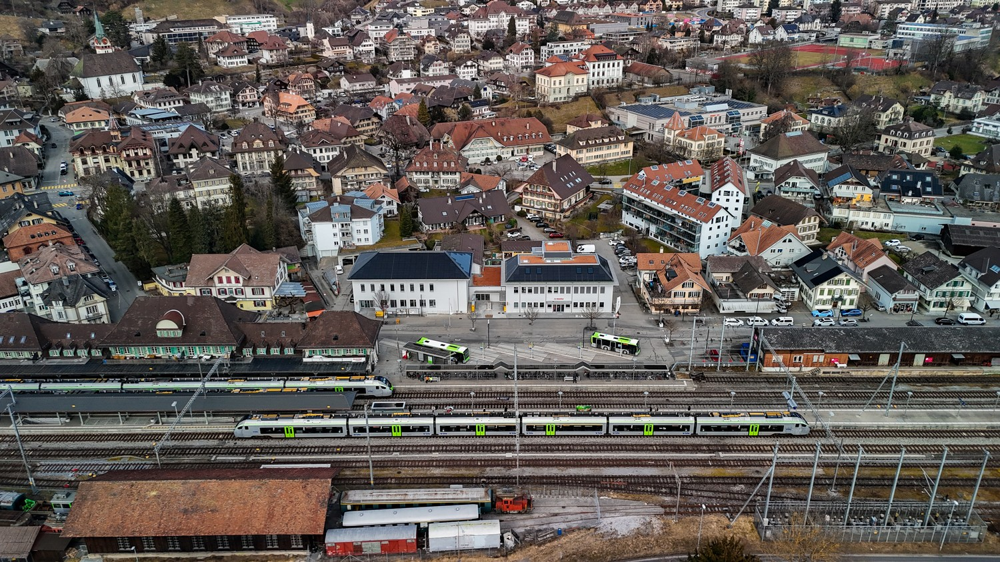
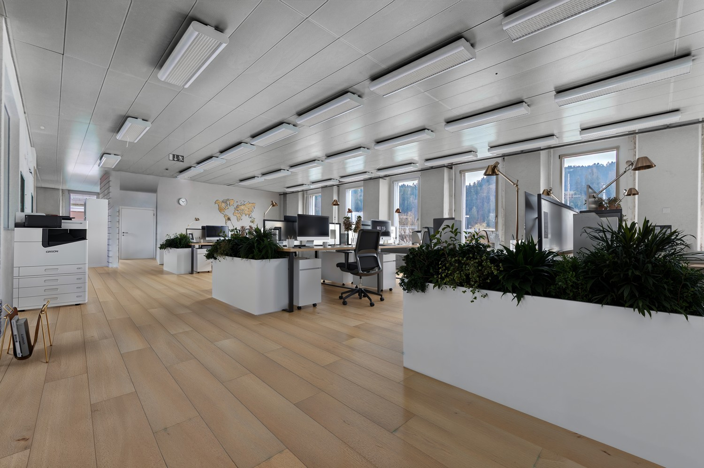
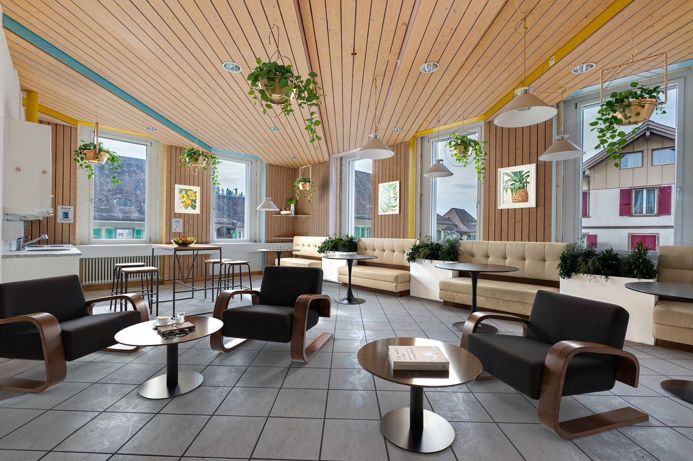
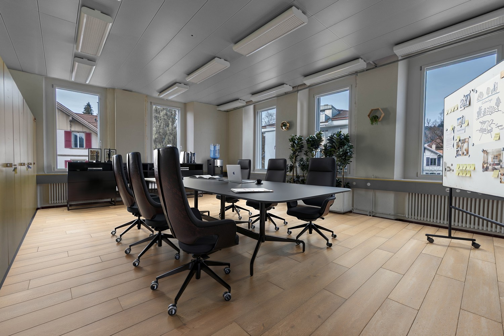
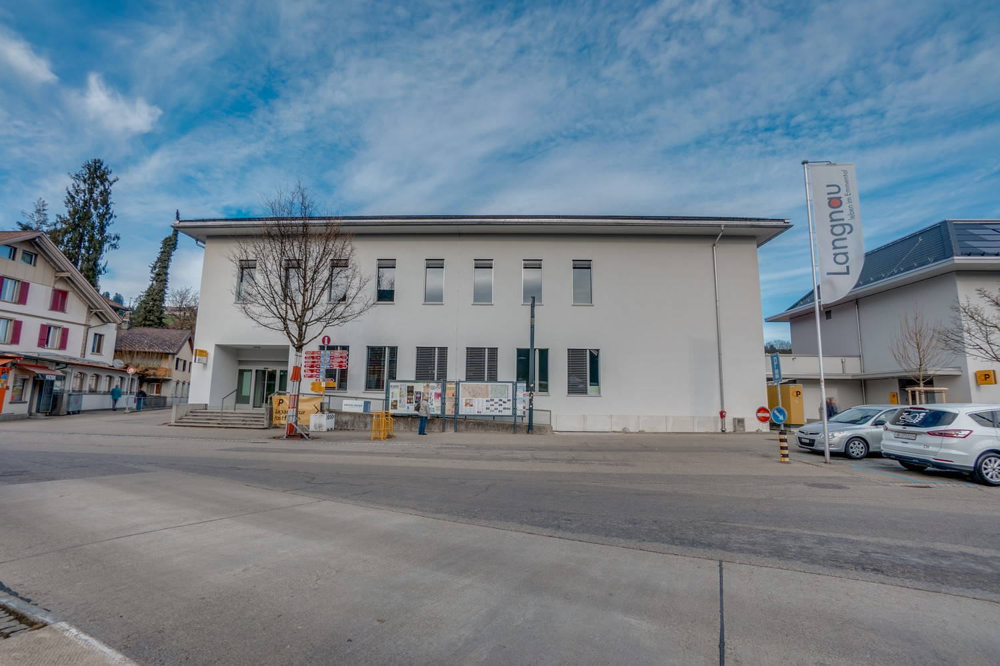
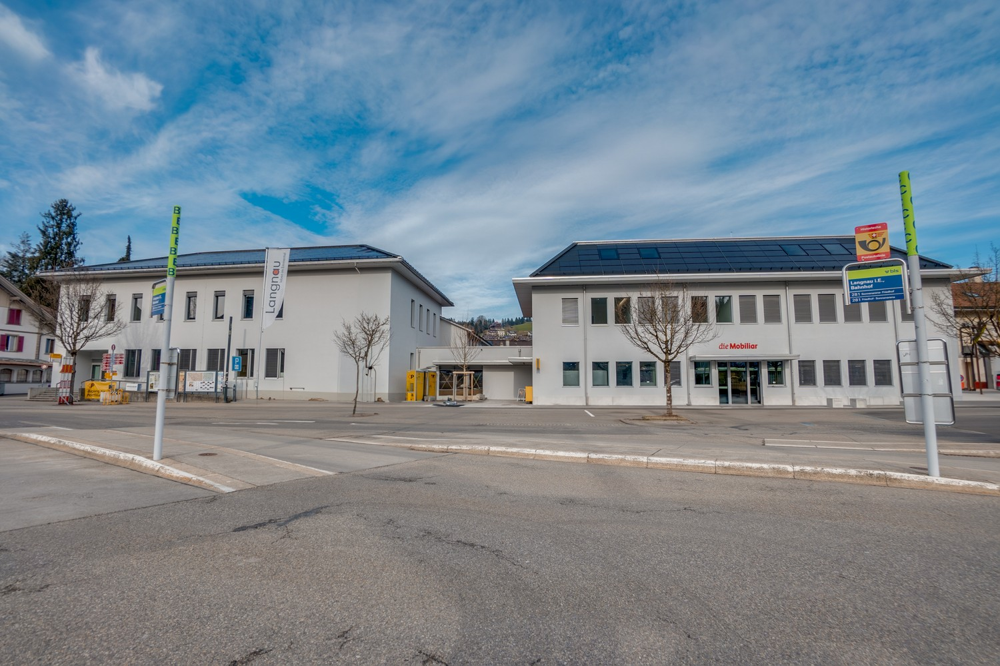
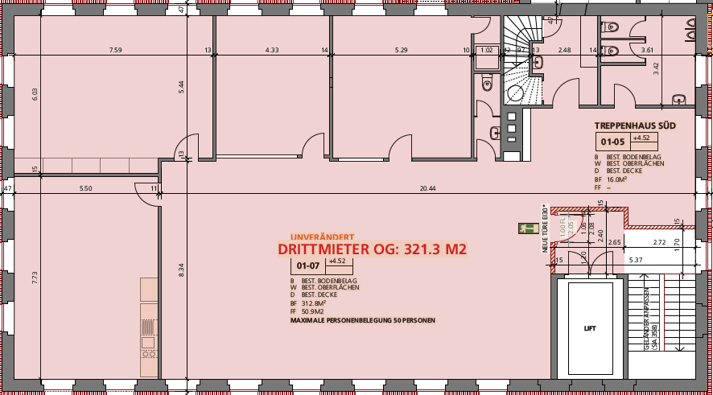

# Bahnhofstrasse 7, 3550 Langnau - auf Anfrage

> **Categorie:** `A_praxis_medical`  
> **Regiune:** Cantonul Berna  
> **Tip ofertă:** RENT / OFFICE  
> **Relevant pentru praxis:** da (praxisräumlichkeiten)  
> **Sursă:** [flatfox.ch](https://flatfox.ch/de/wohnung/bahnhofstrasse-7-3550-langnau/1240066/)  
> **Descărcat:** 2026-08-17 12:32

## Date obiect

| Câmp | Valoare |
|---|---|
| Adresă | Bahnhofstrasse 7, 3550 Langnau |
| Categorie obiect | INDUSTRY |
| Tip obiect | OFFICE |
| Suprafață utilă | 321 m² |
| Etaj | 1 |
| An renovare | 2024 |
| Disponibil de la | agr |
| Referință | Langnau.898.OG HG |

## Texte originale (germană)

**Titlu public:** Bahnhofstrasse 7, 3550 Langnau - auf Anfrage

**Titlu scurt:** 321m² Büro

**Pitch:** 321m² Büro in Langnau mieten

**Titlu descriere:** Ihre Büro- / Praxisräumlichkeiten verdienen die beste Lage!

**Titlu chirie:** 321m² Büro in Langnau mieten

**Spațiu afișat:** 321

### Descriere completă

Direkt neben der Postfiliale in Langnau i. E. vermieten wir im 1. Obergeschoss im Hauptgebäude schöne Büroflächen. Die Räumlichkeiten und Fassade werden vor Mietbeginn neu saniert, damit Sie Ihr Geschäft optimal präsentieren können. Folgende Vorteile zeichnen diesen Standort aus:  
  

*   Büro- / Praxisräumlichkeit 321 m2 verfügbar und frei unterteilbar. Die bestehenden Wände können entfernt werden.
*   Viele Blaue-Zone Parkplätze vor der Liegenschaft
*   Zug- und Busbahnhof gegenüber der Liegenschaft
*   private Parkmöglichkeiten für Mitarbeitende vorhanden
*   Zugang via Treppenhaus oder Warenlift
*   grosser Estrich zur Lagerung von Gegenstände
*   weitere Mietfläche von 145 m2 im Dachgeschoss des Nebengebäudes kann dazu gemietet werden

Realisieren Sie noch heute den idealen Standort für Ihr Geschäft und kontaktieren Sie uns für eine unverbindliche Besichtigung. Wir freuen uns auf Ihre Kontaktaufnahme.

## Dotări (attributes)

- lift
- garage
- accessiblewithwheelchair
- parkingspace
- washingmachine
- stonefloor
- broadbandinternet
- tumbler
- parquetflooring
- cable
- dishwasher

## Ofertant

- **Nume:** Post Immobilien M&S AG
- **Stradă:** Wankdorfallee 4
- **NPA:** 3030
- **Localitate:** Bern

## Imagini (7)

*`01.jpg` — 1500x844 px*

*`02.jpg` — 1500x1000 px*

*`03.jpg` — 1500x1000 px*

*`04.jpg` — 1500x1000 px*

*`05.jpg` — 1500x1000 px*

*`06.jpg` — 1500x1000 px*

*`07.png` — 886x491 px*
