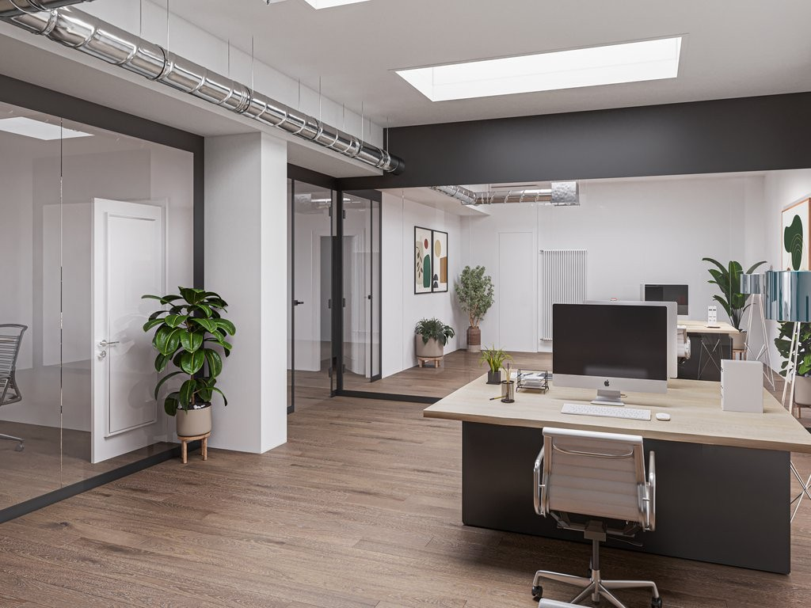
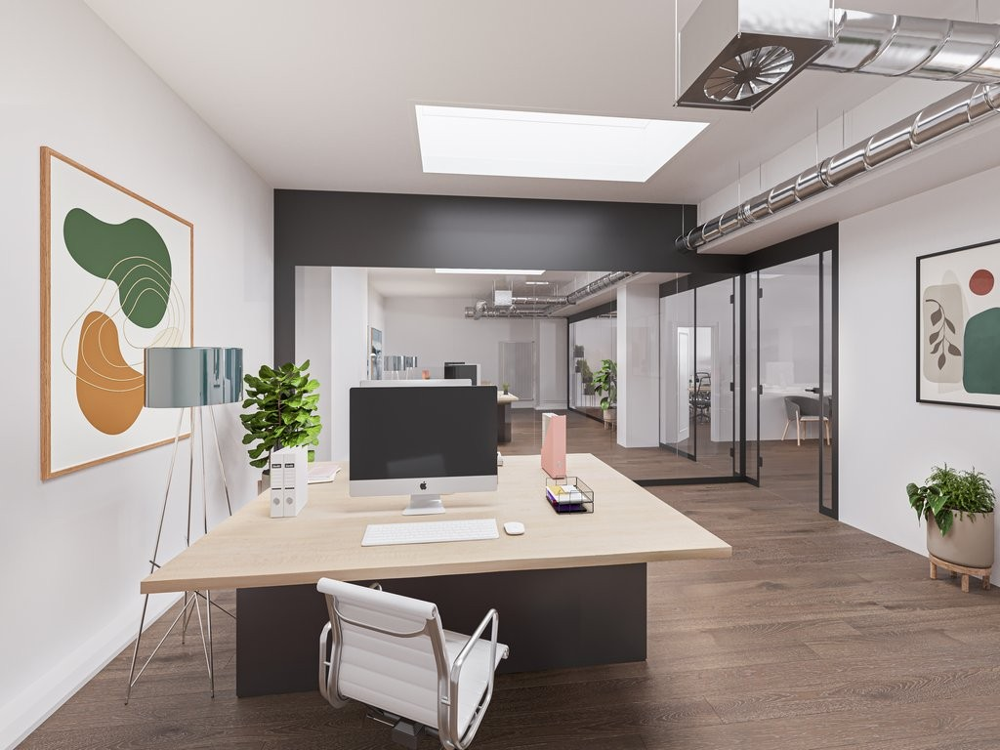
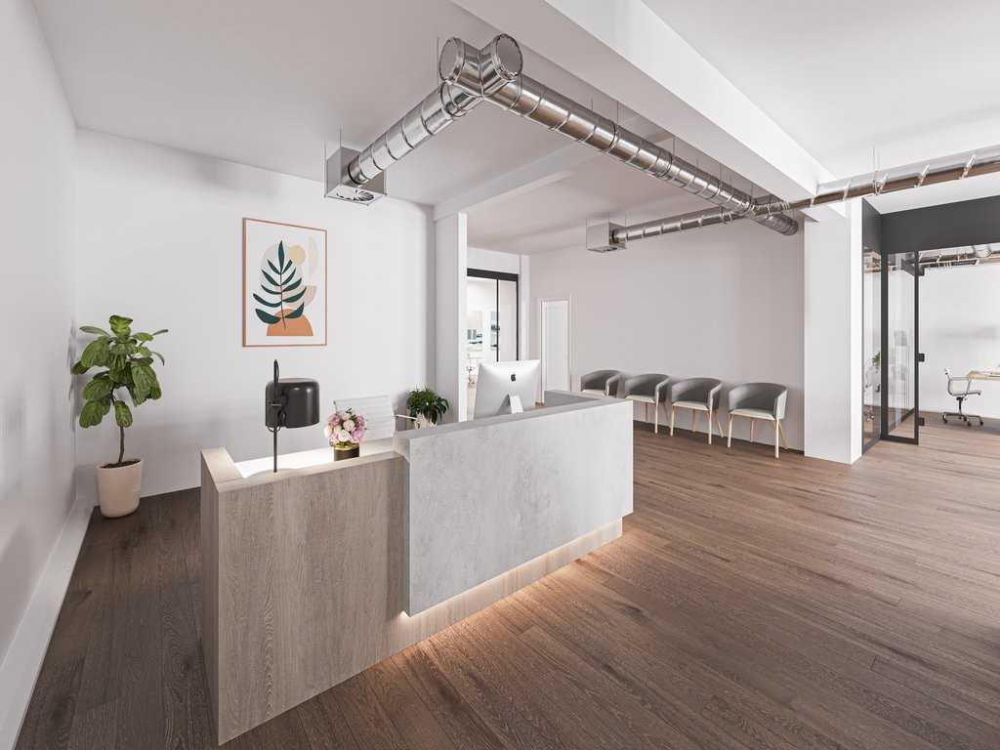
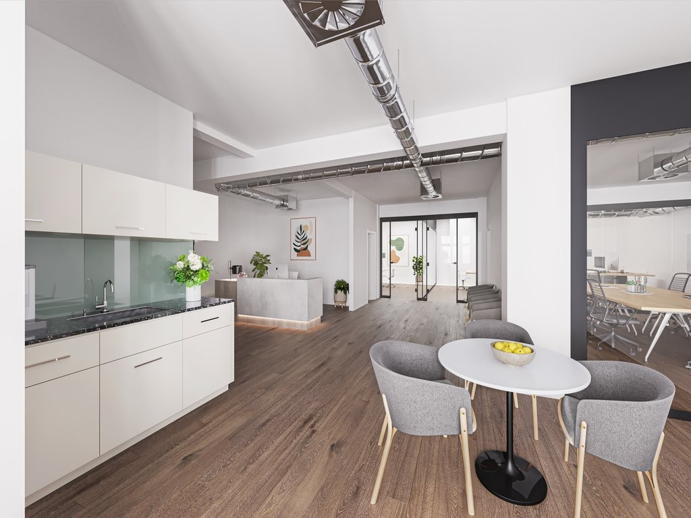
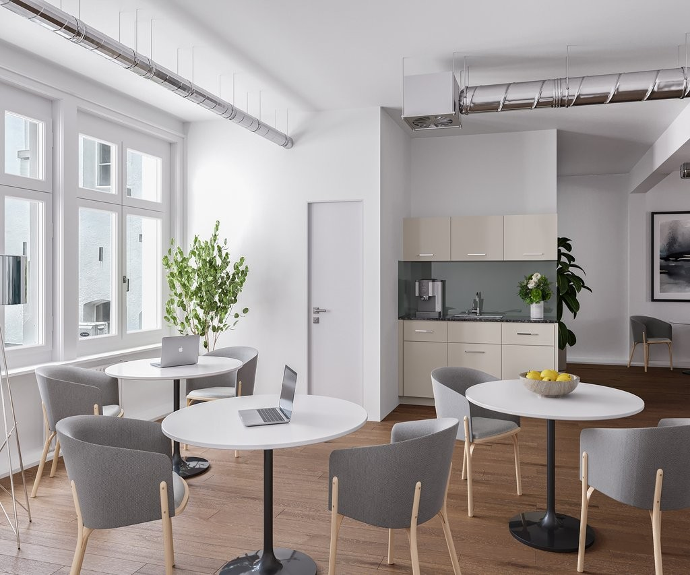
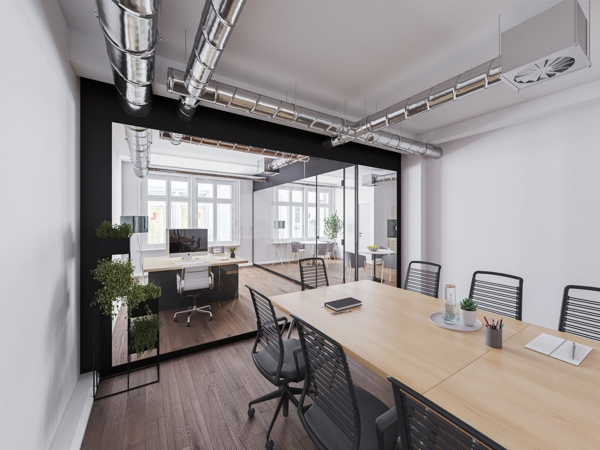
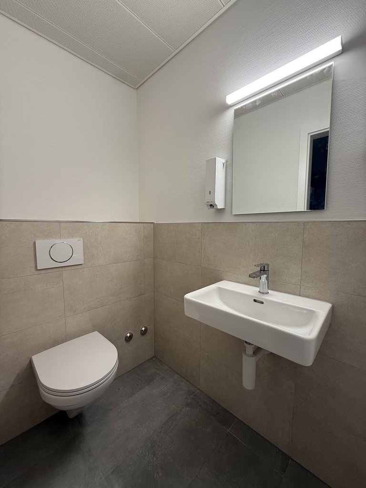
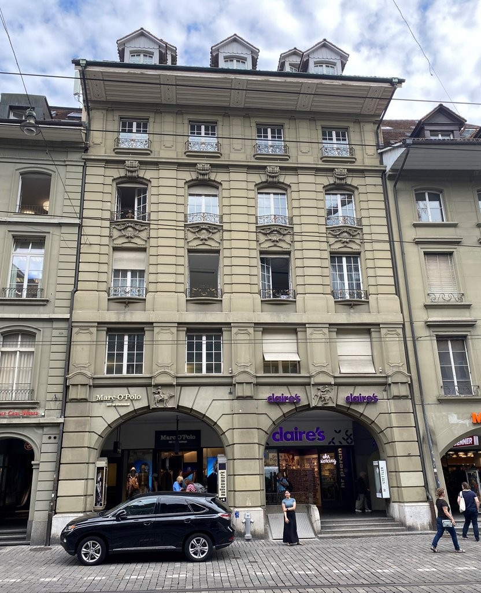
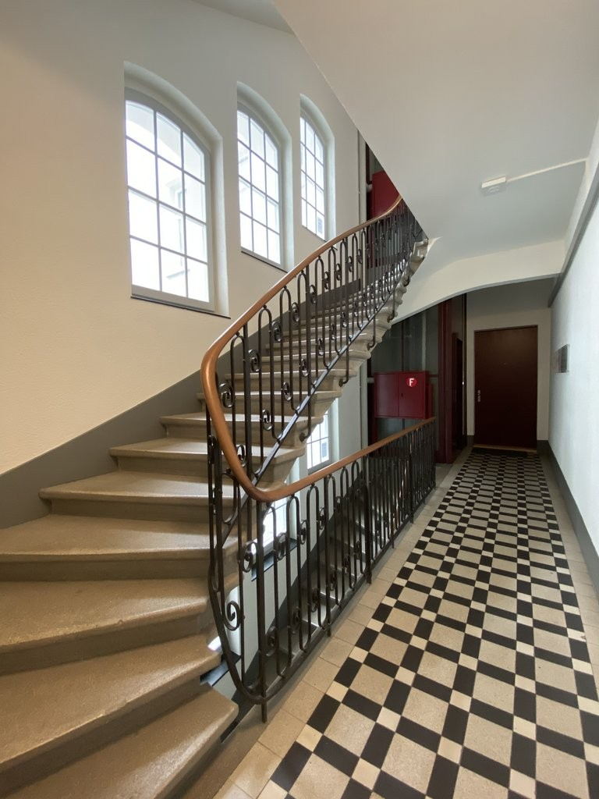

# Marktgasse 50, 3011 Bern - CHF 293 inkl. NK pro m² / Jahr

> **Categorie:** `A_praxis_medical`  
> **Regiune:** Berna (oraș)  
> **Tip ofertă:** RENT / OFFICE  
> **Relevant pentru praxis:** da (praxisfläche, praxisräumlichkeiten)  
> **Sursă:** [flatfox.ch](https://flatfox.ch/de/wohnung/marktgasse-50-3011-bern/1304523/)  
> **Descărcat:** 2026-08-17 12:25

## Date obiect

| Câmp | Valoare |
|---|---|
| Adresă | Marktgasse 50, 3011 Bern |
| Categorie obiect | INDUSTRY |
| Tip obiect | OFFICE |
| Chirie netă | CHF 280 |
| Nebenkosten | CHF 13 |
| Chirie brută | CHF 293 |
| Preț afișat | CHF 293 |
| Suprafață utilă | 177 m² |
| Etaj | 1 |
| An construcție | 1912 |
| Disponibil de la | agr |
| Referință | 13460.01.410020 |

## Texte originale (germană)

**Titlu public:** Marktgasse 50, 3011 Bern - CHF 293 inkl. NK pro m² / Jahr

**Titlu scurt:** 177m² Büro

**Pitch:** 177m² Büro in Bern mieten

**Titlu descriere:** Neue Büro- oder Praxisfläche im Stadtzentrum zu vermieten!

**Titlu chirie:** 177m² Büro in Bern mieten

**Spațiu afișat:** 177

### Descriere completă

An der Marktgasse 50, in kurzer Gehdistanz vom Hauptbahnhof entfernt, vermieten wir eine neue Büro- oder Praxisfläche von 177 m2.   
  
Der Fertigausbau kann vom zukünftigen Mieter im Rahmen der baulichen Möglichkeiten noch mitbestimmt werden.   
  
Bei den Bildern handelt es sich um Visualisierungen, welche die Nutzung als Büro- oder Praxisräumlichkeiten mit Raumunterteilung zeigen. Eine Nutzung als Open-Space-Bürofläche ist auch möglich.   
  
Die Mietfläche bietet folgende Vorzüge:   
\- Sehr gute Innenstadtlage   
\- Hervorragende Erschliessung durch die öffentlichen Verkehrsmittel   
\- Metro-Parking in der Nähe   
\- Raumüberhöhe (ca. 3 Meter)   
\- Innerhalb der Liegenschaft sehr ruhig gelegen   
\- Zu- und Abluftanlage   
\- Zwei neu erstellte WC-Anlagen   
\- Kabelkanäle entlang den Umfassungsmauern   
\- Anschlüsse für Kleinküche   
\- Budget für Fertigbodenbelag   
\- Budget für die Raumunterteilung   
\- Mitbenutzung Personenaufzug   
\- Geringe Nebenkosten (Heizung, Warmwasser, Kehrichtgrundgebühren)   
  
Nicht im Grundausbau enthalten:   
\- IT-Verkabelung in bestehenden Kabelkanälen   
\- Kleinküche (Möbel und Apparate)   
\- Beleuchtung   
\- Mobiliar   
  
Der Fertigausbau beansprucht einen zeitlichen Vorlauf von mindestens drei Monaten.   
  
Für Besichtigungen oder weitere Auskünfte sind wir gerne für Sie da und freuen uns auf Ihre schriftliche Anfrage!

## Dotări (attributes)

- accessiblewithwheelchair

## Ofertant

- **Nume:** Von Graffenried AG Liegenschaften
- **Stradă:** Marktgass-Passage 3
- **NPA:** 3011
- **Localitate:** Bern

## Imagini (9)

*`01.jpg` — 1024x768 px — Büro*

*`02.jpg` — 1024x768 px — Büro*

*`03.jpg` — 1024x768 px — Eingangsbereich*

*`04.jpg` — 1024x768 px — Küche und Eingangsbereich*

*`05.jpg` — 1024x853 px — Küche und Aufenthalt*

*`06.jpg` — 1024x768 px — Sitzungszimmer*

*`07.jpg` — 768x1024 px — WC-Anlage*

*`08.jpg` — 832x1024 px — Neubarocke Fassade, Marktgasse*

*`09.jpg` — 768x1024 px — Treppenhaus (denkmalgeschützt)*
