# Mühlestrasse 47, 2504 Biel - CHF 1’490

> **Categorie:** `A_praxis_medical`  
> **Regiune:** Cantonul Berna  
> **Tip ofertă:** RENT / SHOP  
> **Relevant pentru praxis:** da (praxis)  
> **Sursă:** [flatfox.ch](https://flatfox.ch/de/wohnung/muhlestrasse-47-2504-biel/1397420/)  
> **Descărcat:** 2026-08-17 12:35

## Date obiect

| Câmp | Valoare |
|---|---|
| Adresă | Mühlestrasse 47, 2504 Biel |
| Categorie obiect | INDUSTRY |
| Tip obiect | SHOP |
| Chirie netă | CHF 1'300 |
| Nebenkosten | CHF 190 |
| Chirie brută | CHF 1'490 |
| Preț afișat | CHF 1'490 |
| Suprafață utilă | 140 m² |
| Etaj | 0 |
| An renovare | 2016 |
| Disponibil de la | agr |
| Referință | ..az5jq.6jlfq |

## Texte originale (germană)

**Titlu public:** Mühlestrasse 47, 2504 Biel - CHF 1’490

**Titlu scurt:** 140m² Ladenfläche

**Pitch:** 140m² Ladenfläche in Biel mieten

**Titlu descriere:** Stilvolle Gewerbefläche in Biel-Mett – ideal für Beauty, Praxis oder Büro

**Titlu chirie:** 140m² Ladenfläche in Biel mieten

**Spațiu afișat:** 140

### Descriere completă

In ruhiger und gut erreichbarer Lage in Biel/Bienne vermieten wir ein attraktives und vielseitig nutzbares Gewerbelokal mit angenehmer Atmosphäre. Die Räumlichkeiten eignen sich besonders für Beauty-, Wellness- oder Bürokonzepte, bei denen ein ruhiges Umfeld und ein professioneller Auftritt geschätzt werden. 

Ob Beauty-Salon, Kosmetikstudio, Praxis, Beratungsbüro, Atelier oder stilles Gewerbe – dieses Objekt bietet ideale Voraussetzungen, um Kunden und Mitarbeitende in einem gepflegten Umfeld zu empfangen. 

Das Objekt bietet: 

  * Erdgeschoss ca. 100 m² mit Küche 

  * Untergeschoss / Lager ca. 40 m² mit WC 

  * Flexible Nutzungsmöglichkeiten 

  * Ruhige Lage mit angenehmem Umfeld 

  * Gute Erreichbarkeit mit ÖV und Auto 

  * Parkmöglichkeiten in unmittelbarer Nähe 

Die lichtdurchfluteten Räume bieten viel Potenzial zur individuellen Gestaltung und schaffen eine angenehme Atmosphäre für Kundschaft und Mitarbeitende. 

Nutzen Sie die Gelegenheit, Ihr Geschäft an einem attraktiven Standort in Biel-Mett zu etablieren. Wir freuen uns auf Ihre Anfrage und zeigen Ihnen das Objekt gerne persönlich.

## Dotări (attributes)

- accessiblewithwheelchair

## Ofertant

- **Nume:** PS Immobilien AG
- **Stradă:** Paul-Emile Brandt-Strasse 2
- **NPA:** 2502
- **Localitate:** Biel/Bienne

## Imagini (12)

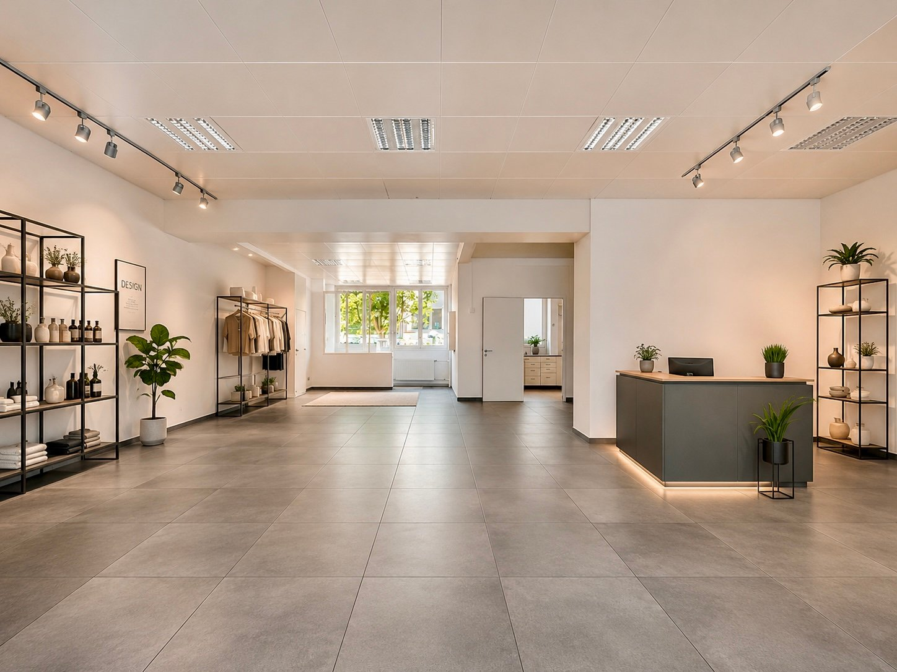
*`01.jpg` — 1448x1086 px*

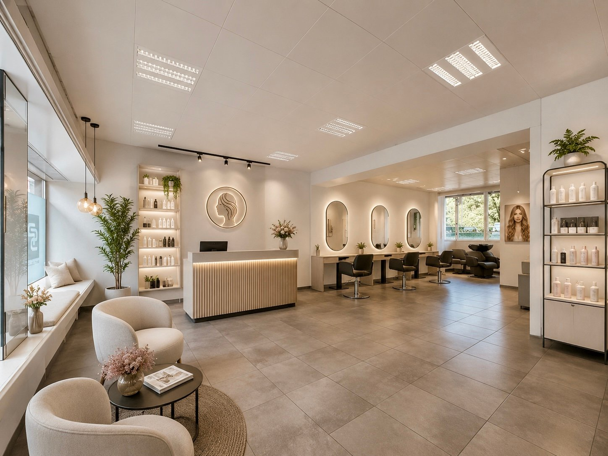
*`02.jpg` — 1448x1086 px*

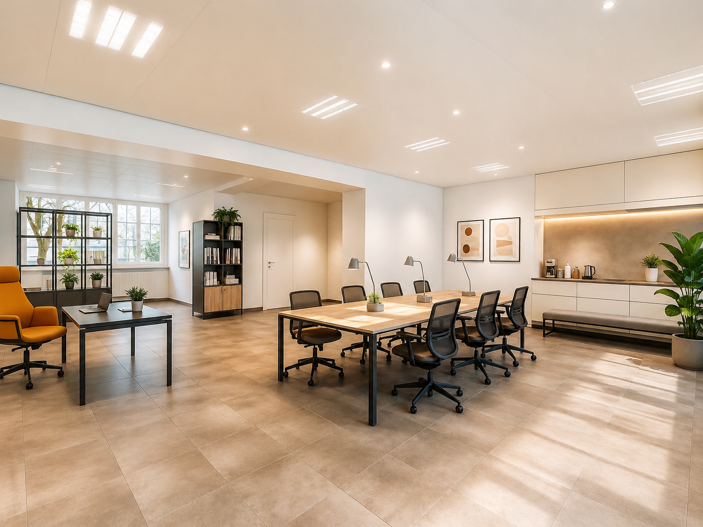
*`03.png` — 1448x1086 px*

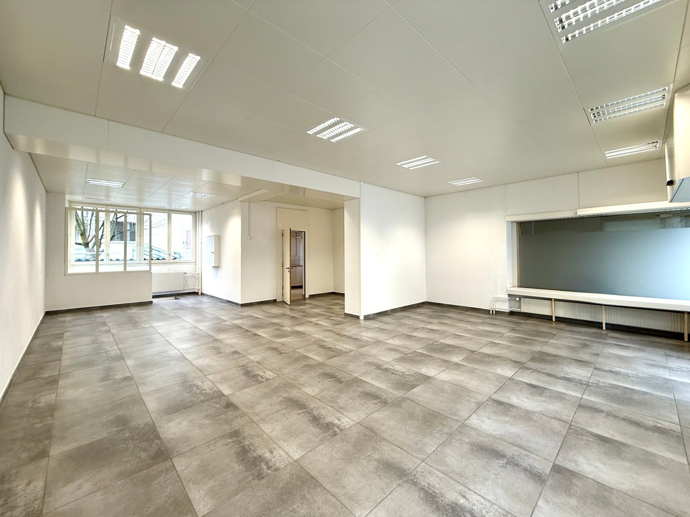
*`04.jpg` — 1500x1125 px*

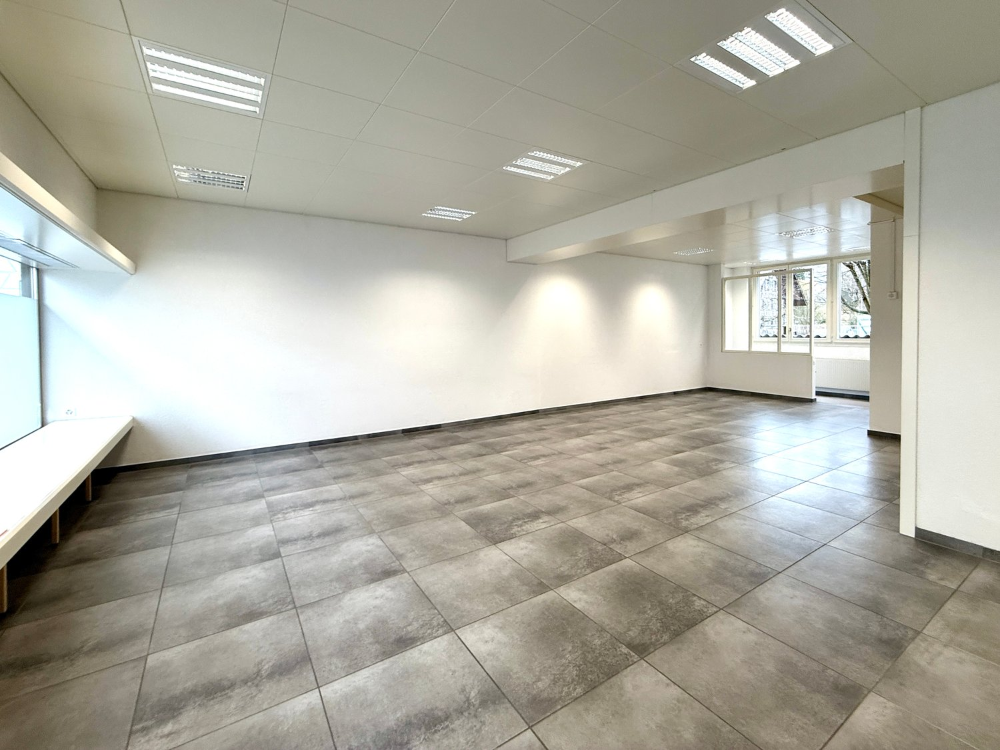
*`05.jpg` — 1500x1125 px*

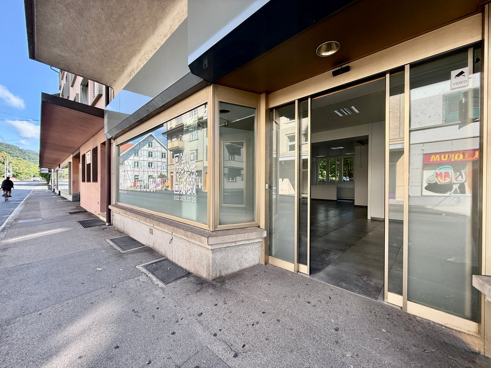
*`06.jpg` — 1500x1125 px*

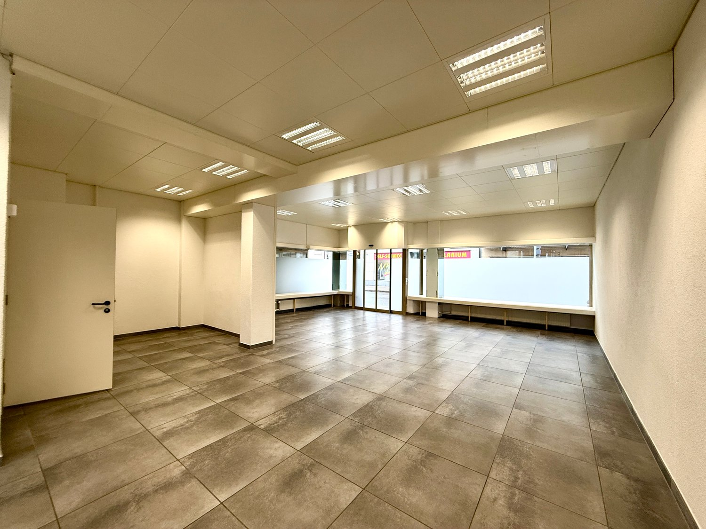
*`07.jpg` — 1500x1125 px*

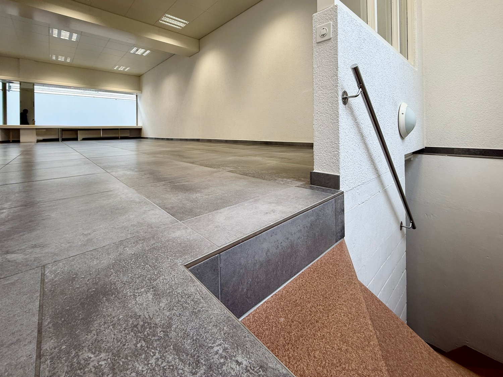
*`08.jpg` — 1500x1124 px*

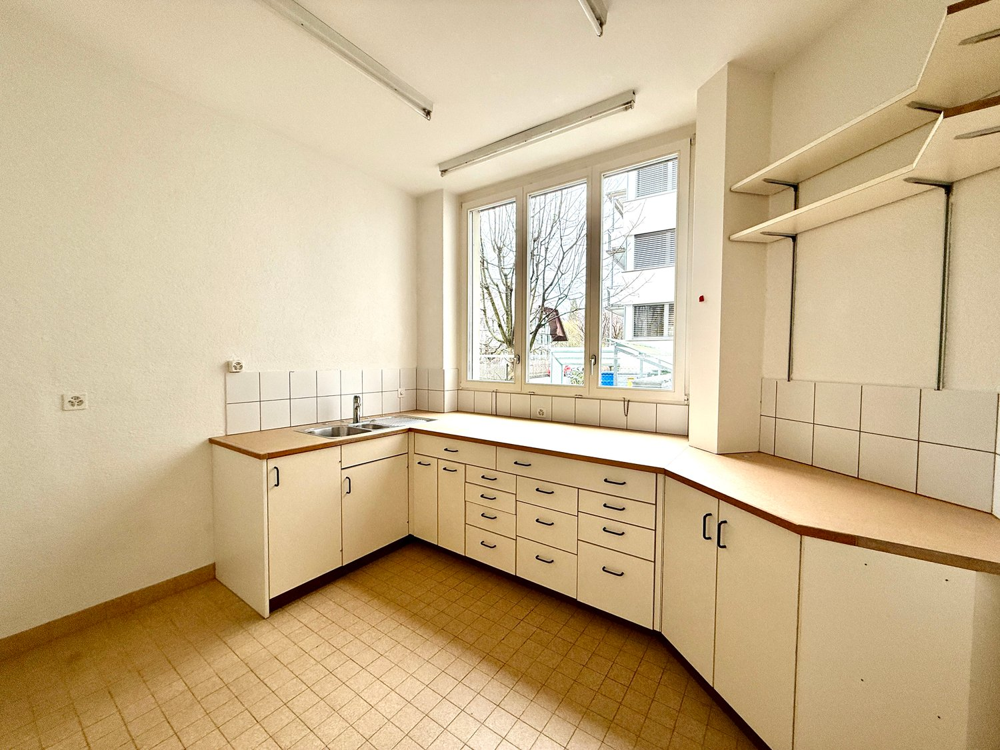
*`09.jpg` — 1500x1125 px*

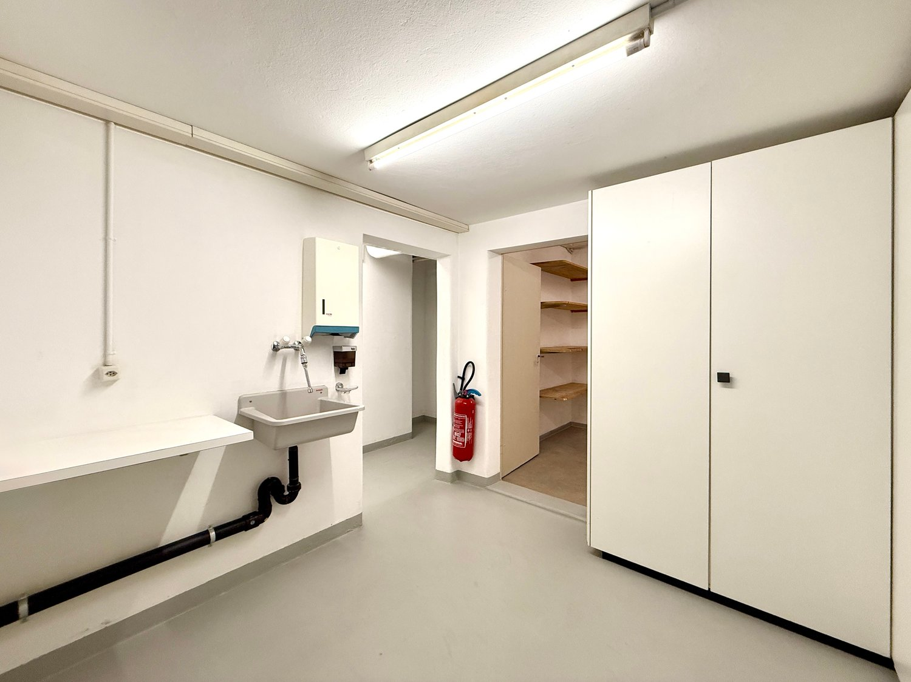
*`10.jpg` — 1500x1124 px*

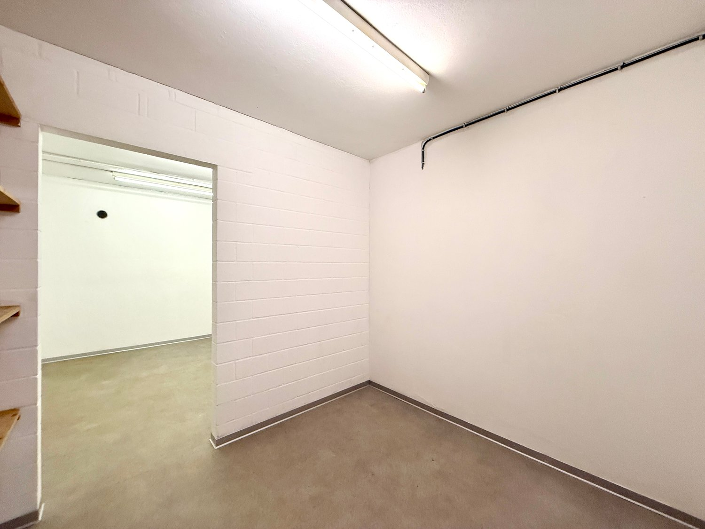
*`11.jpg` — 1500x1125 px*

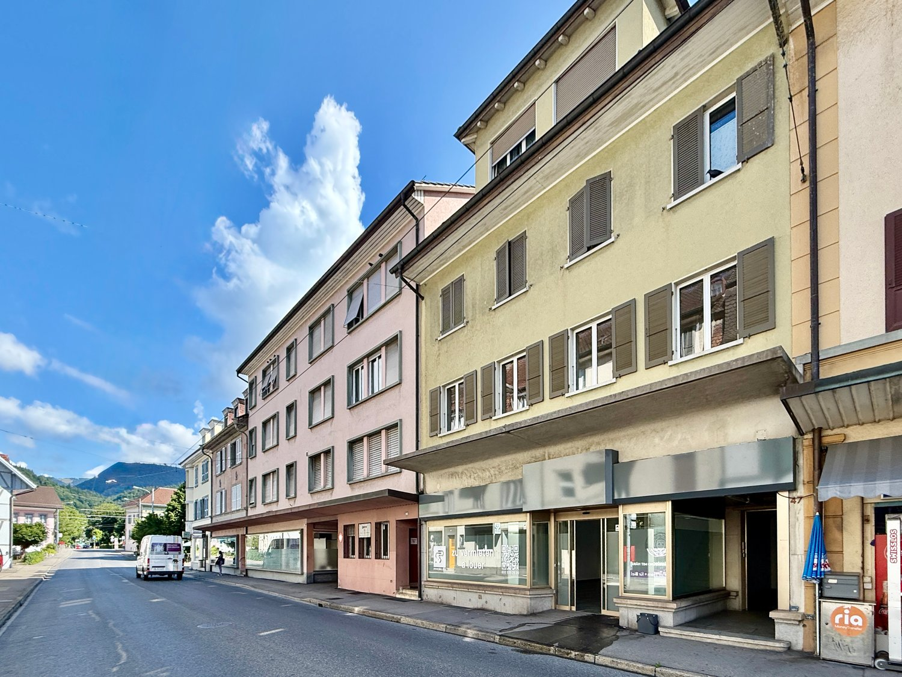
*`12.jpg` — 1500x1125 px*
