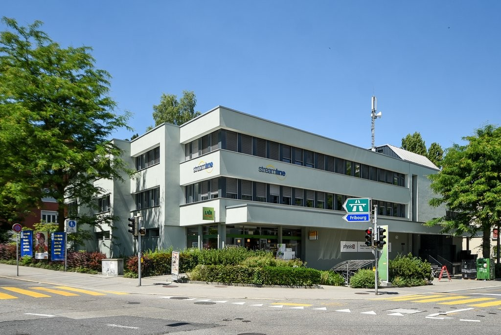
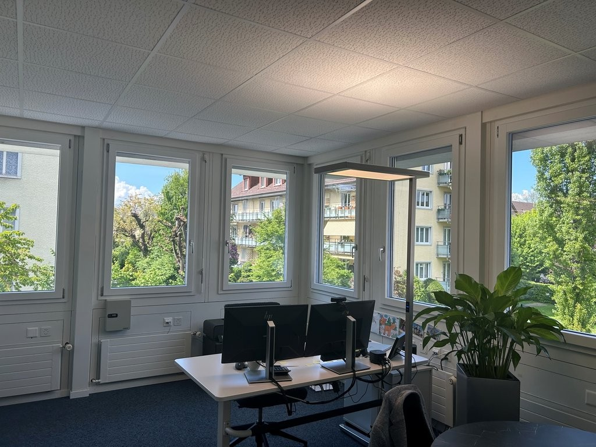
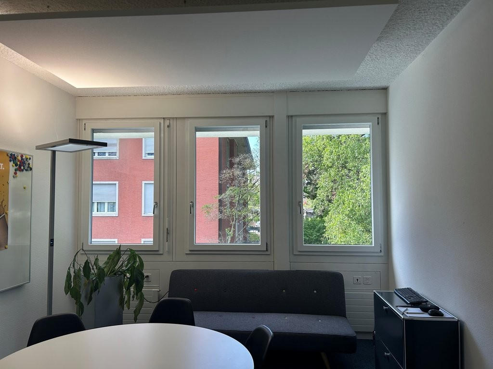
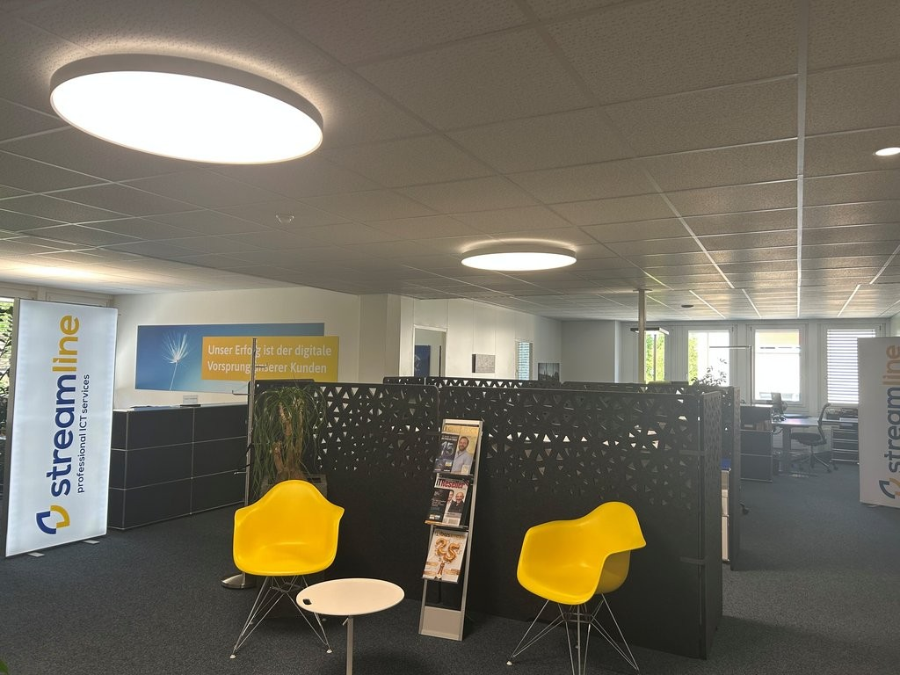
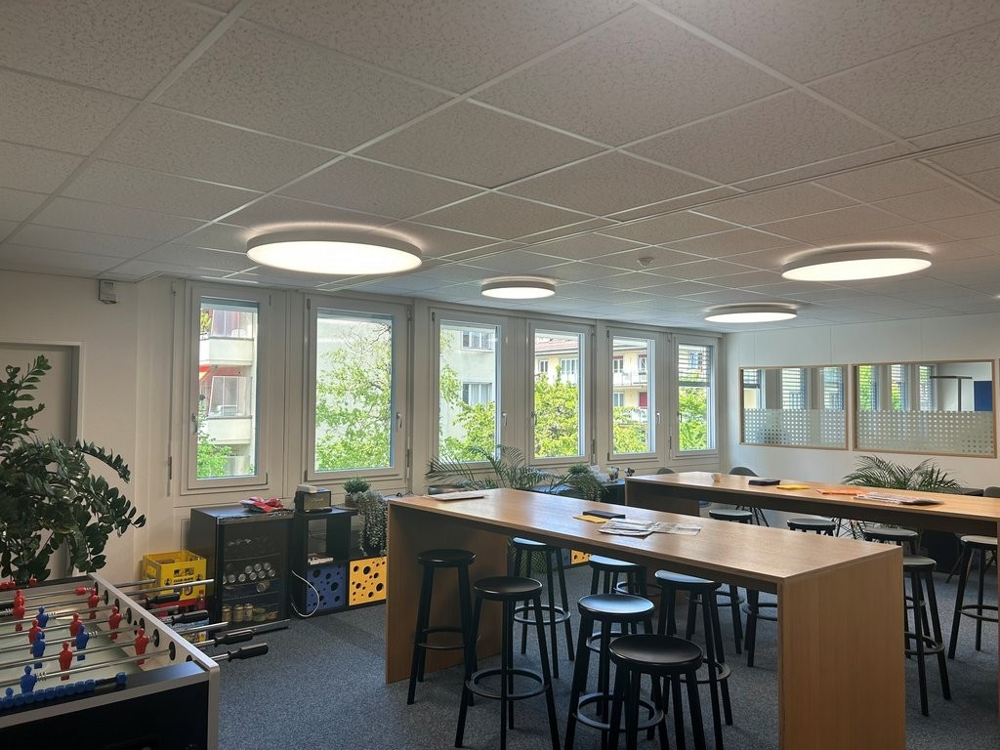
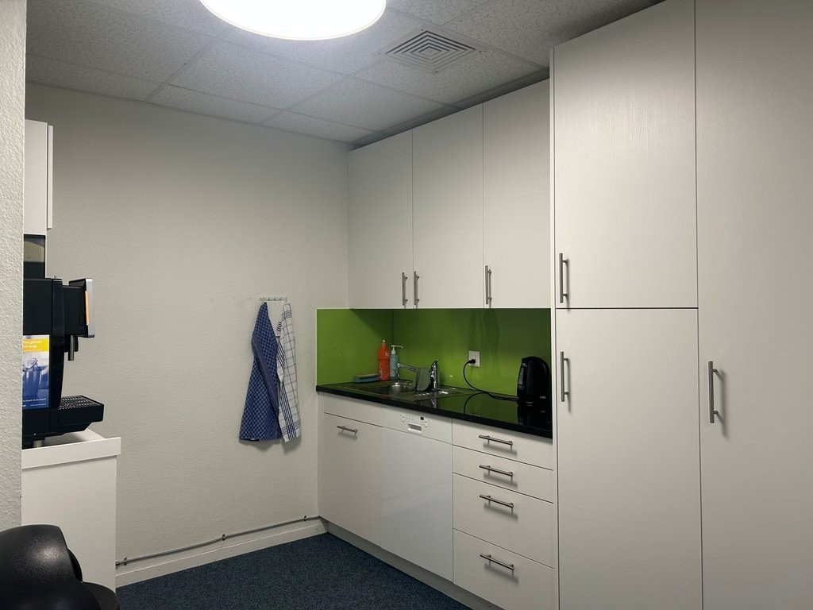
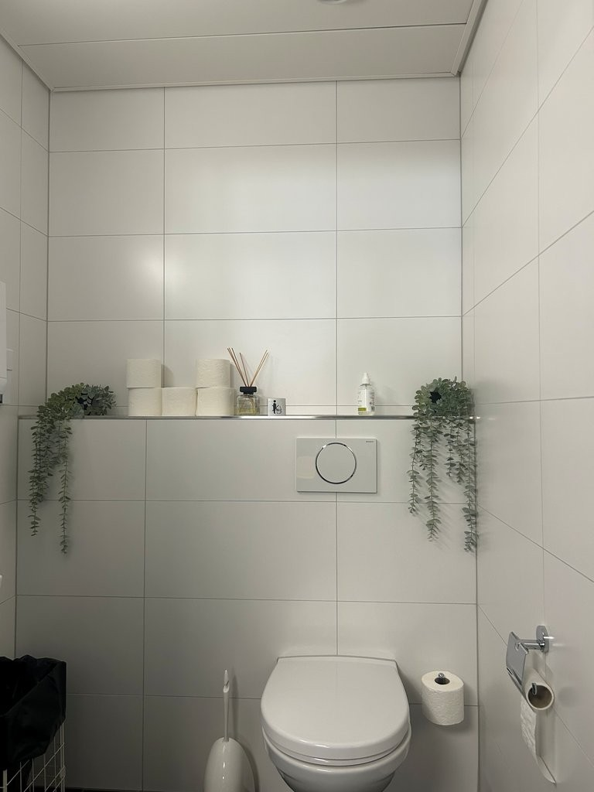
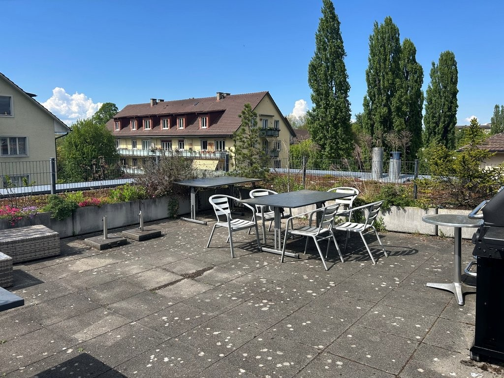

# Könizstrasse 60, 3008 Bern - CHF 14’300 inkl. NK pro Monat

> **Categorie:** `A_praxis_medical`  
> **Regiune:** Berna (oraș)  
> **Tip ofertă:** RENT / OFFICE  
> **Relevant pentru praxis:** da (arztpraxis, physiotherapie, praxisfläche)  
> **Sursă:** [flatfox.ch](https://flatfox.ch/de/wohnung/konizstrasse-60-3008-bern/1698652/)  
> **Descărcat:** 2026-08-17 12:25

## Date obiect

| Câmp | Valoare |
|---|---|
| Adresă | Könizstrasse 60, 3008 Bern |
| Categorie obiect | INDUSTRY |
| Tip obiect | OFFICE |
| Chirie netă | CHF 12'800 |
| Nebenkosten | CHF 1'500 |
| Chirie brută | CHF 14'300 |
| Preț afișat | CHF 14'300 |
| Suprafață utilă | 668 m² |
| Etaj | 2 |
| Disponibil de la | imm |
| Referință | 14980.01.420010 |

## Texte originale (germană)

**Titlu public:** Könizstrasse 60, 3008 Bern - CHF 14’300 inkl. NK pro Monat

**Titlu scurt:** 668m² Büro

**Pitch:** 668m² Büro in Bern mieten

**Titlu descriere:** Gesundheit im Zentrum - Praxisfläche mit Synergiepotenzial

**Titlu chirie:** 668m² Büro in Bern mieten

**Spațiu afișat:** 668

### Descriere completă

An der Könizstrasse 60 in 3008 Bern wird per Oktober 2025 oder nach Vereinbarung im 2. Obergeschoss eine helle und vielseitig nutzbare **Gewerbefläche von 667m2** frei. Die Liegenschaft überzeugt durch eine hervorragende Erreichbarkeit, moderne Infrastruktur und eine vielseitige Nutzungsmöglichkeit - besonders ideal für eine **Arztpraxis** , aber auch bestens geeignet als **Büro- oder Dienstleistungsfläche** .   
  

**Ihre Vorteile auf einen Blick:**

  * **Optimale Erreichbarkeit:** Nur rund **5 Minuten ab Autobahnausfahrt Bern-Bümpliz** entfernt - ideal für Patienten und Mitarbeitende. 

  * **Sehr gute ÖV-Anbindung:** Ab **Bahnhof Bern** in ca. **10 Minuten mit der Buslinie 17 oder Tramlinie 6**

  * **Attraktive Umgebung:** **Rundumblick ins Freie** für ein angenehmes Arbeits- und Patientenklima. 

  * **Infrastruktur vor Ort:**

    * **Warenlift** mit direktem Zugang zur Mietfläche 

    * **Voi Migros** im Erdgeschoss - perfekte Nahversorgung 

    * **Dachterrasse** zur Mitbenutzung - ideal für Pausen 

    * **13 Einstellhallenplätze** können zusätzlich gemietet werden 

  * **Innenausstattung:**

    * **Flexibler Grundriss** \- individuell anpassbar an Ihre Bedürfnisse 

    * **Teeküche** , **Dusche** sowie separate **Mitarbeiter- und Kundentoiletten**

  * **Nachbarschaft:** Bereits heute befindet sich in der Liegenschaft eine etablierte Physiotherapie - ideale Voraussetzungen für Synergien im Gesundheitswesen. 

Ob Sie eine moderne **Arztpraxis** , eine **Therapieeinrichtung** oder eine **ruhige, gut erreichbare Bürofläche** realisieren möchten - diese Fläche bietet Ihnen den idealen Rahmen für Ihre Tätigkeit. 

  

**Kontaktieren Sie uns** für weitere Informationen oder eine unverbindliche Besichtigung - wir freuen uns auf Ihre Anfrage.

## Dotări (attributes)

- accessiblewithwheelchair
- lift

## Ofertant

- **Nume:** Von Graffenried AG Liegenschaften
- **Stradă:** Marktgass-Passage 3
- **NPA:** 3011
- **Localitate:** Bern

## Imagini (8)

*`01.jpg` — 1024x685 px — 10470-Kanizstrasse_60-3.jpg*

*`02.jpg` — 1024x768 px — Buero_2.jpg*

*`03.jpg` — 1024x768 px — Buero_1.jpg*

*`04.jpg` — 1024x768 px — Eingangsbereich.jpg*

*`05.jpg` — 1024x768 px — Pausenraum.jpg*

*`06.jpg` — 1024x768 px — Teekueche.jpg*

*`07.jpg` — 768x1024 px — Kundentoilette.jpg*

*`08.jpg` — 1024x768 px — Terrasse.jpg*
