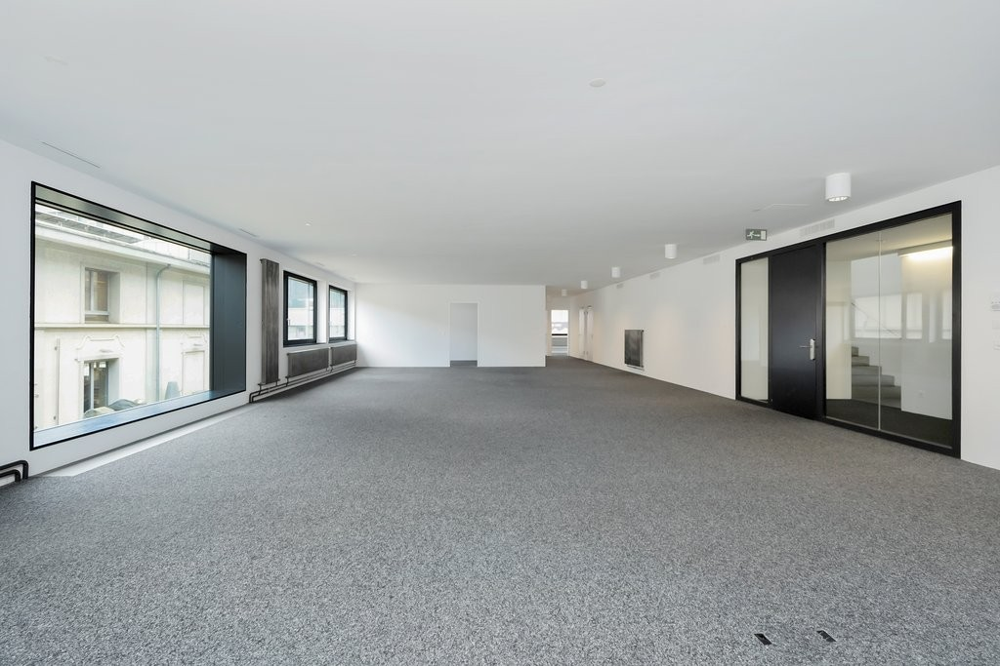
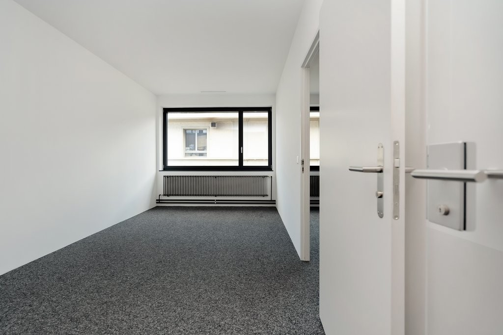
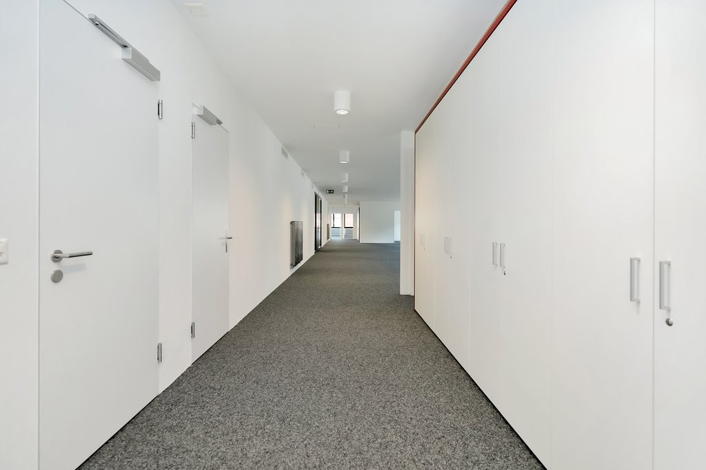
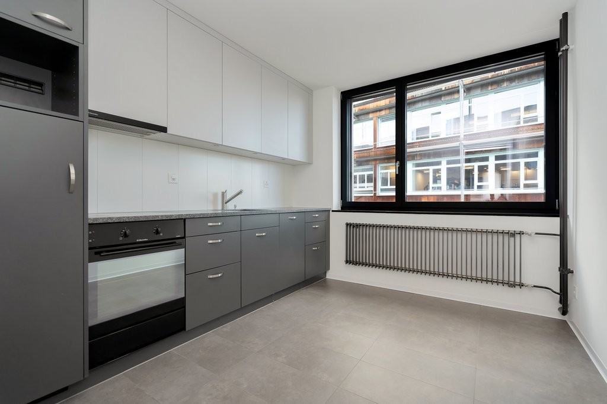
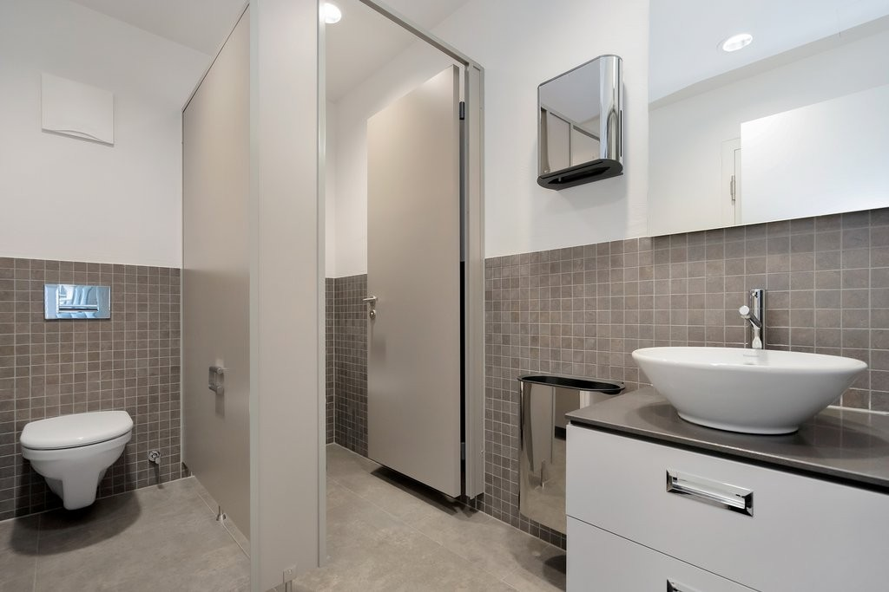

# Werkstrasse 20, 3084 Wabern - CHF 225 inkl. NK pro m² / Jahr

> **Categorie:** `A_praxis_medical`  
> **Regiune:** Cantonul Berna  
> **Tip ofertă:** RENT / OFFICE  
> **Relevant pentru praxis:** da (praxisfläche, praxisräume)  
> **Sursă:** [flatfox.ch](https://flatfox.ch/de/wohnung/werkstrasse-20-3084-wabern/84797173/)  
> **Descărcat:** 2026-08-17 12:28

## Date obiect

| Câmp | Valoare |
|---|---|
| Adresă | Werkstrasse 20, 3084 Wabern |
| Categorie obiect | INDUSTRY |
| Tip obiect | OFFICE |
| Chirie netă | CHF 195 |
| Nebenkosten | CHF 30 |
| Chirie brută | CHF 225 |
| Preț afișat | CHF 225 |
| Suprafață utilă | 200 m² |
| Etaj | 1 |
| Disponibil de la | agr |
| Referință | 1481.01.01001 |

## Texte originale (germană)

**Titlu public:** Werkstrasse 20, 3084 Wabern - CHF 225 inkl. NK pro m² / Jahr

**Titlu scurt:** 200m² Büro

**Pitch:** 200m² Büro in Wabern mieten

**Titlu descriere:** Top angebundene Büro- und Praxisflächen in Wabern

**Titlu chirie:** 200m² Büro in Wabern mieten

**Spațiu afișat:** 200

### Descriere completă

Suchen Sie einen gut erreichbaren, modernen Standort für Ihre Räumlichkeiten? 

Diese hellen und flexibel nutzbaren Büro-, und Praxisflächen (200 m  2  ) in Wabern bieten ideale Voraussetzungen für einen professionellen Firmenauftritt nur wenige Minuten von Bern entfernt. 

Dank der unmittelbaren Nähe zum Tram erreichen Mitarbeitende, Kunden und Patienten den Standort schnell und unkompliziert. 

**Ihre Vorteile auf einen Blick:**

  * Moderne, hochwertige und voll ausgebaute Räumlichkeiten - sofort bezugsbereit 
  * Arbeiten mit Blick und viel Tageslicht 
  * Perfekt erreichbar für Kunden und Mitarbeitende 
  * Effiziente Belüftung 
  * Küche und Sanitäranlagen vorhanden 
  * Personenlift im Gebäude 
  * Besucherparkplätze vorhanden 
  * Repräsentativer Standort für Kundenempfang 
  * Einstellhallenplätze können bei Bedarf gerne dazu gemietet werden 

  

**Ideal geeignet für:**

  * KMU und Dienstleistungsunternehmen 
  * Treuhand-, Beratungs- oder IT-Firmen 
  * Schulungs-, Therapie- oder Praxisräume 
  * Start-ups mit Wachstumspotenzial 

**Lage & Erreichbarkeit: **

  * Tram (Linie 9) und S-Bahnhof Wabern in unmittelbarer Gehdistanz 
  * Sehr gute Anbindung an den Bahnhof Bern (ca. 15 Minuten) 
  * Einkaufsmöglichkeiten und Verpflegung in Gehdistanz 
  * Schnelle Erreichbarkeit mit dem Auto 

  

Gerne zeigen wir Ihnen die Flächen bei einer persönlichen Besichtigung und besprechen individuelle Ausbau- oder Nutzungswünsche. 

Wir freuen uns auf Ihre Kontaktaufnahme. 

**Achtung. Eigenwerbung** : Sie ziehen in eine Mietwohnung und benötigen Unterstützung für den bestmöglichen Verkauf Ihrer Immobilie? Kontaktieren Sie die Dr.Meyer Immobilien AG für eine unverbindliche Offerte - wir sind gut darin.

## Dotări (attributes)

- accessiblewithwheelchair

## Ofertant

- **Nume:** Dr.Meyer Immobilien AG
- **Stradă:** Morgenstrasse 83A
- **NPA:** 3018
- **Localitate:** Bern

## Imagini (9)

*`01.jpg` — 1024x683 px — _DM31123.jpg*

*`02.jpg` — 1024x683 px — Buero_4.jpg*

*`03.jpg` — 1024x683 px — Buero_5.jpg*

*`04.jpg` — 1024x683 px — Buero_1.jpg*

*`05.jpg` — 1024x683 px — Korridor_2.jpg*

*`06.jpg` — 1024x683 px — Kueche.jpg*

*`07.jpg` — 1024x683 px — Toilettenanlage_1.jpg*

*`08.jpg` — 1024x683 px — Toilettenanlage_2.jpg*

*`09.jpg` — 1024x682 px — Aussenansicht.jpg*

## Media suplimentară

- **tour_url:** https://my.matterport.com/show/?m=sQXJ6tHEF9C
