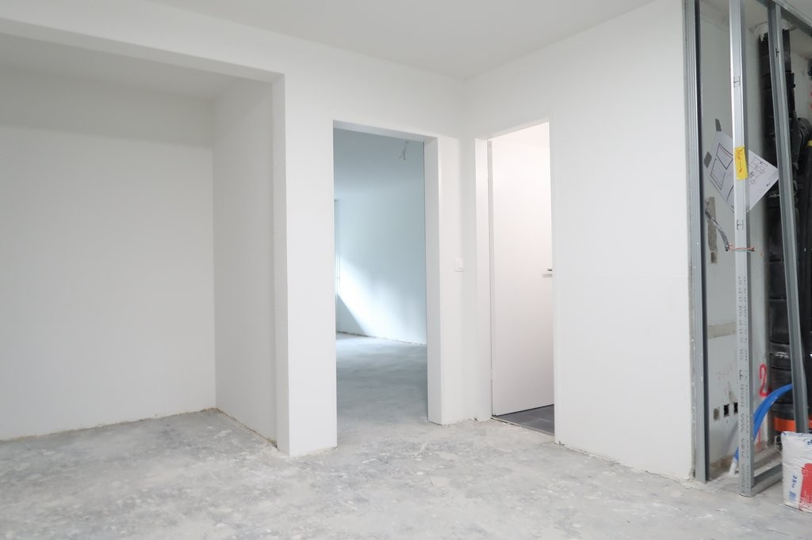
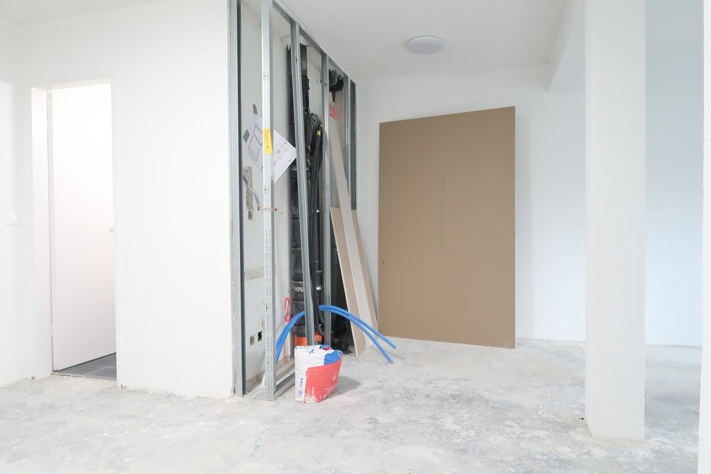
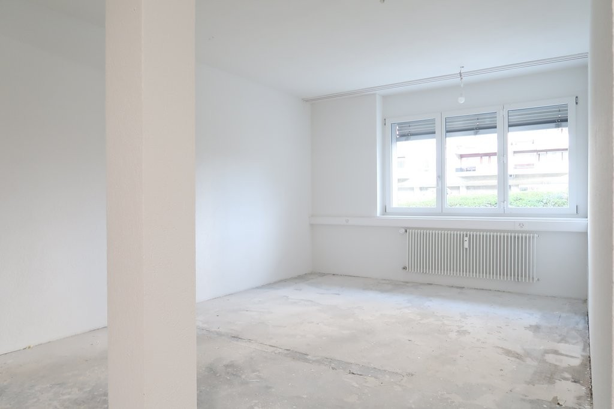
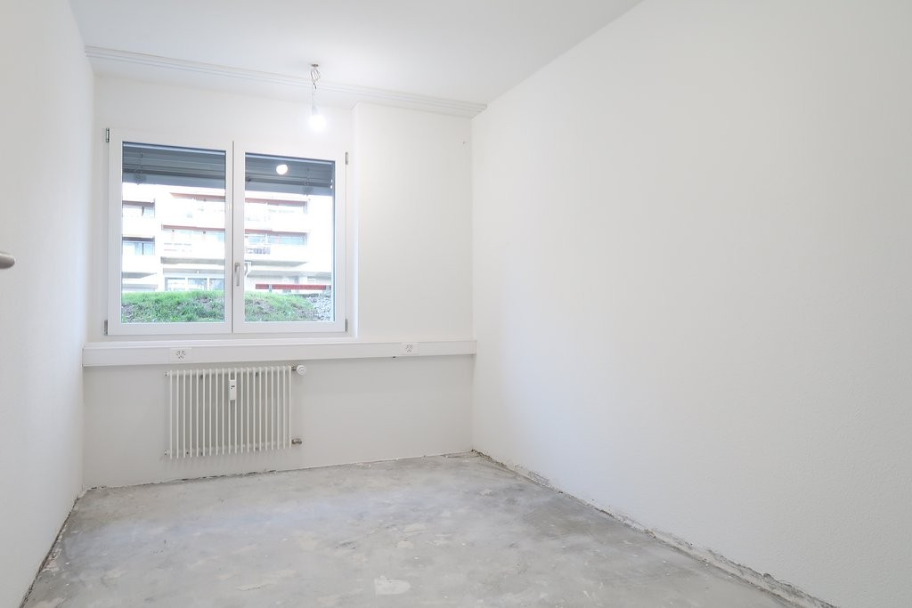
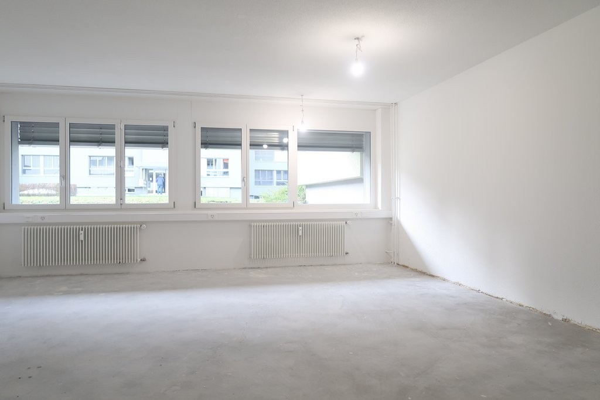
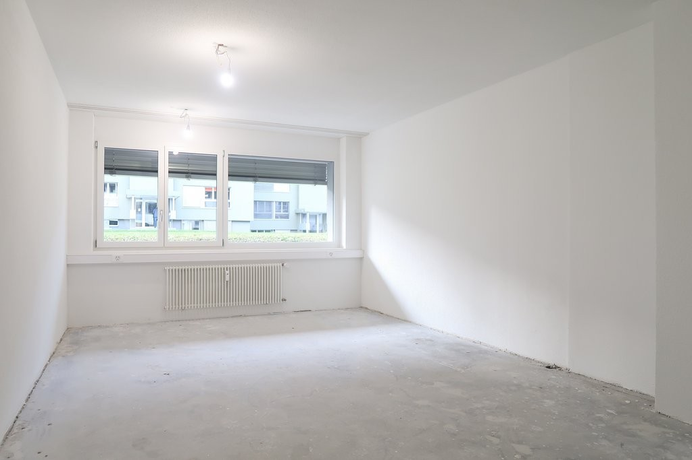
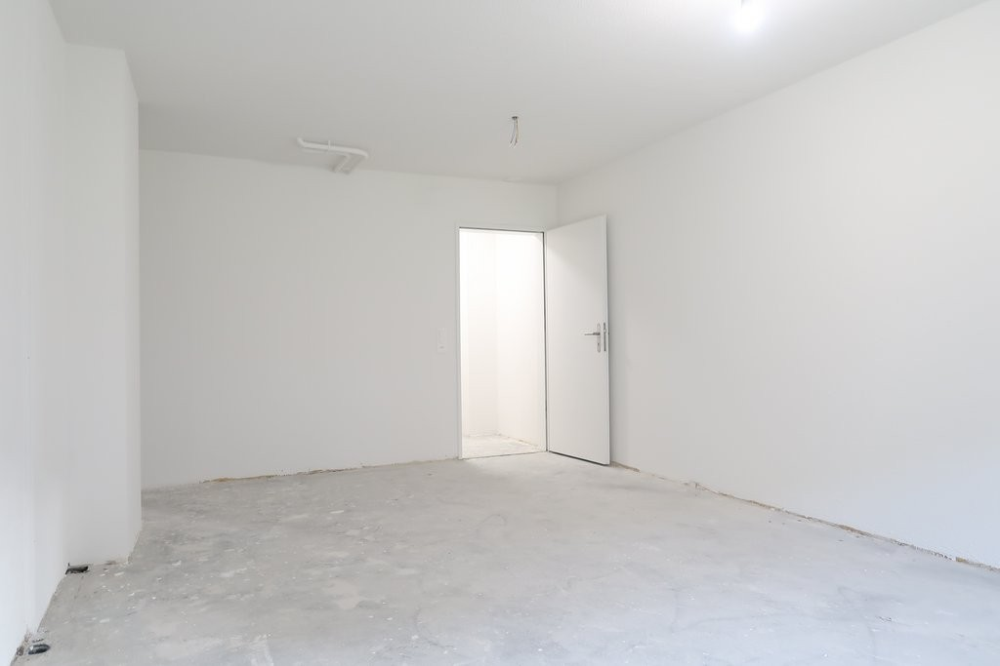
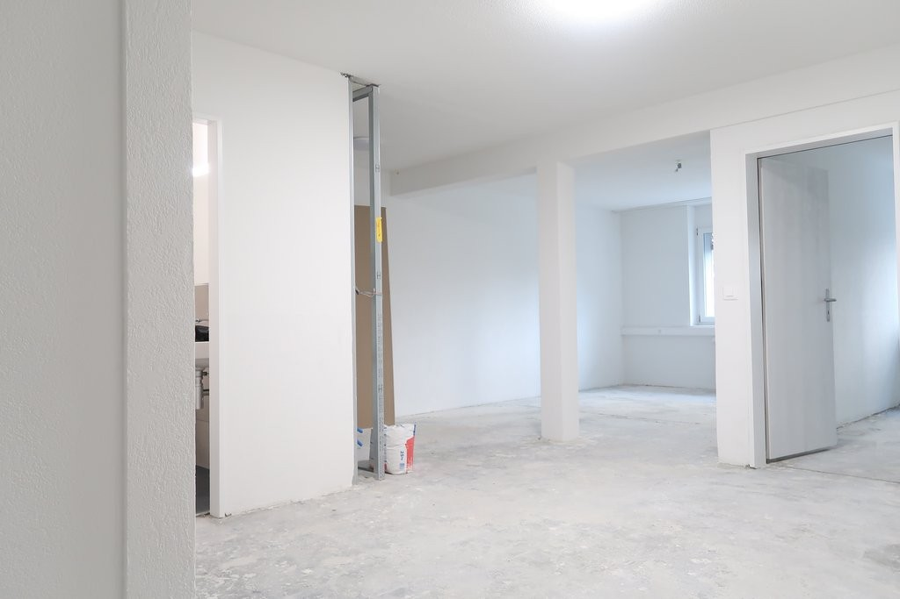
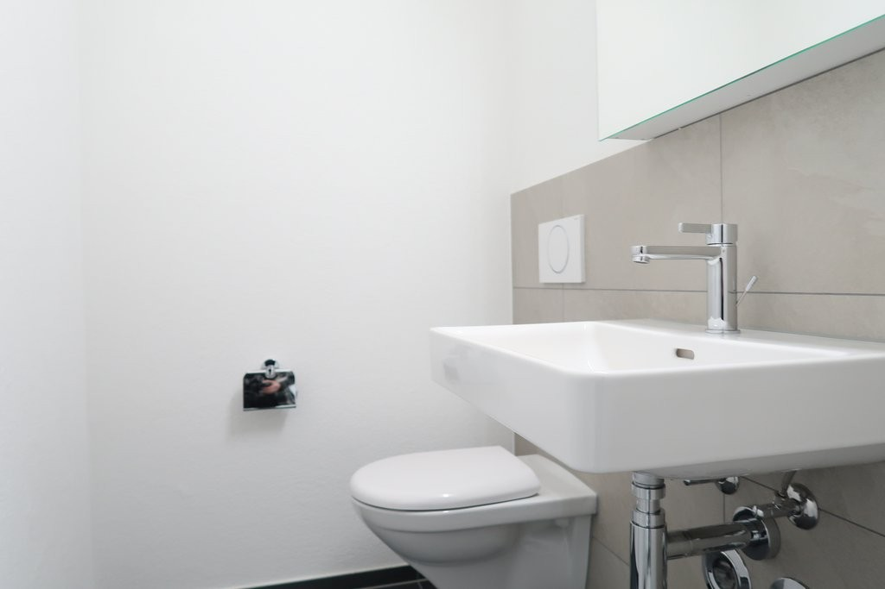
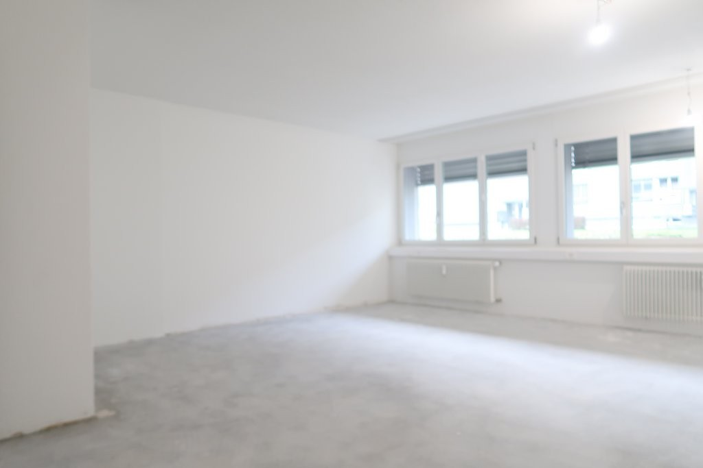

# Funkstrasse 116, 3084 Wabern - CHF 2’015 inkl. NK pro Monat

> **Categorie:** `A_praxis_medical`  
> **Regiune:** Cantonul Berna  
> **Tip ofertă:** RENT / PRACTICE  
> **Relevant pentru praxis:** da (praxis)  
> **Sursă:** [flatfox.ch](https://flatfox.ch/de/wohnung/funkstrasse-116-3084-wabern/85369212/)  
> **Descărcat:** 2026-08-17 12:30

## Date obiect

| Câmp | Valoare |
|---|---|
| Adresă | Funkstrasse 116, 3084 Wabern |
| Categorie obiect | INDUSTRY |
| Tip obiect | PRACTICE |
| Chirie netă | CHF 1'615 |
| Nebenkosten | CHF 400 |
| Chirie brută | CHF 2'015 |
| Preț afișat | CHF 2'015 |
| Suprafață utilă | 102 m² |
| Etaj | 0 |
| An construcție | 1974 |
| An renovare | 2025 |
| Disponibil de la | agr |
| Referință | 12650.03.390020 |

## Texte originale (germană)

**Titlu public:** Funkstrasse 116, 3084 Wabern - CHF 2’015 inkl. NK pro Monat

**Titlu scurt:** 102m² Praxis

**Pitch:** 102m² Praxis in Wabern mieten

**Titlu descriere:** Attraktives Büro in zentraler Lage nahe der Tramstation Sandrain

**Titlu chirie:** 102m² Praxis in Wabern mieten

**Spațiu afișat:** 102

### Descriere completă

Dieses kompakte Büro befindet sich in einer gepflegten fünfstöckigen Liegenschaft mit Lift und überzeugt durch eine zentrale, dennoch ruhige Lage. Die Nähe zur Tramhaltestelle Sandrain ermöglicht schnelle Verbindungen in die Stadt, während Einkaufsmöglichkeiten, Grünflächen am Gurten und die Aare in unmittelbarer Reichweite für kurze Pausen und Erholung sorgen.   
  

**Lage**

  * Zentrale, dennoch ruhige Lage in unmittelbarer Nähe zur Tramhaltestelle Sandrain 
  * Nahegelegene Naherholungsgebiete Gurten, Aare und Eichholz 
  * Einkaufsmöglichkeiten in der Nähe 

  

**Ausstattung**

  * Grosszügiger Eingangsbereich schafft eine einladende Arbeitsatmosphäre 
  * Vier abgeschlossene Büroräume für konzentriertes Arbeiten 
  * Praktischer Abstellraum 
  * Separate Toilette 
  * Vorbereitungen für den Einbau einer Teeküche bereits getroffen 

**Haben wir Ihr Interesse geweckt? Dann senden Sie uns gern eine Nachricht über das Kontaktformular. Wir freuen uns auf Ihre Kontaktaufnahme!**

## Dotări (attributes)

- cable
- garage
- parkingspace
- lift

## Ofertant

- **Nume:** Von Graffenried AG Liegenschaften
- **Stradă:** Marktgass-Passage 3
- **NPA:** 3011
- **Localitate:** Bern

## Imagini (12)

*`01.jpg` — 1024x768 px — Aussenansicht_nach_Sanierung.jpg*

*`02.jpg` — 1024x683 px — IMG_7653.JPG*

*`03.jpg` — 1024x683 px — IMG_7654.JPG*

*`04.jpg` — 1024x683 px — IMG_7659.JPG*

*`05.jpg` — 1024x683 px — IMG_7661.JPG*

*`06.jpg` — 1024x683 px — IMG_7663.JPG*

*`07.jpg` — 1024x683 px — IMG_7667.JPG*

*`08.jpg` — 1024x683 px — IMG_7670.JPG*

*`09.jpg` — 1024x683 px — IMG_7670.JPG*

*`10.jpg` — 1024x683 px — IMG_7673.JPG*

*`11.jpg` — 1024x683 px — IMG_7651.JPG*

*`12.jpg` — 1024x683 px — IMG_7664.JPG*
