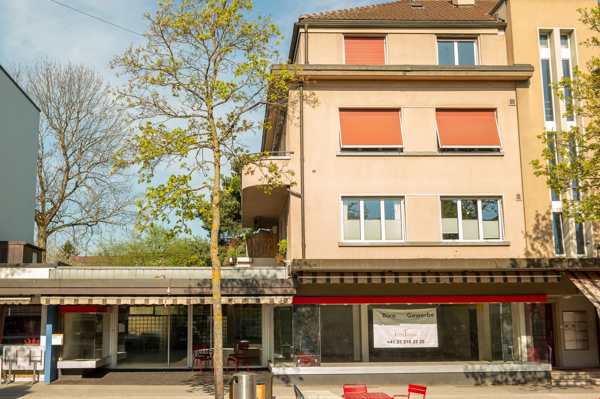
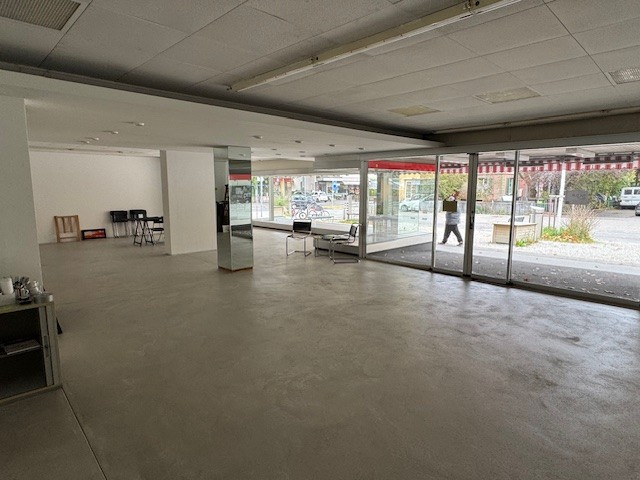
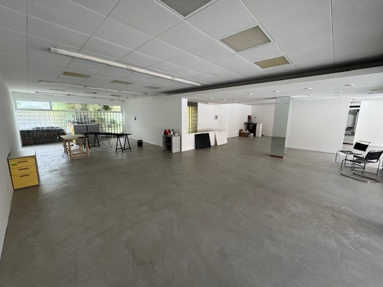
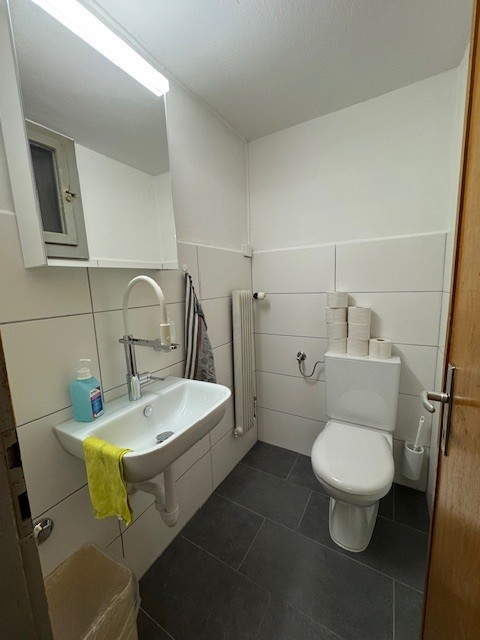
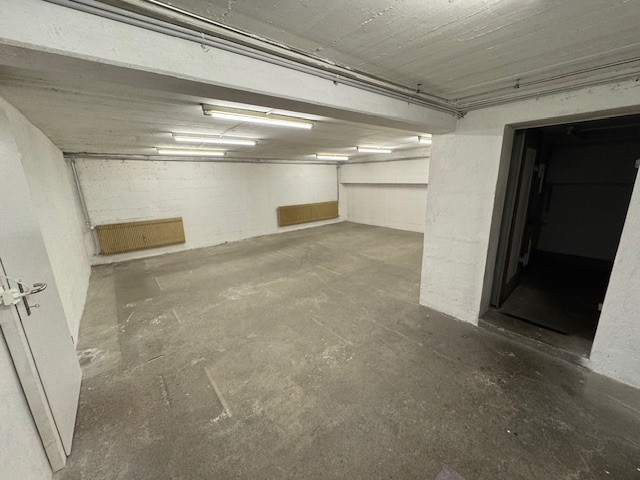

# Bümplizstrasse 112, 3018 Bern - CHF 3’450

> **Categorie:** `A_praxis_medical`  
> **Regiune:** Berna (oraș)  
> **Tip ofertă:** RENT / OFFICE  
> **Relevant pentru praxis:** da (praxis)  
> **Sursă:** [flatfox.ch](https://flatfox.ch/de/wohnung/bumplizstrasse-112-3018-bern/85439131/)  
> **Descărcat:** 2026-08-17 12:30

## Date obiect

| Câmp | Valoare |
|---|---|
| Adresă | Bümplizstrasse 112, 3018 Bern |
| Categorie obiect | INDUSTRY |
| Tip obiect | OFFICE |
| Chirie netă | CHF 2'900 |
| Nebenkosten | CHF 550 |
| Chirie brută | CHF 3'450 |
| Preț afișat | CHF 3'450 |
| Suprafață utilă | 280 m² |
| Etaj | 0 |
| An renovare | 2022 |
| Disponibil de la | imm |
| Referință | 3018.112.iqjcu.ddjye |

## Texte originale (germană)

**Titlu public:** Bümplizstrasse 112, 3018 Bern - CHF 3’450

**Titlu scurt:** 280m² Büro

**Pitch:** 280m² Büro in Bern mieten

**Titlu descriere:** Attraktiver Laden / Praxis / Büroraum im Zentrum von Bümpliz zu vermieten!

**Titlu chirie:** 280m² Büro in Bern mieten

**Spațiu afișat:** 280

### Descriere completă

An frequentierter Lage mitten in Bümpliz (3018 Bern) vermieten wir per sofort oder nach Vereinbarung ein attraktives Ladenlokal / Praxis / Bürofläche. 

Folgendes hat diese sehr repräsentable Gewerbefläche zu bieten: 

  * Im EG sind ca. 175 m2 verfügbar. Via einer direkten Treppenverbindung gelangen Sie ins UG mit ca. 105 m2 Lagerfläche 

  * Zugang via elektrischer Schiebetüre 

  * phänomenale Schaufensterfront 

  * neuwertiger, belastbarer Bodenbelag (eingegossener Hartbeton) vorhanden 

  * neuwertiges WC, Lavabo im UG 

Gastgewerbe, Coiffeursalon, Barbershop, Take away-Geschäfte kommen nicht in Frage. 

**MZ CHF 2'900 mtl. plus CHF 550 NK Akonto**

Sind Sie interessiert? Dann rufen Sie uns für einen Besichtigungstermin an.

## Dotări (attributes)

- accessiblewithwheelchair

## Ofertant

- **Nume:** KONImmo AG
- **Stradă:** Wylerringstrasse 62
- **NPA:** 3000
- **Localitate:** Bern

## Imagini (5)

*`01.jpg` — 1500x999 px — Three-story building, beige exterior, glass storefront, awnings, balcony on second floor, trees*

*`02.jpg` — 640x480 px — empty room with sliding glass doors, chairs, tables, person walking outside*

*`03.jpg` — 640x480 px — empty room, high ceiling, grey flooring, office desks, chairs, cabinets, window*

*`04.jpg` — 480x640 px — white walls, sink with faucet, radiator, toilet, tissue, trash can*

*`05.jpg` — 640x480 px — empty underground parking area, concrete floor, two heaters on the wall, ceiling lights, doors on the left and right*
