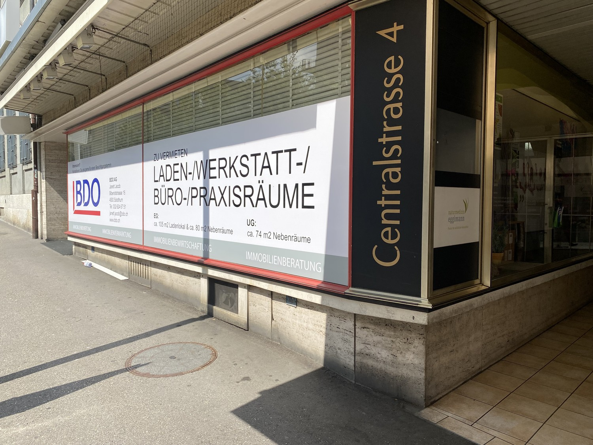
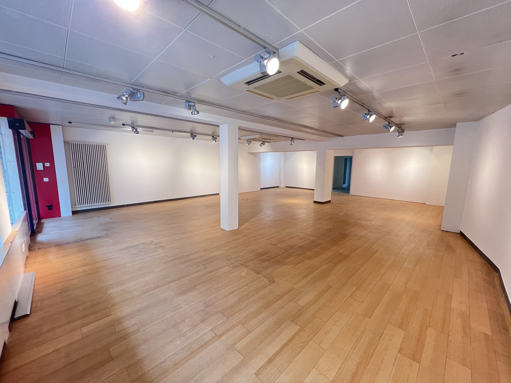
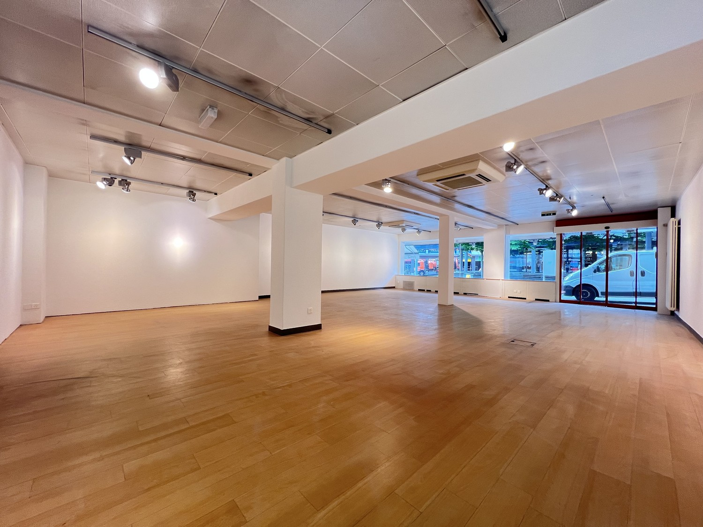
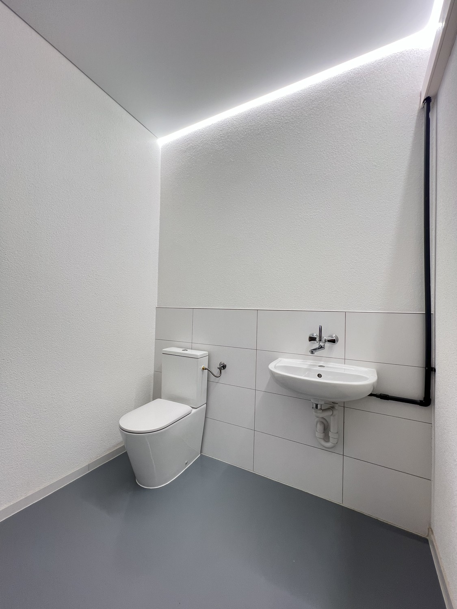
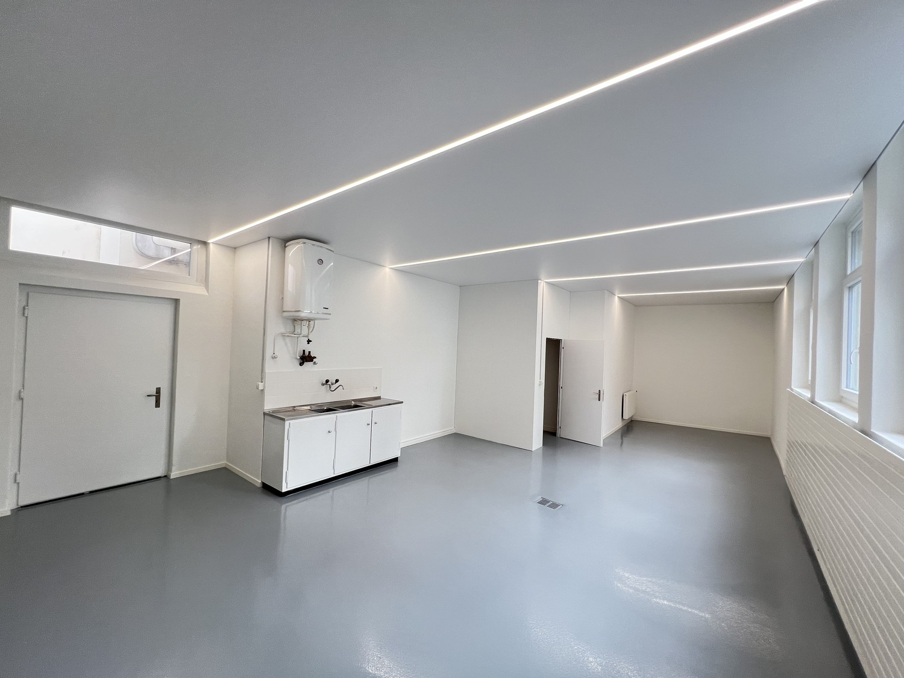
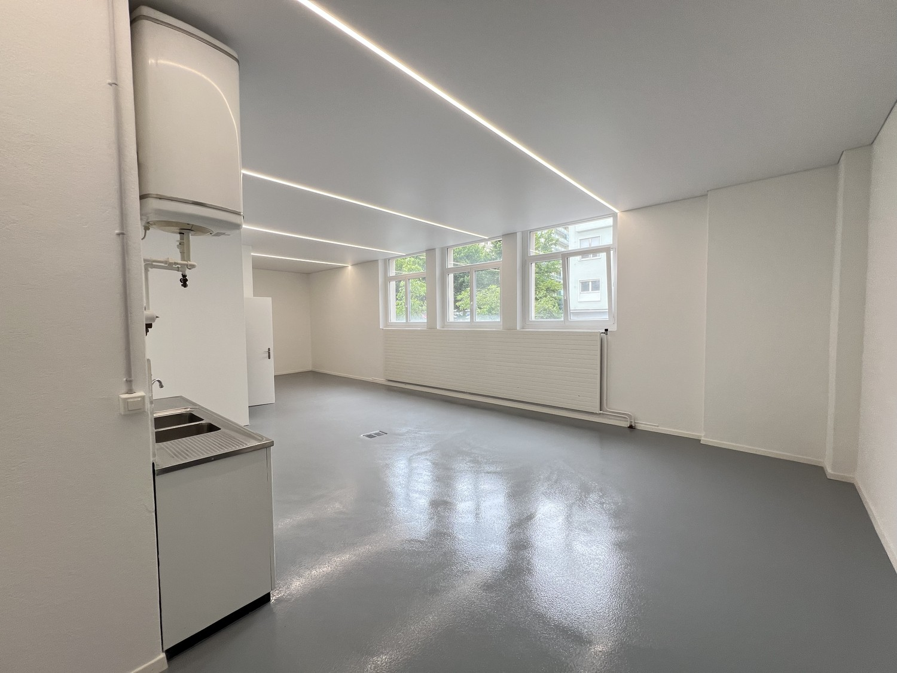

# Centralstrasse 4, 2540 Grenchen - CHF 2’450 inkl. NK pro Monat

> **Categorie:** `A_praxis_medical`  
> **Regiune:** Cantonul Berna  
> **Tip ofertă:** RENT / OFFICE  
> **Relevant pentru praxis:** da (praxisfläche, praxisräume)  
> **Sursă:** [flatfox.ch](https://flatfox.ch/de/wohnung/centralstrasse-4-2540-grenchen/85482084/)  
> **Descărcat:** 2026-08-17 12:39

## Date obiect

| Câmp | Valoare |
|---|---|
| Adresă | Centralstrasse 4, 2540 Grenchen |
| Categorie obiect | INDUSTRY |
| Tip obiect | OFFICE |
| Chirie netă | CHF 1'900 |
| Nebenkosten | CHF 550 |
| Preț afișat | CHF 2'450 |
| Suprafață utilă | 185 m² |
| Etaj | 0 |
| An renovare | 2025 |
| Disponibil de la | agr |
| Referință | 1206.04.2001 |

## Texte originale (germană)

**Titlu public:** Centralstrasse 4, 2540 Grenchen - CHF 2’450 inkl. NK pro Monat

**Titlu scurt:** 185m² Büro

**Pitch:** 185m² Büro in Grenchen mieten

**Titlu descriere:** Geräumige Büro- oder Praxisräume an zentraler Lage

**Titlu chirie:** 185m² Büro in Grenchen mieten

**Spațiu afișat:** 185

### Descriere completă

Wir vermieten eine Büro/- oder Praxisfläche von 105 m2 mit frisch renovierten Nebenräumen von 80m2 im EG.  
  
Bei Bedarf Bedarf stehen im UG noch 74 m2 Lagerflächen zur Verfügung.  
Die monatliche Nettomiete beläuft sich somit auf CHF 1'900.00 und die Nebenkosten-Akonto auf CHF 550.00.  
  
Das Objekt bietet Ihnen folgende Annehmlichkeiten:  
\- Fläche im EG mit grosser Schaufensterfront  
\- Sonnenstore vorhanden  
\- frisch renovierte Toilette mit Lavabo im EG  
\- neu sanierter Raum im Backoffice mit kleiner Teeküche  
\- 2 Lagerräume im EG  
  
Die Räume befinden sich an einer gut frequentierten Lage im Zentrum von Grenchen und bietet Ihnen vorzügliche Erreichbarkeit mit dem Auto und den Öffentlichen Verkehrsmitteln.  
  
Sind Sie interessiert?  
Wir freuen uns auf Ihre Kontaktaufnahme.

## Dotări (attributes)

- accessiblewithwheelchair
- lift
- cable
- broadbandinternet

## Ofertant

- **Nume:** BDO AG Solothurn

## Imagini (6)

*`01.jpg` — 1500x1125 px*

*`02.jpg` — 1500x1125 px*

*`03.jpg` — 1500x1125 px*

*`04.jpg` — 1125x1500 px*

*`05.jpg` — 1500x1125 px*

*`06.jpg` — 1500x1125 px*
