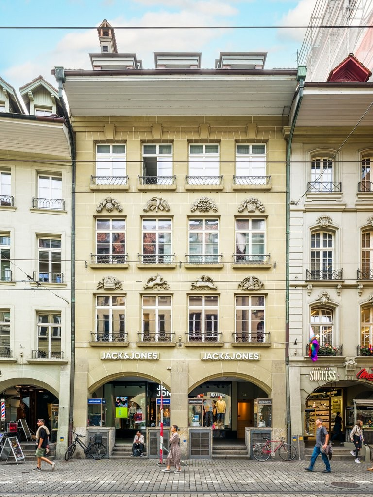
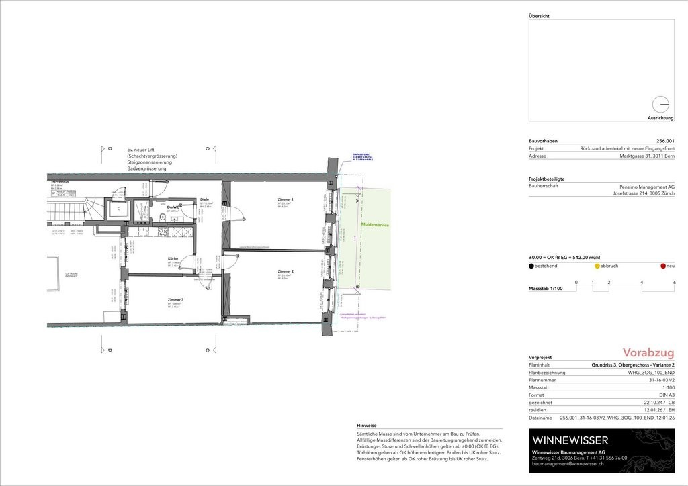

# Marktgasse 31, 3011 Bern - CHF 400 inkl. NK pro m² / Jahr

> **Categorie:** `A_praxis_medical`  
> **Regiune:** Berna (oraș)  
> **Tip ofertă:** RENT / PRACTICE  
> **Relevant pentru praxis:** da (praxis)  
> **Sursă:** [flatfox.ch](https://flatfox.ch/de/wohnung/marktgasse-31-3011-bern/85710155/)  
> **Descărcat:** 2026-08-17 12:29

## Date obiect

| Câmp | Valoare |
|---|---|
| Adresă | Marktgasse 31, 3011 Bern |
| Categorie obiect | INDUSTRY |
| Tip obiect | PRACTICE |
| Chirie netă | CHF 400 |
| Chirie brută | CHF 400 |
| Preț afișat | CHF 400 |
| Suprafață utilă | 96 m² |
| Etaj | 3 |
| An construcție | 1933 |
| An renovare | 2022 |
| Disponibil de la | 2026-09-01 |
| Referință | ..903_26055.01.6032 |

## Texte originale (germană)

**Titlu public:** Marktgasse 31, 3011 Bern - CHF 400 inkl. NK pro m² / Jahr

**Titlu scurt:** 96m² Praxis

**Pitch:** 96m² Praxis in Bern mieten

**Titlu descriere:** Neu renovierte Gewerbefläche an Toplage in der Berner Marktgasse

**Titlu chirie:** 96m² Praxis in Bern mieten

**Spațiu afișat:** 96

### Descriere completă

Die Marktgasse 31 liegt zentral in der Berner Altstadt und überzeugt durch eine lebendige Umgebung mit zahlreichen Geschäften, Restaurants und Cafés. Dank der hohen Passantenfrequenz sowie der ausgezeichneten Anbindung an den öffentlichen Verkehr bietet dieser Standort ideale Voraussetzungen für eine erfolgreiche Geschäftstätigkeit.    
  
Die helle Gewerbefläche im 3.Obergeschoss überzeugt durch eine funktionale Raumaufteilung und eignet sich hervorragend als Praxis-, Therapie- oder Bürofläche für Dienstleistungsbetriebe. Der Grundausbau ist hochwertig ausgeführt und bietet Ihnen gleichzeitig die Freiheit, die Räume nach Ihren individuellen Bedürfnissen zu gestalten.   
  
Profitieren Sie von den zahlreichen Vorteilen, die Ihnen diese Gewerbefläche bietet:   
\- Neu renovierte Gewerbefläche an zentralster Altstadtlage   
\- Drei individuell nutzbare und gestaltbare Räume   
\- Voll ausgestattet, geschlossene Küche   
\- Eigene WC-Anlage sowie Dusche   
**  
Ihre Vorteile mit Regimo Business: **   
1\. Individuelle Mietpreis- und Vertragsmodelle   
2\. Beratung und Unterstützung bei der Umbau- und Einrichtungsplanung durch ausgewiesene Spezialisten.   
3\. Persönliche Betreuung und hohe Flexibilität im Hinblick auf Mieterwünsche während der gesamten Vertragsdauer.   
  
Der Mietzins versteht sich zzgl. CHF 32.50 Nebenkosten/m2/Jahr und MwSt.   
  
Haben wir Ihr Interesse geweckt? Dann zögern Sie nicht und kontaktieren Sie uns, um einen individuellen Besichtigungstermin zu vereinbaren.

## Dotări (attributes)

- lift

## Ofertant

- **Nume:** Regimo Bern
- **Stradă:** Thunstrasse 32
- **NPA:** 3005
- **Localitate:** Bern

## Imagini (2)

*`01.jpg` — 768x1024 px — Gebäude*

*`02.jpg` — 1024x724 px — Grundrissplan_Var1*
