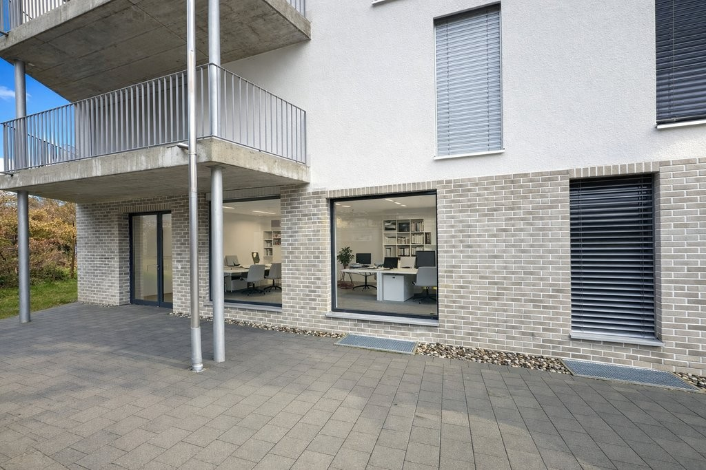
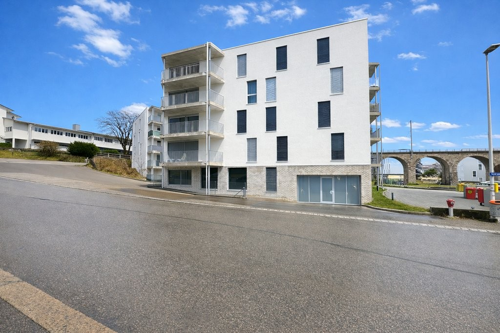
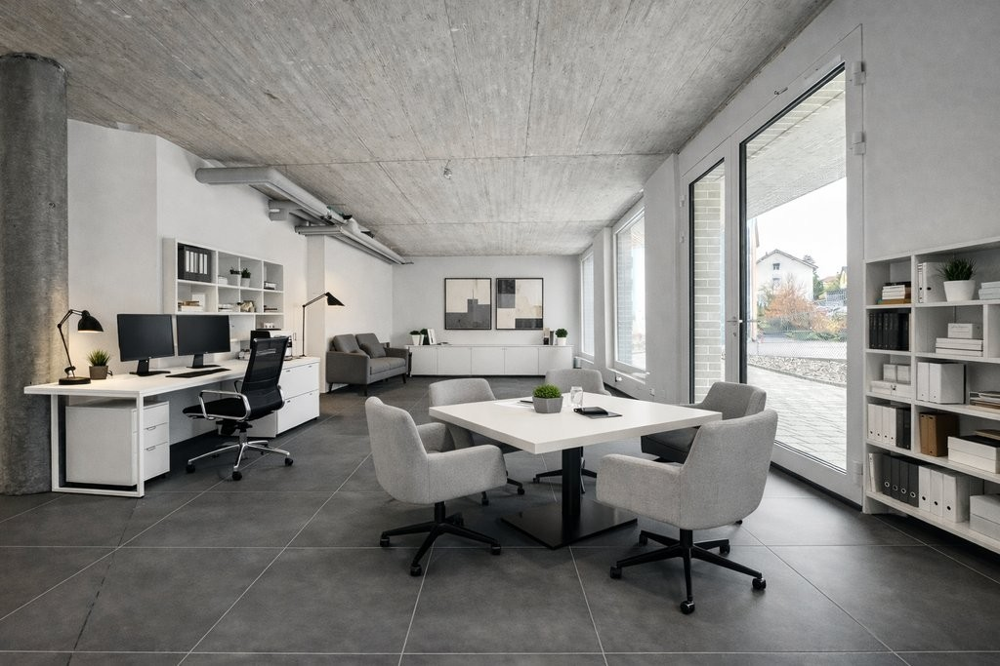
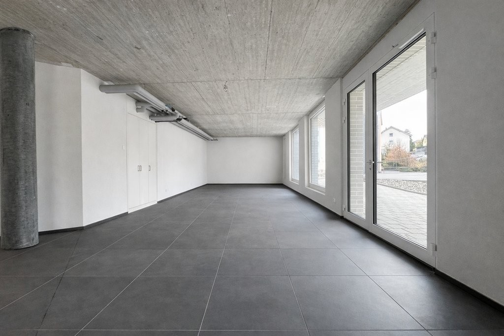
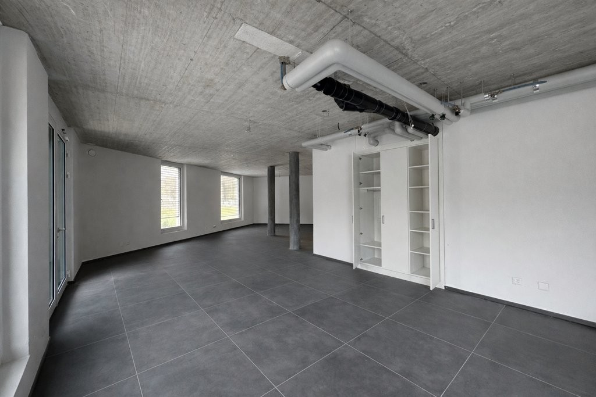
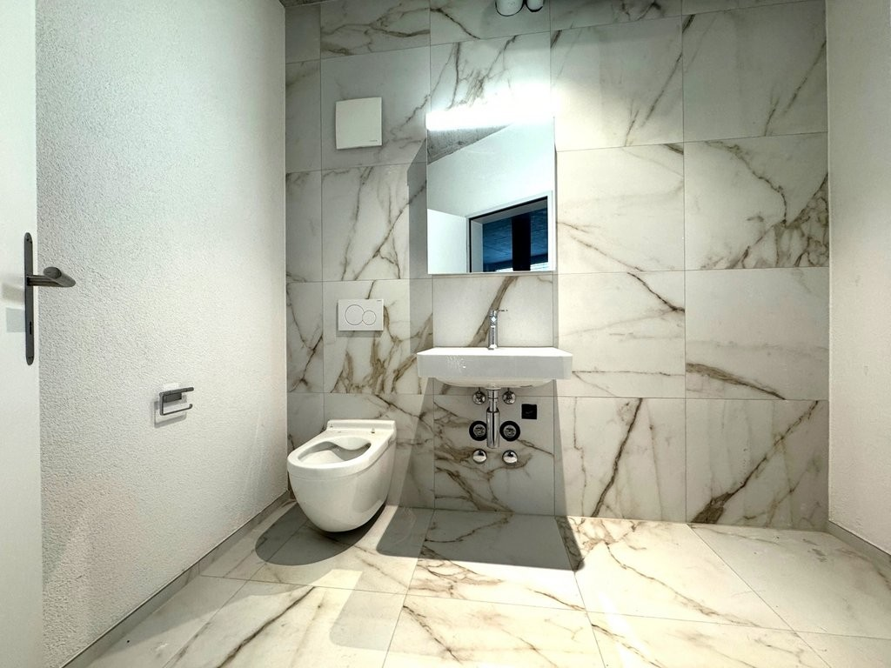

# Oelirain 1, 2540 Grenchen - CHF 1’890 inkl. NK pro Monat

> **Categorie:** `A_praxis_medical`  
> **Regiune:** Cantonul Berna  
> **Tip ofertă:** RENT / COMMERCIAL  
> **Relevant pentru praxis:** da (praxen, praxisfläche)  
> **Sursă:** [flatfox.ch](https://flatfox.ch/de/wohnung/oelirain-1-2540-grenchen/85777423/)  
> **Descărcat:** 2026-08-17 12:38

## Date obiect

| Câmp | Valoare |
|---|---|
| Adresă | Oelirain 1, 2540 Grenchen |
| Categorie obiect | INDUSTRY |
| Tip obiect | COMMERCIAL |
| Chirie netă | CHF 1'590 |
| Nebenkosten | CHF 300 |
| Chirie brută | CHF 1'890 |
| Preț afișat | CHF 1'890 |
| Suprafață utilă | 100 m² |
| Etaj | 0 |
| Disponibil de la | agr |
| Referință | 10245.1.1001 |

## Texte originale (germană)

**Titlu public:** Oelirain 1, 2540 Grenchen - CHF 1’890 inkl. NK pro Monat

**Titlu scurt:** 100m² Gewerbe

**Pitch:** 100m² Gewerbe in Grenchen mieten

**Titlu descriere:** ATTRAKTIVE BÜRO/PRAXISFLÄCHE - 2x NETTOMIETZINS GESCHENKT

**Titlu chirie:** 100m² Gewerbe in Grenchen mieten

**Spațiu afișat:** 100

### Descriere completă

**Attraktive Gewerbefläche für Praxis, Büro oder Dienstleistung mit 100 m 2 an moderner Wohnlage in Grenchen.**

**Nutzen Sie die Gelegenheit und profitieren Sie von 2 geschenkten Nettomietzinsen zum Start Ihres neuen Geschäftsstandorts.**

An der Überbauung Oelirain 1 in Grenchen vermieten wir per sofort eine helle und flexibel nutzbare Gewerbefläche mit rund 100 m2. Die Räumlichkeiten überzeugen durch einen modernen Ausbaustandard, grosszügige Fensterflächen und vielseitige Nutzungsmöglichkeiten. 

Die Fläche eignet sich ideal für Dienstleistungsbetriebe, Beratungsunternehmen, Treuhandbüros, Agenturen, Therapiepraxen, Kosmetik und Beautyangebote oder andere kundenorientierte Geschäftskonzepte. 

**Ihre Vorteile auf einen Blick:**

  * Helle und freundliche Räumlichkeiten mit viel Tageslicht 
  * Flexible Nutzungsmöglichkeiten für Büro,Praxis oder Dienstleistungsbetriebe 
  * Moderner Ausbaustandard 
  * Plattenboden in sämtlichen Räumen 
  * Fussbodenheizung 
  * Separate Lüftungsanlage für ein angenehmes Raumklima 
  * Elektrische Raffstoren 
  * Moderne Nasszelle (WC) 
  * Praktische Einbauschränke 
  * Eigener Aussensitzplatz 
  * Besucherfreundliche Erreichbarkeit 
  * Tiefgaragenparkplätze verfügbar 

Die Gewerbefläche befindet sich in einer modernen Wohnüberbauung und profitiert von einem attraktiven Umfeld mit potenzieller Kundschaft direkt vor Ort. 

Zur Überbauung gehören Tiefgaragenparkplätze, die für CHF 130.00 pro Monat zusätzlich angemietet werden können. 

Für weitere Fragen steht Ihnen Frau de Castro gerne zur Verfügung: 079 278 68 17

## Dotări (attributes)

- balconygarden
- lift

## Ofertant

- **Nume:** VIVIQ
- **Stradă:** Lerchenstrasse 24
- **NPA:** 8045
- **Localitate:** Zürich

## Imagini (6)

*`01.jpg` — 1024x683 px*

*`02.jpg` — 1024x683 px*

*`03.jpg` — 1024x683 px*

*`04.jpg` — 1024x683 px*

*`05.jpg` — 1024x683 px*

*`06.jpg` — 1024x768 px*
