# Konsumstrasse 13, 3007 Bern - CHF 2’010 inkl. NK pro Monat

> **Categorie:** `A_praxis_medical`  
> **Regiune:** Berna (oraș)  
> **Tip ofertă:** RENT / OFFICE  
> **Relevant pentru praxis:** da (praxisfläche, praxisräumlichkeiten)  
> **Sursă:** [flatfox.ch](https://flatfox.ch/de/wohnung/konsumstrasse-13-3007-bern/85849912/)  
> **Descărcat:** 2026-08-17 12:28

## Date obiect

| Câmp | Valoare |
|---|---|
| Adresă | Konsumstrasse 13, 3007 Bern |
| Categorie obiect | INDUSTRY |
| Tip obiect | OFFICE |
| Chirie netă | CHF 1'760 |
| Nebenkosten | CHF 250 |
| Chirie brută | CHF 2'010 |
| Preț afișat | CHF 2'010 |
| Etaj | 0 |
| An construcție | 1988 |
| Disponibil de la | agr |
| Referință | 25540..60001 |

## Texte originale (germană)

**Titlu public:** Konsumstrasse 13, 3007 Bern - CHF 2’010 inkl. NK pro Monat

**Titlu scurt:** Büro

**Pitch:** Büro in Bern mieten

**Titlu descriere:** Attraktive Büro- oder Praxisräumlichkeiten im Mattenhofquartier

**Titlu chirie:** Büro in Bern mieten

### Descriere completă

Per sofort oder nach Vereinbarung vermieten wir helle, modern ausgebaute Büro- oder Praxisflächen an ruhiger Lage im gefragten Mattenhofquartier. Die betroffene Gewerbefläche ist auf dem Grundrissplan grün markiert.   
  
Ihre Vorteile auf einen Blick:   
  
\- Lichtdurchflutete Räume mit hochwertigem Laminatboden   
\- Flexible Grundrissgestaltung – ideal für individuelle Nutzungskonzepte   
\- Angenehmes Arbeitsumfeld mit viel Tageslicht   
\- Vielfältige Gastronomie- und Einkaufsmöglichkeiten in unmittelbarer Umgebung   
\- Beste Anbindung an den öffentlichen Verkehr – Tramlinie 6 in nur 3 Gehminuten erreichbar   
\- Autobahnanschluss innert sechs Fahrt-Minuten erreicht   
\- Einstellhallenplätze für je CHF 150.00 verfügbar (auf Wunsch stehen auch E-Ladestationen zur Verfügung)   
  
Bei Bedarf können zusätzlich die angrenzenden Gewerberäumlichkeiten (violett auf dem Grundrissplan) dazugemietet werden.

## Dotări (attributes)

- parkingspace
- lift
- accessiblewithwheelchair
- garage

## Ofertant

- **Nume:** Niederer AG

## Imagini (12)

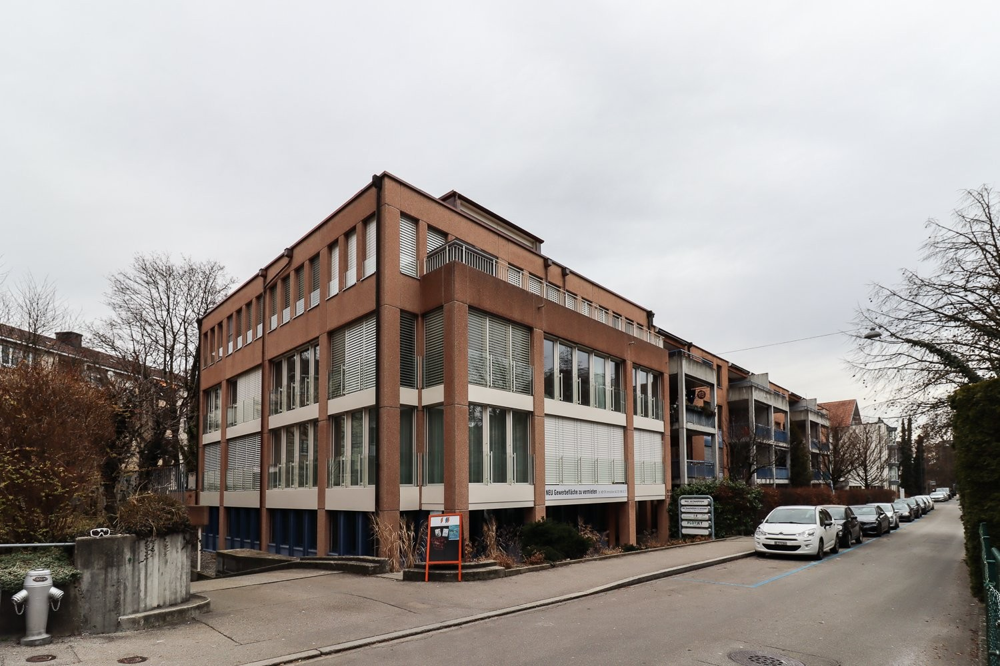
*`01.jpg` — 1500x1000 px — Aussenansicht*

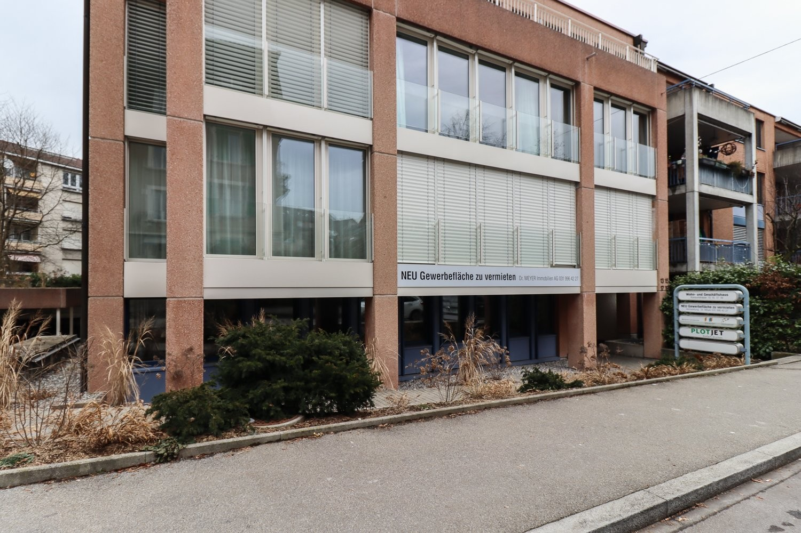
*`02.jpg` — 1500x1000 px — Aussenansicht*

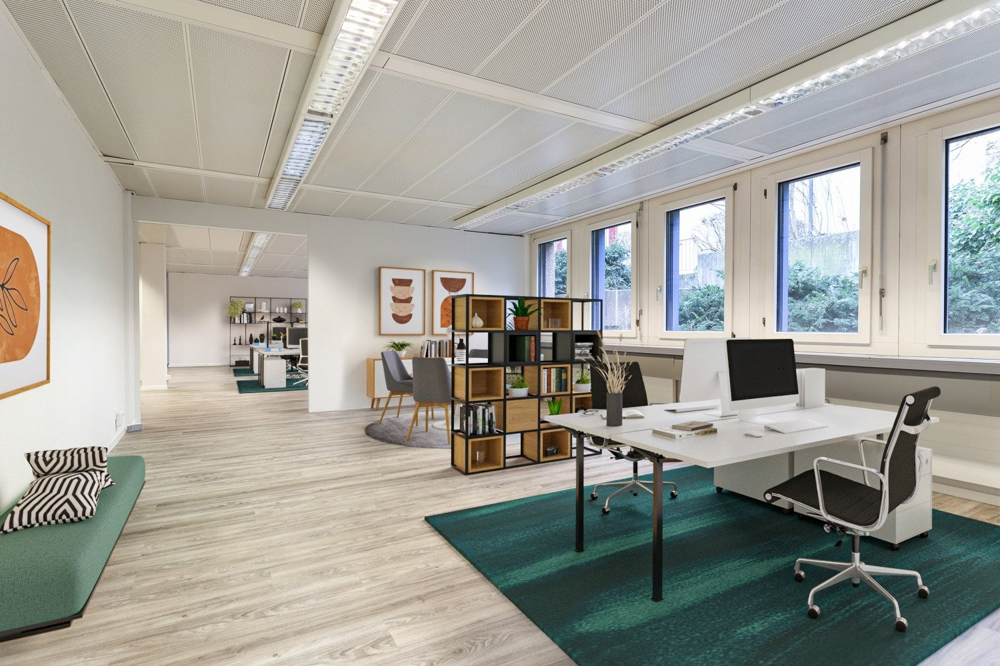
*`03.jpg` — 1500x1000 px — Digitalisierung Gewerberäume 1*

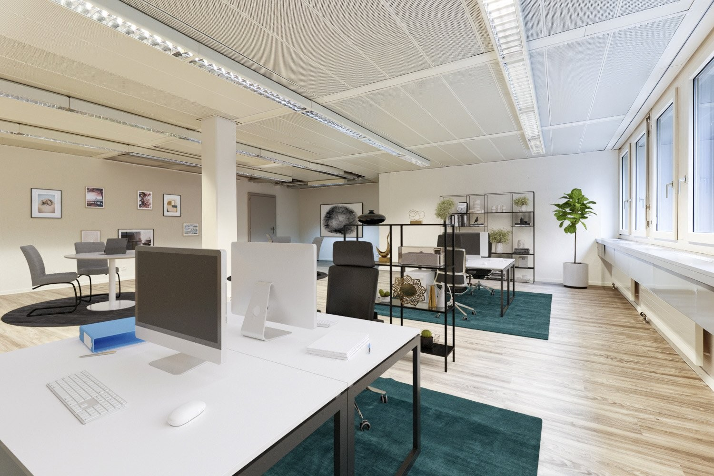
*`04.jpg` — 1500x1000 px — Digitalisierung Gewerberäume 2*

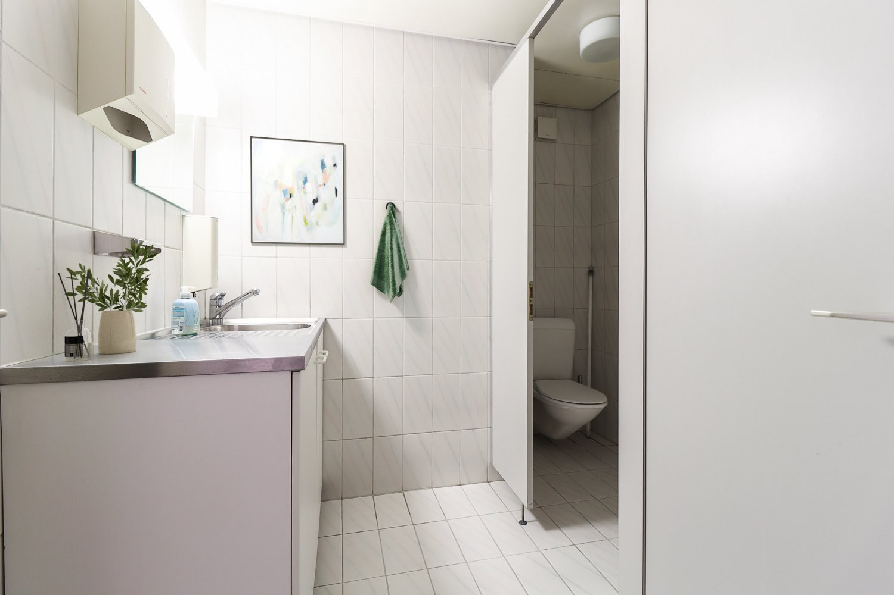
*`05.jpg` — 1500x1000 px — Digitalisierung Badezimmer*

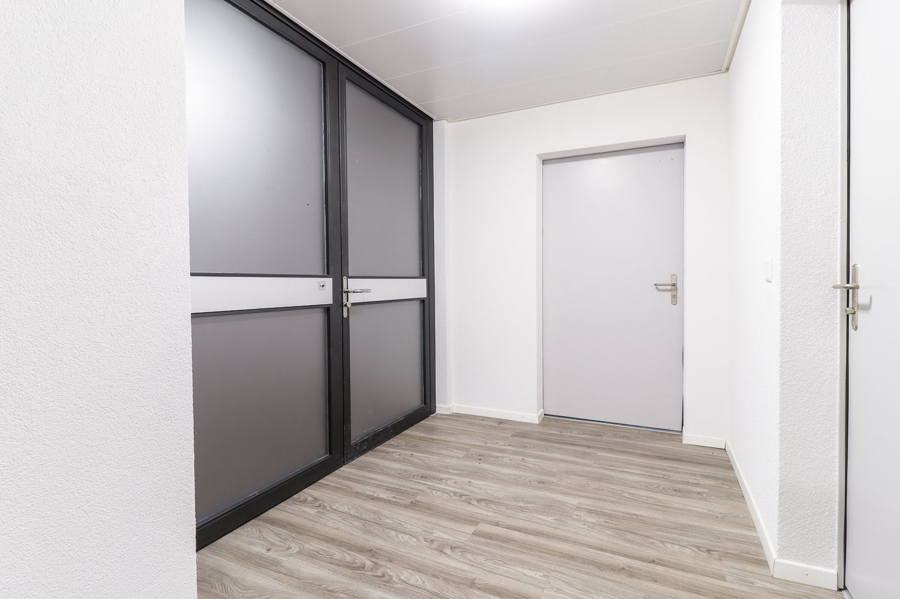
*`06.jpg` — 1500x1000 px — Eingang*

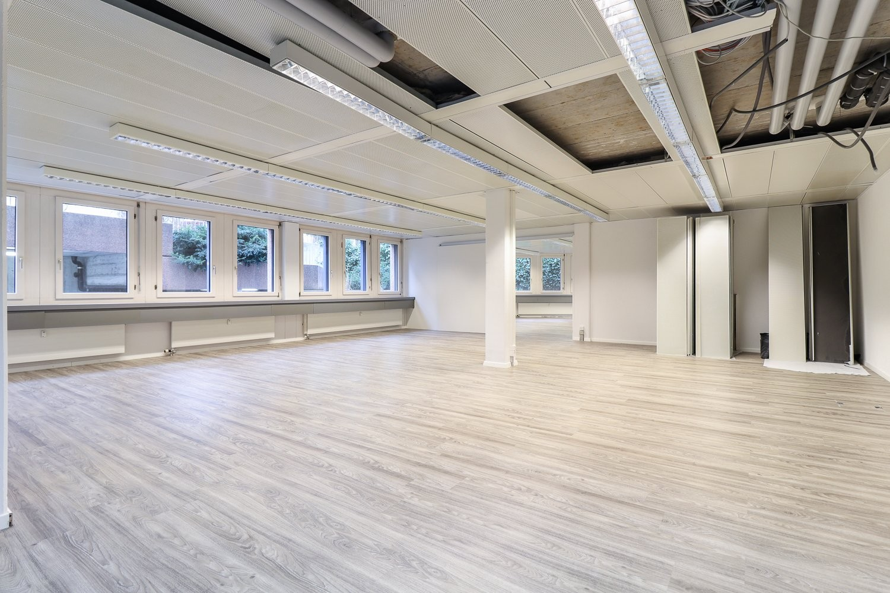
*`07.jpg` — 1500x1000 px — Innenansicht*

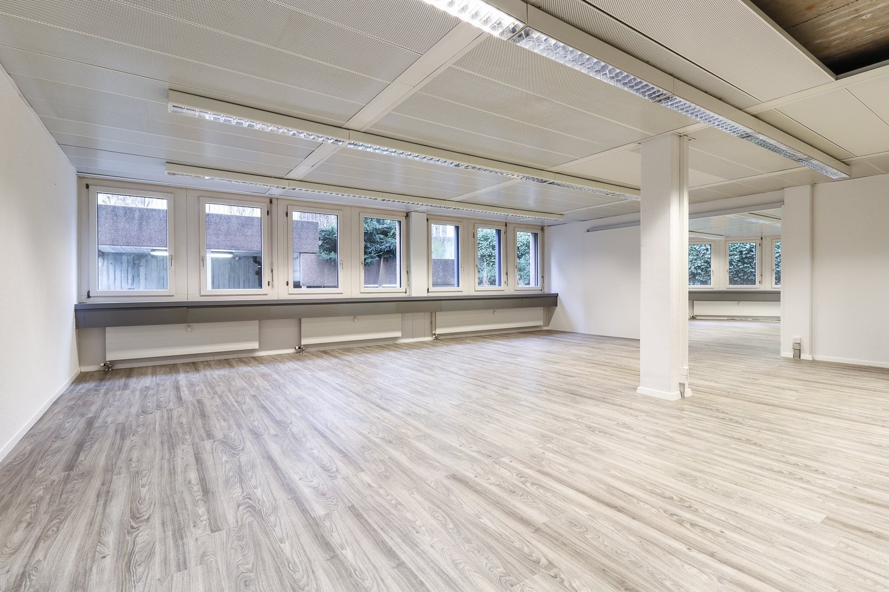
*`08.jpg` — 1500x1000 px — Innenansicht 2*

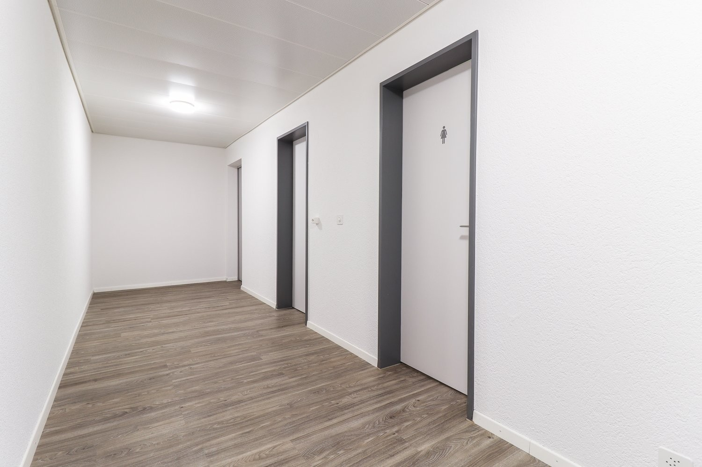
*`09.jpg` — 1500x1000 px — Badezimmer aussen*

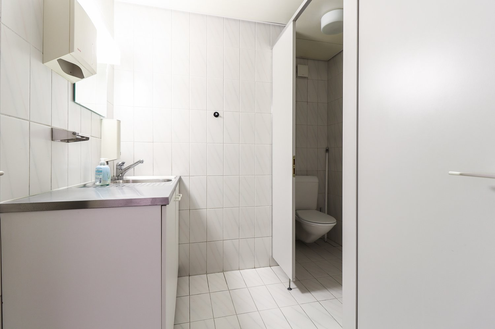
*`10.jpg` — 1500x1000 px — Bad*

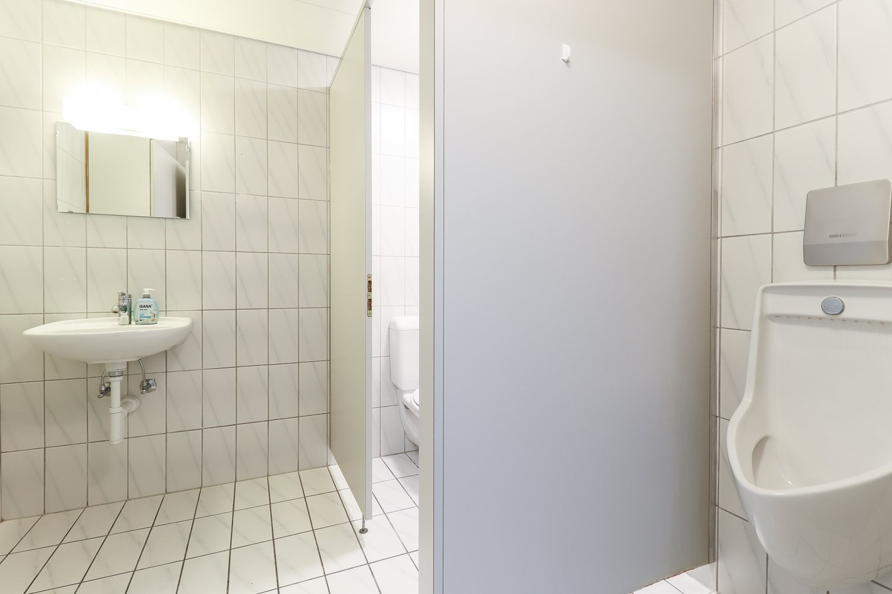
*`11.jpg` — 1500x1000 px — Bad 2*

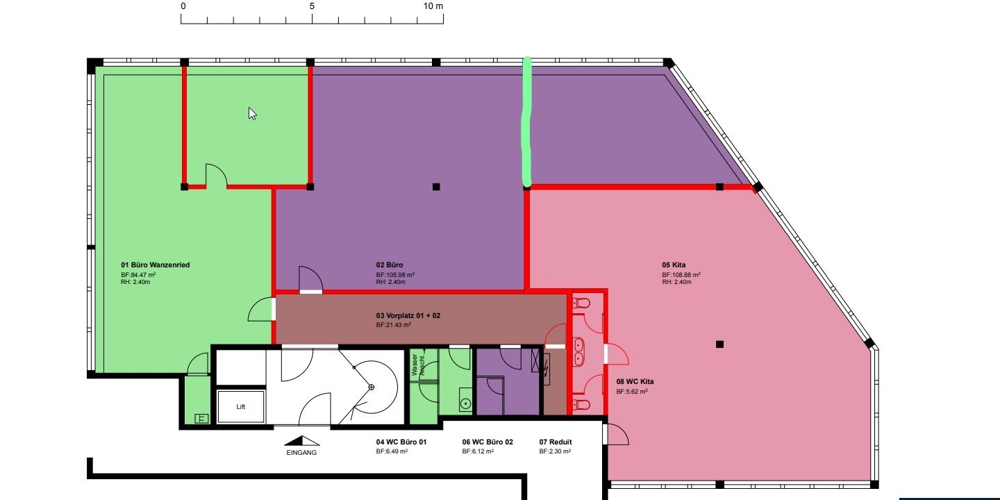
*`12.jpg` — 1440x720 px — Grünes Büro*
