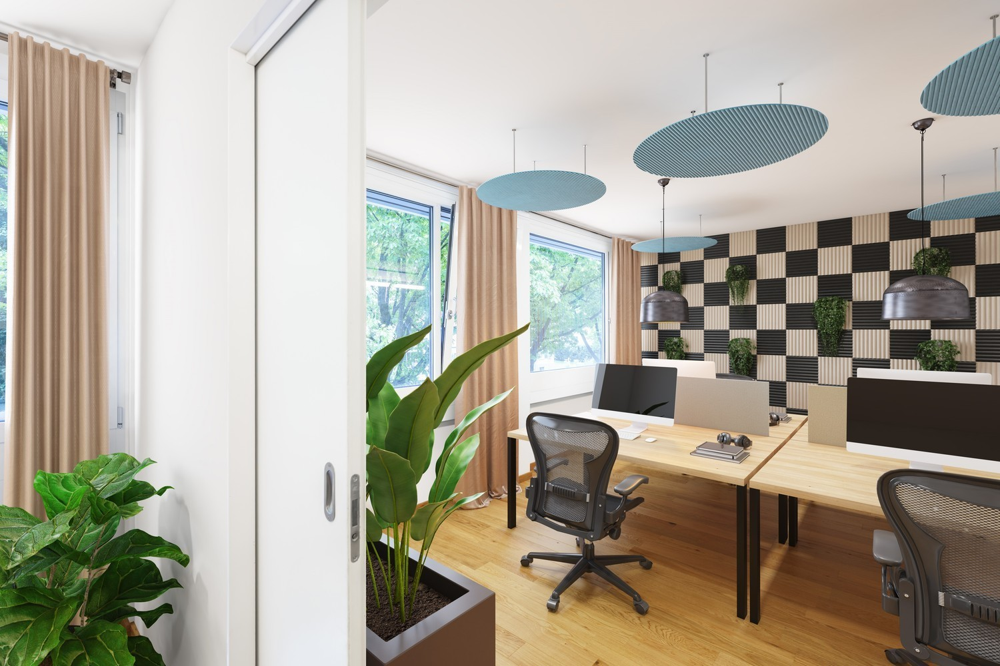
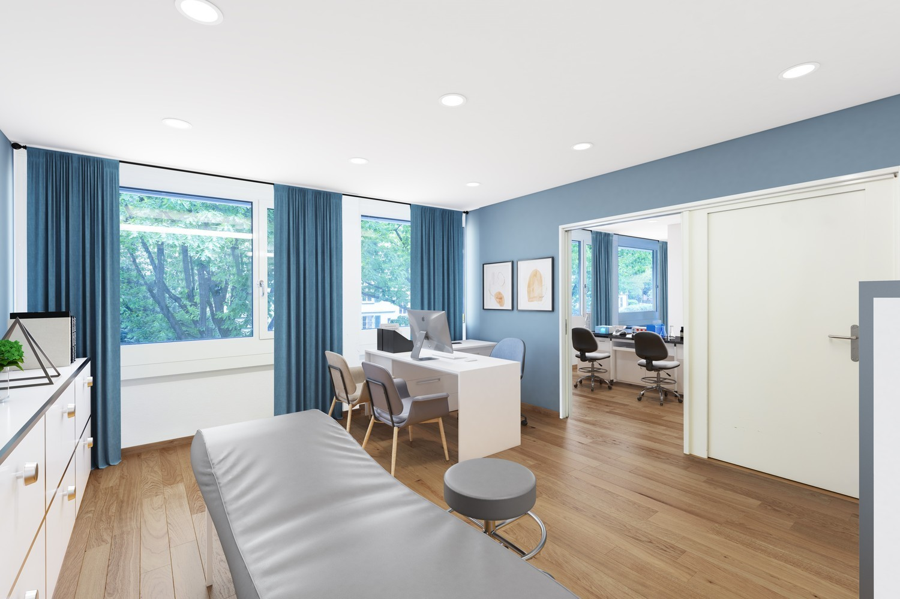
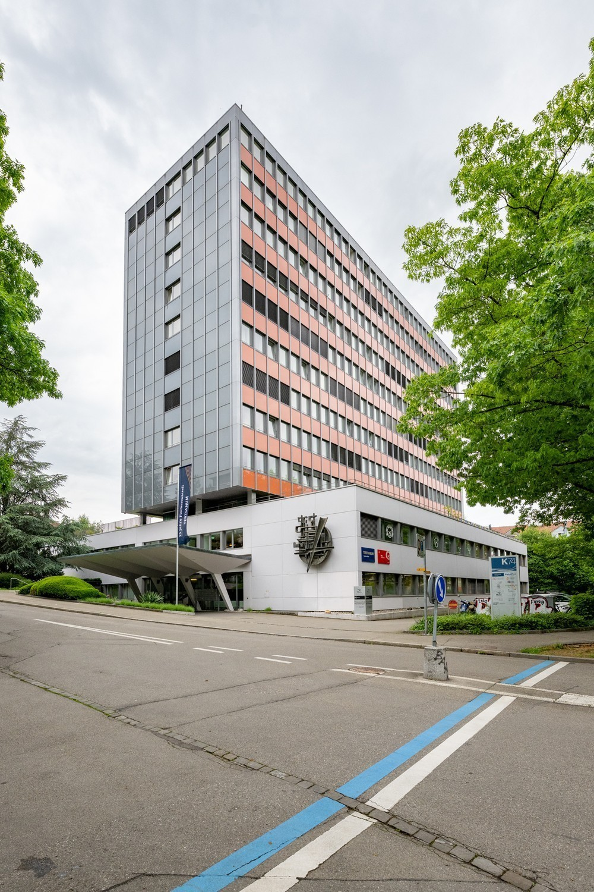
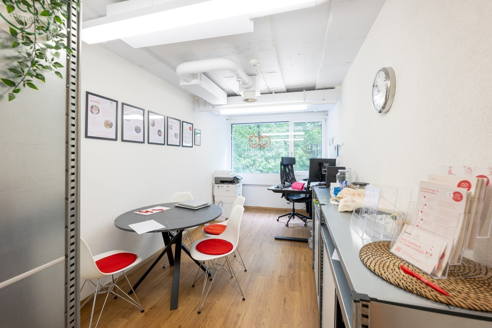
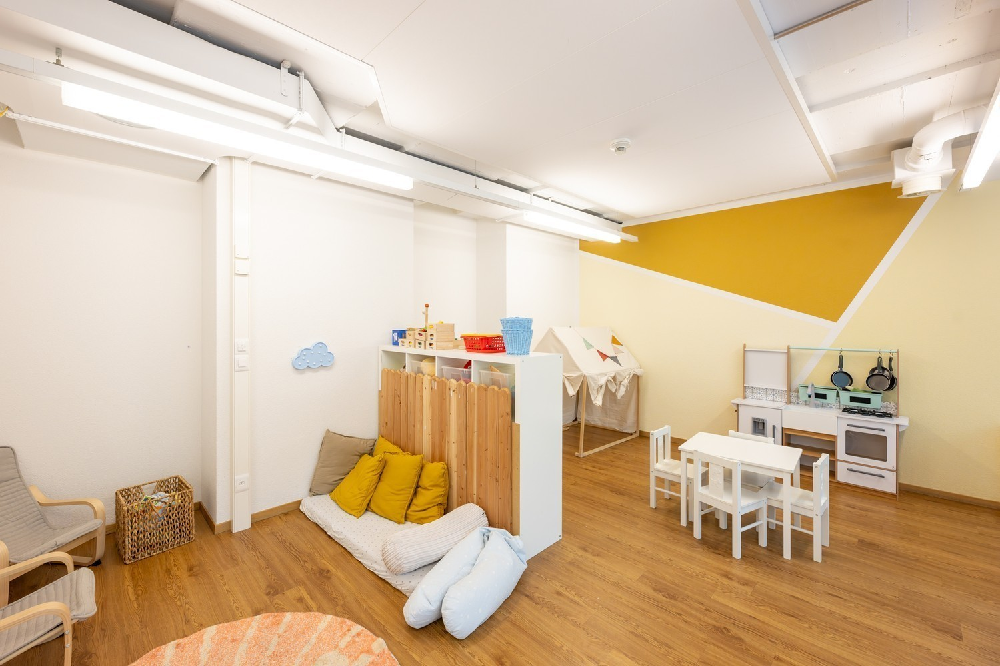
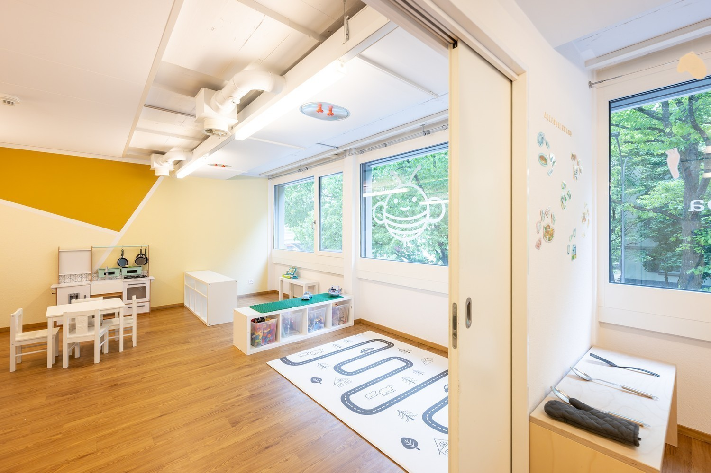
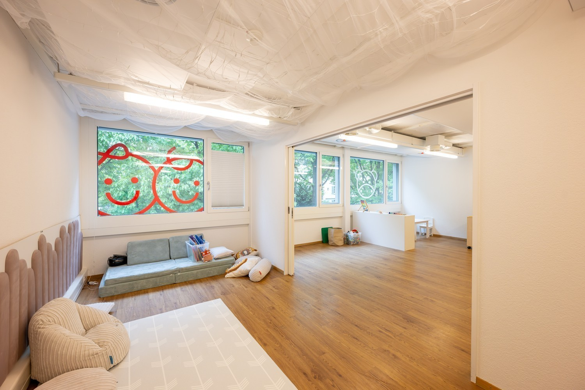
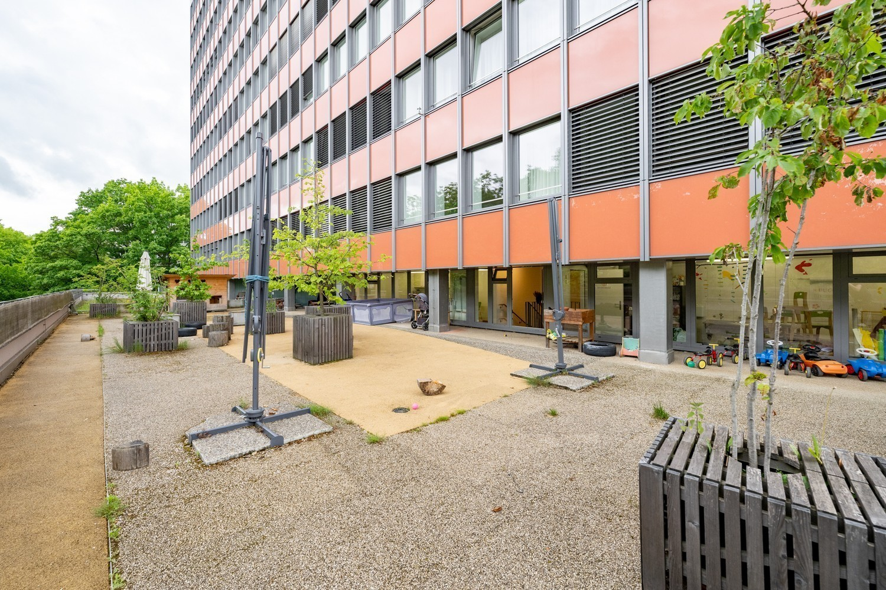
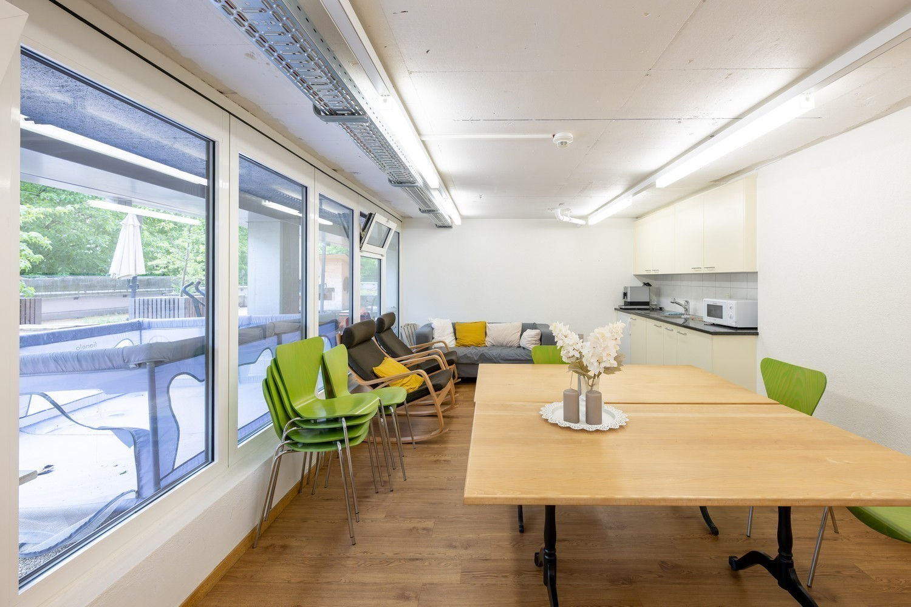
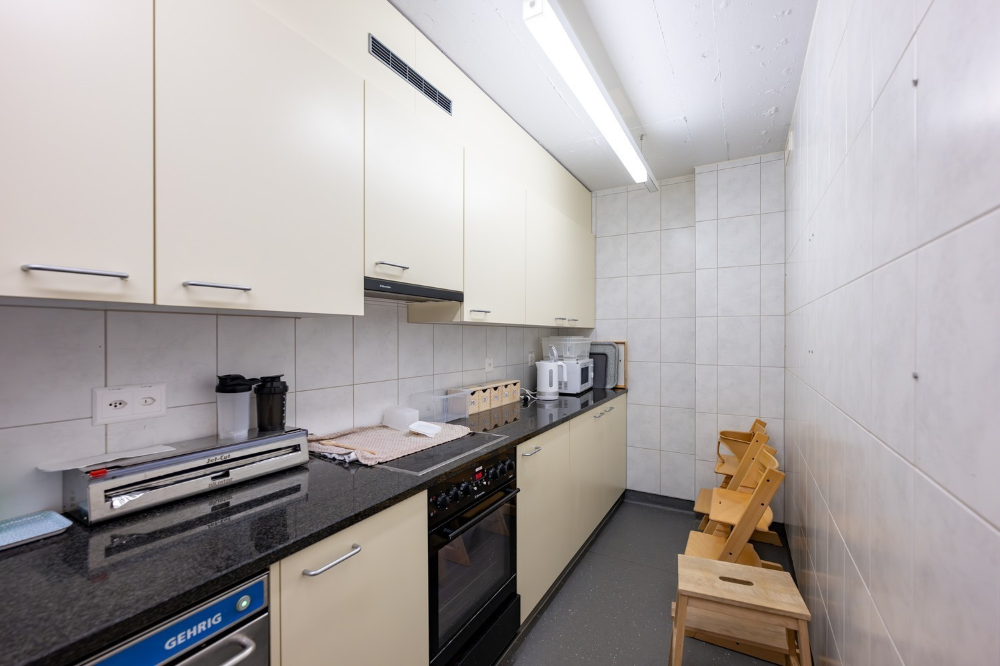

# Könizstrasse 74, 3008 Bern - auf Anfrage

> **Categorie:** `A_praxis_medical`  
> **Regiune:** Berna (oraș)  
> **Tip ofertă:** RENT / OFFICE  
> **Relevant pentru praxis:** da (praxis)  
> **Sursă:** [flatfox.ch](https://flatfox.ch/de/wohnung/konizstrasse-74-3008-bern/85864223/)  
> **Descărcat:** 2026-08-17 12:25

## Date obiect

| Câmp | Valoare |
|---|---|
| Adresă | Könizstrasse 74, 3008 Bern |
| Categorie obiect | INDUSTRY |
| Tip obiect | OFFICE |
| Suprafață utilă | 300 m² |
| Etaj | 1 |
| Disponibil de la | agr |
| Referință | 25203.01.30100.Privera8 |

## Texte originale (germană)

**Titlu public:** Könizstrasse 74, 3008 Bern - auf Anfrage

**Titlu scurt:** 300m² Büro

**Pitch:** 300m² Büro in Bern mieten

**Titlu descriere:** Flexible Gewerbefläche an zentraler Lage – ideal für KITA, Büro oder Praxis

**Titlu chirie:** 300m² Büro in Bern mieten

**Spațiu afișat:** 300

### Descriere completă

Die angebotene Fläche eignet sich ideal für eine Kindertagesstätte (KITA), ist jedoch auch perfekt nutzbar als Büro oder Praxis. Die Raumaufteilung ermöglicht individuelle Anpassungen je nach Bedarf.  
**Flächenaufteilung:**  
– 1. Obergeschoss: ca. 318 m² mit Sanitärräumen und Küchen  
– Zwischengeschoss: ca. 45 m² mit zusätzlicher Küche und WC  
– Terrasse: ca. 242 m² (exklusive Aussenfläche)  
– Teilflächen sind möglich (Innenfläche ca. 50m2 und 300m2)  
– Abstell-/ und Lagerräume diverse Vorhanden  
– Einstellhallenplätze vorhanden  
**Highlights:**  
– Vielseitig nutzbare Gewerbefläche  
– Zentrale Lage mit guter Anbindung an den öffentlichen Verkehr  
– Grosse Terrasse mit vielseitigem Nutzungspotenzial  
– Diverse Küchen und moderne Sanitäranlagen (auf der Hauptfläche spezielle Sanitäranlagen für Kinder)  
– Lager-/Abstellfläche im Erdgeschoss  
– Einstellhallenplätze direkt im Gebäude  
– Bezug ab sofort möglich  
**Lage:**  
Die Liegenschaft befindet sich an der gut frequentierten Könizstrasse im westlichen Teil von Bern, im Stadtteil Weissenbühl. Die Bus- und Tramhaltestellen „Wabernstrasse“ und „Steigerhubel“ befinden sich in Gehdistanz und bieten direkten Anschluss an das Stadtzentrum sowie den Bahnhof Bern. Auch der Autobahnanschluss ist in wenigen Minuten erreichbar. In der direkten Umgebung befinden sich Schulen, Einkaufsmöglichkeiten, Gastronomiebetriebe und öffentliche Einrichtungen – ein attraktives Umfeld für Mitarbeitende, Kundschaft oder Eltern von Kita-Kindern.  
**Mietkonditionen:**  
Gerne geben wir Ihnen bei Interesse detaillierte Auskünfte zu den Mietpreisen und Konditionen.  
**Haben wir Ihr Interesse geweckt?**  
Gerne stehen wir für weitere Informationen oder einen unverbindlichen Besichtigungstermin zur Verfügung. Wir freuen uns auf Ihre Kontaktaufnahme!  
  
_\*Die aufgeführten Impressionen (Fotos) sind urheberrechtlich geschützt und dürfen nicht von Dritten verwendet werden. Die Flächen werden ohne Einrichtung vermietet._

## Ofertant

- **Nume:** PRIVERA AG
- **Stradă:** Worbstrasse 142
- **NPA:** 3073
- **Localitate:** Gümligen

## Imagini (10)

*`01.jpg` — 1500x1000 px*

*`02.jpg` — 1500x1000 px*

*`03.jpg` — 1000x1500 px*

*`04.jpg` — 1500x1000 px*

*`05.jpg` — 1500x1000 px*

*`06.jpg` — 1500x1000 px*

*`07.jpg` — 1500x1000 px*

*`08.jpg` — 1500x1000 px*

*`09.jpg` — 1500x1000 px*

*`10.jpg` — 1500x1000 px*
