# Bümplizstrasse 150, 3018 Bern - CHF 8’780 inkl. NK pro Monat

> **Categorie:** `A_praxis_medical`  
> **Regiune:** Berna (oraș)  
> **Tip ofertă:** RENT / OFFICE  
> **Relevant pentru praxis:** da (praxisräume)  
> **Sursă:** [flatfox.ch](https://flatfox.ch/de/wohnung/bumplizstrasse-150-3018-bern/85903567/)  
> **Descărcat:** 2026-08-17 12:31

## Date obiect

| Câmp | Valoare |
|---|---|
| Adresă | Bümplizstrasse 150, 3018 Bern |
| Categorie obiect | INDUSTRY |
| Tip obiect | OFFICE |
| Chirie netă | CHF 7'800 |
| Nebenkosten | CHF 980 |
| Chirie brută | CHF 8'780 |
| Preț afișat | CHF 8'780 |
| Suprafață utilă | 478 m² |
| Etaj | 0 |
| Disponibil de la | 2027-03-01 |
| Referință | 1256.01.00001 |

## Texte originale (germană)

**Titlu public:** Bümplizstrasse 150, 3018 Bern - CHF 8’780 inkl. NK pro Monat

**Titlu scurt:** 478m² Büro

**Pitch:** 478m² Büro in Bern mieten

**Titlu descriere:** Attraktive Gewerbefläche geeignet als Büro- oder Praxisräume

**Titlu chirie:** 478m² Büro in Bern mieten

**Spațiu afișat:** 478

### Descriere completă

Ideal geeignet als Büro, Praxis oder für andere Dienstleistungsbetriebe.   
Die Fläche bietet mit 480 m2 eine gut erreichbare Lage und vielseitige Nutzungsmöglichkeiten.   
Archivraum 58 m2 im UG und mehrere Aussenparkplätze können dazu gemietet werden.   
Gute Anbindung mit Tram, Bus und Zug ins Stadtzentrum.   
Standort mit guter Infrastruktur und Entwicklungspotenzial!   
Weitere Informationen und Besichtigung auf Anfrage.

## Dotări (attributes)

- raisedgroundfloor

## Ofertant

- **Nume:** Dr.Meyer Immobilien AG
- **Stradă:** Morgenstrasse 83A
- **NPA:** 3018
- **Localitate:** Bern

## Imagini (12)

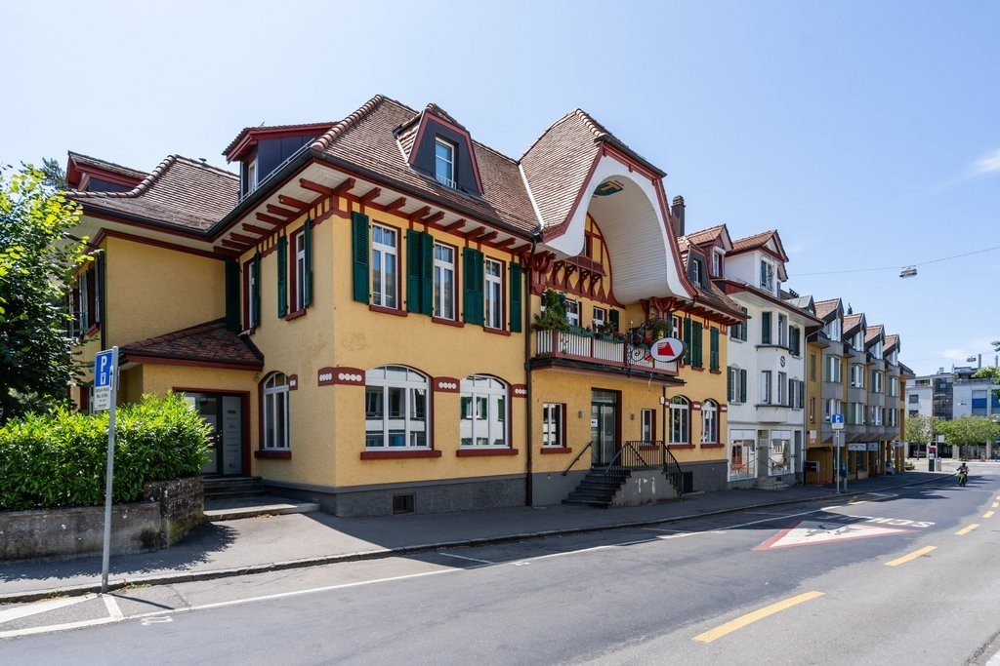
*`01.jpg` — 1024x683 px — _DM36089.jpeg*

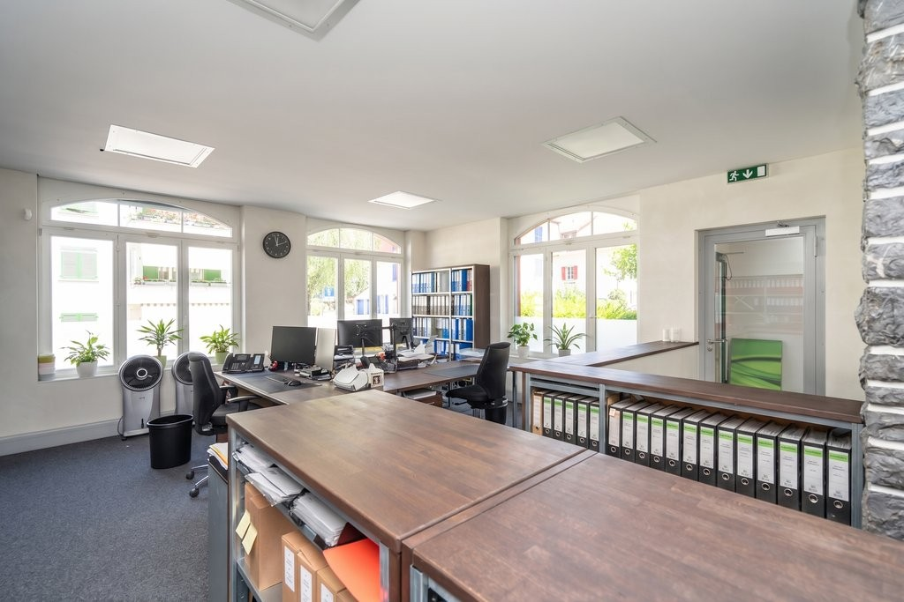
*`02.jpg` — 1024x683 px — 1_1.jpeg*

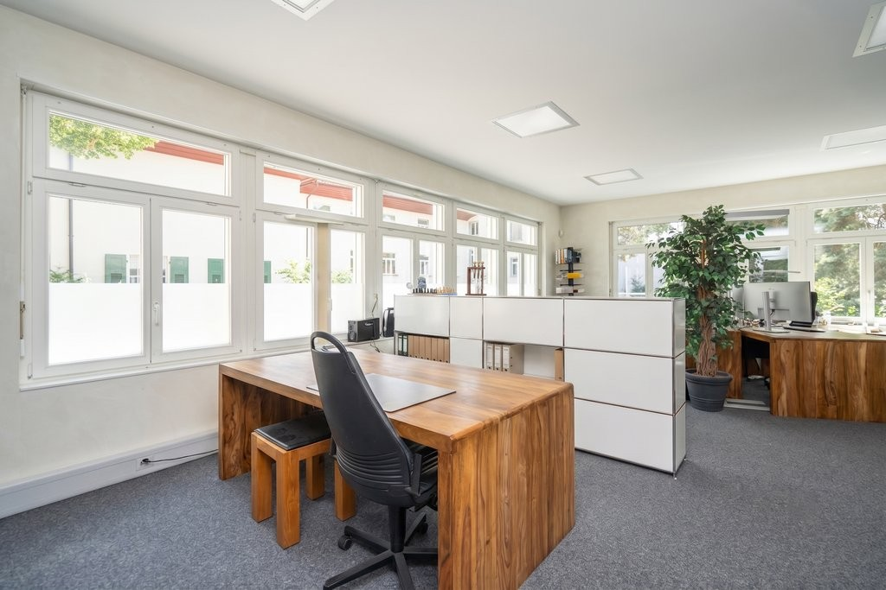
*`03.jpg` — 1024x683 px — 1_2.jpeg*

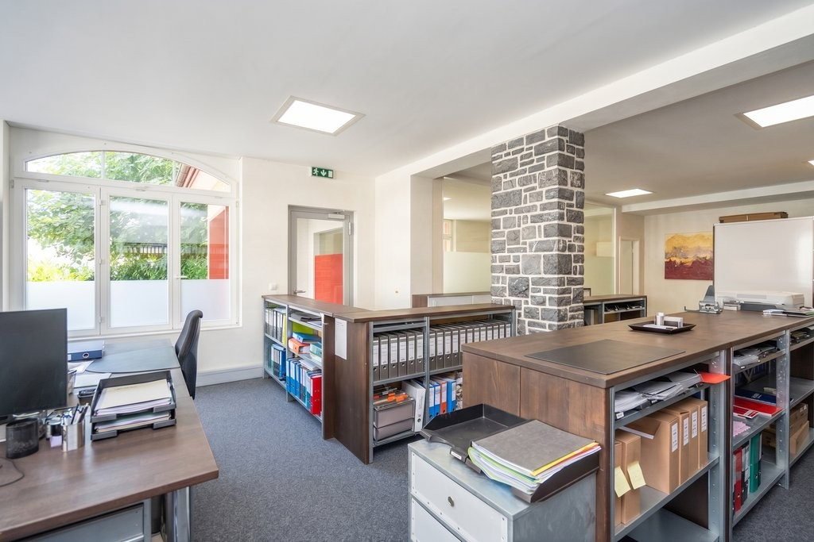
*`04.jpg` — 1024x683 px — 1_8.jpeg*

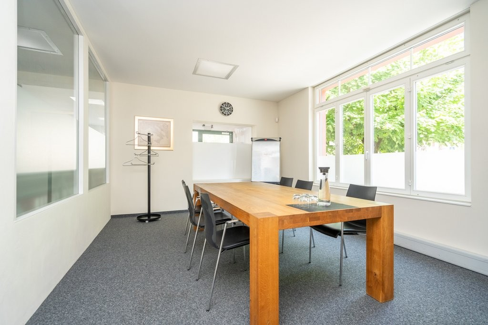
*`05.jpg` — 1024x683 px — _DM36035.jpeg*

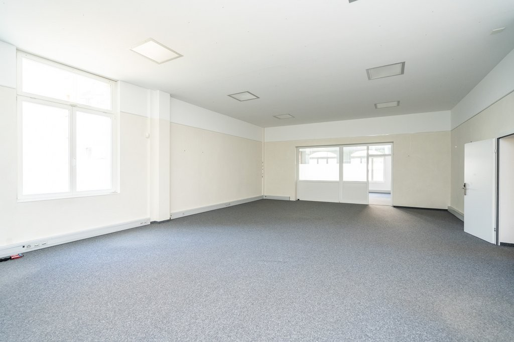
*`06.jpg` — 1024x683 px — _DM36068.jpeg*

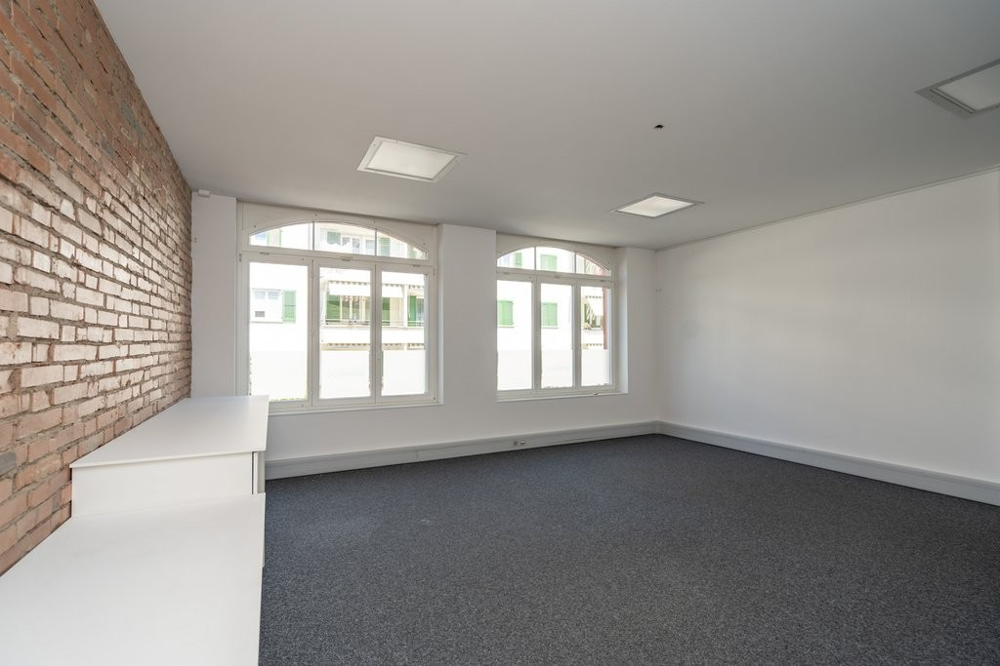
*`07.jpg` — 1024x683 px — _DM36075.jpeg*

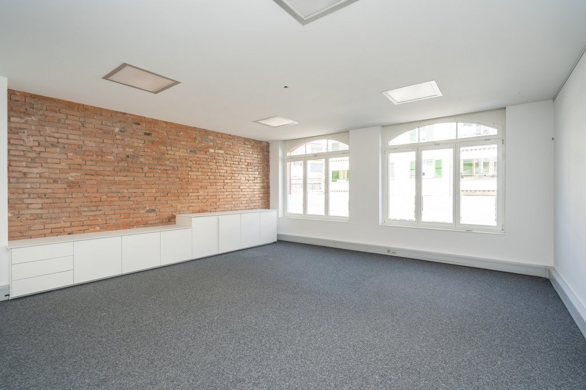
*`08.jpg` — 1024x683 px — _DM36073.jpeg*

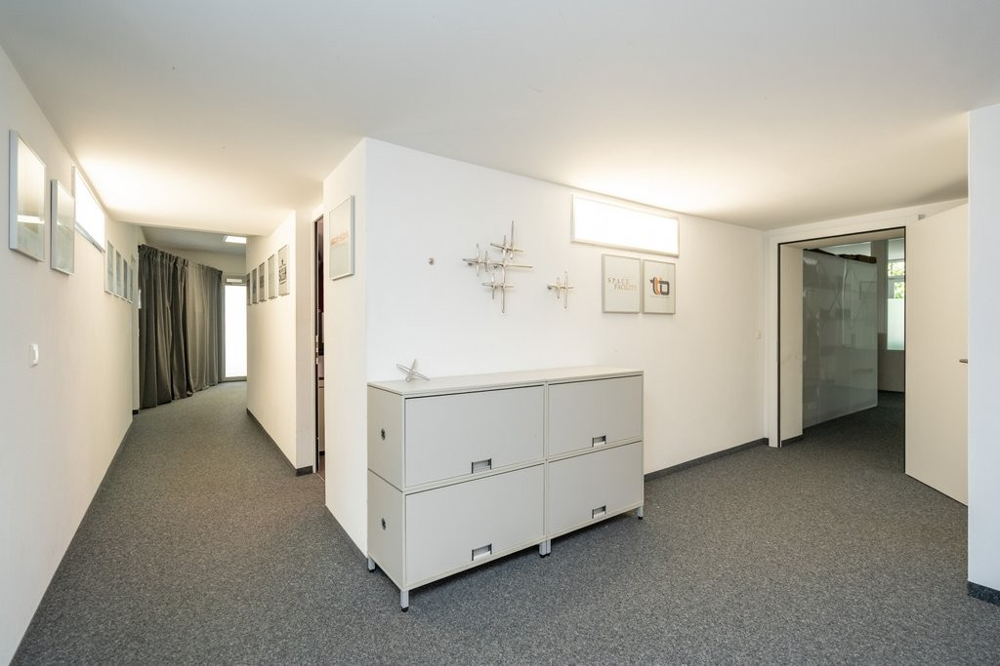
*`09.jpg` — 1024x683 px — _DM36045.jpeg*

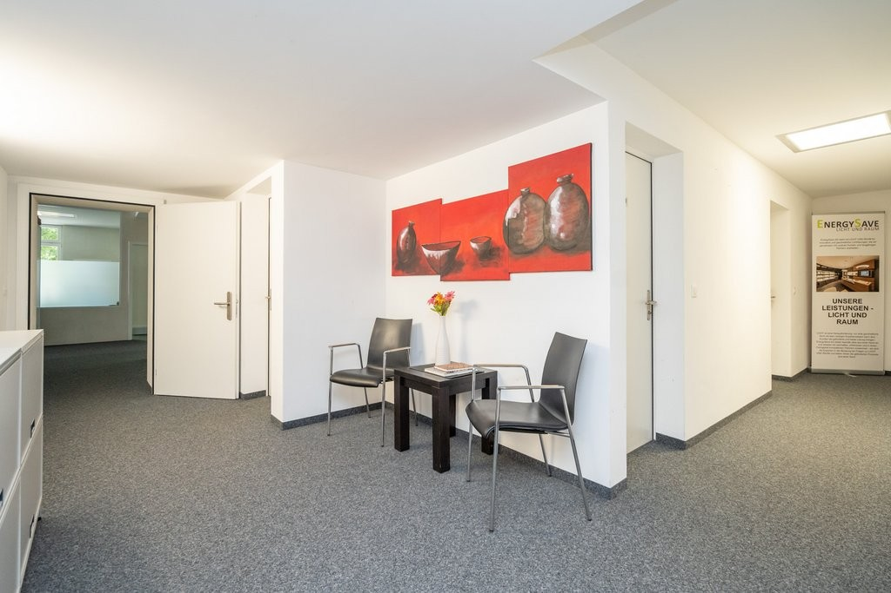
*`10.jpg` — 1024x683 px — _DM36046.jpeg*

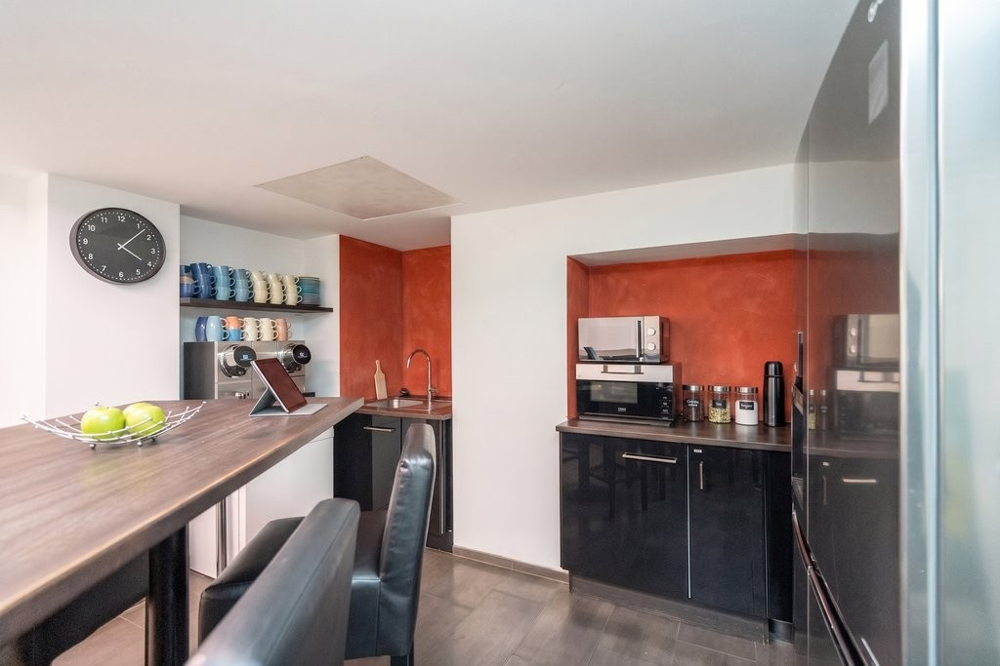
*`11.jpg` — 1024x683 px — 1_4.jpeg*

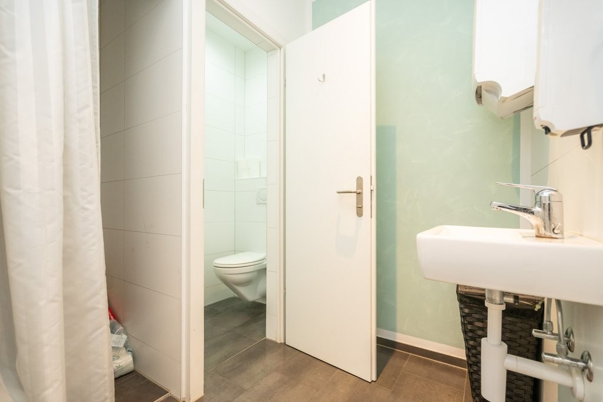
*`12.jpg` — 1024x683 px — _DM36055.jpeg*
