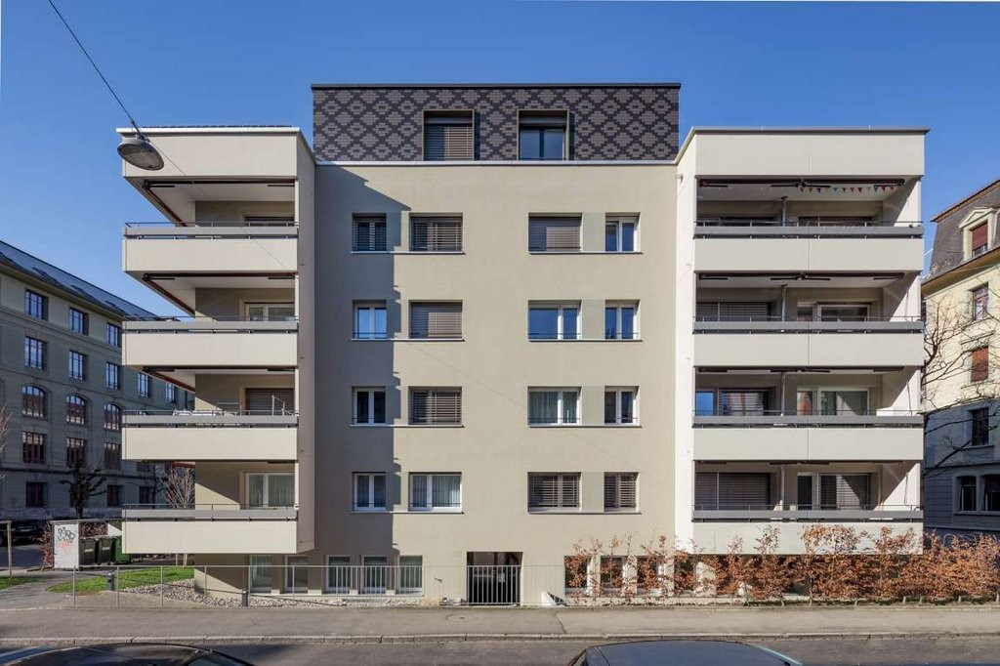
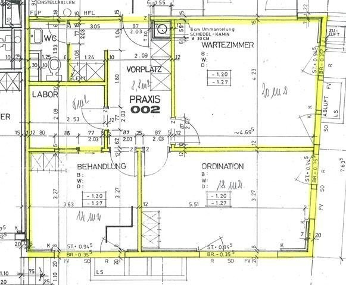

# Brückfeldstr. 19, 3012 Bern - CHF 328 inkl. NK pro m² / Jahr

> **Categorie:** `A_praxis_medical`  
> **Regiune:** Berna (oraș)  
> **Tip ofertă:** RENT / OFFICE  
> **Relevant pentru praxis:** da (praxisräume)  
> **Sursă:** [flatfox.ch](https://flatfox.ch/de/wohnung/bruckfeldstr-19-3012-bern/85928076/)  
> **Descărcat:** 2026-08-17 12:38

## Date obiect

| Câmp | Valoare |
|---|---|
| Adresă | Brückfeldstr. 19, 3012 Bern |
| Categorie obiect | INDUSTRY |
| Tip obiect | OFFICE |
| Chirie netă | CHF 302 |
| Nebenkosten | CHF 26 |
| Chirie brută | CHF 328 |
| Preț afișat | CHF 328 |
| Suprafață utilă | 65 m² |
| Etaj | 0 |
| An construcție | 1976 |
| An renovare | 2005 |
| Disponibil de la | 2026-09-01 |
| Referință | 1080.01.0002 |

## Texte originale (germană)

**Titlu public:** Brückfeldstr. 19, 3012 Bern - CHF 328 inkl. NK pro m² / Jahr

**Titlu scurt:** 65m² Büro

**Pitch:** 65m² Büro in Bern mieten

**Titlu descriere:** Attraktive Praxisräume im Länggass-Quartier

**Titlu chirie:** 65m² Büro in Bern mieten

**Spațiu afișat:** 65

### Descriere completă

Sind Sie auf der Suche nach einem attraktiven Standort für Ihre Praxis oder einem Firmensitz? Wir haben die passenden Räume in einer gepflegten und schönen Liegenschaft (Wohn- und Geschäftshaus) in der Länggasse. Die Liegenschaft ist Rollstuhlgängig.   
  
Die Räumlichkeiten eignen sich als Büro- oder Praxisnutzung und eine allfällige Vermietung erfolgt per 01.09.2026 oder nach Vereinbarung.   
  
Rund um die Liegenschaft sind genügend Parkmöglichkeiten vorhanden (blaue Zone).   
  
Haben wir Ihr Interesse geweckt? Zögern Sie nicht uns zu kontaktieren und sichern Sie sich Ihren Besichtigungstermin.

## Dotări (attributes)

- accessiblewithwheelchair
- petsallowed

## Ofertant

- **Nume:** Apleona Schweiz AG
- **Stradă:** Kirchstrasse 24
- **NPA:** 3097
- **Localitate:** Liebefeld

## Imagini (2)

*`01.jpg` — 1024x682 px — Aussenansicht*

*`02.jpg` — 581x480 px — Grundriss*
