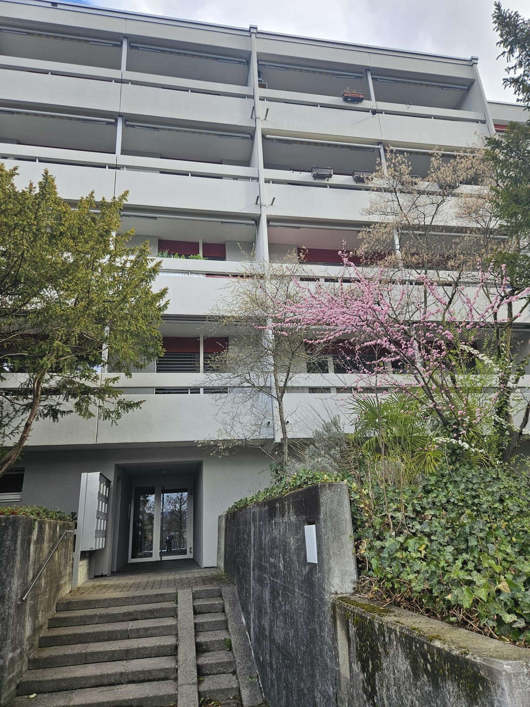
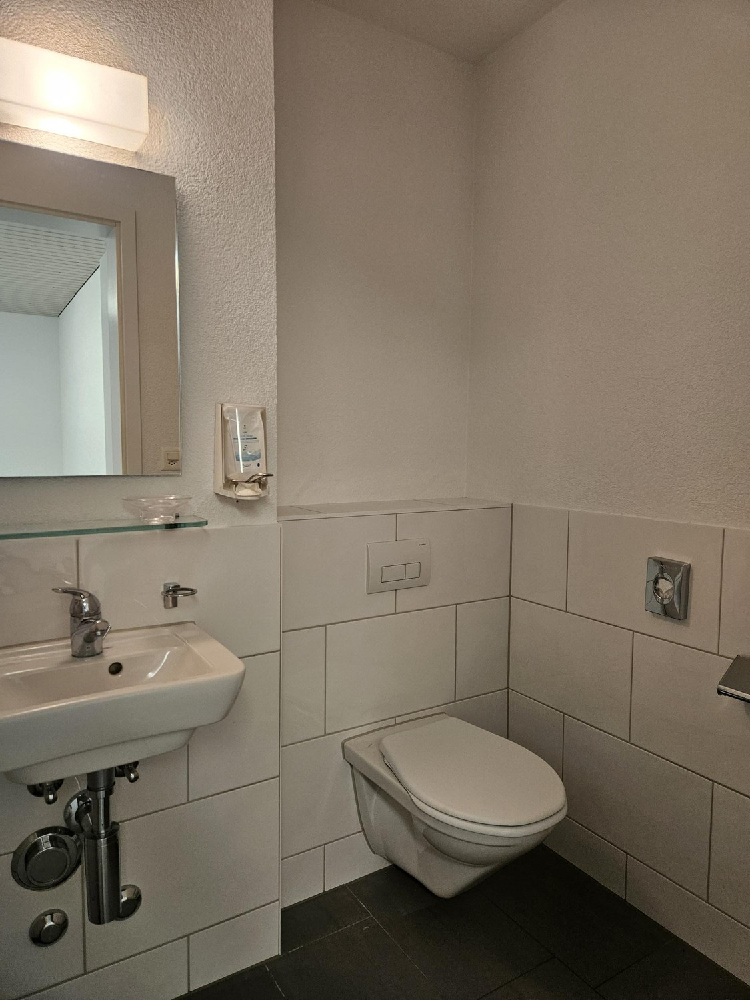
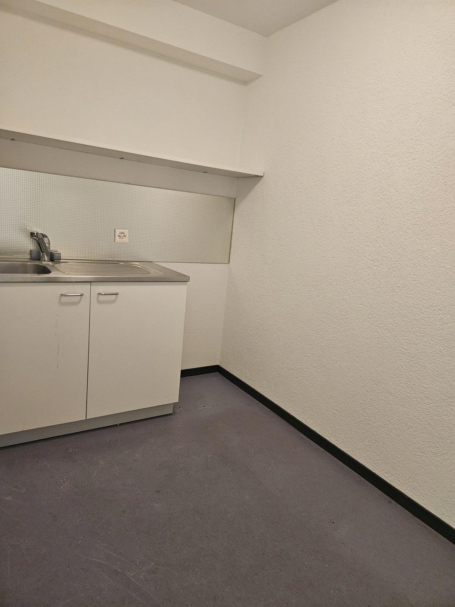
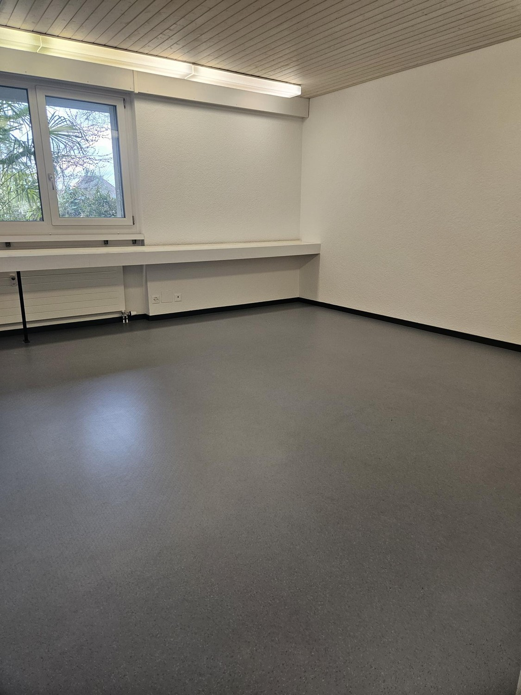
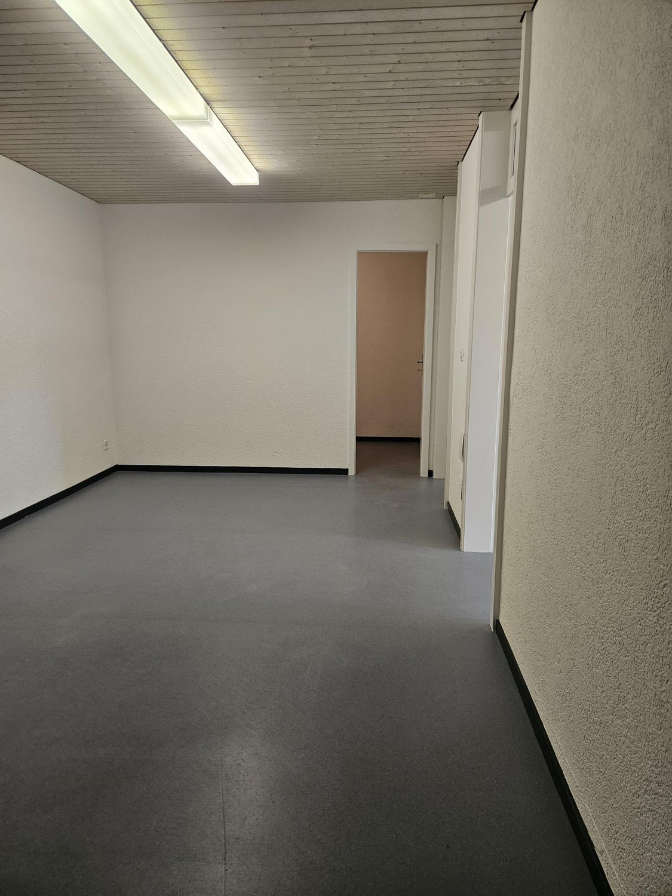

# Niesenweg 4, 3012 Bern - CHF 1’170 inkl. NK pro Monat

> **Categorie:** `A_praxis_medical`  
> **Regiune:** Berna (oraș)  
> **Tip ofertă:** RENT / OFFICE  
> **Relevant pentru praxis:** da (praxisräume, praxisräumlichkeiten)  
> **Sursă:** [flatfox.ch](https://flatfox.ch/de/wohnung/niesenweg-4-3012-bern/85972479/)  
> **Descărcat:** 2026-08-17 12:30

## Date obiect

| Câmp | Valoare |
|---|---|
| Adresă | Niesenweg 4, 3012 Bern |
| Categorie obiect | INDUSTRY |
| Tip obiect | OFFICE |
| Nebenkosten | CHF 180 |
| Chirie brută | CHF 1'170 |
| Preț afișat | CHF 1'170 |
| Suprafață utilă | 65 m² |
| Etaj | 0 |
| An construcție | 1974 |
| An renovare | 2013 |
| Disponibil de la | imm |

## Texte originale (germană)

**Titlu public:** Niesenweg 4, 3012 Bern - CHF 1’170 inkl. NK pro Monat

**Titlu scurt:** 65m² Büro

**Pitch:** 65m² Büro in Bern mieten

**Titlu descriere:** Büro-/Praxisräume Nähe Bahnhof mit flexibler Raumaufteilung

**Titlu chirie:** 65m² Büro in Bern mieten

**Spațiu afișat:** 65

### Descriere completă

er 01.05.2026, oder nach Vereinbarung vermieten wir in einem gepflegten Mehrfamilienhaus am Niesenweg 4, Büro- oder Praxisräumlichkeiten. Das Mehrfamilienhaus befindet sich nächst dem Inselspital, dem Hauptbahnhof Bern sowie der Bushaltestelle Inselplatz.  
  
Die Räumlichkeiten befinden sich im Erdgeschoss und bieten Ihnen auf 65 m2 folgendes:  
  
\- Toilettenanlage  
\- praktische Archivräume mit Wasseranschluss  
\- pflegeleichter PVC-Bodenbelag  
\- Kellerabteil für mehr Stauraum  
  
**Gemäss Aufteilungsplan kann entweder der rot, oder blau eingefärbte Bereich gemietet werden!**  
  
Sie sind interessiert? Wir freuen uns auf Ihre Anfrage!

## Ofertant

- **Nume:** PRIVERA AG
- **Stradă:** Worbstrasse 142
- **NPA:** 3073
- **Localitate:** Gümligen

## Imagini (5)

*`01.jpg` — 1125x1500 px*

*`02.jpg` — 1125x1500 px*

*`03.jpg` — 1125x1500 px*

*`04.jpg` — 1125x1500 px*

*`05.jpg` — 1125x1500 px*
