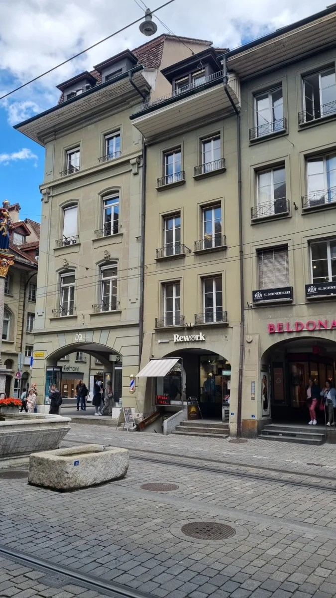
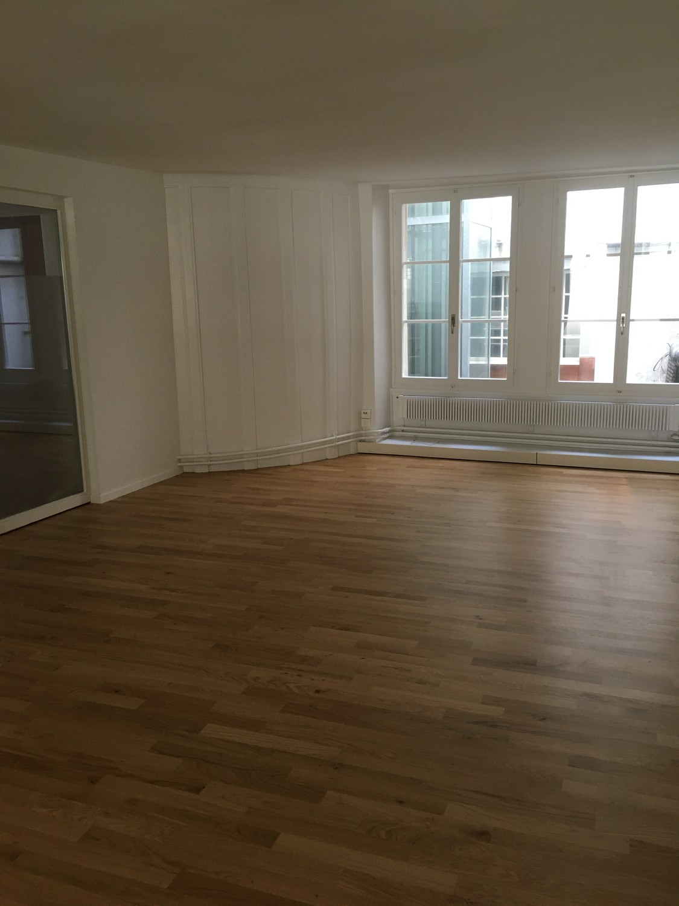
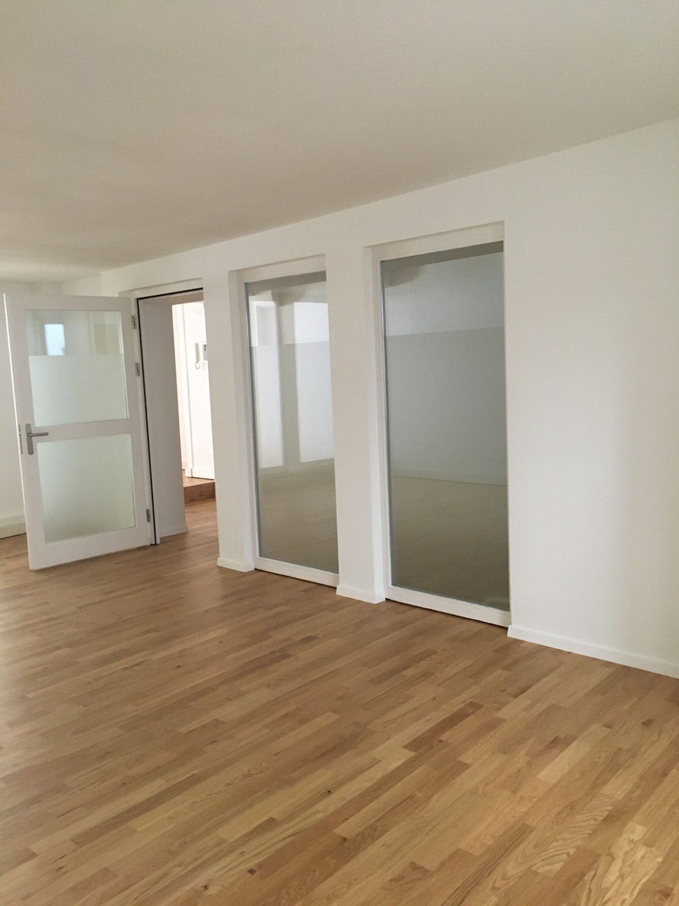
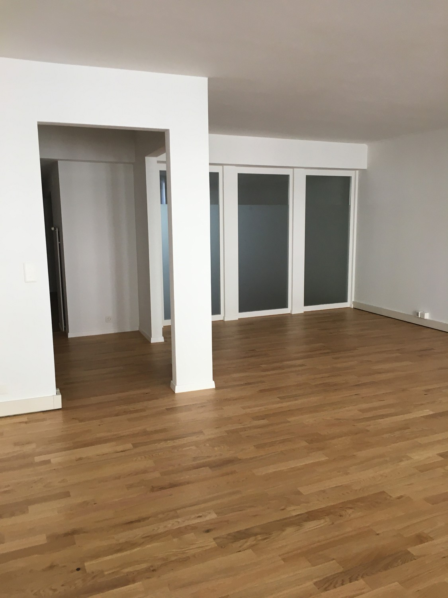
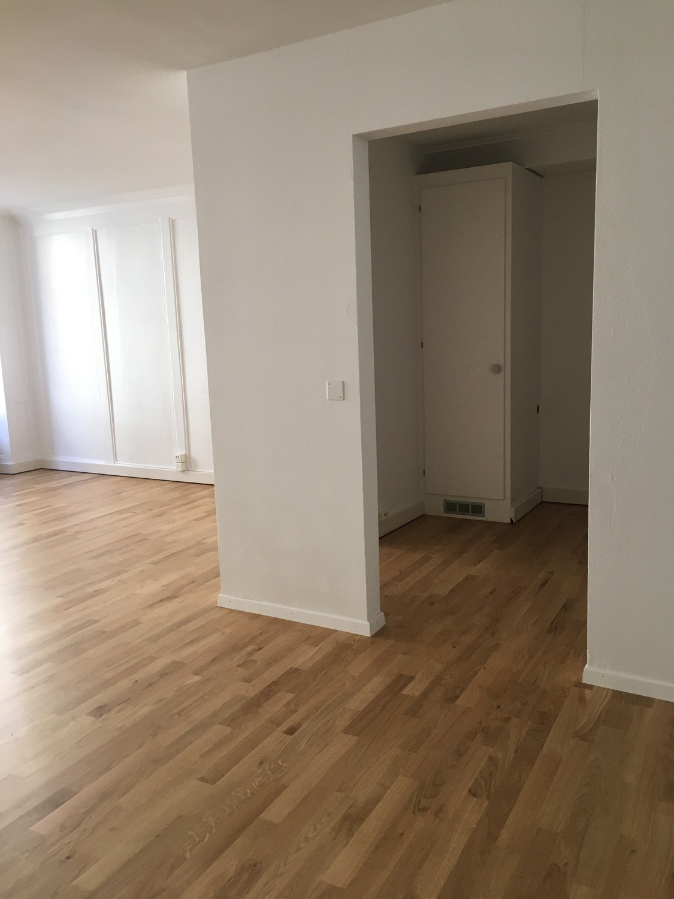
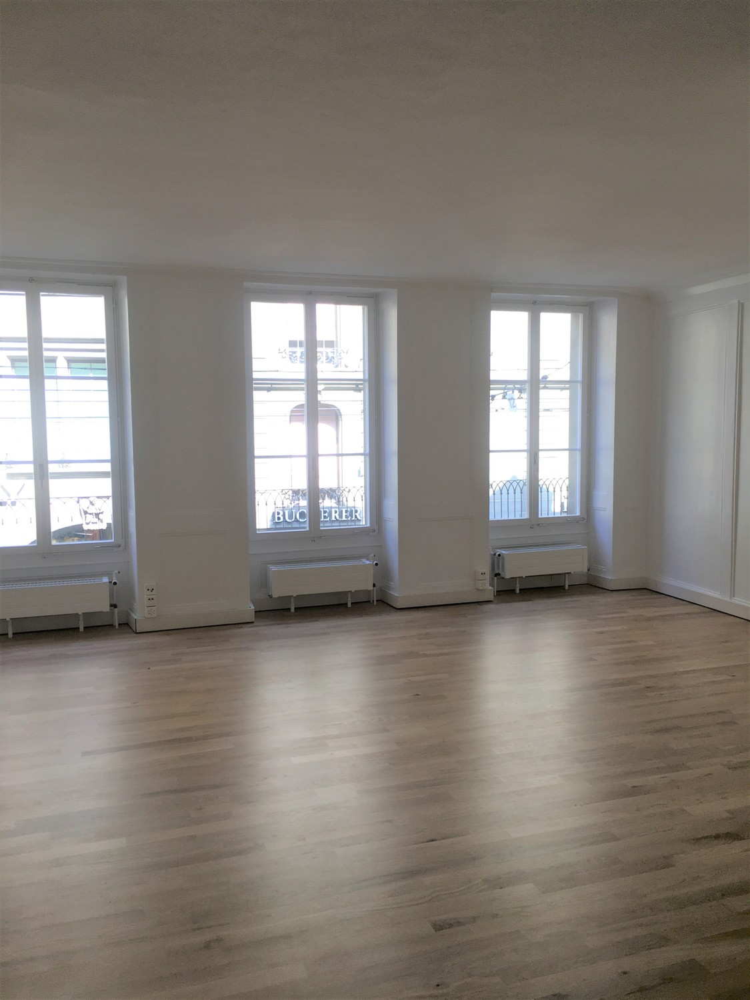
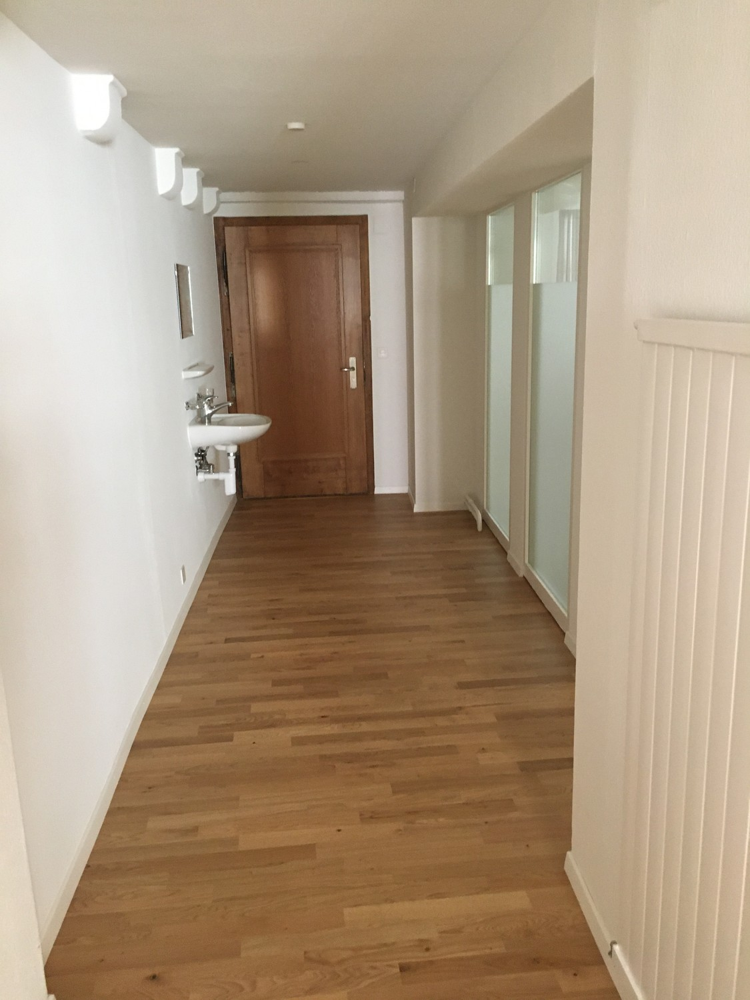
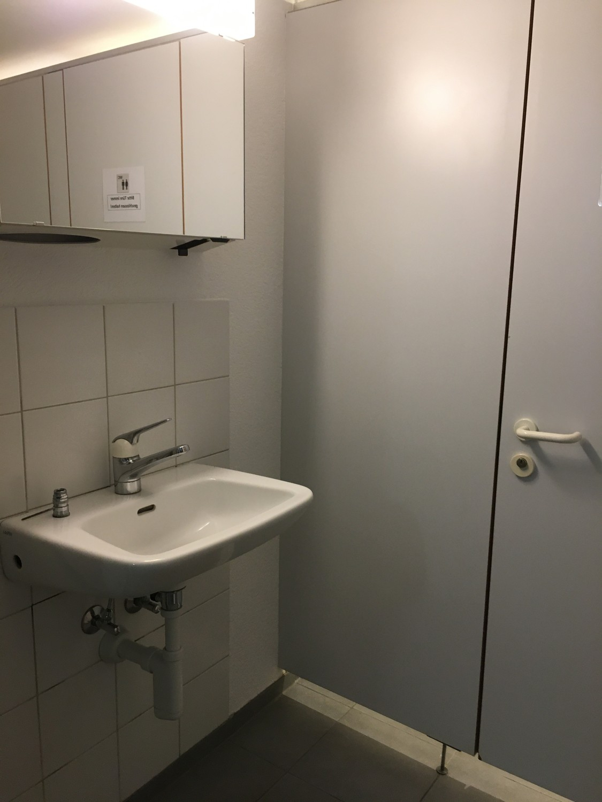
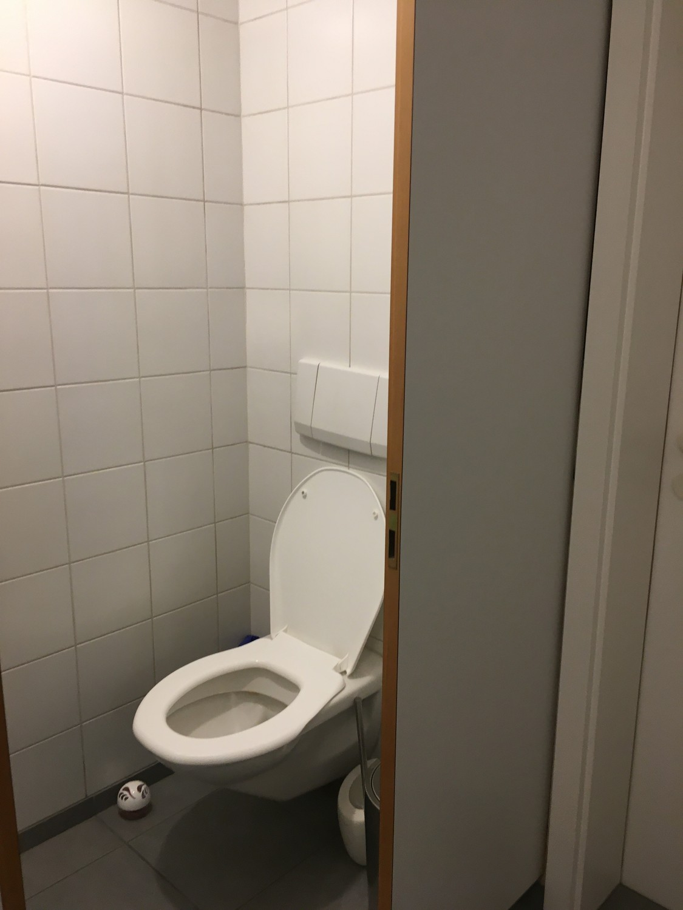
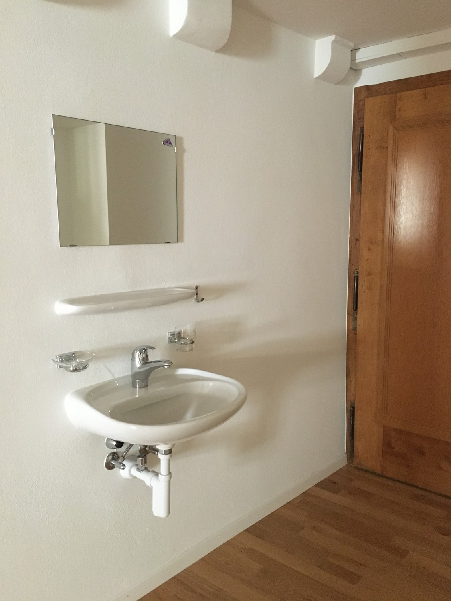

# Marktgasse 3, 3011 Bern - CHF 2’050 inkl. NK pro Monat

> **Categorie:** `A_praxis_medical`  
> **Regiune:** Berna (oraș)  
> **Tip ofertă:** RENT / LIVING_COMMERCIAL_BUILDING  
> **Relevant pentru praxis:** da (praxisräume)  
> **Sursă:** [flatfox.ch](https://flatfox.ch/de/wohnung/marktgasse-3-3011-bern/86196939/)  
> **Descărcat:** 2026-08-17 12:30

## Date obiect

| Câmp | Valoare |
|---|---|
| Adresă | Marktgasse 3, 3011 Bern |
| Categorie obiect | INDUSTRY |
| Tip obiect | LIVING_COMMERCIAL_BUILDING |
| Chirie netă | CHF 1'800 |
| Nebenkosten | CHF 250 |
| Preț afișat | CHF 2'050 |
| Suprafață utilă | 80 m² |
| Etaj | 1 |
| Disponibil de la | agr |
| Referință | 12603..1011 |

## Texte originale (germană)

**Titlu public:** Marktgasse 3, 3011 Bern - CHF 2’050 inkl. NK pro Monat

**Titlu scurt:** 80m² Wohn- / Geschäftshaus

**Pitch:** 80m² Wohn- / Geschäftshaus in Bern mieten

**Titlu descriere:** Büro oder Praxisräume im Zentrum von Bern

**Titlu chirie:** 80m² Wohn- / Geschäftshaus in Bern mieten

**Spațiu afișat:** 80

### Descriere completă

An erstklassiger Lage vermieten wir eine attraktive Gewerbefläche im 1. OG eines charmanten Altbaus an der berühmten Marktgasse in Bern.  
  
Die Räumlichkeiten befinden sich direkt neben der Zytglogge und sind sowohl mit den öffentlichen Verkehrsmitteln als auch zu Fuss hervorragend erreichbar.  
  

*   80m²
*   2 grosszügige Räume
*   separates WC
*   Ideal als Büro-, Praxis- oder Schulungsräume

Haben wir Ihr Interesse geweckt? Gerne stehen wir für weitere Auskünfte oder einen Besichtigungstermin zur Verfügung.

## Dotări (attributes)

- lift

## Ofertant

- **Nume:** Brunner Verwaltungen AG
- **Stradă:** Schauplatzgasse 23
- **NPA:** 3001
- **Localitate:** Bern

## Imagini (10)

*`01.jpg` — 675x1200 px*

*`02.jpg` — 1125x1500 px*

*`03.jpg` — 1125x1500 px*

*`04.jpg` — 1125x1500 px*

*`05.jpg` — 1125x1500 px*

*`06.jpg` — 1125x1500 px*

*`07.jpg` — 1125x1500 px*

*`08.jpg` — 1125x1500 px*

*`09.jpg` — 1125x1500 px*

*`10.jpg` — 1125x1500 px*
