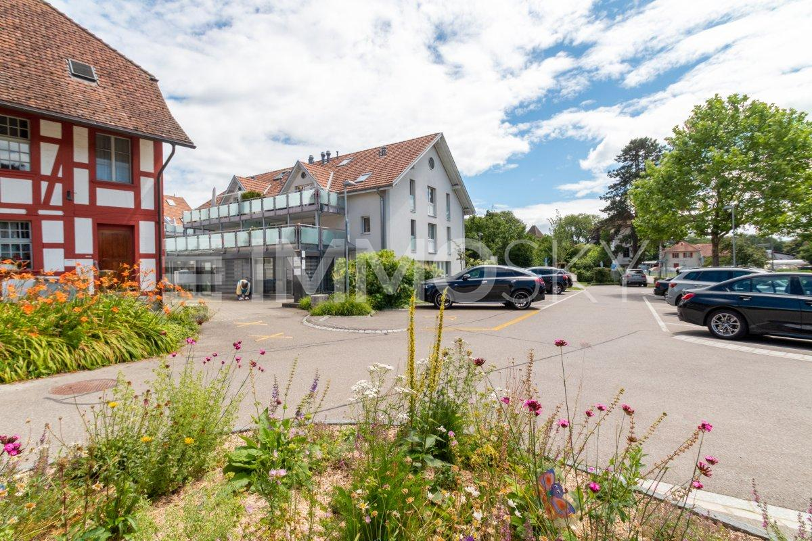
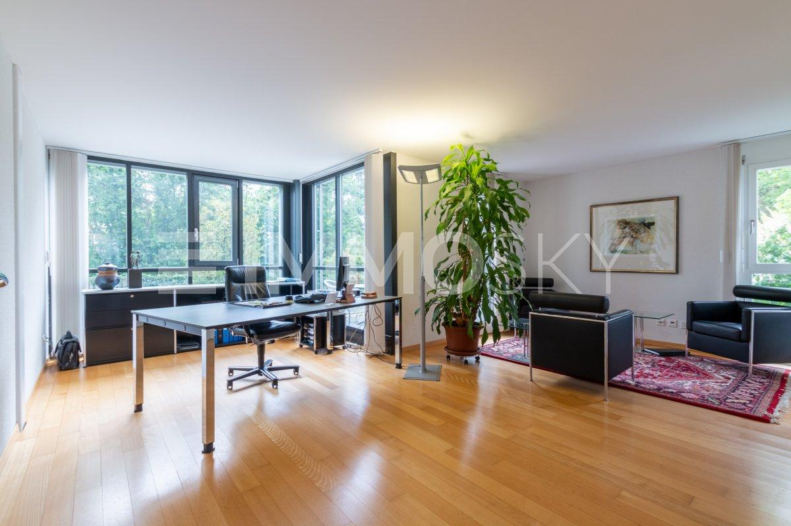
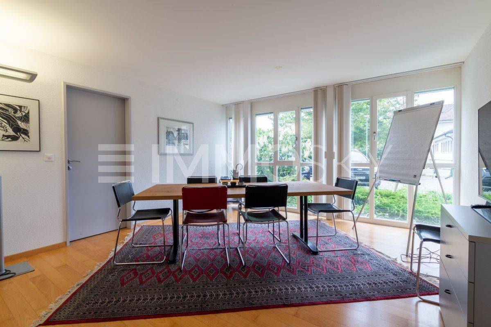
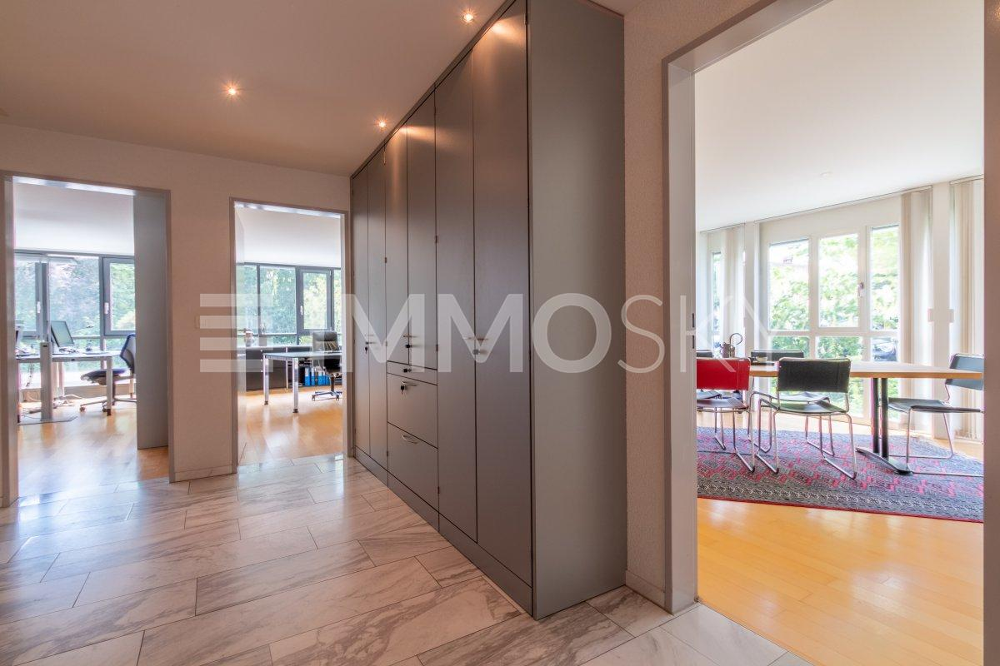
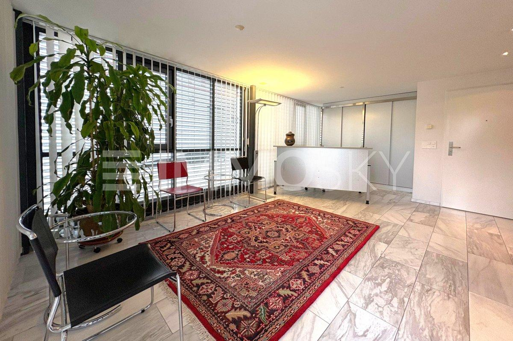
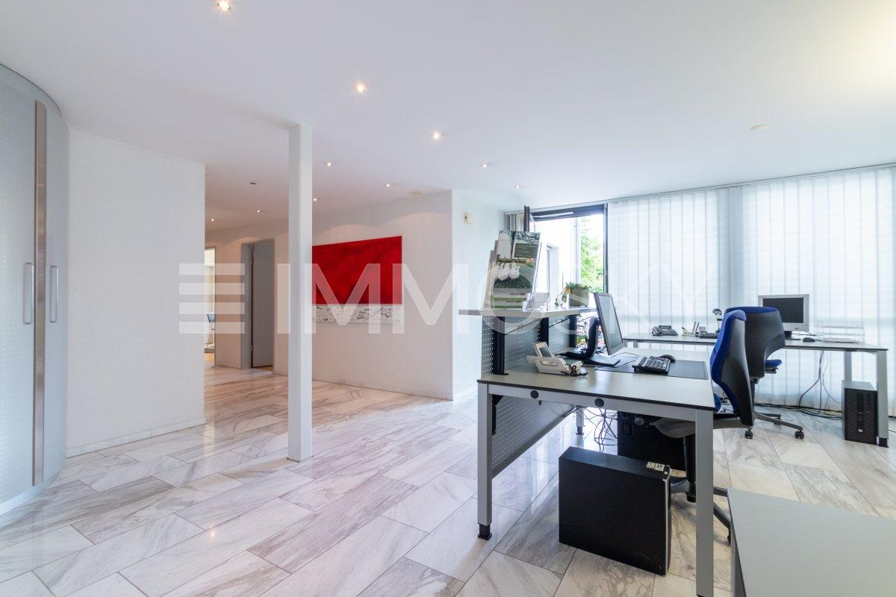

# Löwenplatz 3, 3303 Jegenstorf - CHF 1’150

> **Categorie:** `A_praxis_medical`  
> **Regiune:** Cantonul Berna  
> **Tip ofertă:** RENT / OFFICE  
> **Relevant pentru praxis:** da (praxis)  
> **Sursă:** [flatfox.ch](https://flatfox.ch/de/wohnung/lowenplatz-3-3303-jegenstorf/86225357/)  
> **Descărcat:** 2026-08-17 12:36

## Date obiect

| Câmp | Valoare |
|---|---|
| Adresă | Löwenplatz 3, 3303 Jegenstorf |
| Categorie obiect | INDUSTRY |
| Tip obiect | OFFICE |
| Chirie netă | CHF 1'050 |
| Nebenkosten | CHF 100 |
| Chirie brută | CHF 1'150 |
| Preț afișat | CHF 1'150 |
| Suprafață utilă | 18 m² |
| Etaj | 0 |
| An construcție | 2000 |
| Disponibil de la | 2026-10-01 |
| Referință | 6758153.6758153. |

## Texte originale (germană)

**Titlu public:** Löwenplatz 3, 3303 Jegenstorf - CHF 1’150

**Titlu scurt:** 18m² Büro

**Pitch:** 18m² Büro in Jegenstorf mieten

**Titlu descriere:** Vielseitig nutzbar  Büro oder Praxis an zentraler Lage

**Titlu chirie:** 18m² Büro in Jegenstorf mieten

**Spațiu afișat:** 18

### Descriere completă

Helles Einzelbüro im Zentrum von Jegenstorf   
  
Diese gepflegten, lichtdurchfluteten Einzelbüros bieten ideale Voraussetzungen für Einzelunternehmer, Freiberufler oder Dienstleistende, die eine zentrale Lage, helle Räume und ein professionelles Arbeitsumfeld schätzen. Die Büros können einzeln gemietet werden und eignen sich hervorragend für konzentriertes Arbeiten sowie den Empfang von Kundschaft.   
Grosse Fensterflächen sorgen für viel Tageslicht und verleihen den Räumen eine freundliche und hochwertige Ausstrahlung. Bereits der einladende Eingangsbereich vermittelt einen seriösen und professionellen Eindruck. Auf Wunsch kann vorhandenes Mobiliar übernommen werden, was einen unkomplizierten und schnellen Einzug ermöglicht.   
  
In Kombination mit weiteren Mietparteien entsteht ein vielseitig nutzbares Zentrum für Dienstleistungen, Beratung oder Gesundheitsangebote. So verbinden sich Eigenständigkeit, Austausch und Synergien zu einem attraktiven und inspirierenden Arbeitsumfeld.   
  
Dieses ImmoSky-Angebot bietet folgende *Mehr Leistung*:   
\+ Helle, repräsentative Räume mit grossen Fensterflächen   
\+ Optional Übernahme des vorhandenen Mobiliars   
\+ Hochwertiger Marmorboden   
\+ Voll ausgestattete Küche sowie Nasszelle mit Dusche   
\+ Zwei Terrassen zur Mitbenutzung   
\+ Grosszügiges Kellerabteil   
\+ Zahlreiche öffentliche Parkplätze direkt vor dem Gebäude   
\+ Hervorragende Erreichbarkeit per ÖV und Auto (Autobahnanschluss in unmittelbarer Nähe)   
  
Diese Räumlichkeiten bieten eine hervorragende Basis für individuelle Geschäftsideen in einem professionellen Rahmen. Ob Büro, Praxis, Studio oder Beratungsraum hier finden Sie den passenden Ort für Ihre Tätigkeit.   
Kontaktieren Sie uns für weitere Informationen oder zur Vereinbarung eines Besichtigungstermins.   
  
(Das Verkaufsdossier wird in der Regel innert maximal 24 Stunden an Sie versendet, bitte prüfen Sie auch Ihren SPAM Ordner.)

## Dotări (attributes)

- garage
- petsallowed
- accessiblewithwheelchair

## Ofertant

- **Nume:** ImmoSky AG - Dübendorf
- **Stradă:** Hochbordstrasse 1
- **NPA:** 3018
- **Localitate:** Bern

## Imagini (7)

*`01.jpg` — 1200x800 px — Viele Parkplätze vor der Liegenschaft*

*`02.jpg` — 1200x800 px — Helles Büro mit Terrasse*

*`03.jpg` — 1200x800 px — Sitzungszimmer*

*`04.jpg` — 1200x800 px — Kluge Aufteilung*

*`05.jpg` — 1200x800 px — Grosszügiger Empfangsbereich*

*`06.jpg` — 1200x800 px — Grosses Entrée mit Empfangsstelle*

*`07.jpg` — 1200x675 px — Kennen Sie den Wert Ihrer Immobilie?*

## Media suplimentară

- **website_url:** https://www.immosky.ch
