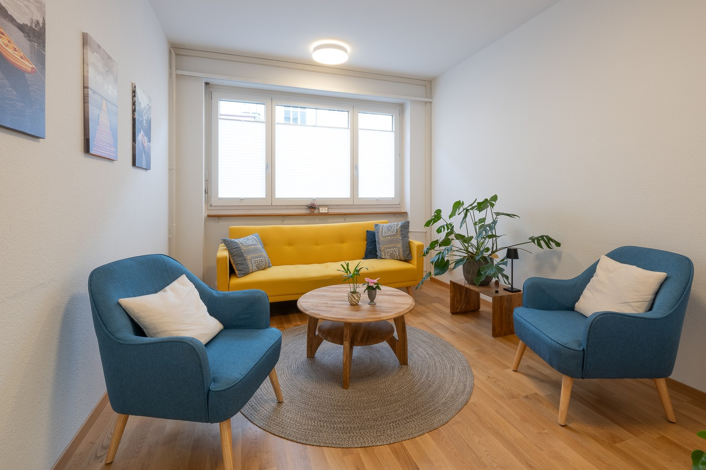
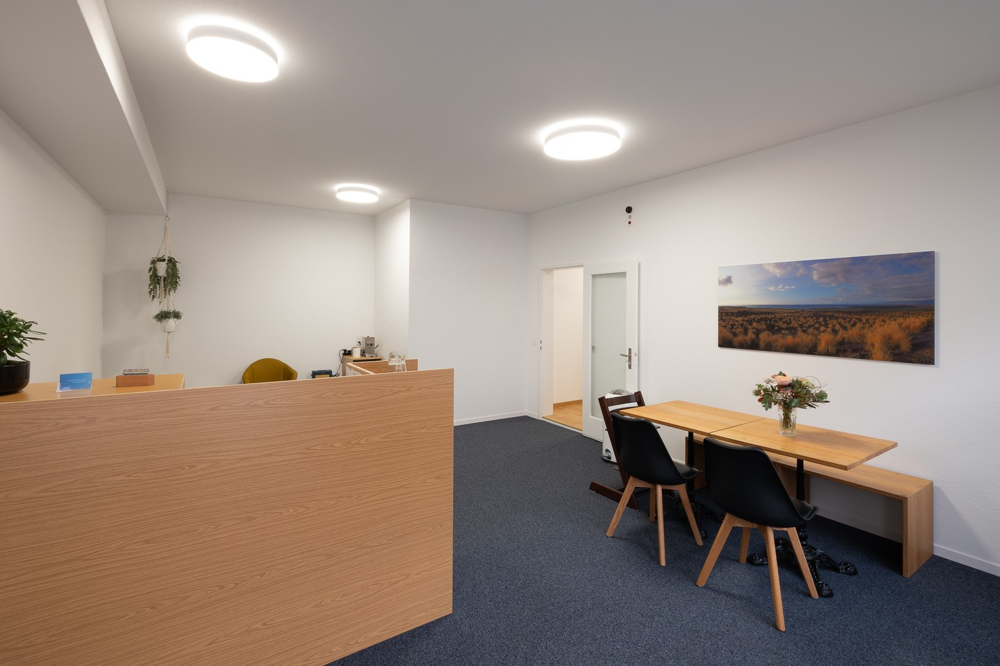
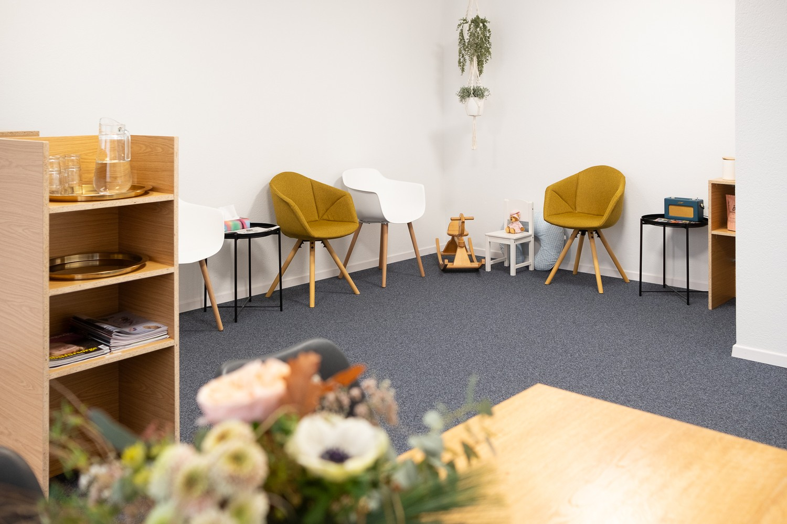
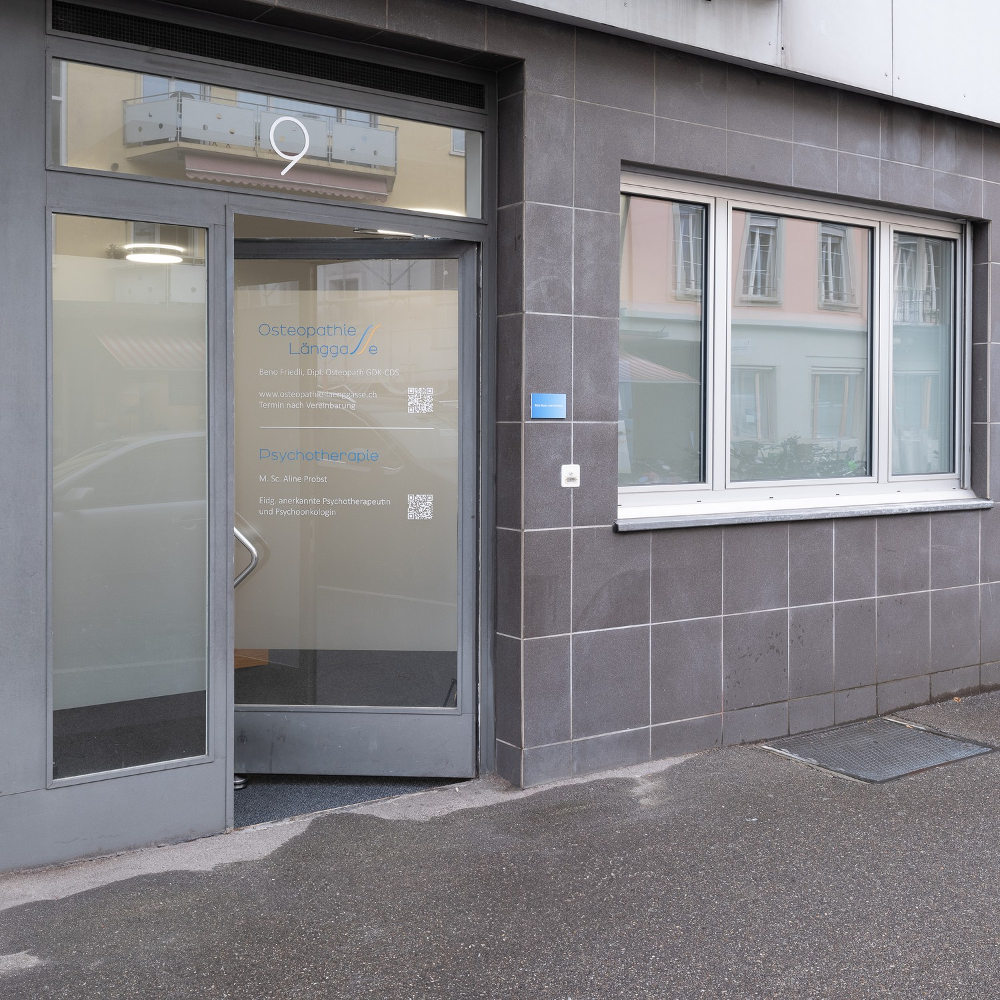

# Mittelstrasse 9, 3012 Bern - CHF 1’000 inkl. NK pro Monat

> **Categorie:** `A_praxis_medical`  
> **Regiune:** Berna (oraș)  
> **Tip ofertă:** RENT / OFFICE  
> **Relevant pentru praxis:** da (osteopathie, praxis, psychotherapie, therapeut)  
> **Sursă:** [flatfox.ch](https://flatfox.ch/de/wohnung/mittelstrasse-9-3012-bern/86250767/)  
> **Descărcat:** 2026-08-17 12:38

## Date obiect

| Câmp | Valoare |
|---|---|
| Adresă | Mittelstrasse 9, 3012 Bern |
| Categorie obiect | INDUSTRY |
| Tip obiect | OFFICE |
| Chirie brută | CHF 1'000 |
| Preț afișat | CHF 1'000 |
| Suprafață utilă | 12 m² |
| Etaj | 0 |
| Disponibil de la | 2026-11-01 |

## Texte originale (germană)

**Titlu public:** Mittelstrasse 9, 3012 Bern - CHF 1’000 inkl. NK pro Monat

**Titlu scurt:** 12m² Büro

**Pitch:** 12m² Büro in Bern mieten

**Titlu descriere:** Praxis- / Büroraum (ca. 12,3m2) an zentraler Lage im Berner Länggassquartier zu vermieten

**Titlu chirie:** 12m² Büro in Bern mieten

**Spațiu afișat:** 12

### Descriere completă

An zentraler Lage an der Mittelstrasse 9 im Berner Länggassquartier ist in einer bestehenden Osteopathiepraxis ein heller Praxis- oder Büroraum (ca. 12,3 m²) zur Untermiete verfügbar.  
  
Der Raum eignet sich ideal für Psychotherapie, Beratungsgespräche, weitere therapeutische Tätigkeiten und/oder als Büroraum.  
  
**Verfügbarkeit**  
ab 1. November 2026 oder nach Vereinbarung  
  
**Raum**  

*   ca. 12,3 m²
*   heller Raum mit Westausrichtung
*   inklusive Deckenlampen und Plissees
*   Vermietung ohne weiteres Inventar

**Zur Mitbenutzung**  

*   grosszügiger Eingangs- und Wartebereich
*   zwei WCs und Dusche
*   kleiner Raum für Rückzug oder administrative Arbeiten

**Optionale Mitnutzung (Kostenbeteiligung nach Nutzung und Bedarf)**  

*   Internet/WLAN
*   Drucker
*   Kühlschrank, Mikrowelle und Kaffeemaschine
*   Zeitungsabonnement “Der Bund” (inkl. digitalem Zugang)
*   Waschmaschine
*   Reinigung des Raums sowie der Gemeinschaftsbereiche

**Mietzins**  
ca. CHF 1’000.- pro Monat inkl. Nebenkosten (abhängig von Nutzung und gewünschten Zusatzleistungen)

## Imagini (4)

*`01.jpg` — 1500x1000 px*

*`02.jpg` — 1500x1000 px*

*`03.jpg` — 1500x1000 px*

*`04.jpg` — 1500x1500 px*
