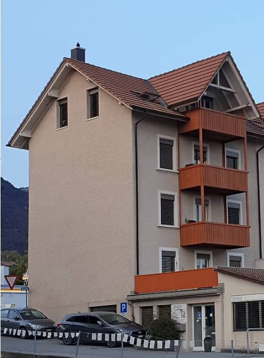
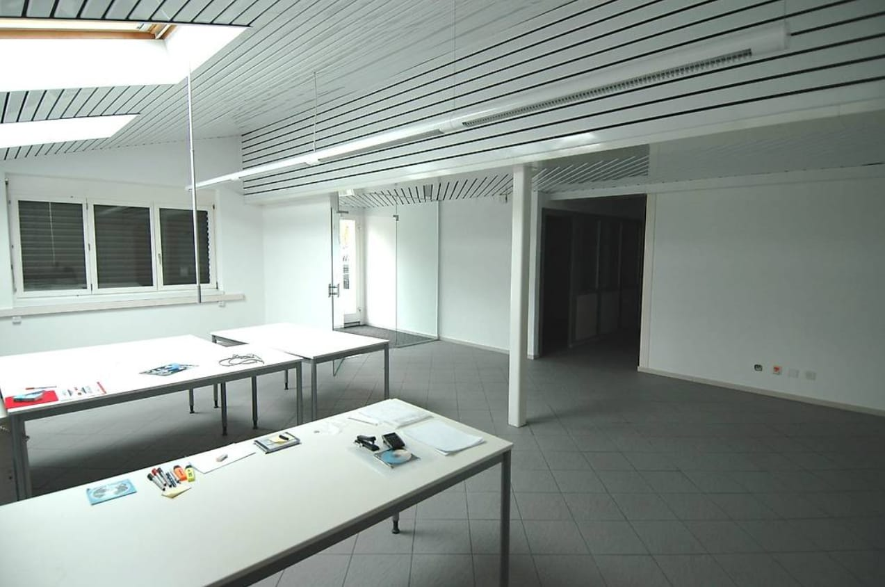
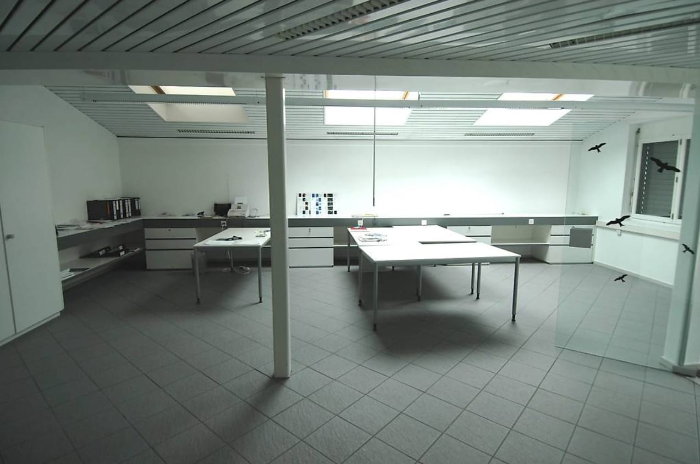
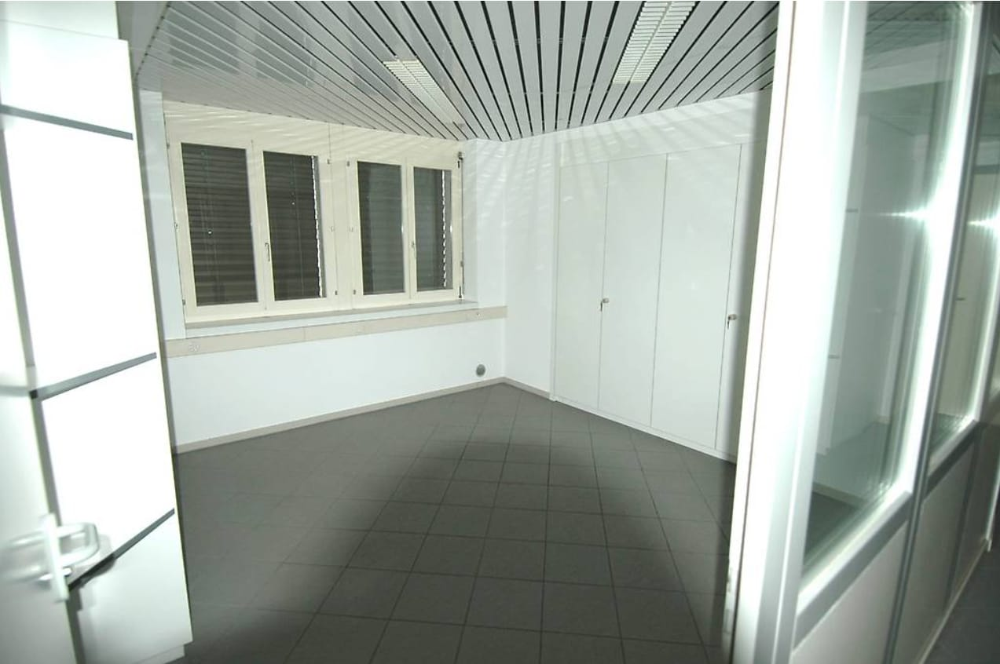
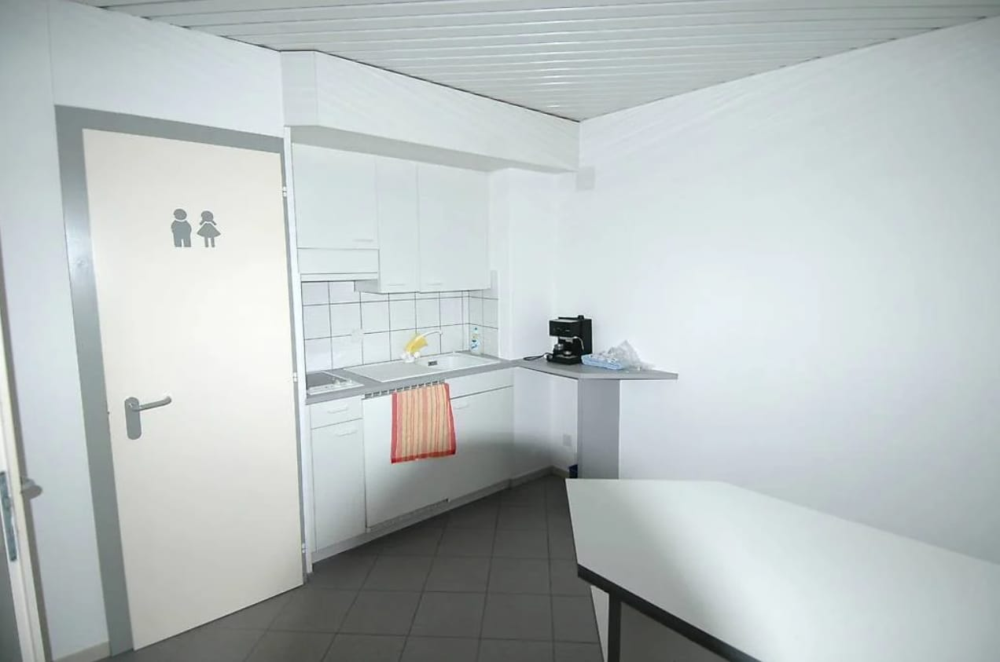

# Solothurnstrasse 96, 2540 Grenchen - CHF 1’800

> **Categorie:** `A_praxis_medical`  
> **Regiune:** Cantonul Berna  
> **Tip ofertă:** RENT / OFFICE  
> **Relevant pentru praxis:** da (physiotherapie, praxisfläche)  
> **Sursă:** [flatfox.ch](https://flatfox.ch/de/wohnung/solothurnstrasse-96-2540-grenchen/86265079/)  
> **Descărcat:** 2026-08-17 12:37

## Date obiect

| Câmp | Valoare |
|---|---|
| Adresă | Solothurnstrasse 96, 2540 Grenchen |
| Categorie obiect | INDUSTRY |
| Tip obiect | OFFICE |
| Chirie netă | CHF 1'500 |
| Nebenkosten | CHF 300 |
| Chirie brută | CHF 1'800 |
| Preț afișat | CHF 1'800 |
| Suprafață utilă | 194 m² |
| Disponibil de la | 2026-10-01 |
| Referință | .52540SO901.6a15526ce7a3ea8dcf967135 |

## Texte originale (germană)

**Titlu public:** Solothurnstrasse 96, 2540 Grenchen - CHF 1’800

**Titlu scurt:** 194m² Büro

**Pitch:** 194m² Büro in Grenchen mieten

**Titlu descriere:** Flexible Büro-/Praxisfläche mit Parkplatz in Grenchen, 194 m²

**Titlu chirie:** 194m² Büro in Grenchen mieten

**Spațiu afișat:** 194

### Descriere completă

An repräsentativer Lage an der Solothurnstrasse 96 in Grenchen erwartet Sie eine helle, ebenerdige Büro-/Praxisfläche mit klarer, funktionaler Architektur. Der Mix aus grosszügigem Open Space und separaten Zimmern erlaubt eine vielseitige Nutzung - ideal für Agentur, Kanzlei, Praxis, Showroom oder Beratung. Ein privater Aussenparkplatz ist inklusive.   
  
**Highlights**

  * Erdgeschoss mit verglastem Eingang und direktem Zugang von aussen 
  * Ca. 194 m² flexibel nutzbare Fläche: Open Space plus abtrennbare Räume 
  * Abgehängte Decke mit Langfeldleuchten, pflegeleichter Plattenboden 
  * Glas-Trennwände, Fenster mit Lamellenstoren; zahlreiche Steckdosen/IT-Anschlüsse 
  * Einbauschränke und lange Arbeits-/Ablageflächen 
  * Separates WC 
  * Heizung: Gas 
  * Privater Aussenparkplatz (1) im Mietpreis inbegriffen 

**Lage**

  * Solothurnstrasse 96, 2540 Grenchen (SO) 
  * Repräsentative Strassenlage im Wohn-/Geschäftshaus 
  * Zwei Bahnhöfe (Grenchen Süd/Nord) im Halbstundentakt; Biel/Solothurn ca. 10-12 Min. 
  * A1 (Solothurn-Ost) ca. 15 Min., A5 (Biel) ca. 20 Min. 

**Miete & Verfügbarkeit **

  * Nettomiete: CHF 1'500/Monat 
  * Nebenkosten: CHF 300/Monat 
  * Bruttomiete: CHF 1'800/Monat 
  * Verfügbar ab: 01.10.2026 

**Geeignet für**

  * Agentur, Kanzlei, Backoffice 
  * Praxis (Physiotherapie, Massage, Coaching) 
  * Showroom und Beratungsfläche

## Dotări (attributes)

- parkingspace

## Ofertant

- **Nume:** Easyhomes Immobilien AG
- **Stradă:** Neueneggstrasse 4
- **NPA:** 3175
- **Localitate:** Flamatt

## Imagini (7)

*`01.jpg` — 515x697 px*

*`02.jpg` — 1273x844 px*

*`03.jpg` — 1273x845 px*

*`04.jpg` — 1273x846 px*

*`05.jpg` — 1536x1024 px*

*`06.jpg` — 1272x843 px*

*`07.jpg` — 1536x1024 px*

## Media suplimentară

- **website_url:** https://easyhomes.avendo.ch/immo/52540SO901?utm_source=smg&utm_medium=referral&utm_campaign=platform_listings
