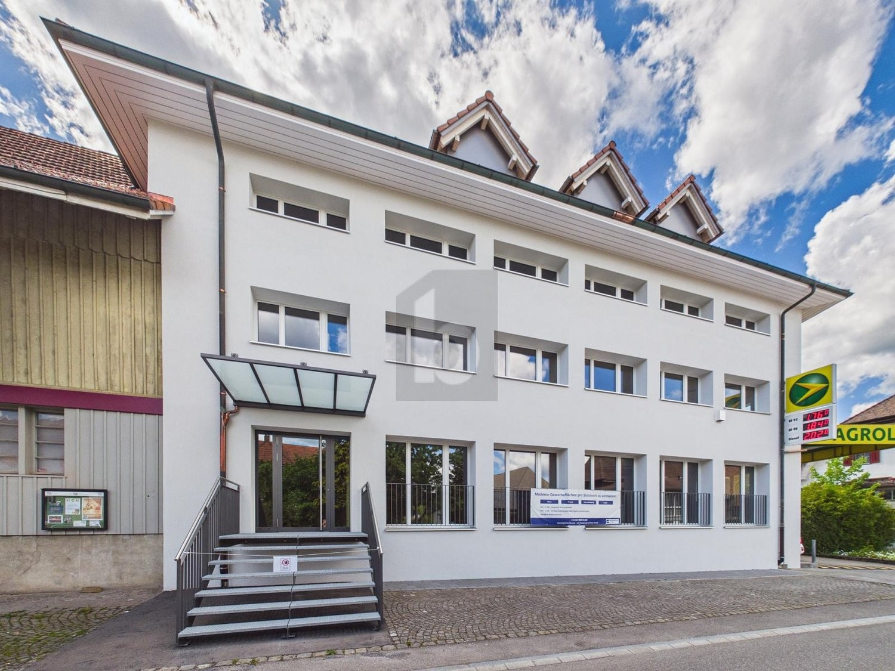
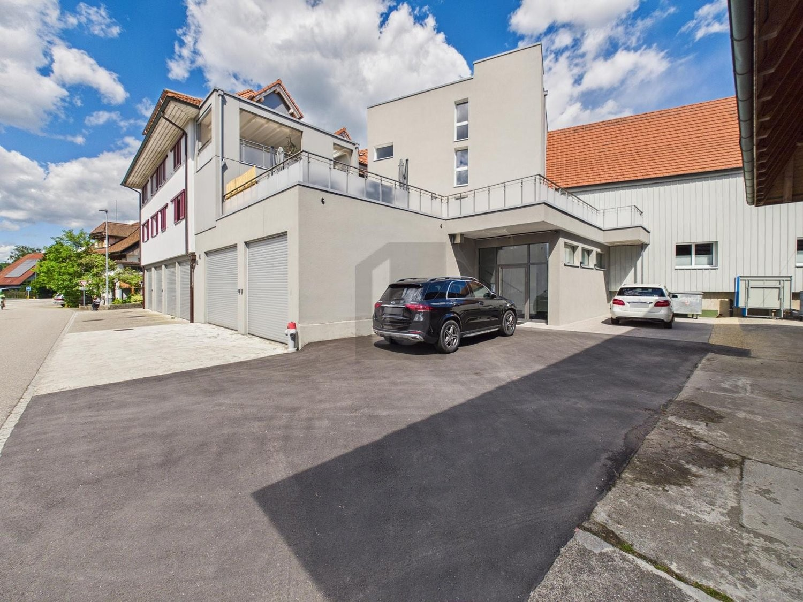
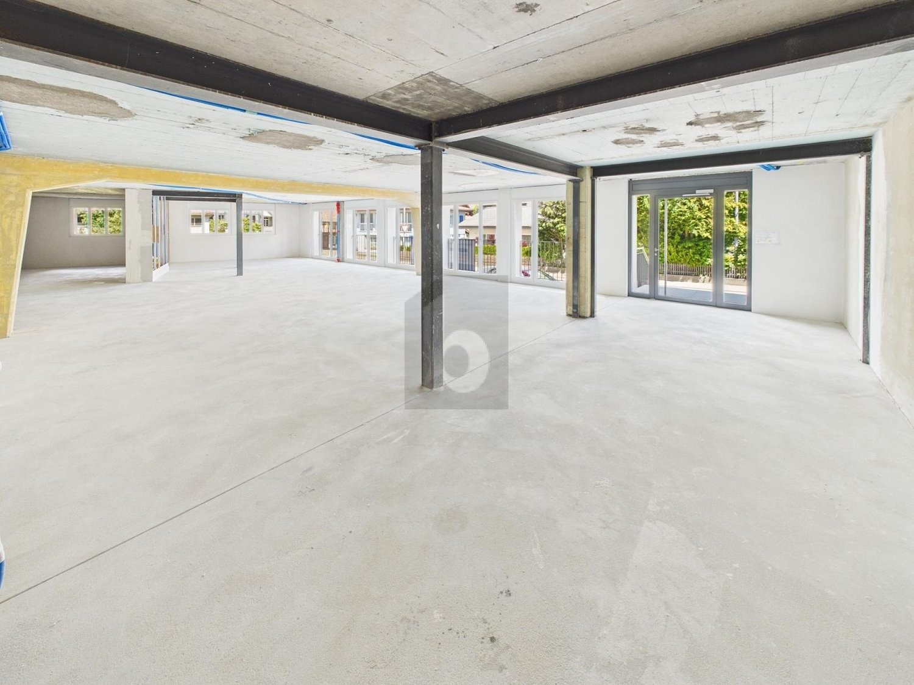
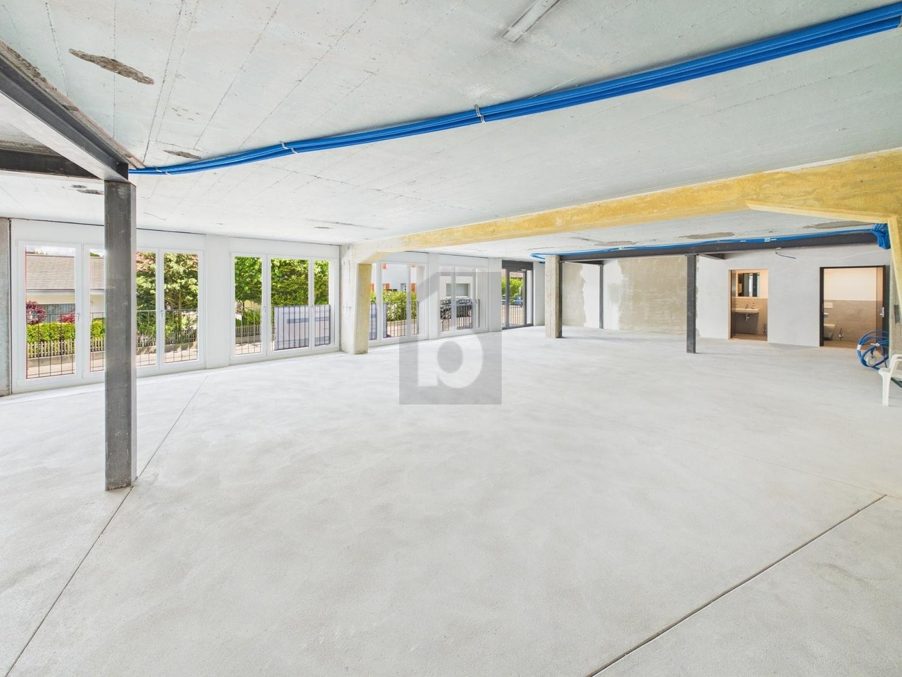

# Auf Anfrage, 3367 Thörigen - CHF 2’555 exkl. NK pro Monat

> **Categorie:** `A_praxis_medical`  
> **Regiune:** Cantonul Berna  
> **Tip ofertă:** RENT / PRACTICE  
> **Relevant pentru praxis:** da (apotheke, arztpraxis)  
> **Sursă:** [flatfox.ch](https://flatfox.ch/de/wohnung/auf-anfrage-3367-thorigen/86275839/)  
> **Descărcat:** 2026-08-17 12:36

## Date obiect

| Câmp | Valoare |
|---|---|
| Adresă | Auf Anfrage, 3367 Thörigen |
| Categorie obiect | INDUSTRY |
| Tip obiect | PRACTICE |
| Chirie netă | CHF 2'555 |
| Preț afișat | CHF 2'555 |
| Suprafață utilă | 219 m² |
| Suprafață teren | 0 m² |
| Etaj | 0 |
| An construcție | 2025 |
| Disponibil de la | agr |
| Referință | ..1412636 |

## Texte originale (germană)

**Titlu public:** Auf Anfrage, 3367 Thörigen - CHF 2’555 exkl. NK pro Monat

**Titlu scurt:** 219m² Praxis

**Pitch:** 219m² Praxis in Thörigen mieten

**Titlu descriere:** MODERN, GROSSZÜGIG UND FLEXIBEL

**Titlu chirie:** 219m² Praxis in Thörigen mieten

**Spațiu afișat:** 219

### Descriere completă

Diese kernsanierte und barrierefreie Praxis in Thörigen (3367) bietet mehrere lichtdurchflutete Zimmer (nach Ausbauwunsch) in einem modernen Gebäude - ideal für Hausarztpraxis, Therapie, Physio oder ein stilvolles Büro. Dank Erstbezug geniessen Sie volle Gestaltungsfreiheit: Ausbau, Materialien und Raumaufteilung können nach Ihren Bedürfnissen mitbestimmt werden. Top-Lage an der stark frequentierten Lindenstrasse mit separatem Eingang und bester Sichtbarkeit. Attraktiv für eine Hausarztpraxis: Medikamentenverkauf möglich, da keine Apotheke im Dorf. Aussenparkplätze optional.   
  
Dieses BETTERHOMES-Angebot zeichnet sich durch folgende Vorteile aus:   
\- Erstbezug nach Kernsanierung   
  
\- lichtdurchflutete Räume in modernem Gebäude   
  
\- volle Gestaltungsfreiheit und Mitsprache bei Ausbau   
  
\- individuelle Raumaufteilung möglich   
  
\- vielseitige Nutzungsmöglichkeiten im Medizin- und Gesundheitsbereich, aber auch als Büro   
  
\- Standortvorteil für eine Hausarztpraxis: Medikamentenverkauf möglich aufgrund fehlender Apotheke im Dorf   
  
\- Beste Sichtbarkeit und separater Eingang an stark frequentierter Lindenstrasse   
  
\- komfortabel und barrierefrei   
  
\- separater Notausgang für zusätzliche Sicherheit   
  
\- Aussenparkplätze optional vorhanden (CHF 55.-/mtl.)   
  
\- und, und, und ...   
  
  
Interessiert? Kontaktieren Sie uns für eine unverbindliche Besichtigung – auch Online-Besichtigung möglich!   
  
Nichts Passendes gefunden? Über 2'000 weitere Angebote unter: www.betterhomes.ch - der Immobilienfairmittler®   
  
Selber eine Immobilie zu vermarkten?   
Profitieren Sie von unserem Know-how: https://www.betterhomes.ch/de/profitieren   
  
Sie möchten eine Immobilie schätzen lassen?   
Erfahren Sie jetzt ihren Wert über unsere Gratis-Schätzung, sofort und unverbindlich!   
https://www.betterhomes.ch/de/knowledge/estimation   
  
  
Mehr Details   
Lage: zentral, ländlich   
Zustand: neu   
  
Bäder / Nasszellen: 2 (2x WC / Lavabo)   
Öffentliche Verkehrsmittel: Bus, 50 m   
Schulen: -   
Geschäfte: Bäckerei, 50 m / Metzgerei, 50 m / Coop, 2.5 km

## Dotări (attributes)

- lift
- accessiblewithwheelchair

## Ofertant

- **Nume:** BETTERHOMES (Schweiz) AG
- **Stradă:** Weltpoststrasse 3E
- **NPA:** 3015
- **Localitate:** Bern

## Imagini (4)

*`01.jpg` — 1500x1125 px*

*`02.jpg` — 1500x1125 px*

*`03.jpg` — 1500x1125 px*

*`04.jpg` — 1500x1125 px*

## Media suplimentară

- **website_url:** https://www.betterhomes.ch/de/immobilie-suchen/detail/objectId/42be5026c4fd6cc6da98cfa5df2a90f8
