# Morgenstrasse 131, 3018 Bern - CHF 2’020 inkl. NK pro m² / Jahr

> **Categorie:** `B_buero_gewerbe`  
> **Regiune:** Berna (oraș)  
> **Tip ofertă:** RENT / STORAGE_ROOM  
> **Sursă:** [flatfox.ch](https://flatfox.ch/de/wohnung/morgenstrasse-131-3018-bern/1088925/)  
> **Descărcat:** 2026-08-17 12:37

## Date obiect

| Câmp | Valoare |
|---|---|
| Adresă | Morgenstrasse 131, 3018 Bern |
| Categorie obiect | INDUSTRY |
| Tip obiect | STORAGE_ROOM |
| Chirie netă | CHF 1'795 |
| Nebenkosten | CHF 225 |
| Chirie brută | CHF 2'020 |
| Preț afișat | CHF 2'020 |
| Suprafață utilă | 179 m² |
| Etaj | -1 |
| An construcție | 1991 |
| Disponibil de la | agr |
| Referință | 25558..60904 |

## Texte originale (germană)

**Titlu public:** Morgenstrasse 131, 3018 Bern - CHF 2’020 inkl. NK pro m² / Jahr

**Titlu scurt:** 179m² Lager

**Pitch:** 179m² Lager in Bern mieten

**Titlu descriere:** Lagerräume zwischen 40-208 m² im 1. UG

**Titlu chirie:** 179m² Lager in Bern mieten

**Spațiu afișat:** 179

### Descriere completă

Wir vermieten ab sofort oder nach Vereinbarung mehrere Lagerräume zwischen 40-208 m² im 1. UG eines Gewerbekomplexes. Die Räume sind in der Regel wie folgt ausgestattet:   
  
\- Stromanschluss vorhanden   
\- Teilweise mit Wasseranschluss   
\- Unbeheizt   
\- Lichtinstallation vorhanden   
\- Einstellhallenplätze für je CHF 150.-- verfügbar.   
\- Keine Verwendung als Musikstudio, Band- oder Proberaum möglich   
  
Ebenfalls befinden sich in den oberen Etagen weitere freie Mietflächen, die für Gewerbezwecke genutzt werden können (https://flatfox.ch/de/wohnung/morgenstrasse-131-3018-bern/831186/).   
  
Die Liegenschaft liegt 2 Fahrtminuten vom Autobahnanschluss Niederwangen entfernt. Bahnhof Bümpliz Süd (S-Bahn) ist zu Fuss in 10 min., die Busstation Nr. 27 und 31 in 4 min. zu erreichen. Vom Hauptbahnhof Bern gelangt man mit dem ÖV innerhalb von 25 min. zur Liegenschaft.   
  
Mietzins auf Anfrage.

## Dotări (attributes)

- garage

## Ofertant

- **Nume:** Niederer AG
- **Stradă:** Unterdorfstrasse 5
- **NPA:** 3072
- **Localitate:** Ostermundigen

## Imagini (11)

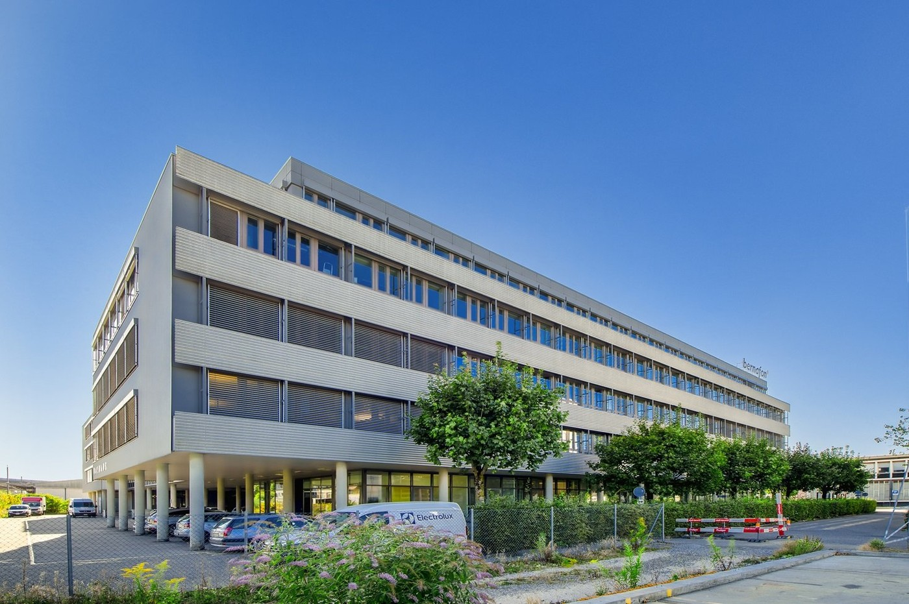
*`01.jpg` — 1400x931 px — Aussenansicht*

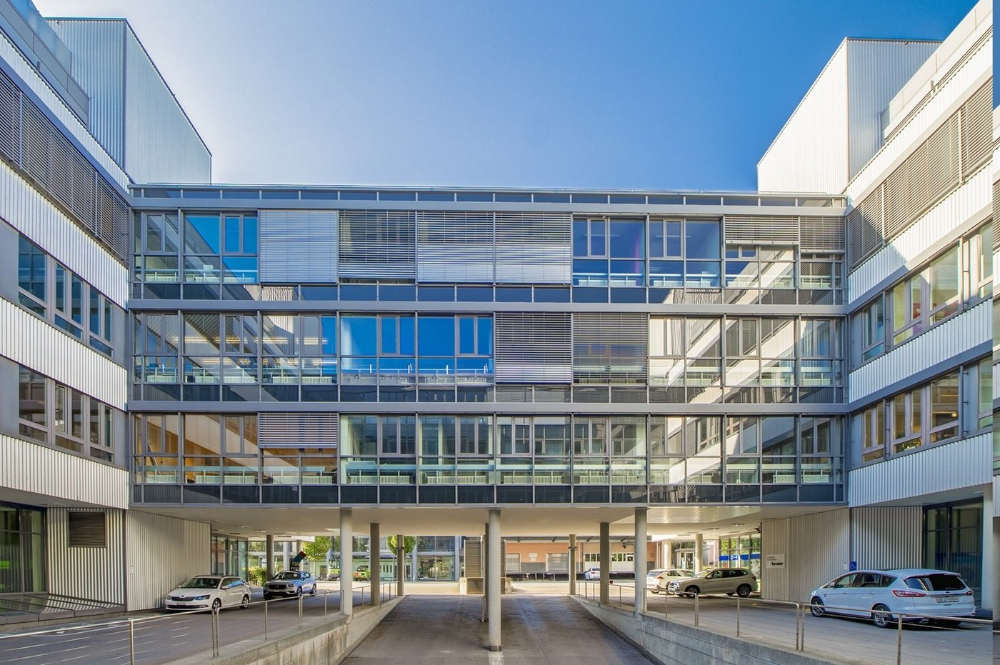
*`02.jpg` — 1400x931 px — Aussenansicht*

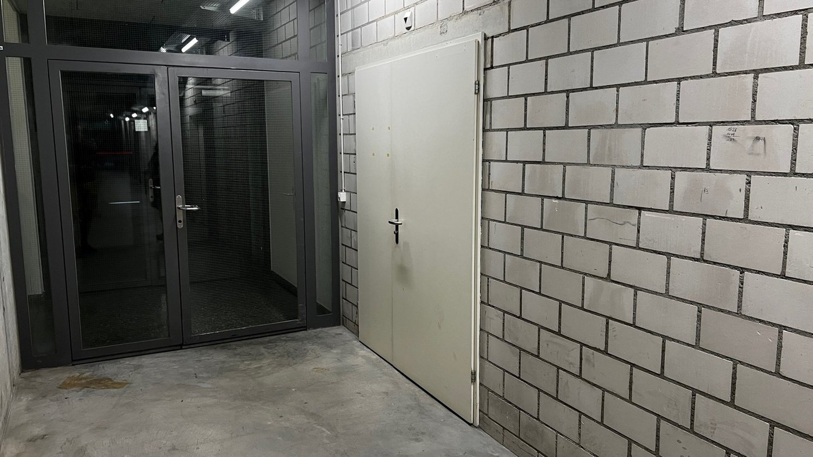
*`03.jpg` — 1400x788 px — Kellergang*

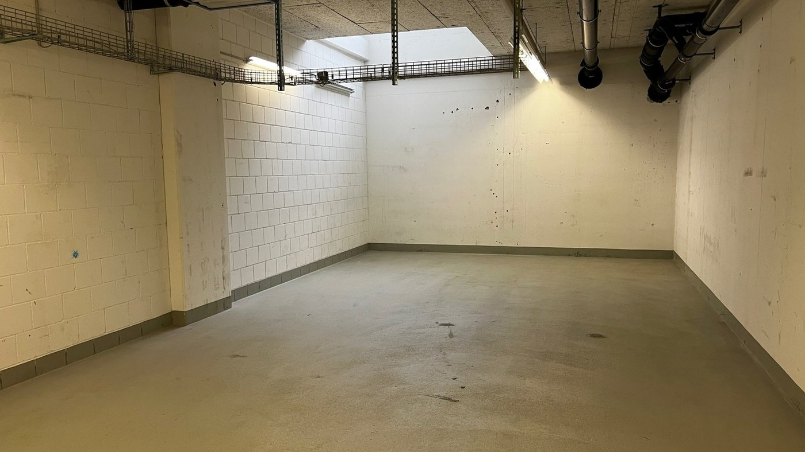
*`04.jpg` — 1400x788 px — Lager 47m2*

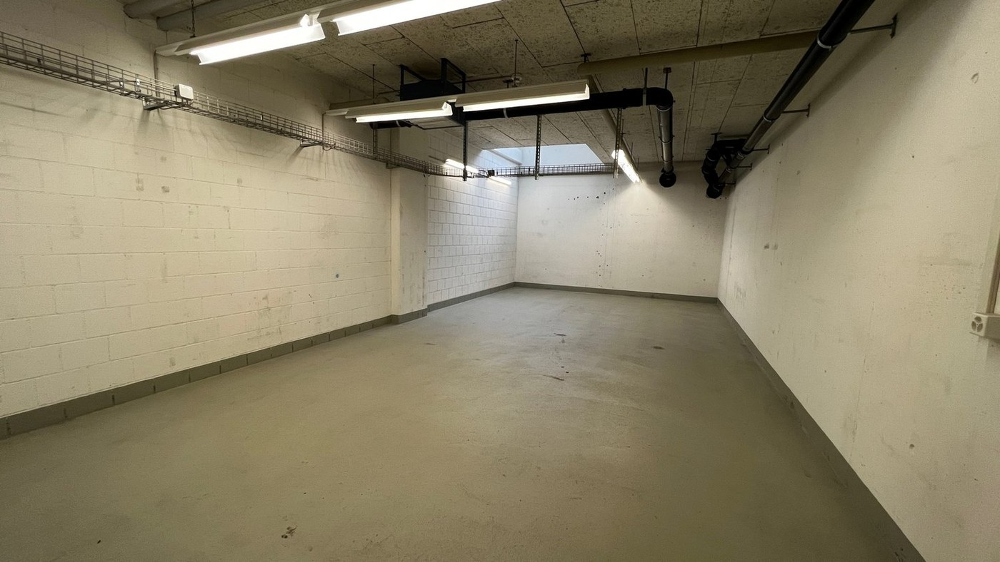
*`05.jpg` — 1400x788 px — Lager 47m2*

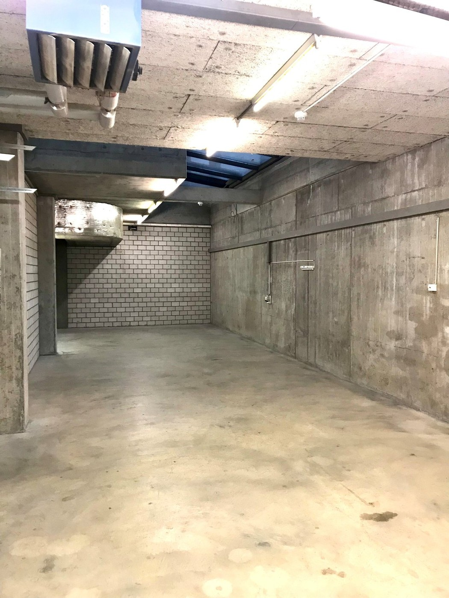
*`06.jpg` — 1050x1400 px — Lager 81m2*

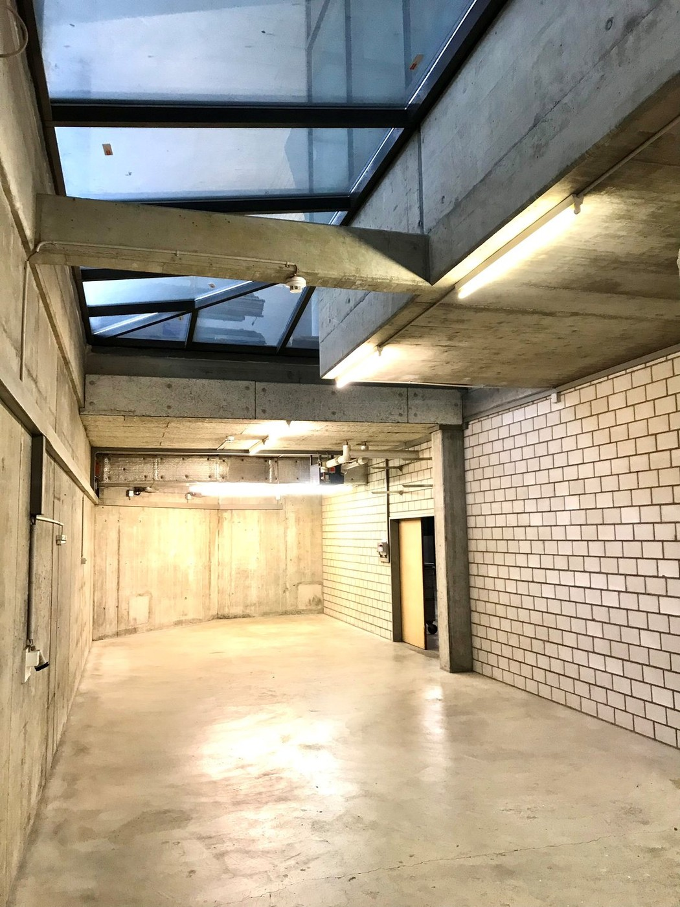
*`07.jpg` — 1050x1400 px — Lager 81m2*

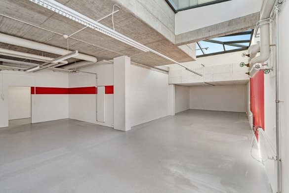
*`08.jpg` — 585x390 px — Lager 95m2*

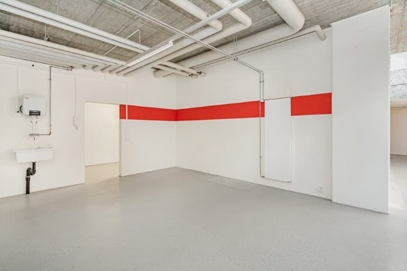
*`09.jpg` — 585x390 px — Lager 95m2*

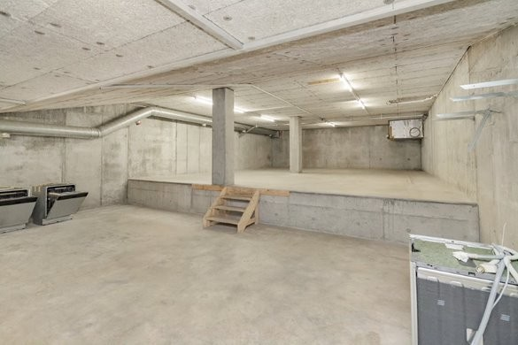
*`10.jpg` — 585x390 px — Lager 143m2*

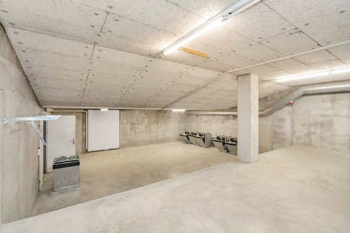
*`11.jpg` — 585x390 px — Lager 143m2*
