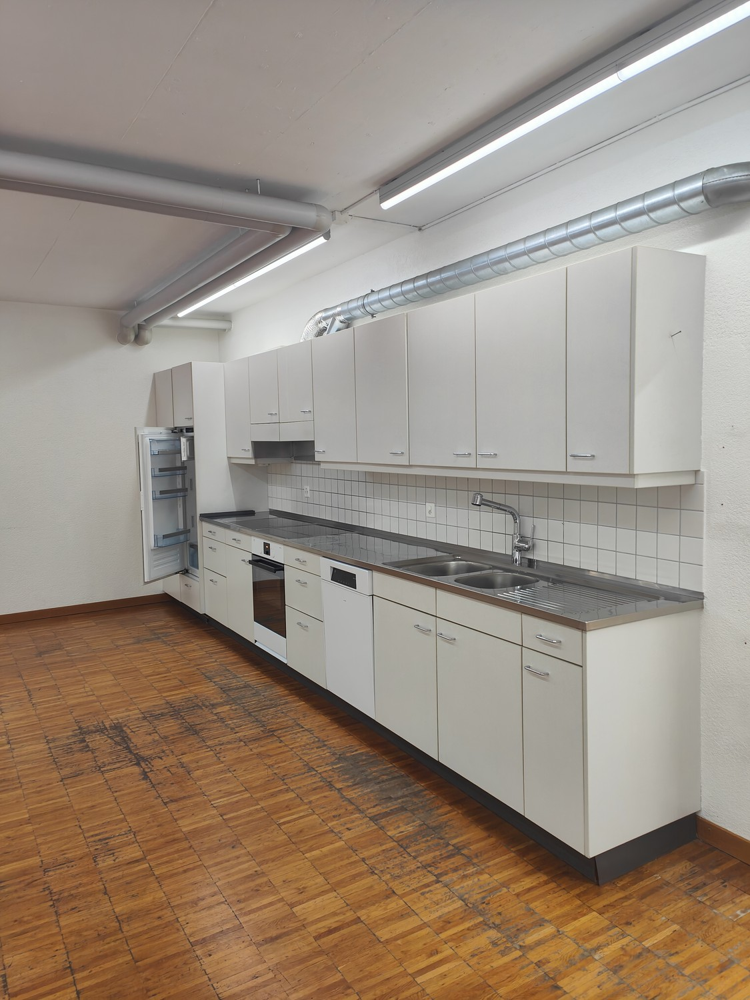
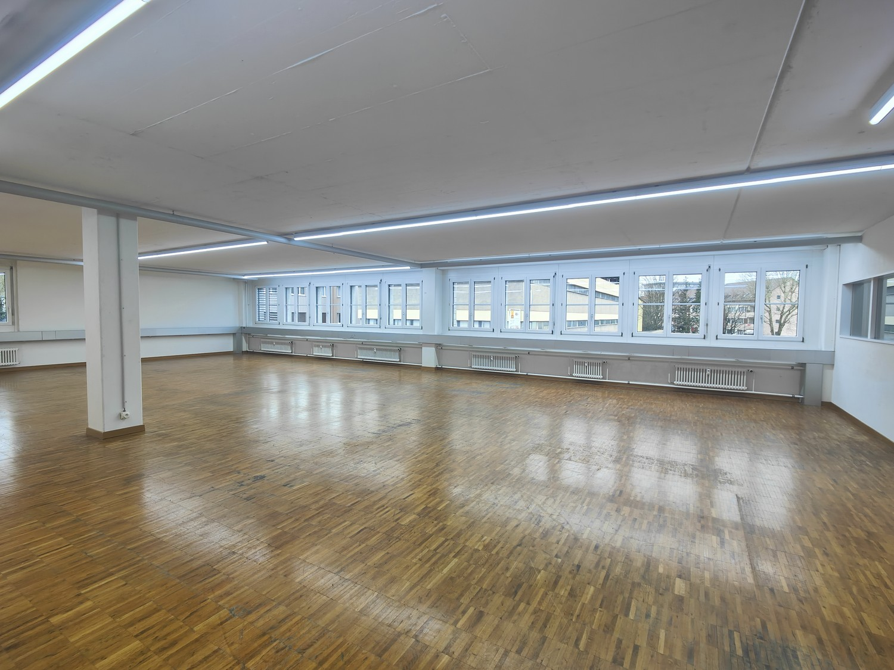
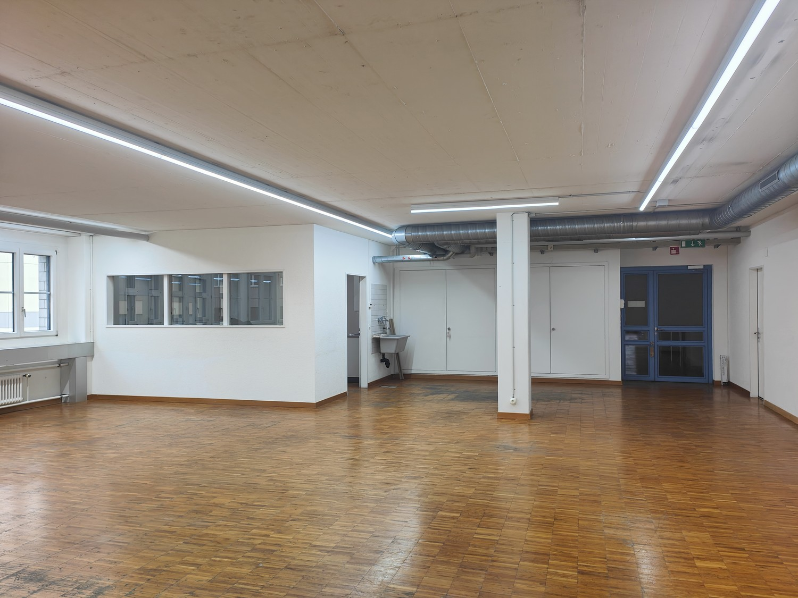
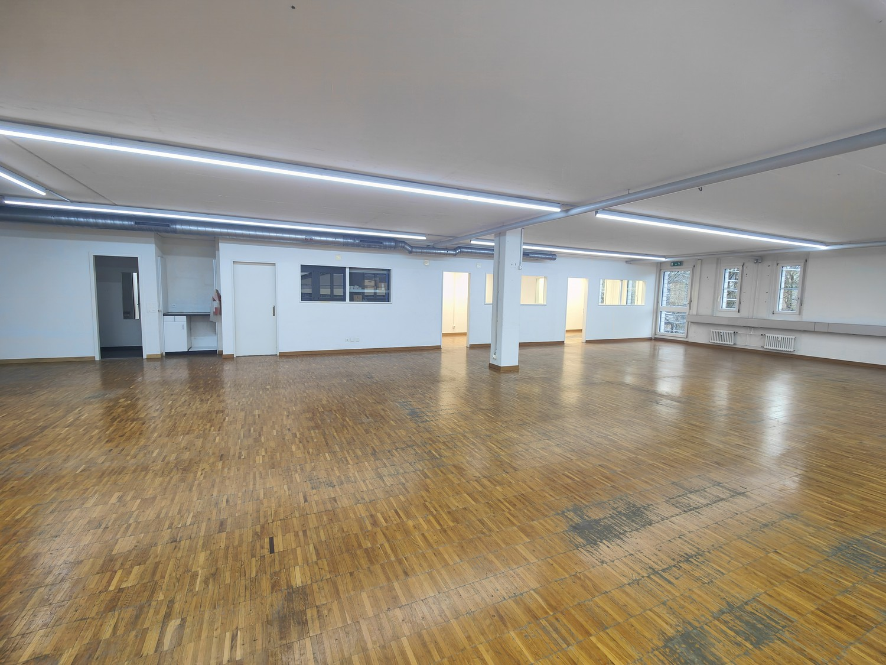
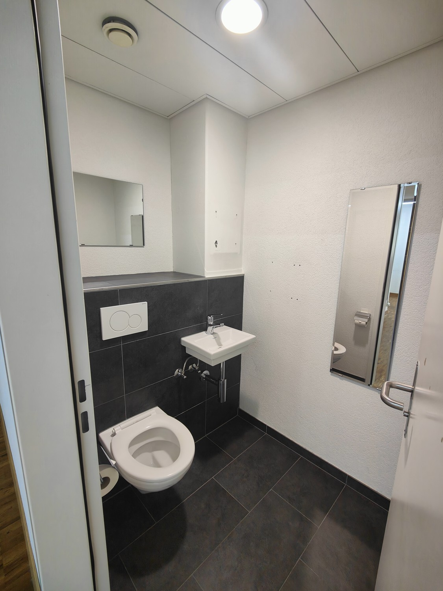
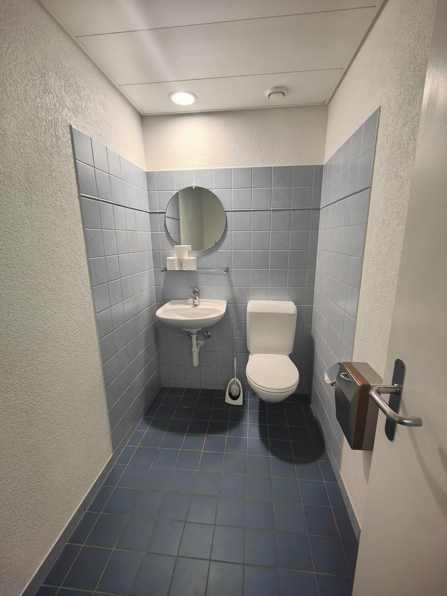
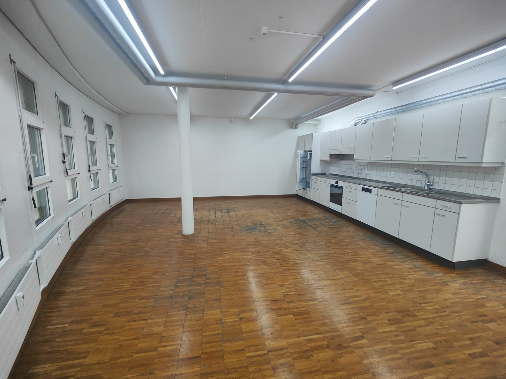
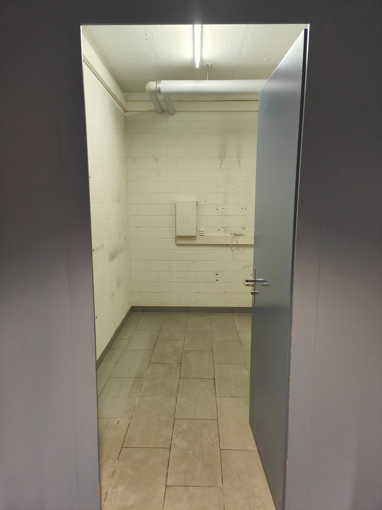
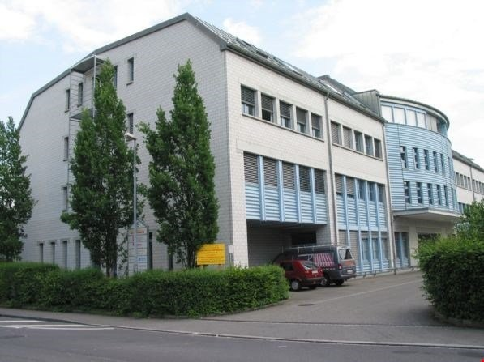

# Looslistrasse 15, 3027 Bern - CHF 3’980 inkl. NK pro Monat

> **Categorie:** `B_buero_gewerbe`  
> **Regiune:** Berna (oraș)  
> **Tip ofertă:** RENT / COMMERCIAL  
> **Sursă:** [flatfox.ch](https://flatfox.ch/de/wohnung/looslistrasse-15-3027-bern/1103503/)  
> **Descărcat:** 2026-08-17 12:35

## Date obiect

| Câmp | Valoare |
|---|---|
| Adresă | Looslistrasse 15, 3027 Bern |
| Categorie obiect | INDUSTRY |
| Tip obiect | COMMERCIAL |
| Chirie netă | CHF 3'630 |
| Nebenkosten | CHF 350 |
| Preț afișat | CHF 3'980 |
| Suprafață utilă | 264 m² |
| Etaj | 2 |
| An construcție | 1991 |
| Disponibil de la | agr |
| Referință | 210661..142101 |

## Texte originale (germană)

**Titlu public:** Looslistrasse 15, 3027 Bern - CHF 3’980 inkl. NK pro Monat

**Titlu scurt:** 264m² Gewerbe

**Pitch:** 264m² Gewerbe in Bern mieten

**Titlu descriere:** Schöne Büro-/Gewerberäume in Bern-Bethlehem

**Titlu chirie:** 264m² Gewerbe in Bern mieten

**Spațiu afișat:** 264

### Descriere completă

**Suchen Sie zentralgelegene Büroräume oder Gewerbeflächen** in Bern-Bethlehem?  
  
Wir vermieten an der Looslistrasse 15 per sofort oder nach Vereinbarung **vielseitig nutzbare Büroräume / Gewerbeflächen (ca. 264 m2) im 2. OG**.  
  
Die Räumlichkeiten zeichnen sich aus durch:  
\- helle und offene Flächen  
\- zwei abschliessbares Sitzungszimmer  
\- abschliessbare grosszügige Küche  
\- zwei sep. Toiletten  
\- Nähe ÖV  
\- Aussenparkplätze vorhanden, ca. 4 Gehminuten  
  
Anfahrt zur Liegenschaft  
mit ÖV:  
Die Liegenschaft ist ab dem Hauptbahnhof Bern mit der S-Bahn S51 ab Bern bis Stöckacker und mit der Tramlinie Nr. 8 bis Bethlehem b. Bern Säge gut erreichbar.  
  
mit PW:  
Die Autobahnausfahrt Weyermannshaus ist unmittelbar in der Nähe des Gebäudes.  
  
Haben wir Ihr Interesse geweckt? Wir freuen uns auf Ihre Kontaktaufnahme!

## Ofertant

- **Nume:** Burgergemeinde Bern, Immobilien
- **Nume 2:** Domänenverwaltung
- **Stradă:** Bahnhofplatz 2
- **NPA:** 3001
- **Localitate:** Bern

## Imagini (9)

*`01.jpg` — 1125x1500 px — Küche*

*`02.jpg` — 1500x1125 px — Gewerbefläche*

*`03.jpg` — 1500x1125 px — Eingangsbereich*

*`04.jpg` — 1500x1125 px — Gewerbefläche*

*`05.jpg` — 1125x1500 px — WC 1*

*`06.jpg` — 1125x1500 px — WC 2*

*`07.jpg` — 1500x1125 px — Küche und Aufenthaltsbereich*

*`08.jpg` — 1125x1500 px — sep. Lager*

*`09.jpg` — 597x447 px — Aussenbereich*
