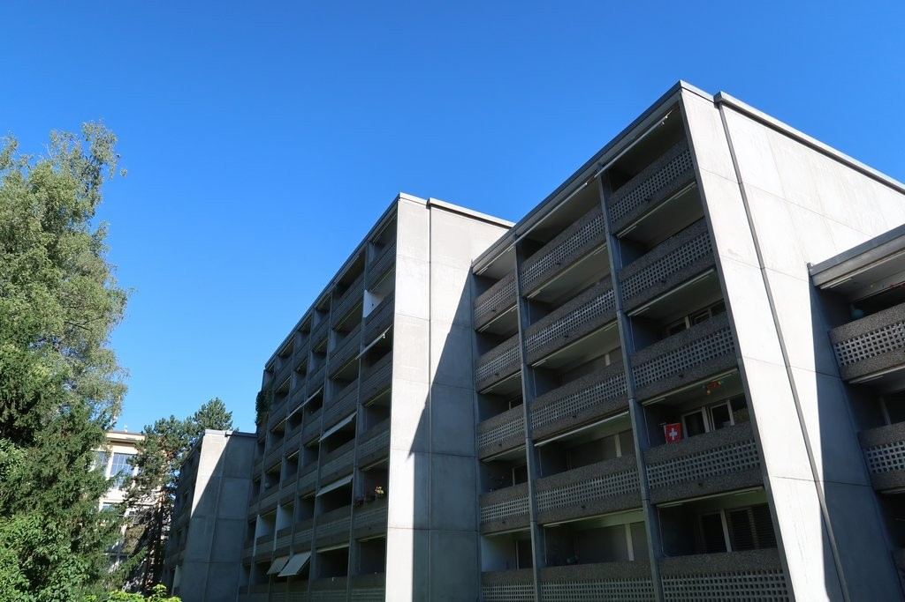
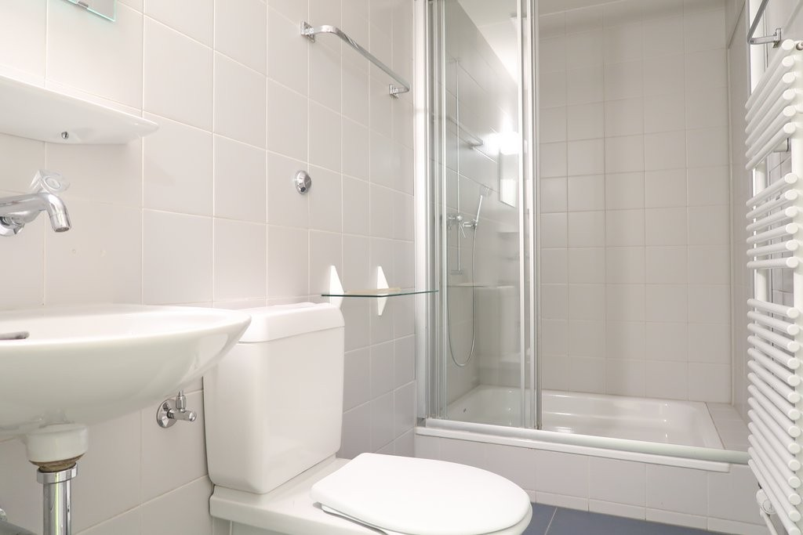
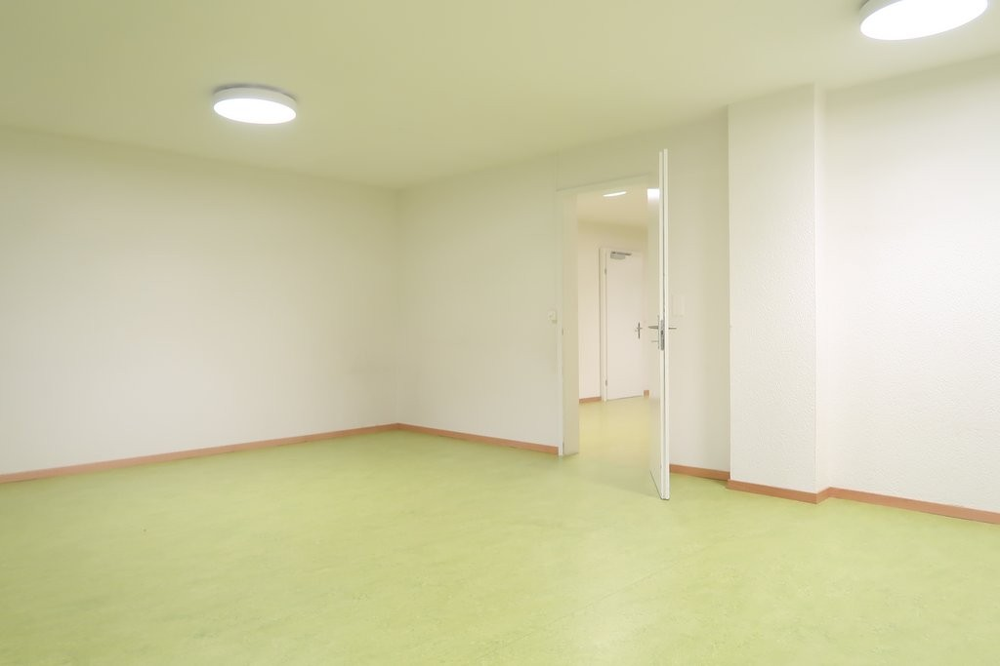
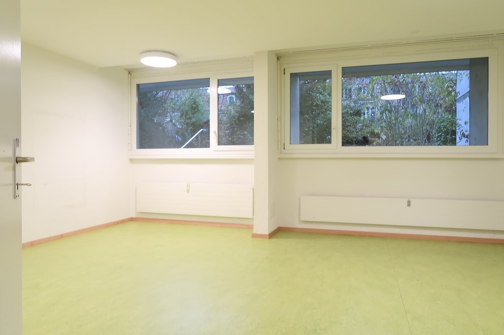
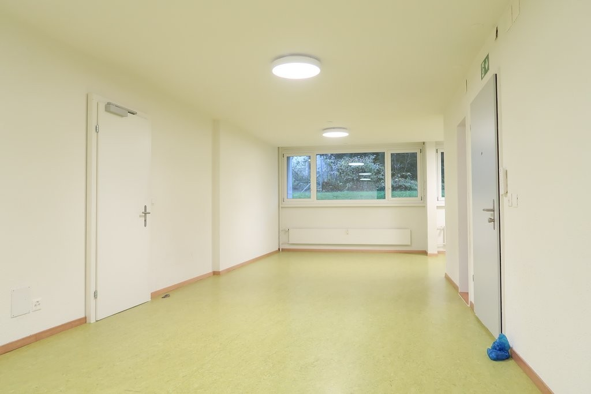
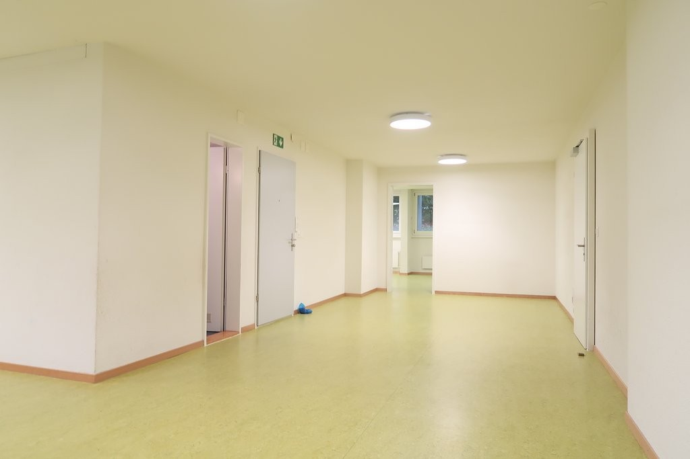
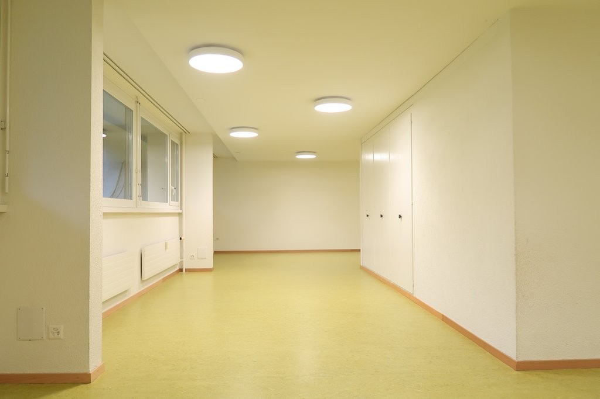
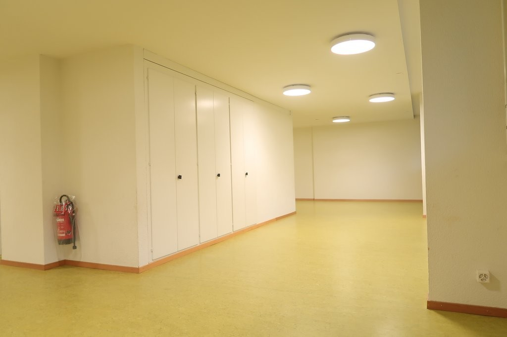
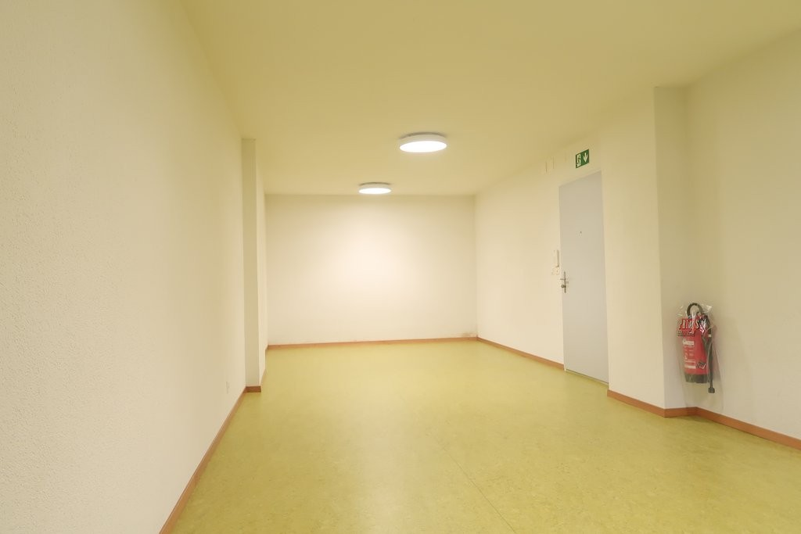
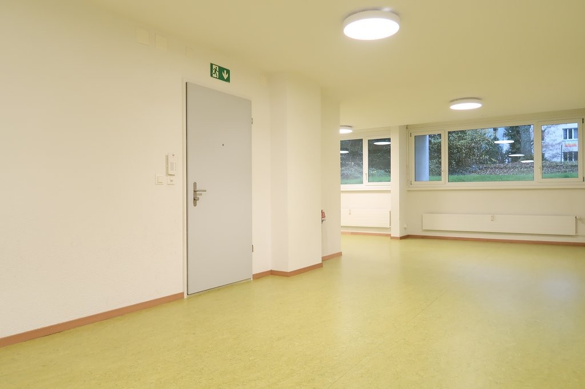

# Fabrikstrasse 29 B, 3012 Bern - CHF 184 inkl. NK pro m² / Jahr

> **Categorie:** `B_buero_gewerbe`  
> **Regiune:** Berna (oraș)  
> **Tip ofertă:** RENT / OFFICE  
> **Sursă:** [flatfox.ch](https://flatfox.ch/de/wohnung/fabrikstrasse-29-b-3012-bern/1195011/)  
> **Descărcat:** 2026-08-17 12:32

## Date obiect

| Câmp | Valoare |
|---|---|
| Adresă | Fabrikstrasse 29 B, 3012 Bern |
| Categorie obiect | INDUSTRY |
| Tip obiect | OFFICE |
| Chirie netă | CHF 141 |
| Nebenkosten | CHF 43 |
| Chirie brută | CHF 184 |
| Preț afișat | CHF 184 |
| Suprafață utilă | 121 m² |
| Etaj | 0 |
| An construcție | 1972 |
| An renovare | 2014 |
| Disponibil de la | agr |
| Referință | 12640.05.400010 |

## Texte originale (germană)

**Titlu public:** Fabrikstrasse 29 B, 3012 Bern - CHF 184 inkl. NK pro m² / Jahr

**Titlu scurt:** 121m² Büro

**Pitch:** 121m² Büro in Bern mieten

**Titlu descriere:** Offen, flexibel, lichtdurchflutet - ideales Umfeld für Wachstum

**Titlu chirie:** 121m² Büro in Bern mieten

**Spațiu afișat:** 121

### Descriere completă

An der Fabrikstrasse 29 B in der hinteren Länggasse steht eine vielseitig nutzbare Gewerbefläche zur Vermietung. 

  

Die Fläche befindet sich im Zwischengeschoss (Boden der Fläche unterhalb des Erdreichs, Fenster ungefähr auf Höhe des Erdreichs) und zeichnet sich durch grosse Fensterfronten, viel Tageslicht und eine funktionale Raumaufteilung aus. 

**  
**

**Infrastruktur & Lage **

  * Ruhige Wohnstraße mit guter Erreichbarkeit 
  * Optimale Anbindung über Bern-Weyermannshaus 
  * Schnelle ÖV-Verbindungen (ca. 200 m zur Bushaltestelle) 
  * Infrastruktur in unmittelbarer Nähe: Einkauf, Banken, Post, Restaurants 
  * Bremgartenwald in der Nähe für Pausen im Freien 

  

**Ausstattung & Merkmale **

  * Hell gestaltete Fläche mit flexibler Raumteilung 
  * Separate Toilette 
  * Einbauschränke 
  * Abgeschlossener Büroraum 
  * Grosses Durchgangsbüro / Open-Office 

  

**Parkmöglichkeiten**

  * Kundenparkplätze und Einstellhallenplätze können nach Verfügbarkeit gemietet werden 

  

**Haben wir Ihr Interesse geweckt? Dann freuen wir uns über Ihre Nachricht via Kontaktformular. Gerne vereinbaren wir einen Besichtigungstermin.**

## Dotări (attributes)

- lift
- cable
- garage
- parkingspace

## Ofertant

- **Nume:** Von Graffenried AG Liegenschaften
- **Stradă:** Marktgass-Passage 3
- **NPA:** 3011
- **Localitate:** Bern

## Imagini (10)

*`01.jpg` — 1024x683 px — IMG_1602.JPG*

*`02.jpg` — 1024x683 px — IMG_7228.JPG*

*`03.jpg` — 1024x683 px — IMG_7225.JPG*

*`04.jpg` — 1024x683 px — IMG_7226.JPG*

*`05.jpg` — 1024x683 px — IMG_7229.JPG*

*`06.jpg` — 1024x683 px — IMG_7231.JPG*

*`07.jpg` — 1024x683 px — IMG_7232.JPG*

*`08.jpg` — 1024x683 px — IMG_7234.JPG*

*`09.jpg` — 1024x683 px — IMG_7236.JPG*

*`10.jpg` — 1024x683 px — IMG_7237.JPG*
