# Worbstrasse 187, 3073 Gümligen - CHF 190 exkl. NK pro m² / Jahr

> **Categorie:** `B_buero_gewerbe`  
> **Regiune:** Cantonul Berna  
> **Tip ofertă:** RENT / OFFICE  
> **Relevant pentru praxis:** da (apotheke)  
> **Sursă:** [flatfox.ch](https://flatfox.ch/de/wohnung/worbstrasse-187-3073-gumligen/1381157/)  
> **Descărcat:** 2026-08-17 12:26

## Date obiect

| Câmp | Valoare |
|---|---|
| Adresă | Worbstrasse 187, 3073 Gümligen |
| Categorie obiect | INDUSTRY |
| Tip obiect | OFFICE |
| Chirie netă | CHF 190 |
| Preț afișat | CHF 190 |
| Suprafață utilă | 705 m² |
| Etaj | 2 |
| An construcție | 2012 |
| Disponibil de la | agr |
| Referință | VM100.0321049.01 |

## Texte originale (germană)

**Titlu public:** Worbstrasse 187, 3073 Gümligen - CHF 190 exkl. NK pro m² / Jahr

**Titlu scurt:** 705m² Büro

**Pitch:** 705m² Büro in Gümligen mieten

**Titlu descriere:** Openspace Büro - Flexibel & Anpassungsfähig, perfekt für Ihr Business!

**Titlu chirie:** 705m² Büro in Gümligen mieten

**Spațiu afișat:** 705

### Descriere completă

Per sofort oder nach Vereinbarung vermieten wir rund 705 m² Büroflächen im 2. Obergeschoss eines modernen Businessstandorts in Gümligen. Das Büro ist bereits ausgebaut (ohne Elektroverkabelung) inklusive einer funktionalen **Teeküche** – so steht einer effizienten Nutzung nichts im Weg.  
  
Das Bürogebäude befindet sich im Zentrum von Gümligen und ist nur knapp 5 Gehminuten vom Bahnhof Gümligen sowie 5 Fahrminuten vom Autobahnanschluss Muri/Gümligen (A6) entfernt. Das hauseigene Fitness sowie Personalrestaurant (UBS Gümligenpark) runden das attraktive Angebot ab. Weitere interessante Geschäfte - unter anderem Migros, Coop inkl. Restaurant, Post, Apotheke etc. - befinden sich in direkter Umgebung.  
  
**Highlights:**  
  

*   3 Einzelbüros gegen Nord-Ost, 1 grosses Sitzungszimmer sowie grosszügige Openspace Flächen
*   **Lichtdurchflutete Räume** für ein angenehmes Arbeitsklima
*   Lichtinstallation teilweise vorhanden
*   Doppelböden für IT-Leitungen
*   Eigene WC-Anlagen sowie IV-WC im Treppenhaus vorhanden
*   Ein gesundes Klima im Gebäude durch **Minergie P-Eco**
*   **Klimatisierte Büros** (Kühldecken)
*   Viele Parkplätze in der Tiefgarage verfügbar
*   Lagerflächen vorhanden

Bei Bedarf stehen zudem weitere Flächen an diesem Standort zur Verfügung. Weitere Informationen finden Sie auf der verlinkten Projektwebseite.  
  
**Konditionen:** Mietzins pro Mietfläche ab CHF 190.00 pro m²/p.a.  
  
Sie wünschen weitere Auskünfte? Wir beraten Sie gerne und freuen uns über Ihre Anfrage. Gerne zeigen wir Ihnen die Räumlichkeiten bei einem persönlichen Besichtigungstermin.

## Dotări (attributes)

- accessiblewithwheelchair
- lift
- parkingspace

## Ofertant

- **Nume:** Privera AG
- **Stradă:** Worbstrasse 142
- **NPA:** 3073
- **Localitate:** Gümligen

## Imagini (12)

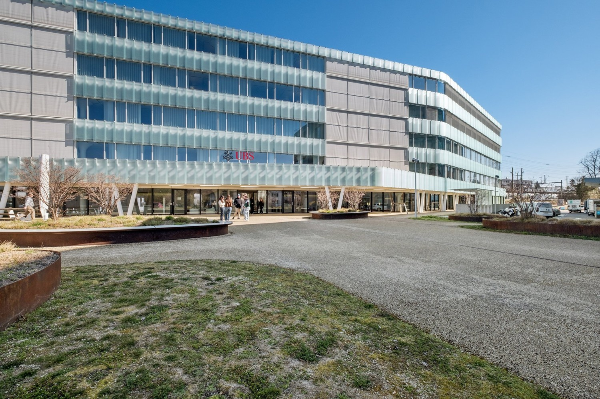
*`01.jpg` — 1500x1000 px*

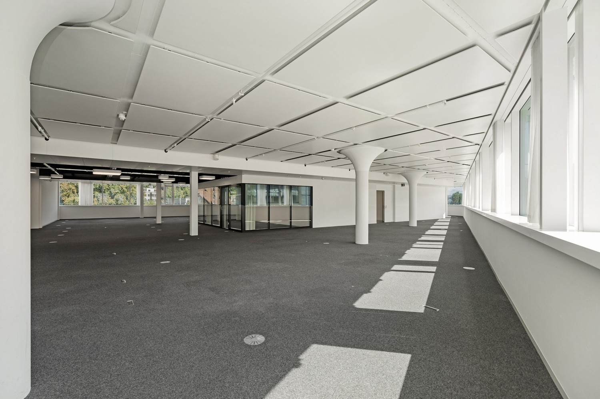
*`02.jpg` — 1500x1000 px*

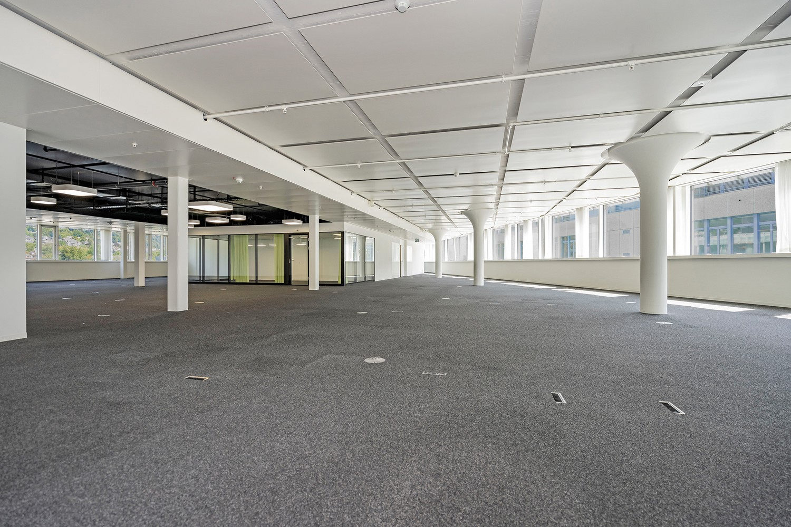
*`03.jpg` — 1500x1000 px*

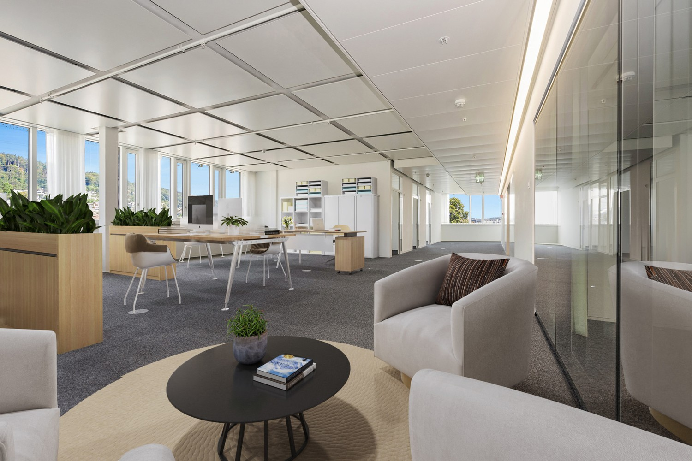
*`04.jpg` — 1500x1000 px — Visualisierung*

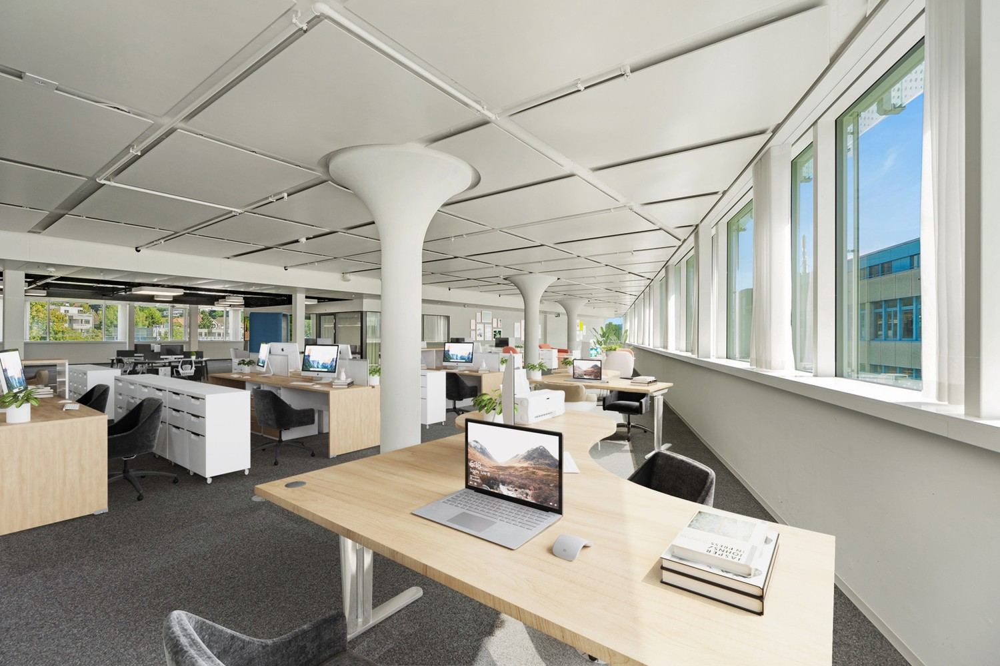
*`05.jpg` — 1500x1000 px — Visualisierung*

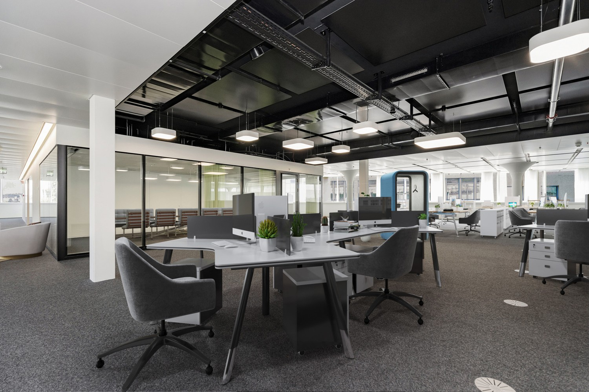
*`06.jpg` — 1500x1000 px — Visualisierung*

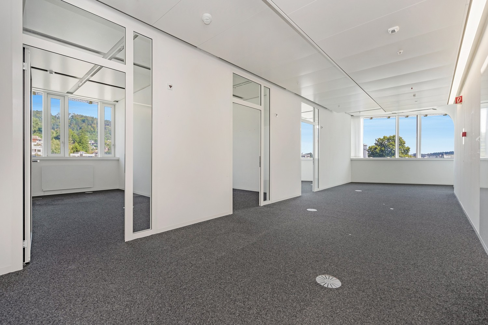
*`07.jpg` — 1500x1000 px*

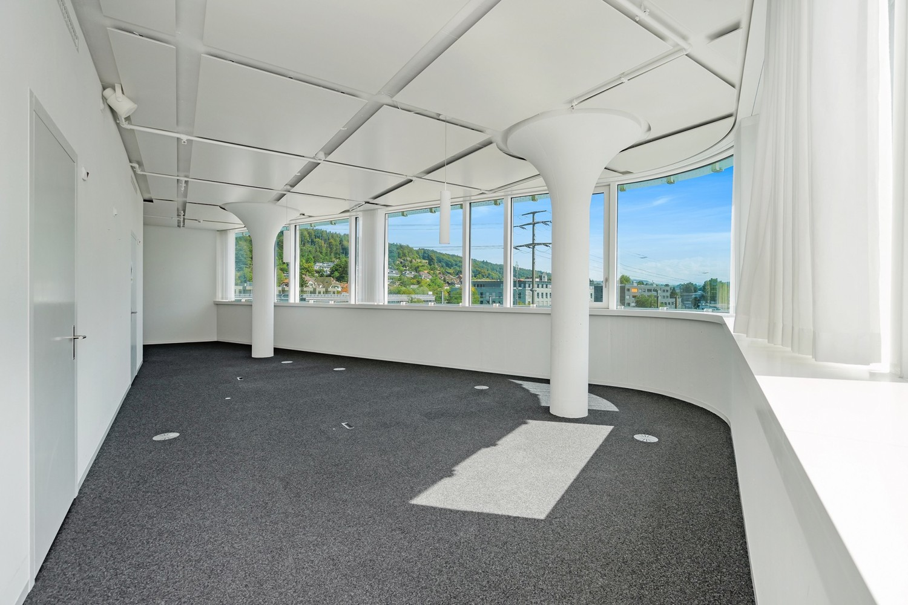
*`08.jpg` — 1500x1000 px*

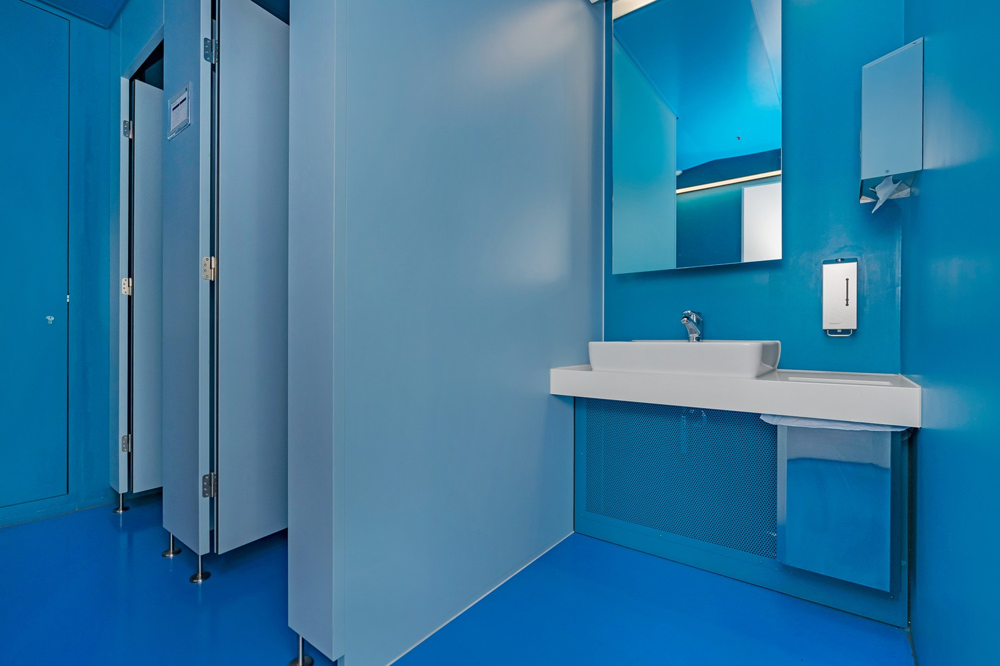
*`09.jpg` — 1500x1000 px*

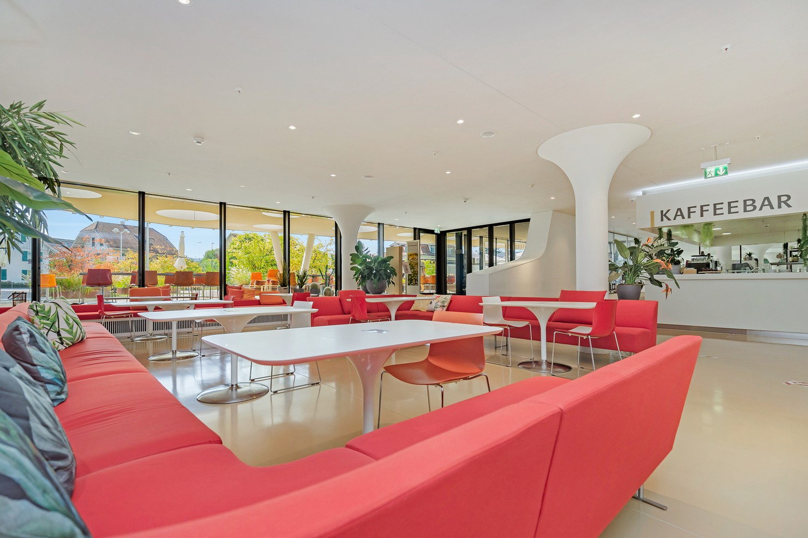
*`10.jpg` — 1500x1000 px*

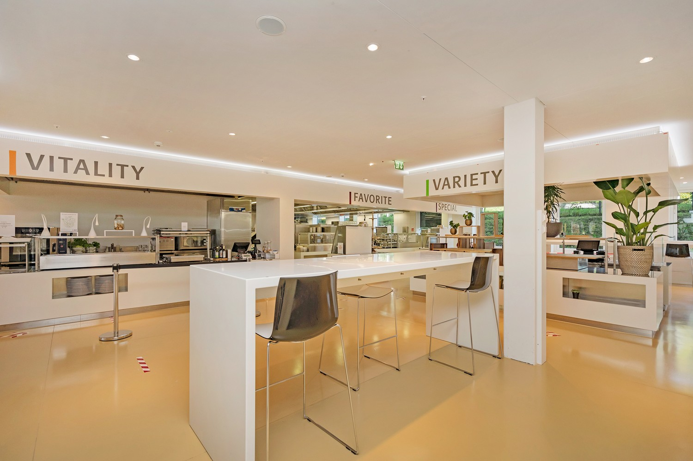
*`11.jpg` — 1500x1000 px*

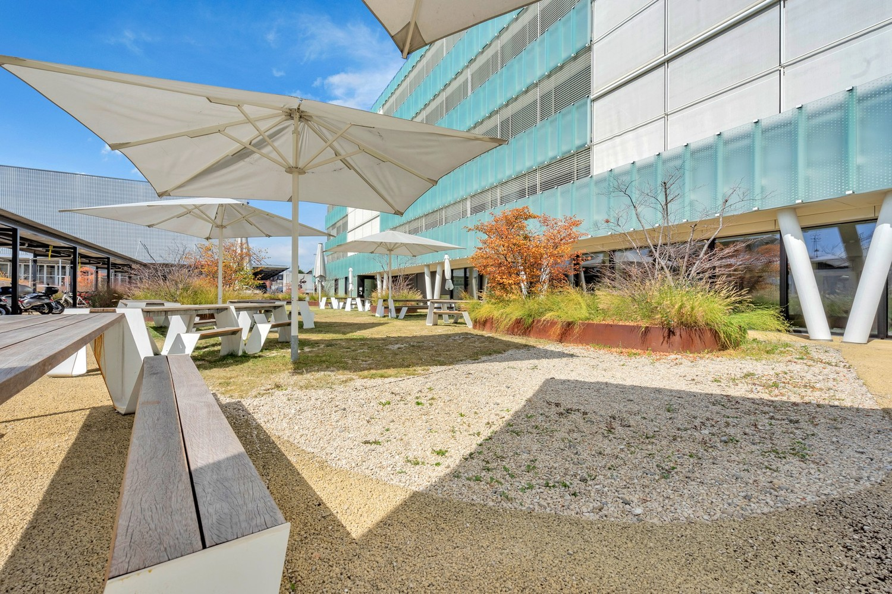
*`12.jpg` — 1500x1000 px*

## Media suplimentară

- **website_url:** https://tannerie.ch/
