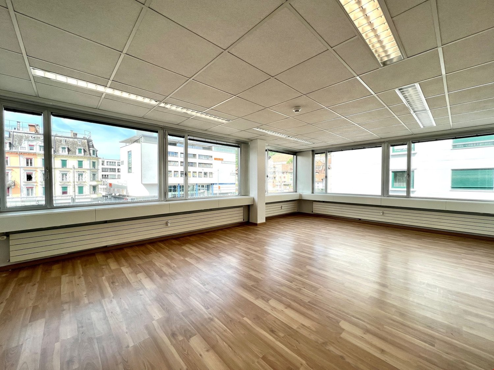
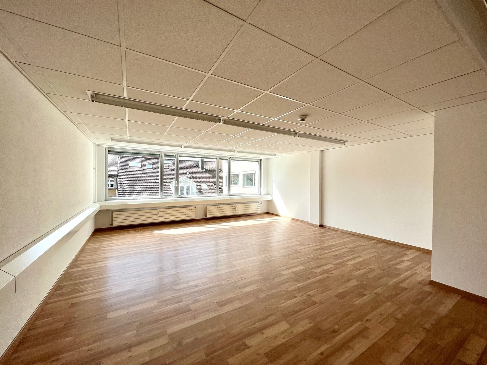
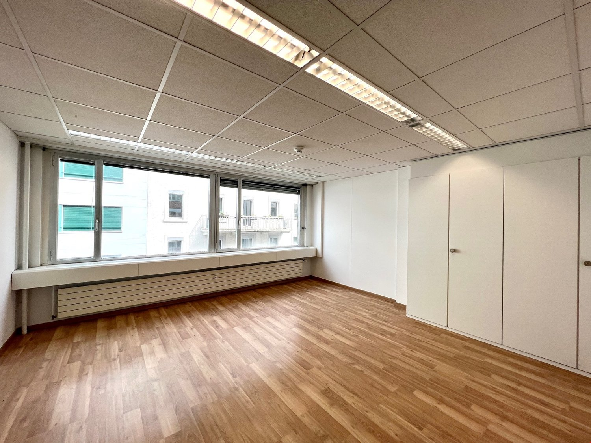
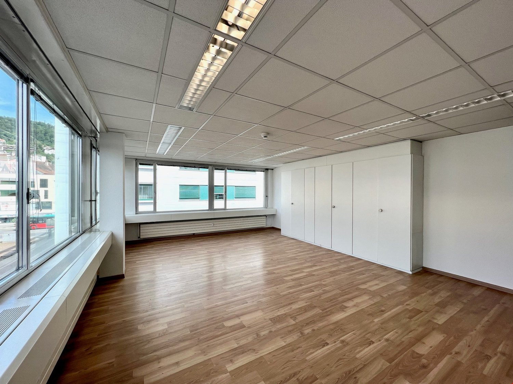
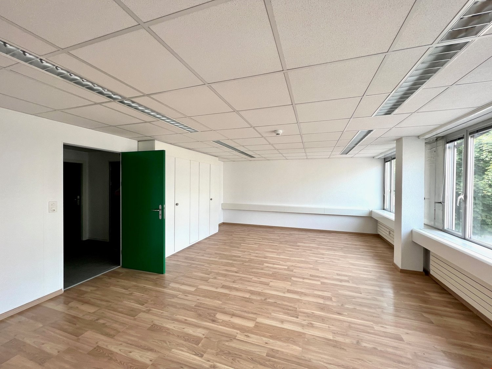
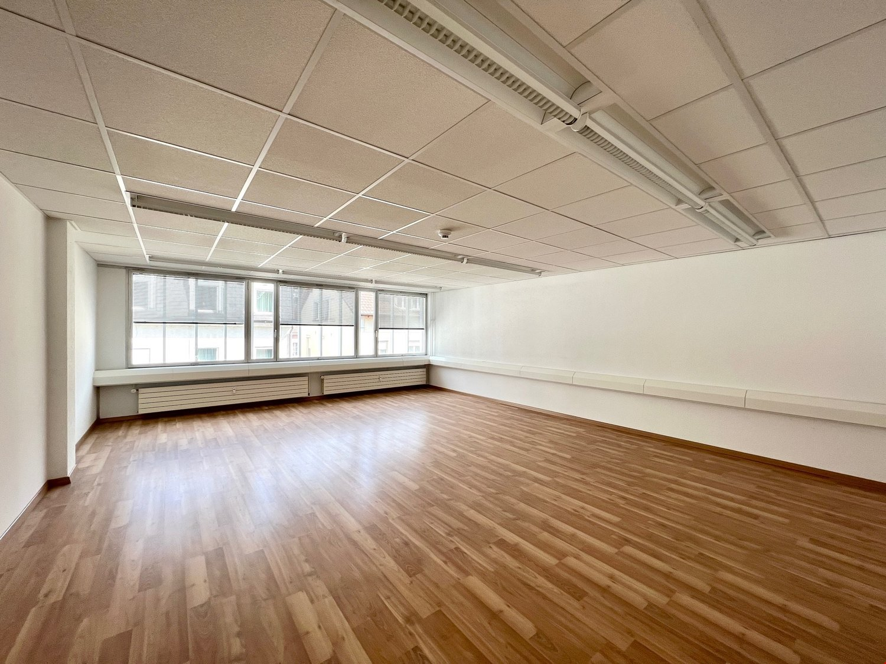
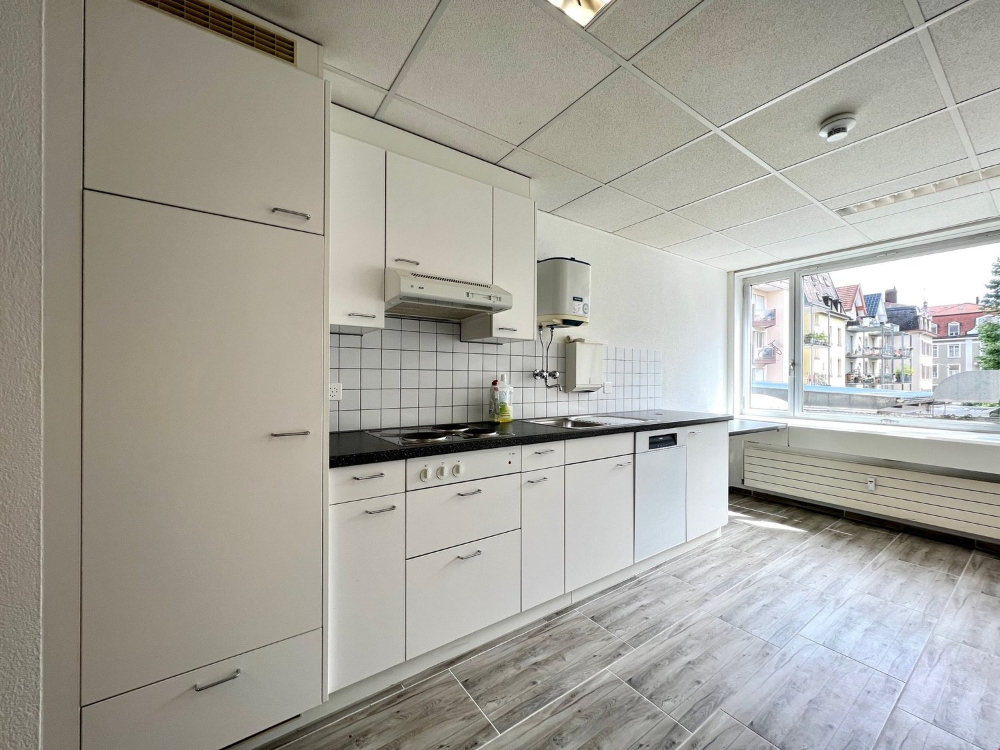

# Reitschulstrasse 5, 2502 Biel/Bienne - CHF 380

> **Categorie:** `B_buero_gewerbe`  
> **Regiune:** Cantonul Berna  
> **Tip ofertă:** RENT / OFFICE  
> **Relevant pentru praxis:** da (praxis)  
> **Sursă:** [flatfox.ch](https://flatfox.ch/de/wohnung/reitschulstrasse-5-2502-bielbienne/1396990/)  
> **Descărcat:** 2026-08-17 12:34

## Date obiect

| Câmp | Valoare |
|---|---|
| Adresă | Reitschulstrasse 5, 2502 Biel/Bienne |
| Categorie obiect | INDUSTRY |
| Tip obiect | OFFICE |
| Chirie brută | CHF 380 |
| Preț afișat | CHF 380 |
| Suprafață utilă | 19 m² |
| Etaj | 5 |
| An renovare | 2022 |
| Disponibil de la | imm |
| Referință | ..i4wpa.1u2bx |

## Texte originale (germană)

**Titlu public:** Reitschulstrasse 5, 2502 Biel/Bienne - CHF 380

**Titlu scurt:** 19m² Büro

**Pitch:** 19m² Büro in Biel/Bienne mieten

**Titlu descriere:** *GELEGENHEIT* diverse neu sanierte Büroräume von 14 - 40m2

**Titlu chirie:** 19m² Büro in Biel/Bienne mieten

**Spațiu afișat:** 19

### Descriere completă

**Ob Home-Office oder Grossraumbüro für Firmen, wir bieten optimale Gewerberäume an idealer Lage im Stadtzentrum** Sie suchen geeignete Räumlichkeiten für Ihre Produktion oder Ihren Gewerbebetrieb, wollen eine Praxis oder einen Schulungsraum eröffnen oder suchen hohe, helle Räume für Ihr neues Büro. 

Das Gebäude am Neumarktplatz in BIEL/BIENNE ist vielseitig nutzbar. **Es besteht die Möglichkeit mehrere oder einzelne Räume zu mieten. Von 14 - 40m2 Einzelgrösse koennen wir Ihnen diverse Räume von 2. - 5. Obergeschoss anbieten) Die Räume bieten Gemeinschafts WC-Anlagen und Küchen.** Die Liegenschaft befindet sich im Stadtzentrum von Biel. 

Biel ist die grösste zweisprachige Stadt der Schweiz und nach Bern die zweitgrösste Stadt des Kantons Bern. Mit 50''''852 Einwohnern rangiert sie auf dem zehnten Platz der grössten Schweizer Städte. In der Agglomeration Biel leben je nach Berechnungsmethode zwischen 94''''000 und 114''''000 Menschen. Biel ist sowohl für das Seeland als auch für den Berner Jura und für Teile des Kantons Solothurn das regionale und wirtschaftliche Zentrum. Ebenfalls verfügt sie seit alters her über mehrere Fachhochschulen und ist aufgrund dessen eine Hochschulstadt. Biel ist, vor Le Locle, Grenchen und La Chaux-de-Fonds, das wichtigste Zentrum der Uhrenindustrie der Schweiz und wird unter anderem aufgrund des Hauptsitzes der Swatch Group und des Produktionsbetriebes von Rolex als Uhrenweltmetropole bezeichnet.

## Dotări (attributes)

- view
- accessiblewithwheelchair

## Ofertant

- **Nume:** PS Immobilien AG
- **Stradă:** Paul-Emile Brandt-Strasse 2
- **NPA:** 2502
- **Localitate:** Biel/Bienne

## Imagini (7)

*`01.jpg` — 1500x1125 px — image/jpeg*

*`02.jpg` — 1500x1125 px — image/jpeg*

*`03.jpg` — 1500x1124 px — image/jpeg*

*`04.jpg` — 1500x1125 px — image/jpeg*

*`05.jpg` — 1500x1125 px — image/jpeg*

*`06.jpg` — 1500x1125 px — image/jpeg*

*`07.jpg` — 1500x1125 px — image/jpeg*
