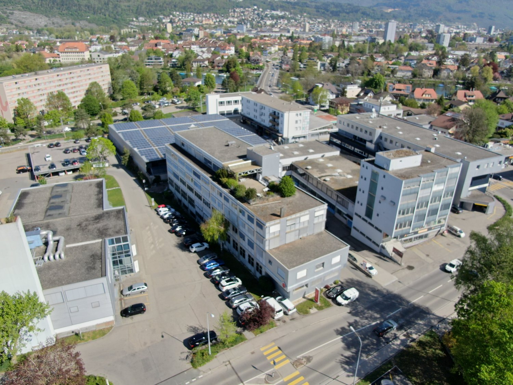
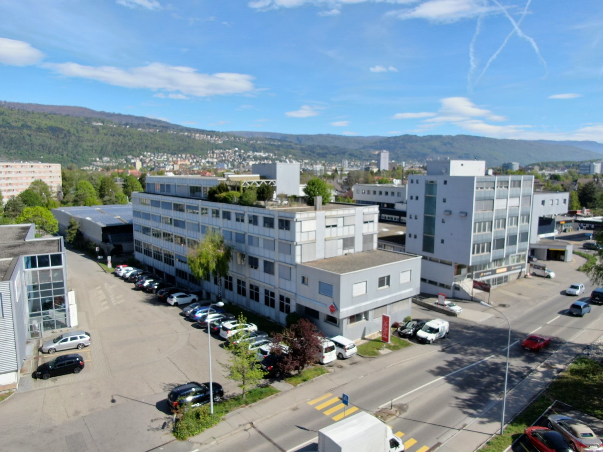
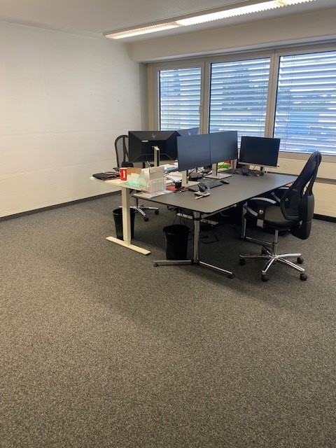
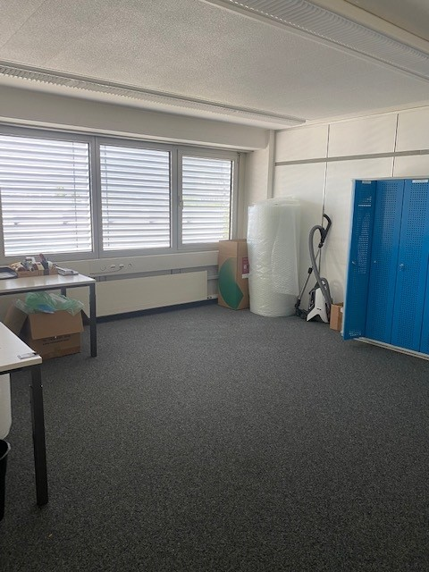
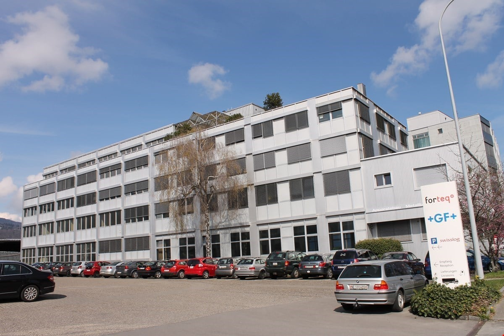

# Ipsachstrasse 10, 2560 Nidau - CHF 120

> **Categorie:** `B_buero_gewerbe`  
> **Regiune:** Cantonul Berna  
> **Tip ofertă:** RENT / COMMERCIAL  
> **Relevant pentru praxis:** da (praxis)  
> **Sursă:** [flatfox.ch](https://flatfox.ch/de/wohnung/ipsachstrasse-10-2560-nidau/1397585/)  
> **Descărcat:** 2026-08-17 12:38

## Date obiect

| Câmp | Valoare |
|---|---|
| Adresă | Ipsachstrasse 10, 2560 Nidau |
| Categorie obiect | INDUSTRY |
| Tip obiect | COMMERCIAL |
| Chirie brută | CHF 120 |
| Preț afișat | CHF 120 |
| Suprafață utilă | 505 m² |
| Etaj | 2 |
| Disponibil de la | imm |
| Referință | __isx275310..is24-6535191 |

## Texte originale (germană)

**Titlu public:** Ipsachstrasse 10, 2560 Nidau - CHF 120

**Titlu scurt:** 505m² Gewerbe

**Pitch:** 505m² Gewerbe in Nidau mieten

**Titlu descriere:** Optimale Büroräumlichkeiten an idealer Lage in Nidau

**Titlu chirie:** 505m² Gewerbe in Nidau mieten

**Spațiu afișat:** 505

### Descriere completă

**_Optimale Büroräume mit Zukunft_ ** Sie suchen geeignete Räumlichkeiten für eine Praxis oder einen Schulungsraum oder suchen hohe, helle Räume für Ihr neues Büro. Das Gebäude an der Ipsachstrasse 10 in Nidau ist vielseitig nutzbar. **Gewerberäumlichkeiten bis total ca. 505m2 (es besteht die Möglichkeit die Räumlichkeit aufzuteilen, die Wände zu verschieben oder anders aufzuteilen)**

**Aktuell noch zu vermieten:**

Büro im 2. OG ca. 100m2 

Büro im 2. OG ca. 4x25m2 

Büro im 2. OG ca. 3x20m2 

Büro im 3. OG ca. 2x33m2 

Büro im 3. OG ca. 176m2 

**Preis: CHF 100.00 + NK/m2/mtl.**

**Parkplätze können dazugemietet werden. Die Liegenschaft befindet sich in der Gemeinde Nidau, direkt an den Verbindungsstrassen Ipsach-Port und Nidau-Bellmund. Nidau, ein 6''863 Einwohner zählendes mittelalterliches Städtchen, liegt direkt am Bielsee. Die Gemeinde grenzt an die zweisprachige Stadt Biel-Bienne (50''000 Einwohner), welche mit den öffentlichen Verkersmitteln, sowie mit dem Auto in wenigen Minuten bequem erreichbar ist. Von der Liegenschaft ist man in nur 3-5 Autominuten bei der Autobahnauffahrt nach Bern. Auch Zürich, Basel und die Romandie sind via Biel per Autobahn einfach erreichbar.**

## Ofertant

- **Nume:** PS Immobilien AG
- **Stradă:** Paul-Emile-Brandt-Strasse 2
- **NPA:** 2502
- **Localitate:** Biel

## Imagini (5)

*`01.jpg` — 1500x1125 px — Multi-story commercial building with solar panels on the roof, surrounded by a parking lot and located in an urban area with other buildings and greenery visible in the background.*

*`02.jpg` — 1500x1125 px — Multi-story office building with a parking lot in the foreground, surrounded by other buildings and a hilly, forested landscape in the background.*

*`03.jpg` — 480x640 px — The image shows an office space with multiple desks, computers, and office chairs. The room has large windows and appears to be on a raised ground floor.*

*`04.jpg` — 480x640 px — The image shows an office space with a desk, shelves, and lockers. The room has large windows with blinds, and the floor is covered in dark gray carpeting.*

*`05.jpg` — 1200x800 px — Multi-story office building with a large parking lot in front, located in an urban area with a blue sky and some clouds in the background.*
