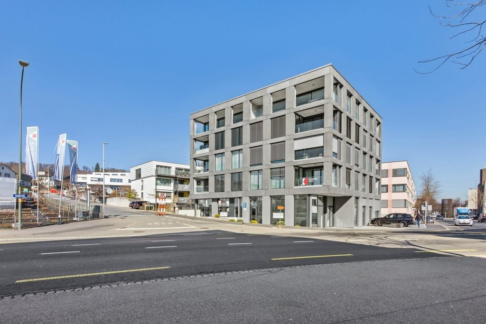
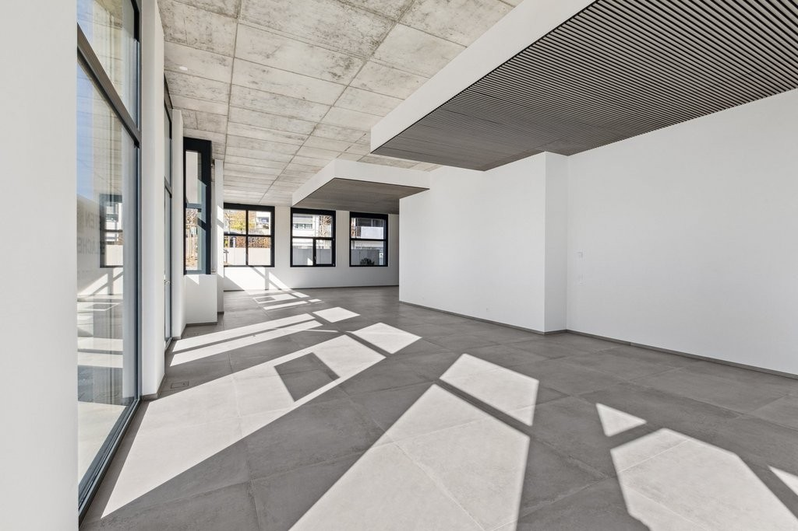
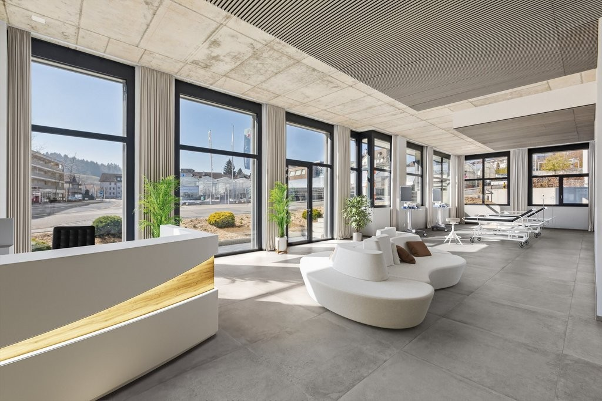
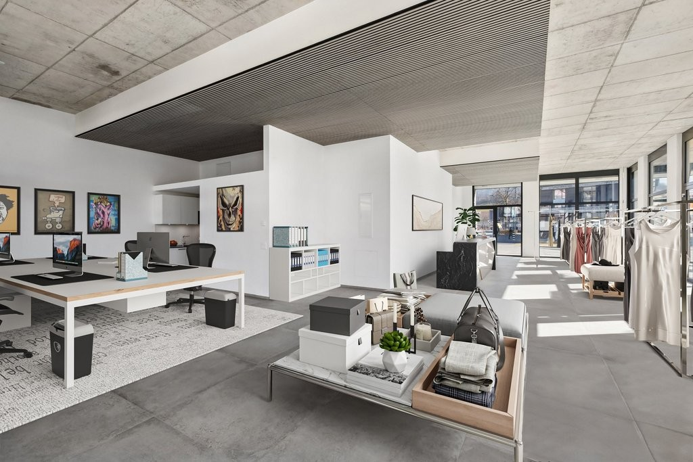
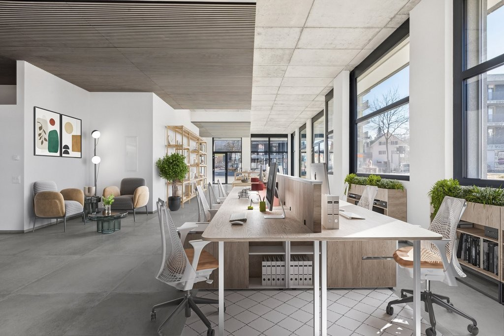
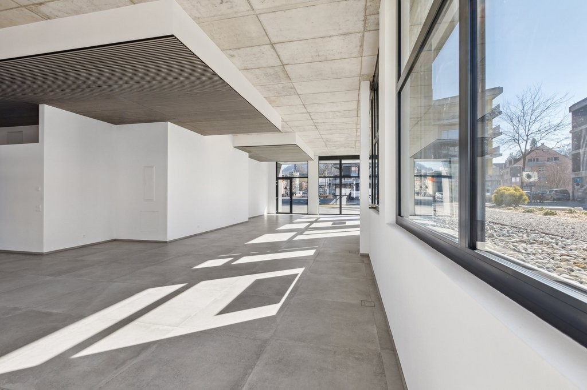
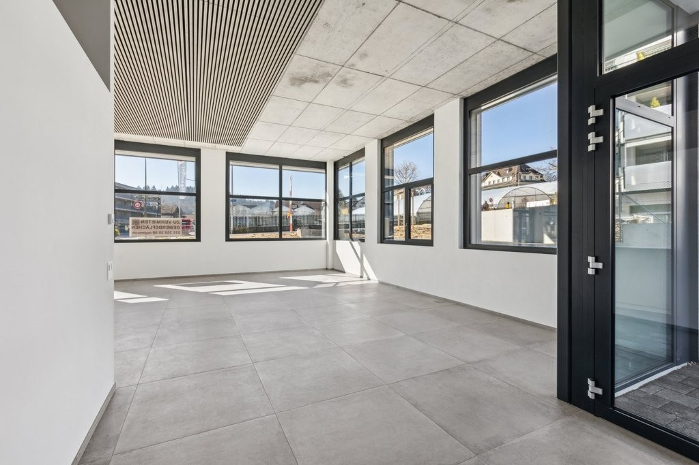
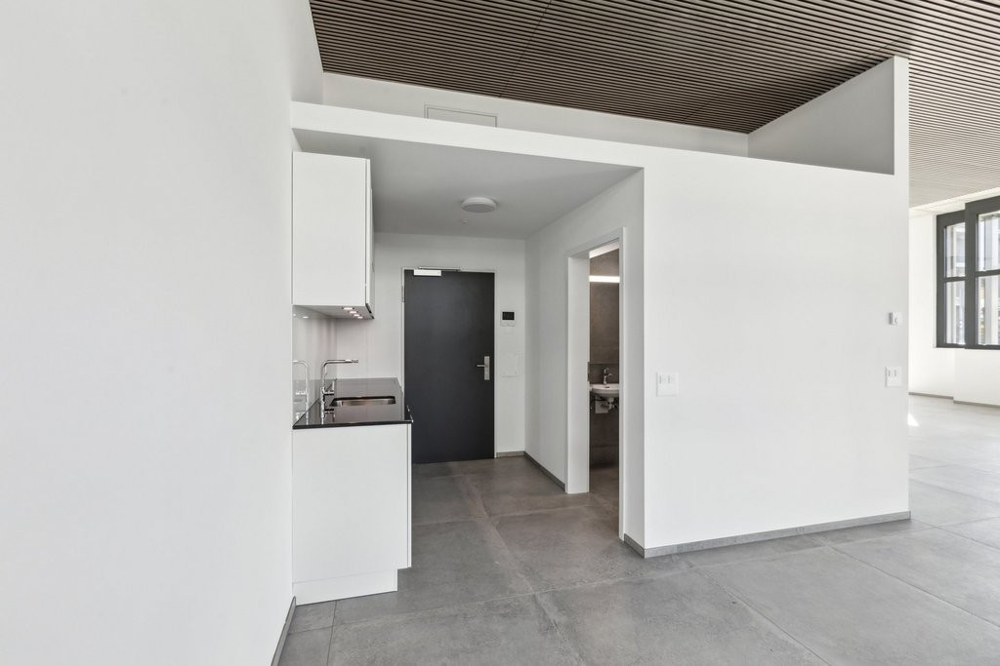
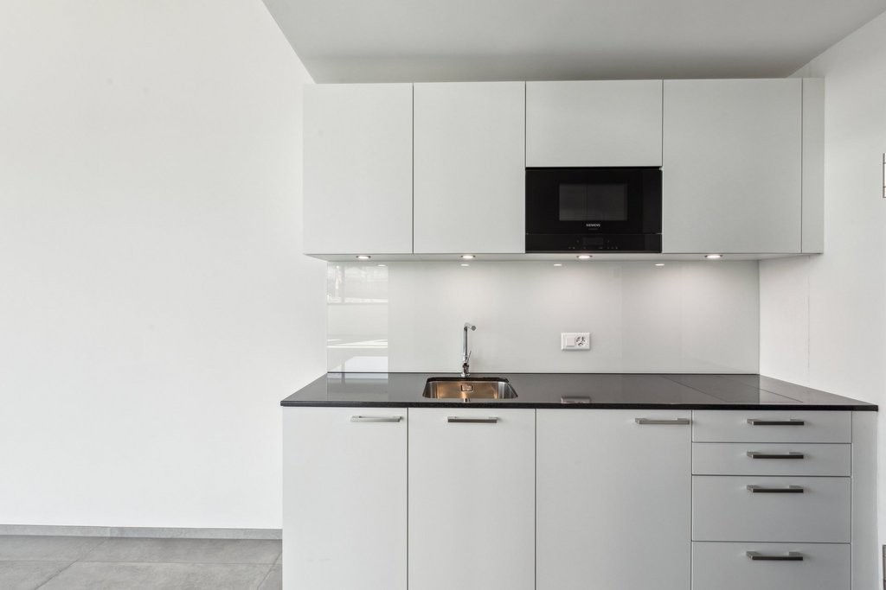
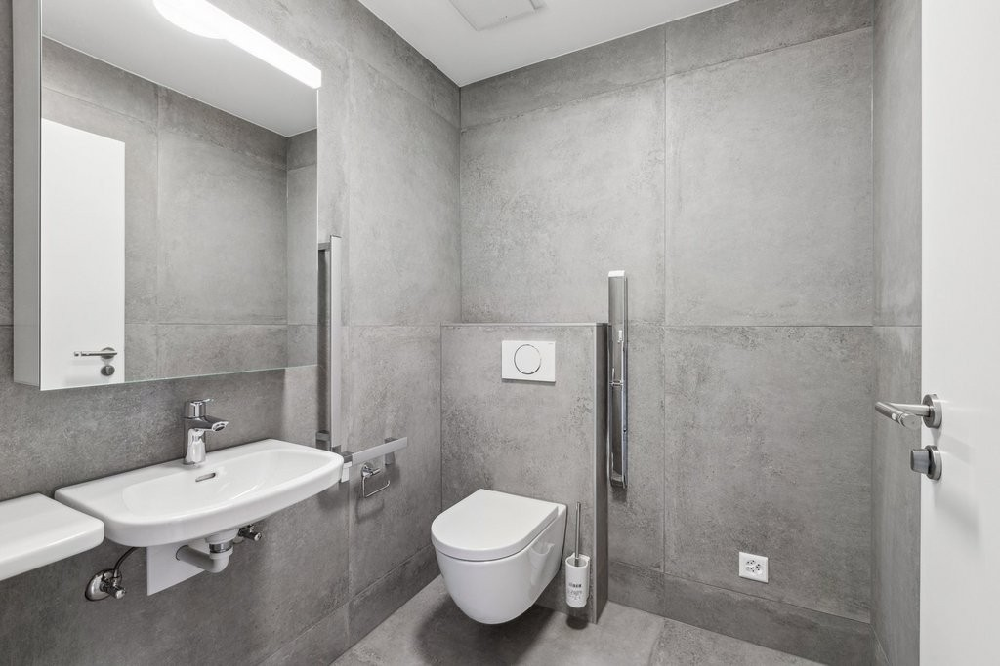

# Landorfstrasse 12, 3098 Köniz - auf Anfrage

> **Categorie:** `B_buero_gewerbe`  
> **Regiune:** Cantonul Berna  
> **Tip ofertă:** RENT / COMMERCIAL  
> **Relevant pentru praxis:** da (praxen)  
> **Sursă:** [flatfox.ch](https://flatfox.ch/de/wohnung/landorfstrasse-12-3098-koniz/1401053/)  
> **Descărcat:** 2026-08-17 12:28

## Date obiect

| Câmp | Valoare |
|---|---|
| Adresă | Landorfstrasse 12, 3098 Köniz |
| Categorie obiect | INDUSTRY |
| Tip obiect | COMMERCIAL |
| Suprafață utilă | 144 m² |
| Etaj | 0 |
| Disponibil de la | agr |
| Referință | 21360.01.6002 |

## Texte originale (germană)

**Titlu public:** Landorfstrasse 12, 3098 Köniz - auf Anfrage

**Titlu scurt:** 144m² Gewerbe

**Pitch:** 144m² Gewerbe in Köniz mieten

**Titlu descriere:** Attraktive Gewerbefläche (Kita, Arztpraxen, Physio, Verkauf, Büro)

**Titlu chirie:** 144m² Gewerbe in Köniz mieten

**Spațiu afișat:** 144

### Descriere completă

Zentral gelegen in Köniz bietet Ihnen diese 143m2 Gewerbefläche die Möglichkeit, Ihre individuellen Geschäftsideen umzusetzen. Die Liegenschaft befindet sich an verkehrstechnisch vorteilhafter Lage und ist einfach über den Autobahnanschluss Bern-Niederwangen oder die Bushaltestelle Köniz Weiermatt zu erreichen.   
  
Die Gewerbe- und Dienstleistungsfläche ist hochwertig ausgebaut. Das beinhaltet fertige Boden- und Wandbeläge (Keramikplatten), fertig ausgebaute Toilettenanlage, eine Teeküche mit Mikrowelle sowie die Elektrogrundinstallation (Bodensteckdosen und Strom bis in den Objektverteilerkasten geführt). Auch die Senkrecht-Stoffmarkisen für die Beschattung der raumhohen Fenster sind bauseits bereits vorhanden.   
  
**Gut fürs Geschäft:**   
\- flexible Nutzungsmöglichkeiten   
\- direkter Zugang von aussen   
\- vorhandener Wandbelag   
\- vorhandene elektrische Installationen   
\- Toilettenanlagen   
\- grosse Fensterfronten   
\- auf Wunsch Einstellplatz für CHF 140.00 pro Monat   
  
**Ihre Vorteile mit Regimo Business:**   
1\. Individuelle Mietpreis- und Vertragsmodelle   
2\. Beratung und Unterstützung bei der Umbau- und Einrichtungsplanung durch ausgewiesene Spezialisten.   
3\. Persönliche Betreuung und hohe Flexibilität im Hinblick auf Mieterwünsche während der gesamten Vertragsdauer.   
  
Haben wir Ihr Interesse geweckt? Dann zögern Sie nicht und kontaktieren Sie uns, um einen individuellen Besichtigungstermin zu vereinbaren.

## Dotări (attributes)

- lift
- accessiblewithwheelchair

## Ofertant

- **Nume:** Regimo Bern
- **Stradă:** Thunstrasse 32
- **NPA:** 3005
- **Localitate:** Bern

## Imagini (10)

*`01.jpg` — 1024x683 px — Gebäude*

*`02.jpg` — 1024x683 px — Gewerbefläche*

*`03.jpg` — 1024x683 px — Gewerbefläche Staging*

*`04.jpg` — 1024x683 px — Gewerbefläche Staging*

*`05.jpg` — 1024x683 px — Gewerbefläche Staging*

*`06.jpg` — 1024x683 px — Gewerbefläche*

*`07.jpg` — 1024x683 px — Gewerbefläche*

*`08.jpg` — 1024x683 px — Teeküche und Nasszelle*

*`09.jpg` — 1024x683 px — Teeküche*

*`10.jpg` — 1024x683 px — Nasszelle WC*
