# Limmatquai 4, 8001 Zürich - CHF 2’990

> **Categorie:** `B_buero_gewerbe`  
> **Regiune:** Elveția — altă regiune  
> **Tip ofertă:** RENT / OFFICE  
> **Relevant pentru praxis:** da (apotheke)  
> **Sursă:** [flatfox.ch](https://flatfox.ch/de/wohnung/limmatquai-4-8001-zurich/1411640/)  
> **Descărcat:** 2026-08-17 12:36

## Date obiect

| Câmp | Valoare |
|---|---|
| Adresă | Limmatquai 4, 8001 Zürich |
| Categorie obiect | INDUSTRY |
| Tip obiect | OFFICE |
| Chirie brută | CHF 2'990 |
| Preț afișat | CHF 2'990 |
| Suprafață utilă | 15 m² |
| Suprafață teren | 15 m² |
| Etaj | 4 |
| An construcție | 1907 |
| An renovare | 2023 |
| Disponibil de la | imm |
| Referință | ..lpt3q.q8ree |

## Texte originale (germană)

**Titlu public:** Limmatquai 4, 8001 Zürich - CHF 2’990

**Titlu scurt:** 15m² Büro

**Pitch:** 15m² Büro in Zürich mieten

**Titlu descriere:** Einzelbüro mit Service in Zürich direkt am Bellevueplatz

**Titlu chirie:** 15m² Büro in Zürich mieten

**Spațiu afișat:** 15

### Descriere completă

Erhalten Sie Zugang zu einem modernen Privatbüro und eleganten Konferenzräumen und einer Dachterrasse mit Blick auf den Zürichsee. Dieses Angebot umfasst 15m² möblierte Bürofläche mit Platz für einen Arbeitsplatzes sowie 250 m² grosszügige Gemeinschaftsflächen – darunter stilvolle Besprechungsräume, ein Bistro, eine Empfangsarea und eine Dachterrasse mit atemberaubendem Blick über die Altstadt, die Oper und den Zürichsee. Alle angegebenen Preise sind Startpreise und können je nach Auswahl und enthaltenen Dienstleistungen variieren. 

Das historische Gebäude „Zürcherhof“ wurde in einer der besten Lagen am Bellevueplatz Zürich zu einem modernen Geschäftshaus umgebaut. Bei der Kernsanierung wurde besonderer Wert auf Nachhaltigkeit, smarte Infrastruktur und Design gelegt, wobei auch der Heimatschutz berücksichtigt wurde. Das Ergebnis sind elegante Büros, hochwertige Meeting- und Sitzungsräume sowie flexible Coworking-Arbeitsplätze, die sowohl hybrides als auch konzentriertes Arbeiten ideal unterstützen. 

Dank der ausgezeichneten Verkehrsanbindung, mit Tram-Stationen am Bellevue und dem Bahnhof Stadelhofen, erreichen Sie sowohl den Hauptbahnhof als auch den Flughafen in nur 2 bis 8 Minuten. 

Verleihen Sie Ihrem Unternehmen ein Zuhause im Zürcherhof mit einem privaten Büro von 15m², ideal für eine Person. Unsere großsszügigen und voll ausgestatteten Büros bieten Ihnen alles, was Sie brauchen – von modernen Möbeln bis hin zu superschnellem WLAN – damit Sie sich voll und ganz auf den Erfolg Ihres Unternehmens konzentrieren können. Ob für einen Tag oder langfristig: Unsere flexiblen Büroflächen passen sich ganz nach den individuellen Bedürfnissen Ihres Unternehmens an. 

Die Vorteile eines privaten Büros bei Satellite Office: 

  * Top-Lage im Herzen von Zürich 

  * Ein mehrsprachiges, hochqualifiziertes Team sorgt für professionellen Empfang, Büroassistenz sowie die Planung und Durchführung von Meetings und Events 

  * 28 exklusive Büros, in denen Design und Funktionalität perfekt miteinander harmonieren: höhenverstellbare Schreibtische, ergonomische Stühle, mobile Apothekerschränke und Caddys 

  * Eine elegante Kaminlounge und 5 hochmoderne Konferenzräume 

  * State-of-the-Art Konferenztechnik mit intelligenten 4K-Videokonferenzsystemen 

  * High-Speed-Internetzugang 

Entscheiden Sie sich für ein Büro, das Ihre Arbeitsweise perfekt unterstützt!

## Dotări (attributes)

- balconygarden
- accessiblewithwheelchair
- view
- lift
- petsallowed

## Ofertant

- **Nume:** Satellite Office
- **Stradă:** Limmatquai 4
- **NPA:** 8001
- **Localitate:** Zürich

## Imagini (12)

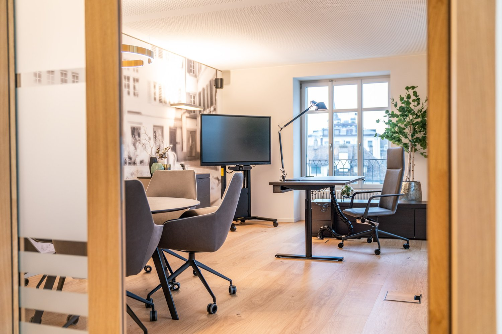
*`01.jpg` — 1500x1000 px*

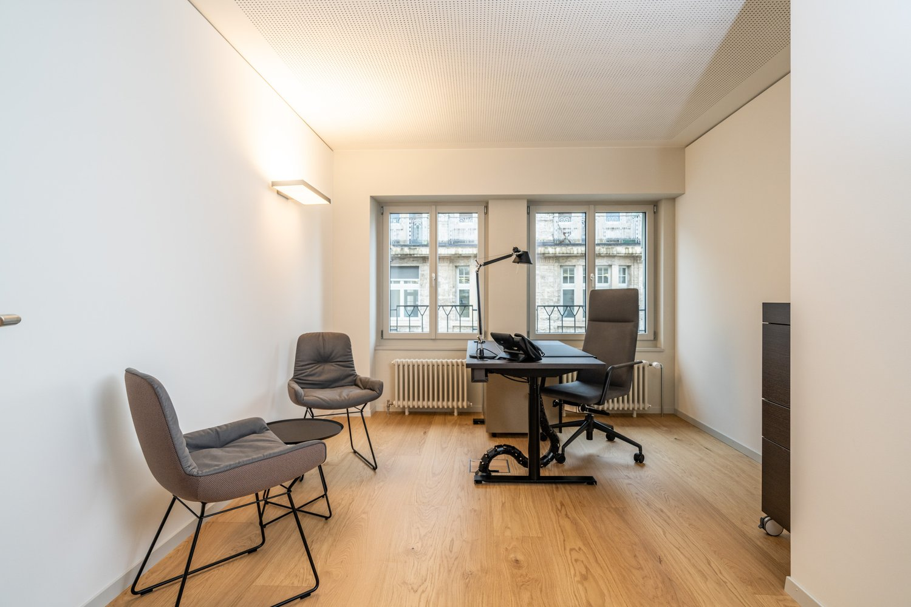
*`02.jpg` — 1500x1000 px*

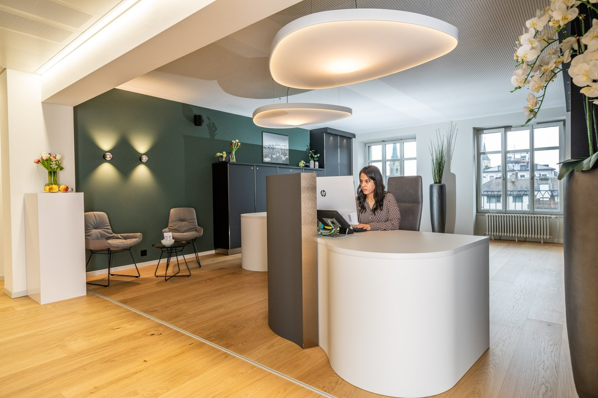
*`03.jpg` — 1500x1000 px*

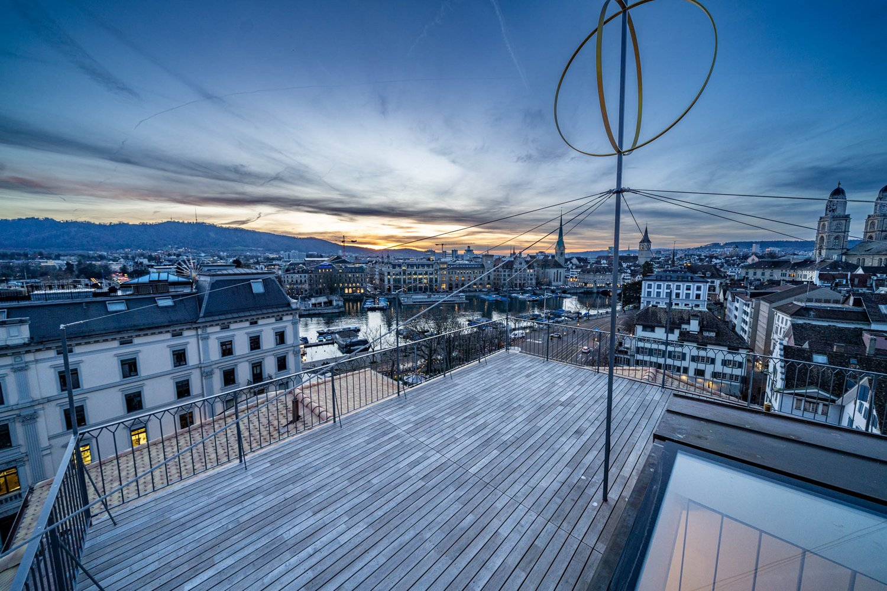
*`04.jpg` — 1500x1000 px*

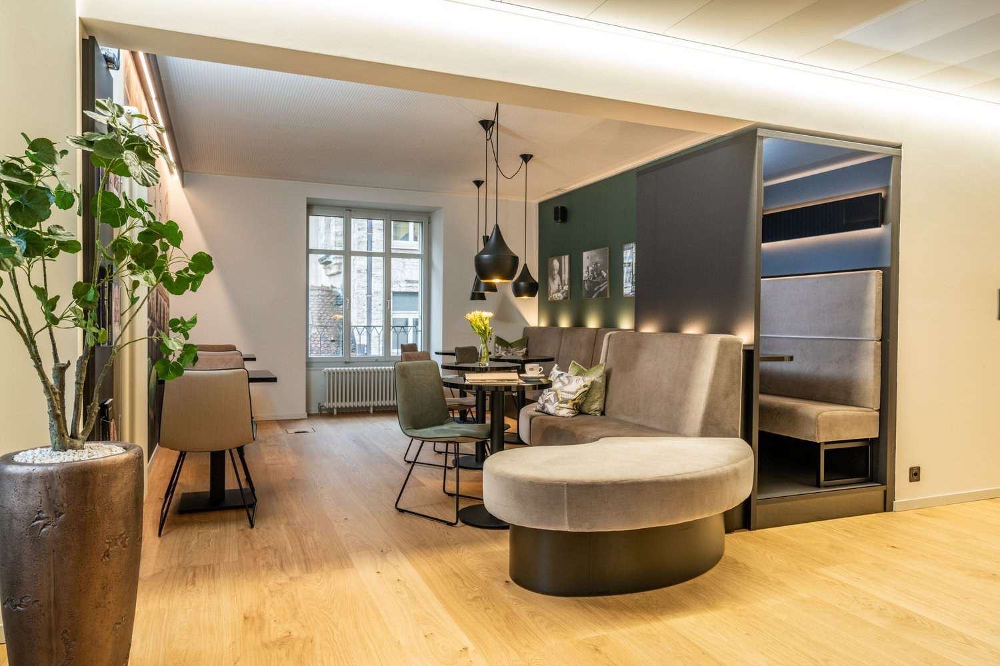
*`05.jpg` — 1500x1000 px*

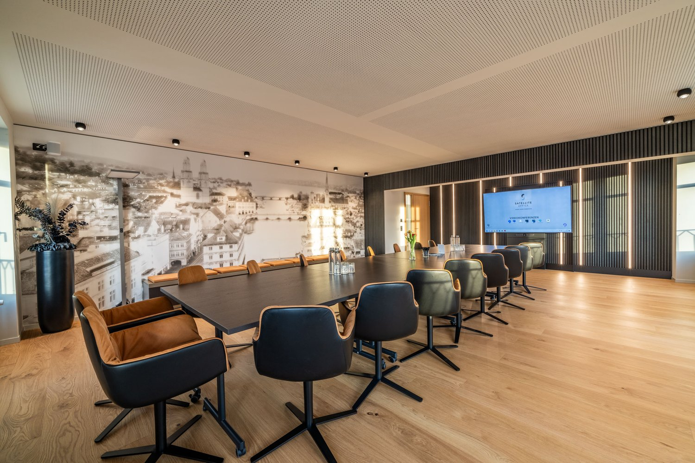
*`06.jpg` — 1500x1000 px*

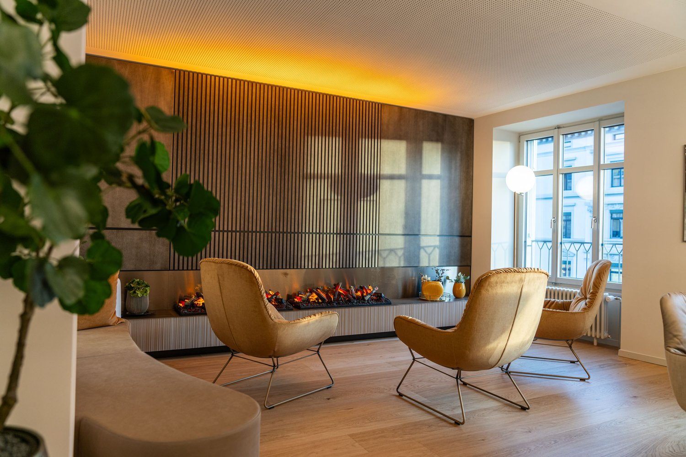
*`07.jpg` — 1500x1000 px*

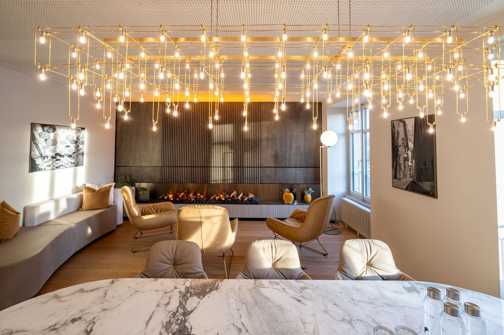
*`08.jpg` — 1500x1000 px*

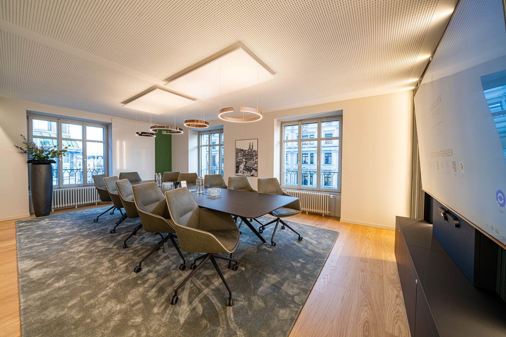
*`09.jpg` — 1500x1000 px*

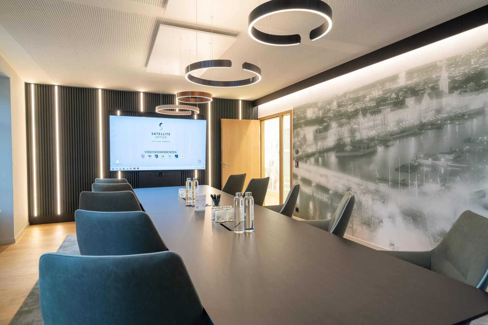
*`10.jpg` — 1500x1000 px*

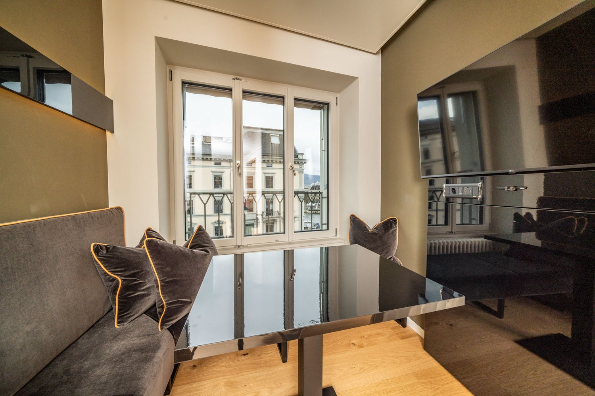
*`11.jpg` — 1500x1000 px*

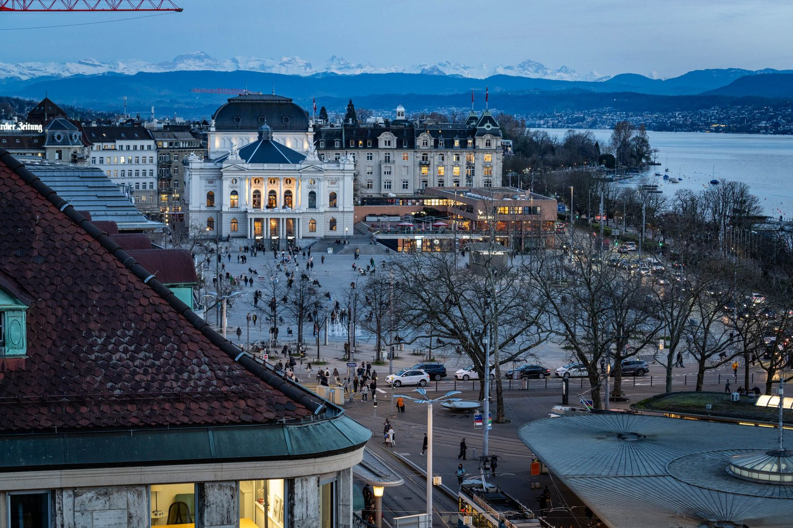
*`12.jpg` — 1500x1000 px*

## Media suplimentară

- **tour_url:** https://my.matterport.com/show/?m=qbw7bJuJky9
- **website_url:** https://www.satelliteoffice.ch/buero-mieten/zuerich/
