# 3662 Seftigen - auf Anfrage

> **Categorie:** `B_buero_gewerbe`  
> **Regiune:** Cantonul Berna  
> **Tip ofertă:** RENT / RESTAURANT  
> **Relevant pentru praxis:** da (arztpraxis, medizinisch, praxen)  
> **Sursă:** [flatfox.ch](https://flatfox.ch/de/wohnung/3662-seftigen/1419702/)  
> **Descărcat:** 2026-08-17 12:30

## Date obiect

| Câmp | Valoare |
|---|---|
| Adresă | 3662 Seftigen |
| Categorie obiect | GASTRO |
| Tip obiect | RESTAURANT |
| Disponibil de la | agr |
| Referință | ..dwbsw.wzcpd |

## Texte originale (germană)

**Titlu public:** 3662 Seftigen - auf Anfrage

**Titlu scurt:** Restaurant

**Pitch:** Restaurant in Seftigen mieten

**Titlu descriere:** Entdecke eine gastronomische Chance in Seftigen

**Titlu chirie:** Restaurant in Seftigen mieten

### Descriere completă

**Restaurant Bijou oder Gewerbe – Ihre Chance in Seftigen**

Nach Vereinbarung steht Ihnen das charmante Restaurant Bijou in Seftigen zur Verfügung, das auch ideal als vielseitige Gewerbefläche für medizinische Praxen, Büros oder andere Dienstleistungen genutzt werden kann. 

**Highlights der Liegenschaft:**

· Beste Lage & Erreichbarkeit: Direkt am Bahnhof gelegen und bahnseitig ebenerdig zugänglich und gut frequentiert. 

· Komfortable Parksituation: 9 Aussenparkplätze für Besucher stehen zur Verfügung. 

· Flexibel vielseitige Nutzung: Ideal für Gastronomie, aber ebenso bestens geeignet für alternative Konzepte wie eine Arztpraxis, Therapie- oder Dienstleistungsbetriebe. 

**Gebäudeaufteilung:**

· Untergeschoss: Luftschutzkeller mit vielseitiger Nutzung als Lagerfläche sowie eine Waschküche zur Mitbenutzung und Gästetoiletten. 

· Erdgeschoss: Wintergarten mit 24 Sitzplätzen, gemütliche Gaststube mit 55 Sitzplätzen, Backoffice sowie eine gut ausgestattete Küche. Ergänzt wird das Angebot durch zwei grosszügige Terrasse mit gesamthaft 68 Sitzplätzen. Zudem ist das gesamte Erdgeschoss vollständig rollstuhlgängig. 

**Kontakt:**

immobilien@gastroconsult.ch 

Die Liegenschaft bietet ideale Voraussetzungen für gastronomische Konzepte und ermöglicht zugleich die Etablierung eines vielseitigen Betriebs an stark frequentierter, zentraler Lage. Die flexible Raumaufteilung sowie die gut ausgebaute Infrastruktur schaffen dabei breite Nutzungsmöglichkeiten.

## Dotări (attributes)

- accessiblewithwheelchair
- parkingspace

## Ofertant

- **Nume:** Gastroconsult AG
- **Stradă:** Weltpoststrasse 5
- **NPA:** 3015
- **Localitate:** Bern

## Imagini (12)

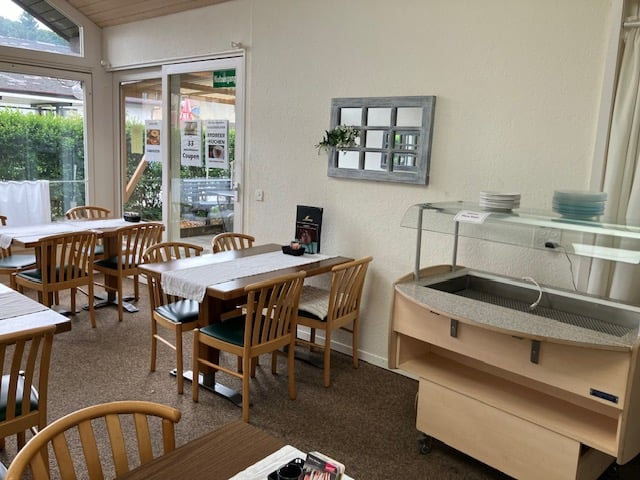
*`01.jpg` — 640x480 px*

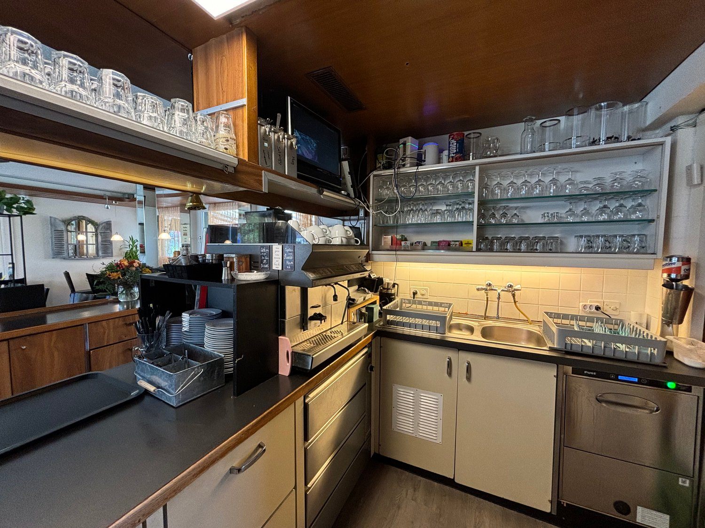
*`02.jpg` — 1500x1125 px*

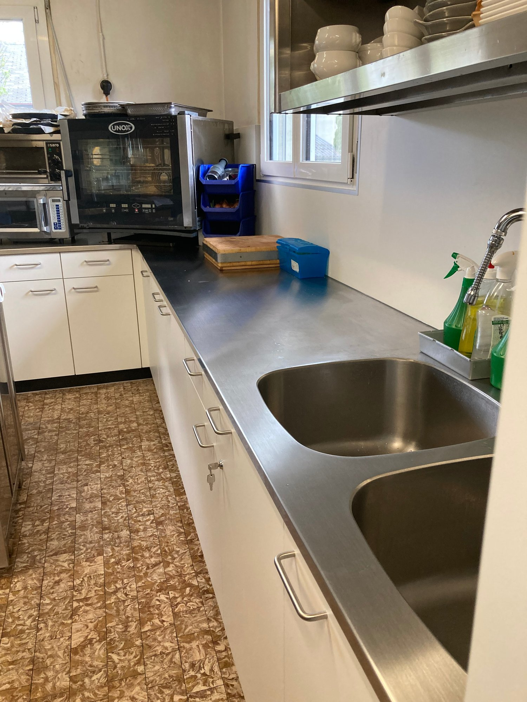
*`03.jpg` — 1500x2000 px*

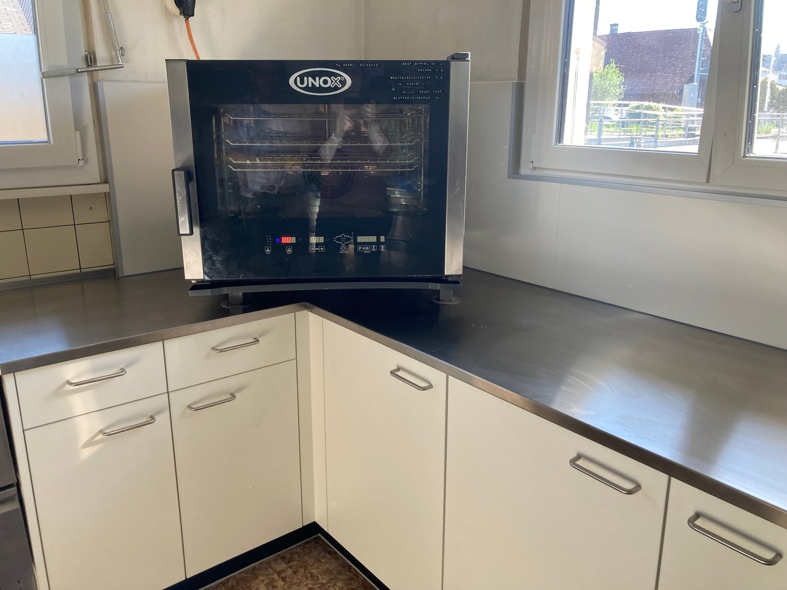
*`04.jpg` — 1500x1125 px*

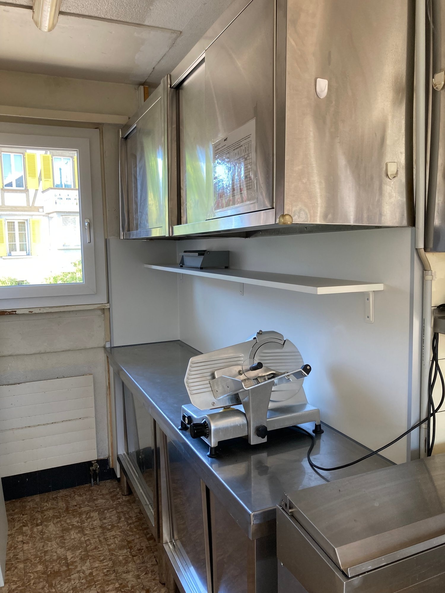
*`05.jpg` — 1500x2000 px*

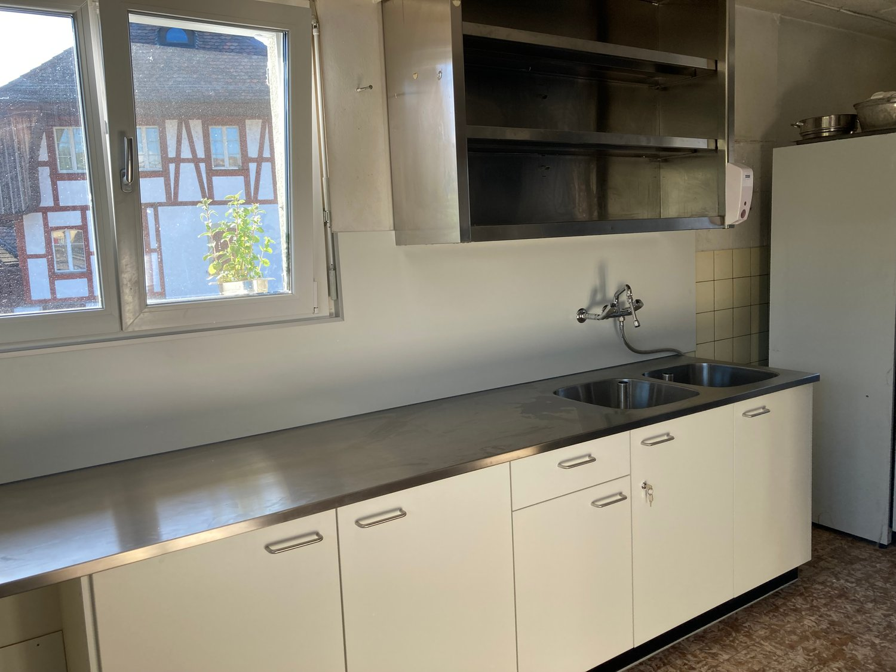
*`06.jpg` — 1500x1125 px*

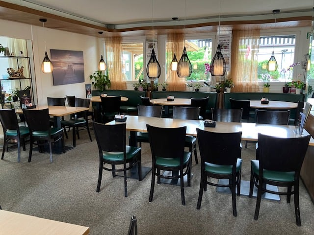
*`07.jpg` — 640x480 px*

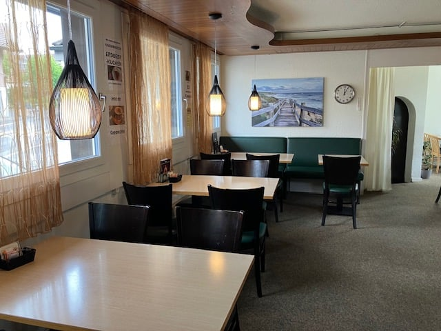
*`08.jpg` — 640x480 px*

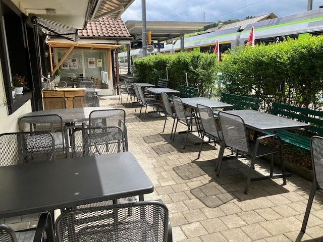
*`09.jpg` — 640x480 px*

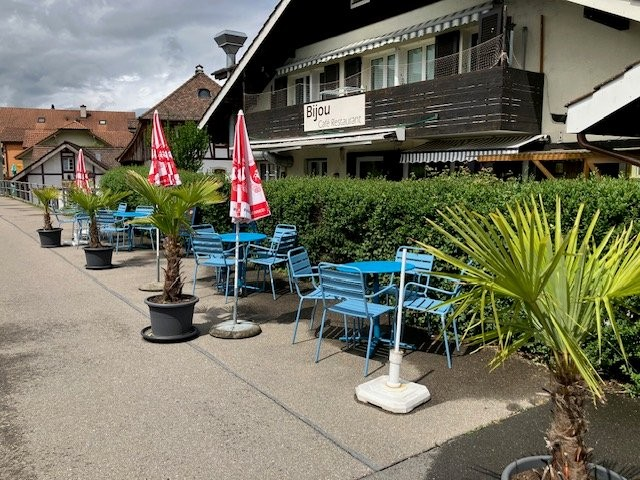
*`10.jpg` — 640x480 px*

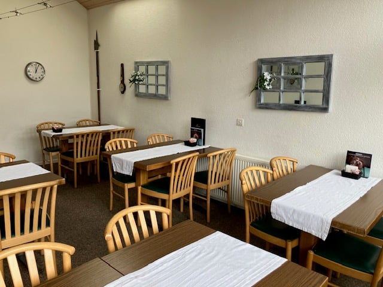
*`11.jpg` — 640x480 px*

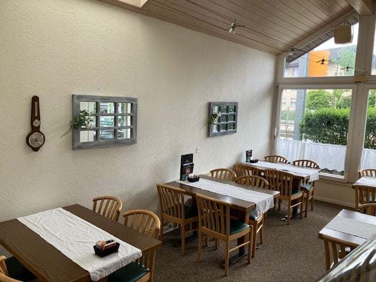
*`12.jpg` — 640x480 px*

## Media suplimentară

- **website_url:** https://www.gastroconsult.ch/de/page/Immobilien/Restaurant-Bijou-oder-Gewerbe-in-Seftigen-93749
