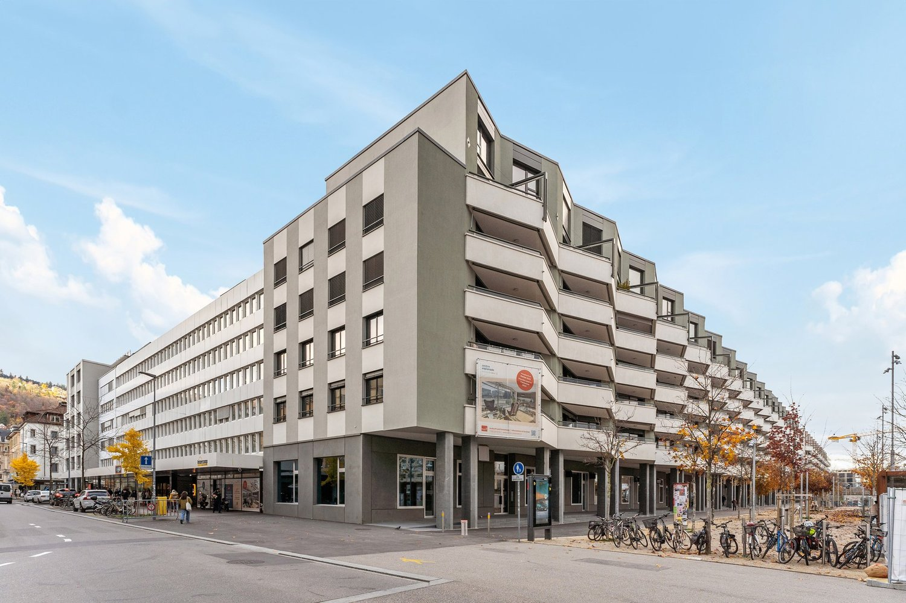
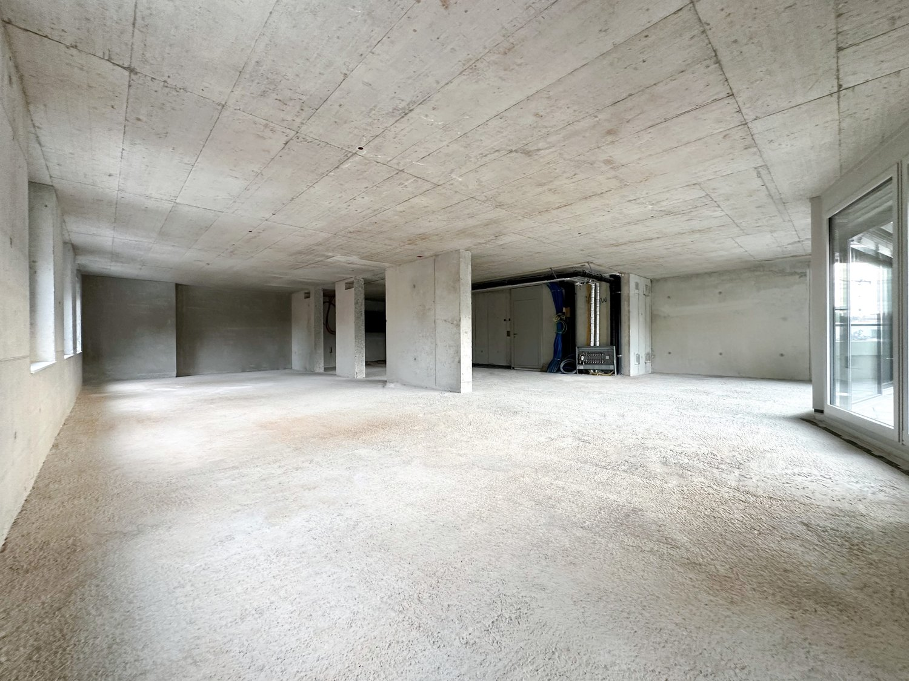
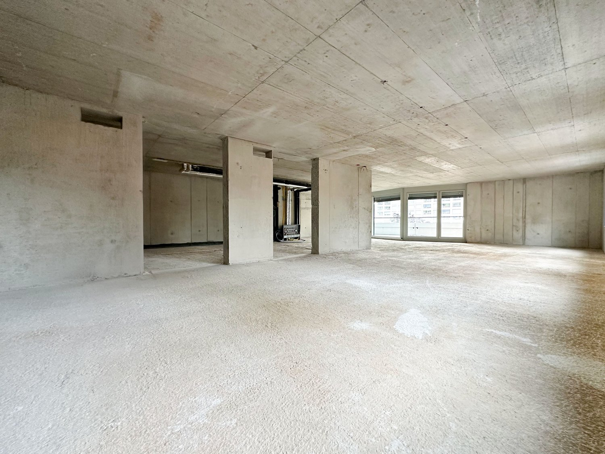
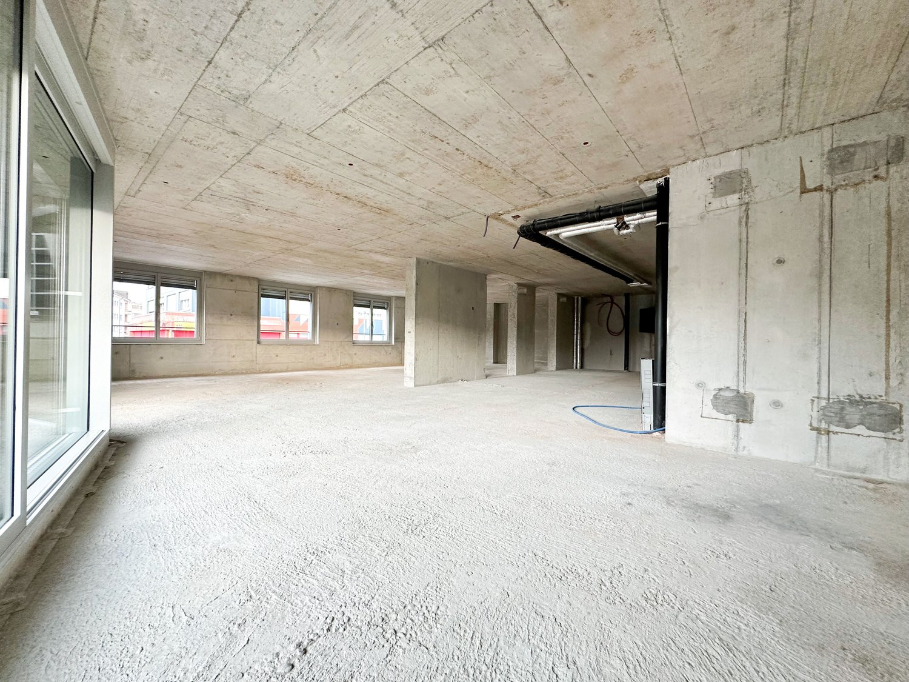
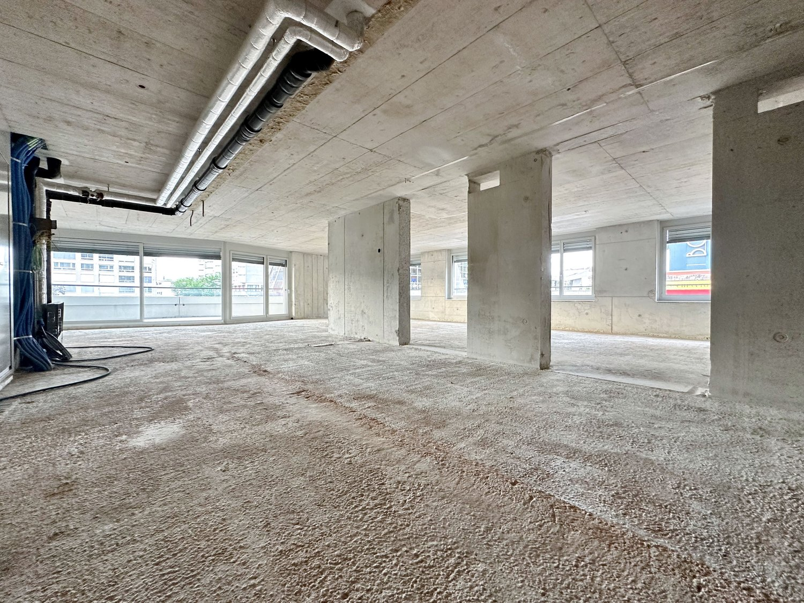
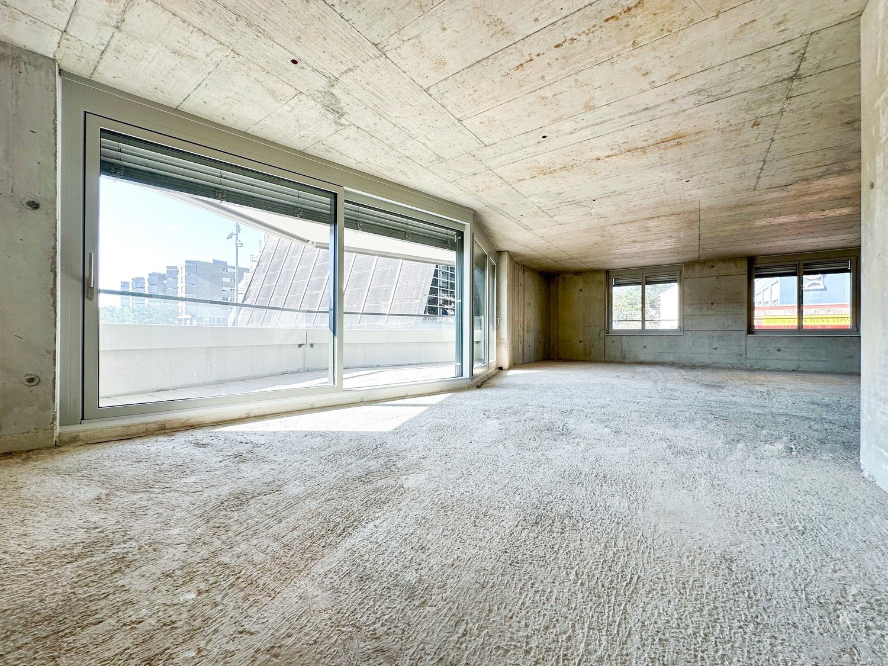
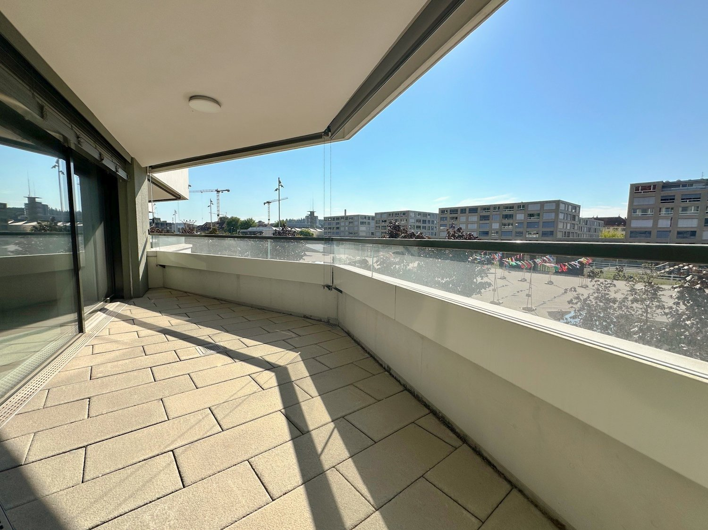
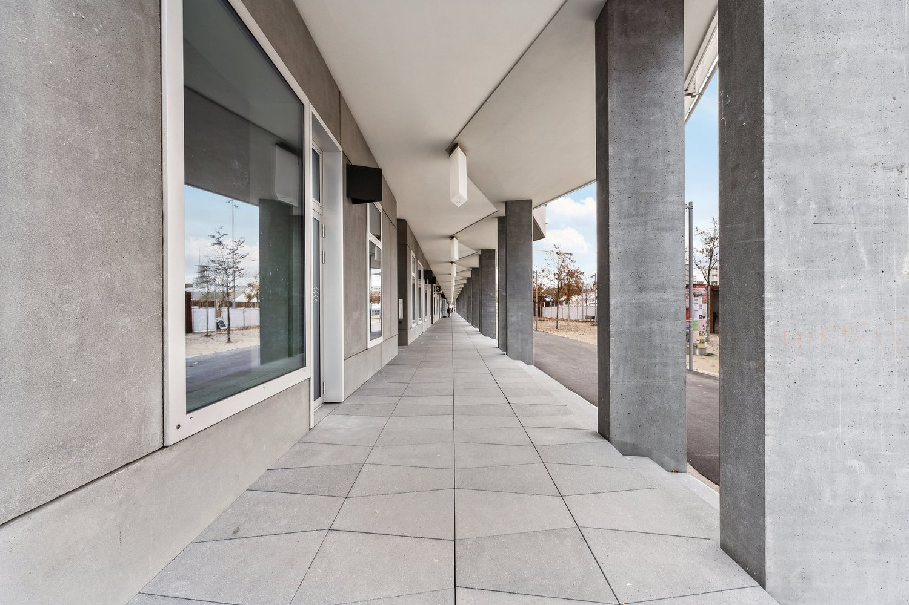
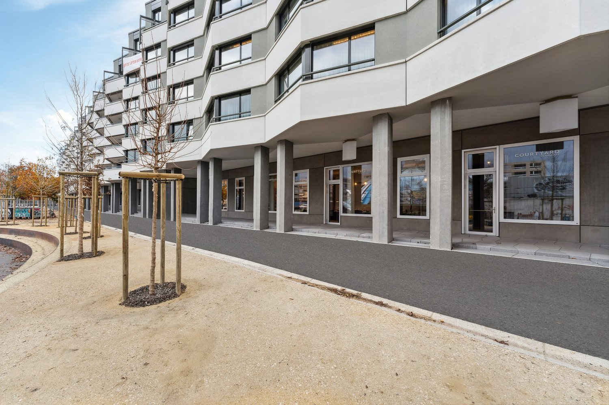
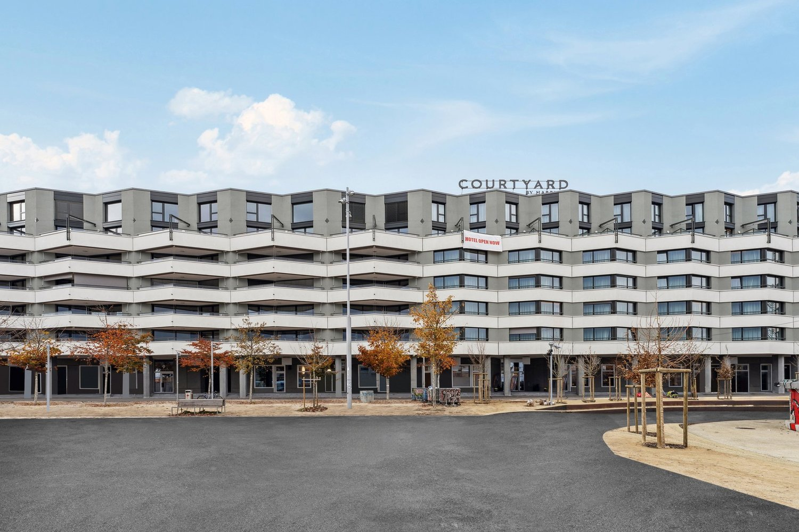

# Esplanade-Kongresshaus 1, 2501 Biel/Bienne - CHF 200

> **Categorie:** `B_buero_gewerbe`  
> **Regiune:** Cantonul Berna  
> **Tip ofertă:** RENT / OFFICE  
> **Sursă:** [flatfox.ch](https://flatfox.ch/de/wohnung/esplanade-kongresshaus-1-2501-bielbienne/1424204/)  
> **Descărcat:** 2026-08-17 12:33

## Date obiect

| Câmp | Valoare |
|---|---|
| Adresă | Esplanade-Kongresshaus 1, 2501 Biel/Bienne |
| Categorie obiect | INDUSTRY |
| Tip obiect | OFFICE |
| Chirie netă | CHF 200 |
| Chirie brută | CHF 200 |
| Preț afișat | CHF 200 |
| Suprafață utilă | 140 m² |
| Etaj | 1 |
| An construcție | 2022 |
| Disponibil de la | imm |
| Referință | 2801.1.1101 |

## Texte originale (germană)

**Titlu public:** Esplanade-Kongresshaus 1, 2501 Biel/Bienne - CHF 200

**Titlu scurt:** 140m² Büro

**Pitch:** 140m² Büro in Biel/Bienne mieten

**Titlu descriere:** An der Esplanade: Bürofläche mit Balkon und Ausblick

**Titlu chirie:** 140m² Büro in Biel/Bienne mieten

**Spațiu afișat:** 140

### Descriere completă

Diese Bürofläche mit 140 m² im ersten Obergeschoss befindet sich derzeit im Rohbau. Bei Bedarf kann diese Bürofläche mit der angrenzenden Bürofläche mit 113 m² zu einer Fläche von 253 m² erweitert werden. Ist Ihnen die Fläche mit 140 m² jedoch zu gross, kann die Räumlichkeit mit 113 m² auch einzeln gemietet werden.   
  
Im Zentrum der lebendigen Stadt Biel, unmittelbar zur Begegnungszone Kongresshaus Esplanade ist das Centre Esplanade entstanden. Das Areal bietet attraktive Wohneinheiten, ein internationales Businesshotel sowie ansprechende Büro- und Gewerbeflächen, die an die eigene Tiefgarage erschlossen sind. Für Kunden steht das öffentliche Parkhaus des Kongresshauses zur Verfügung, welches ebenfalls mit unserem Komplex verbunden ist.   
  
Profitieren Sie von der idealen Lage unserer Liegenschaft. Die Bushaltestellen sind in weniger als 5 Minuten zu Fuss erreichbar, den Bahnhof Biel erreichen Sie in rund 10 Gehminuten. Der naheliegende Autobahnanschluss bietet eine optimale Ausgangslage für Ihr Unternehmen.   
  
Weitere Informationen zum Areal und unserem Flächenangebot liefert Ihnen die Homepage Centre Esplanade.   
  
Unser erfahrenes Team unterstützt Sie, gemeinsam mit unseren externen Partnern für Planung und Bau, bei der Realisierung Ihrer Vorstellungen.   
  
Alpine ist ein familiengeführtes Immobilienunternehmen mit Sitz in Zürich und Berlin. Als Bestandshalter sind wir spezialisiert auf Büro- und Geschäftshäuser im Umfeld internationaler Flughäfen. Von der Entwicklung über die Vermietung bis zur Bewirtschaftung von Immobilien bietet Alpine alle Dienstleistungen aus einer Hand an.   
  
Kontaktieren Sie uns und überzeugen Sie sich von unserem Angebot.   
*************************   
Cette surface de bureau de 140 m² au premier étage est actuellement en construction brute. En cas de demande, cette surface de bureau peut être agrandie avec la surface de bureau adjacente de 113 m² pour atteindre une surface de 253 m². Si la surface de 140 m² est toutefois trop grande pour vous, le local de 113 m² peut également être loué séparément.   
  
Le Centre Esplanade a été réalisé au centre de la ville vivante de Bienne, à proximité immédiate de la zone de rencontre Palais des Congrès Esplanade. Le complexe offre des appartements attrayants, un hôtel business international ainsi que des bureaux et des surfaces commerciales agréables, reliés au propre parking souterrain. Les clients peuvent utiliser le parking public du Palais des Congrès.   
  
Profitez de la situation idéale de notre immeuble. Les arrêts de bus se trouvent à moins de 5 minutes à pied et la gare de Bienne est à environ 10 minutes à pied. L'accès à l'autoroute à proximité offre une situation de départ optimale pour votre entreprise.   
  
Pour plus d'informations sur le complexe et notre offre de surfaces, consultez le homepage Centre Esplanade.   
  
Notre team expérimenté vous soutient, en collaboration avec nos partenaires externes pour la réalisation de la planification et de la construction, dans la réalisation de vos idées.   
  
Alpine est une entreprise immobilière familiale basée à Zurich et à Berlin. En tant que gestionnaire de portefeuille, nous sommes spécialisés dans les immeubles de bureaux et de commerces situés à proximité d'aéroports internationaux. Du développement à la gestion immobilière en passant par la location, Alpine propose tous les services d'un seul tenant.   
  
Contactez-nous et laissez-vous convaincre par notre offre.

## Dotări (attributes)

- view
- lift
- balconygarden
- garage

## Ofertant

- **Nume:** Alpine Immobilien AG
- **Stradă:** Sägereistrasse 25
- **NPA:** 8152
- **Localitate:** Glattbrugg

## Imagini (10)

*`01.jpg` — 1500x1000 px*

*`02.jpg` — 1500x1125 px*

*`03.jpg` — 1500x1126 px*

*`04.jpg` — 1500x1125 px*

*`05.jpg` — 1500x1125 px*

*`06.jpg` — 1500x1125 px*

*`07.jpg` — 1500x1124 px*

*`08.jpg` — 1500x1000 px*

*`09.jpg` — 1500x1000 px*

*`10.jpg` — 1500x1000 px*

## Media suplimentară

- **website_url:** https://www.centre-esplanade.ch/gewerbe
