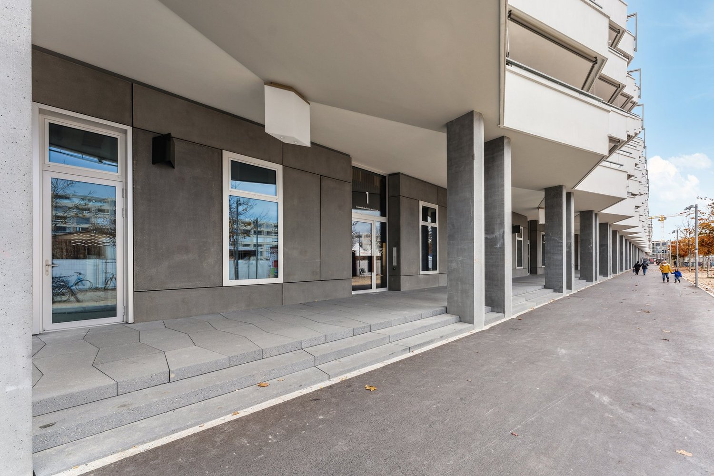
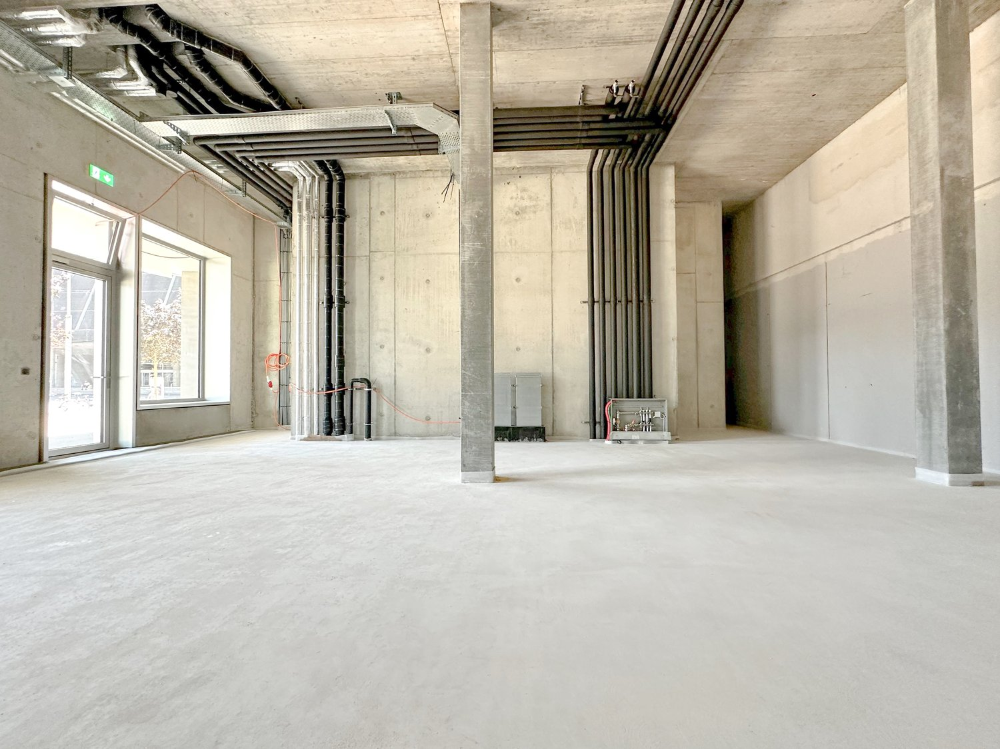
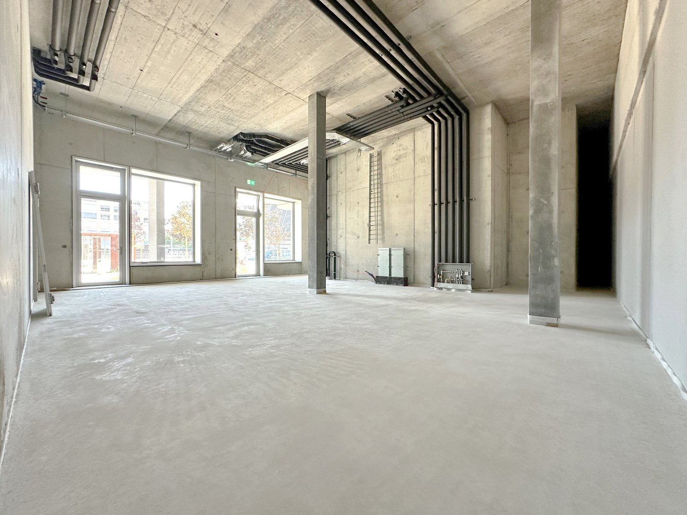

# Esplanade-Kongresshaus 3, 2501 Biel/Bienne - CHF 250

> **Categorie:** `B_buero_gewerbe`  
> **Regiune:** Cantonul Berna  
> **Tip ofertă:** RENT / SHOP  
> **Relevant pentru praxis:** da (praxis)  
> **Sursă:** [flatfox.ch](https://flatfox.ch/de/wohnung/esplanade-kongresshaus-3-2501-bielbienne/1424205/)  
> **Descărcat:** 2026-08-17 12:30

## Date obiect

| Câmp | Valoare |
|---|---|
| Adresă | Esplanade-Kongresshaus 3, 2501 Biel/Bienne |
| Categorie obiect | INDUSTRY |
| Tip obiect | SHOP |
| Chirie netă | CHF 250 |
| Chirie brută | CHF 250 |
| Preț afișat | CHF 250 |
| Suprafață utilă | 87 m² |
| Etaj | 0 |
| An construcție | 2022 |
| Disponibil de la | imm |
| Referință | 2801.2.2001 |

## Texte originale (germană)

**Titlu public:** Esplanade-Kongresshaus 3, 2501 Biel/Bienne - CHF 250

**Titlu scurt:** 87m² Ladenfläche

**Pitch:** 87m² Ladenfläche in Biel/Bienne mieten

**Titlu descriere:** Ihr neues Business am Puls von Biel

**Titlu chirie:** 87m² Ladenfläche in Biel/Bienne mieten

**Spațiu afișat:** 87

### Descriere completă

Diese 87 m² grosse Verkaufsfläche präsentiert sich im Rohbau, sodass Ihnen bei der Realisation Ihrer Bedürfnisse maximaler Spielraum geboten wird. Lassen Sie Ihren Vorstellungen freien Lauf und überzeugen Sie uns von Ihrer Idee und Ihrem Retailkonzept.   
  
Wenn Ihnen diese Fläche zu klein ist, haben wir ein paar Hauseingänge nebenan, Esplanade Kongresshaus 7, eine grössere Retailfläche von 144m².   
  
Bitte beachten Sie, dass jegliche Gastronomie- Fitness- sowie Coiffeurbetriebe und Barbershops nicht erwünscht sind, da diese Nutzungen bereits in der Überbauung vertreten sind. Die Fläche eignet sich jedoch ideal für zahlreiche andere Konzepte wie Retail, Showroom, Dienstleistung, Praxis oder ähnliche Nutzungen.   
  
Im Herzen von Biel, unmittelbar zur Begegnungszone "Kongresshaus Esplanade" ist das Centre Esplanade entstanden. Das Areal bietet Raum für attraktive Wohneinheiten, ein internationales Businesshotel sowie Büro- und Gewerbeflächen und ist an die eigene Tiefgarage erschlossen. Für Kunden steht das öffentliche Parkhaus des Kongresshauses zur Verfügung, welches ebenfalls mit unserem Komplex verbunden ist.   
  
Die Lage könnte nicht besser sein - perfekt an den öffentlichen Verkehr angebunden, nur 10 Gehminuten vom Bahnhof Biel entfernt und die nahe gelegene Autobahn sorgt für eine bequeme An- & Abreise. Eine Fülle von Einkaufsmöglichkeiten und Restaurants, Bars sind direkt vor Ort, um Ihren Arbeitstag noch angenehmer zu gestalten.   
  
Auf der Homepage Centre Esplanade können Sie sich einen ersten Überblick zu unserem Flächenangebot machen. Schauen Sie vorbei!   
  
Unser erfahrenes Team unterstützt Sie, gemeinsam mit unseren externen Partnern für Planung und Bau, bei der Realisierung Ihrer Vorstellungen.   
  
Alpine ist ein familiengeführtes Immobilienunternehmen mit Sitz in Zürich und Berlin. Als Bestandshalter sind wir spezialisiert auf Büro- und Geschäftshäuser im Umfeld internationaler Flughäfen. Von der Entwicklung über die Vermietung bis zur Bewirtschaftung von Immobilien bietet Alpine alle Dienstleistungen aus einer Hand an.   
  
Kontaktieren Sie uns und überzeugen Sie sich von unserem Angebot.   
*************************   
Cette surface de vente de 87 m² se présente à l'état brut, ce qui vous offre une marge de manoeuvre maximale pour la réalisation de vos besoins. Laissez libre cours à votre imagination et convainquez-nous de votre idée et de votre concept de commerce.   
  
Si cet espace vous semble trop petit, nous disposons de quelques entrées, juste à côté, Esplanade Kongresshaus 7, d'un espace commercial plus grand de 144 m².   
  
Les utilisations pour la restauration, de fitness ainsi que les salons de coiffure / barber shop de sont pas autorisées.   
  
Le Centre Esplanade a été construit au coeur de Bienne, à proximité immédiate de la zone de rencontre "Palais des Congrès Esplanade". Le complexe offre de l'espace pour des appartements attrayants, un hôtel business international ainsi que des bureaux et des surfaces commerciales et est relié à son propre parking souterrain. Les clients peuvent utiliser le parking public du Palais des Congrès.   
  
L'endroit ne pourrait pas être mieux situé - parfaitement desservi par les transports publics, à seulement 10 minutes à pied de la gare de Bienne et l'autoroute toute proche permet d'arriver et de repartir facilement. Une multitude de magasins, de restaurants et de bars se trouvent sur place pour rendre votre journée de travail encore plus agréable.   
  
Sur la page d'accueil du Centre Esplanade, vous pouvez vous faire une première idée de notre offre de surfaces. N'hésitez pas à y faire un tour!   
  
Notre team expérimenté vous soutient, en collaboration avec nos partenaires externes pour la réalisation de la planification et de la construction, dans la réalisation de vos idées.   
  
Contactez-nous et laissez-vous convaincre par notre offre.

## Dotări (attributes)

- lift
- garage

## Ofertant

- **Nume:** Alpine Immobilien AG
- **Stradă:** Sägereistrasse 25
- **NPA:** 8152
- **Localitate:** Glattbrugg

## Imagini (4)

*`01.jpg` — 1500x1000 px*

*`02.jpg` — 1500x1124 px*

*`03.jpg` — 1500x1125 px*

*`04.jpg` — 1500x1000 px*

## Media suplimentară

- **website_url:** https://www.centre-esplanade.ch/gewerbe
