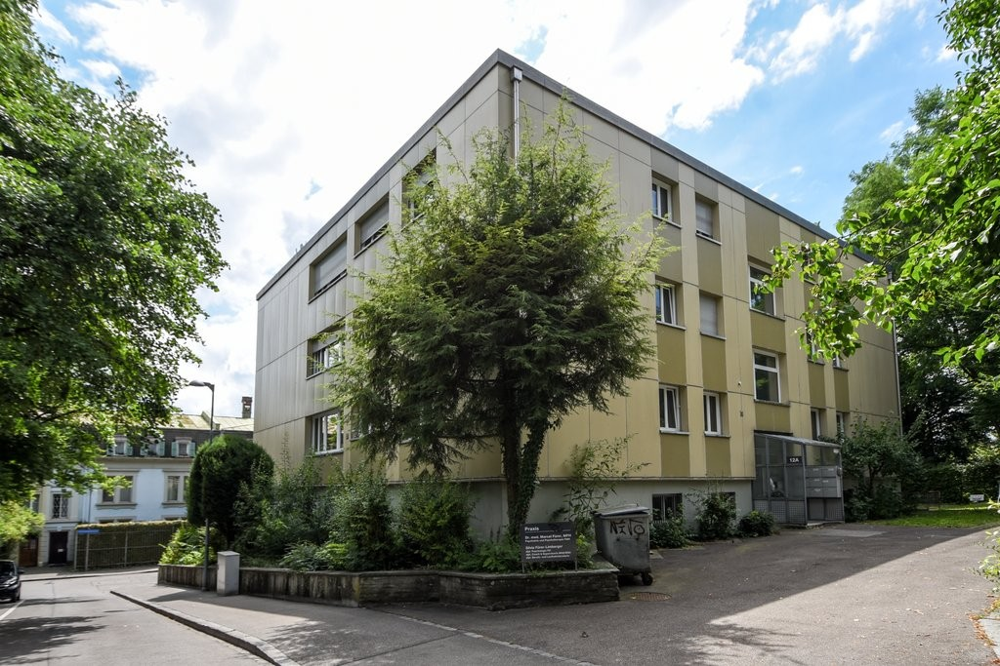
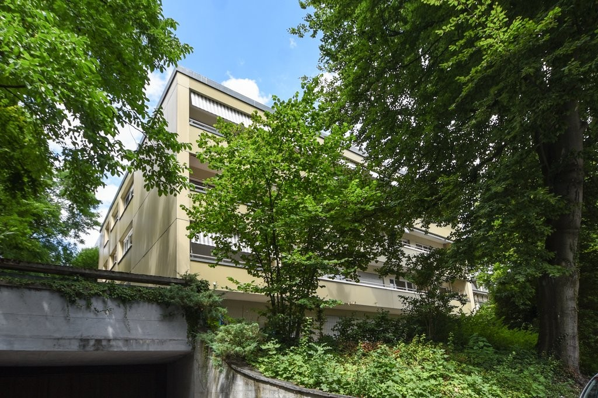
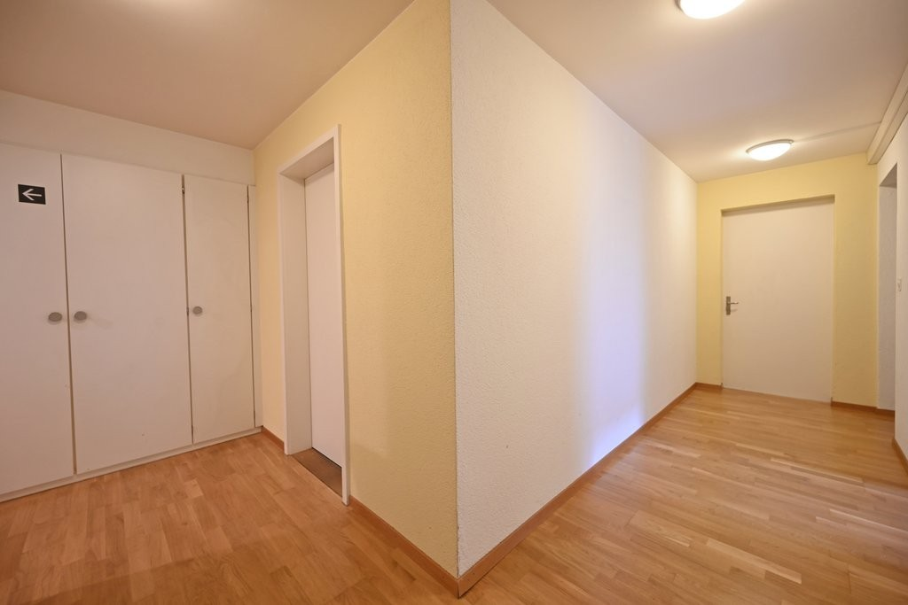
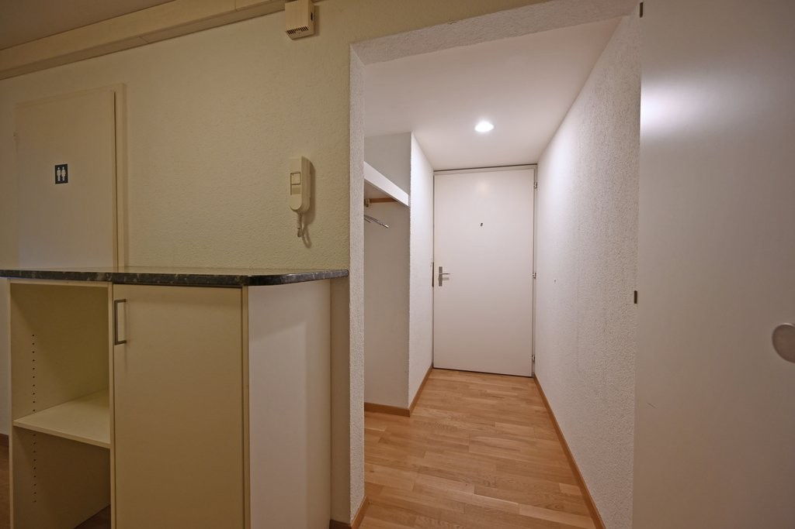
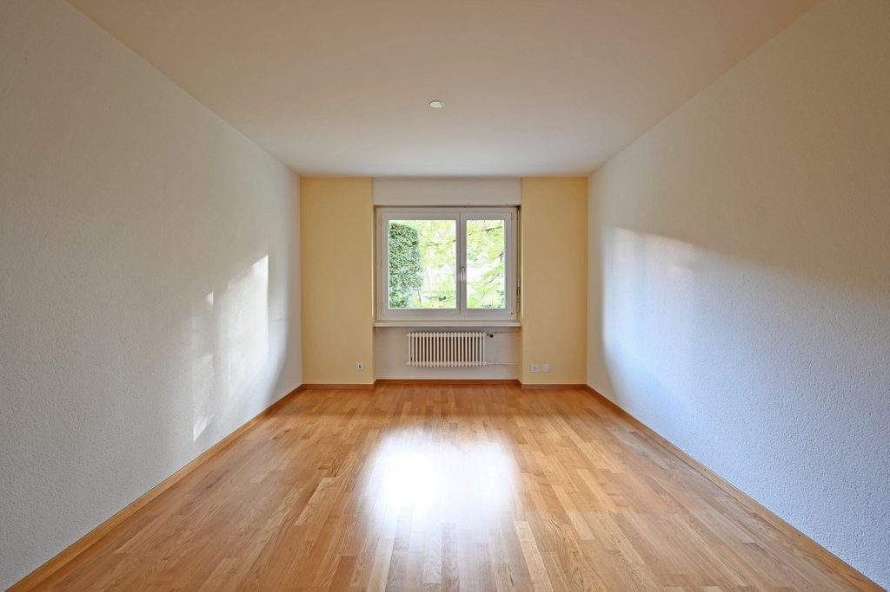
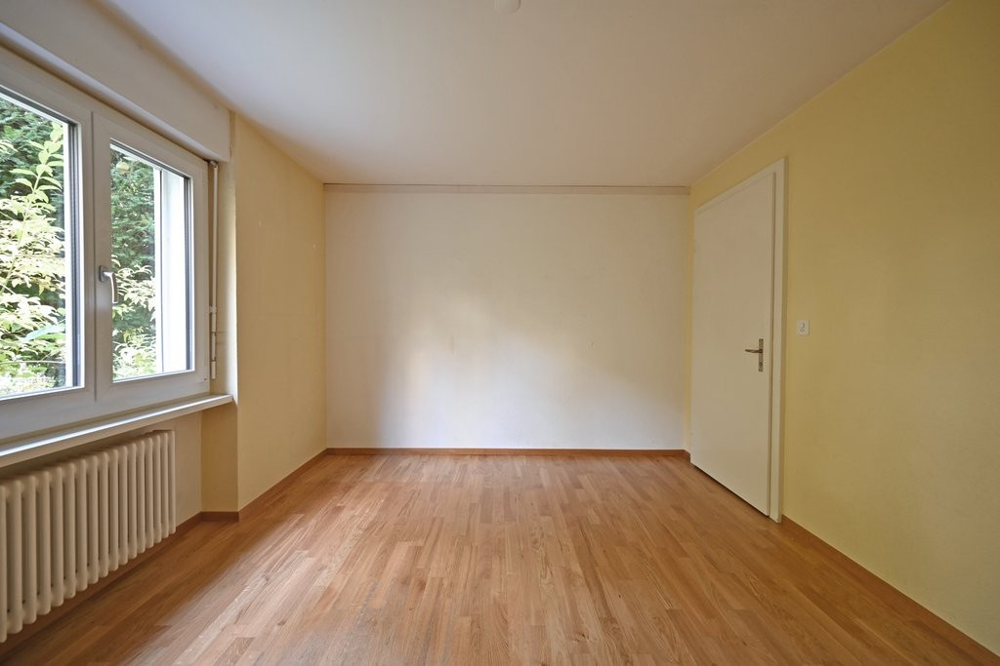
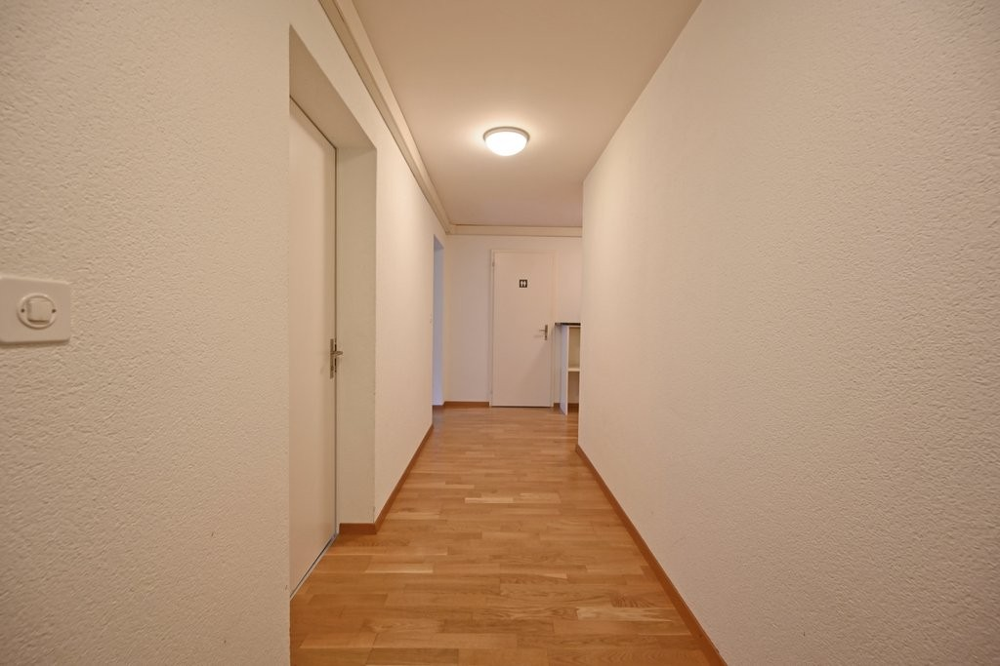
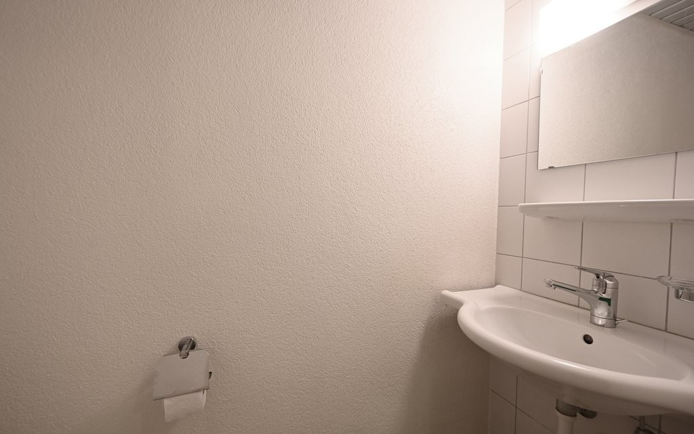

# Falkenhöheweg 12a, 3012 Bern - auf Anfrage

> **Categorie:** `B_buero_gewerbe`  
> **Regiune:** Berna (oraș)  
> **Tip ofertă:** RENT / OFFICE  
> **Relevant pentru praxis:** da (praxisraum, praxisräumlichkeiten)  
> **Sursă:** [flatfox.ch](https://flatfox.ch/de/wohnung/falkenhoheweg-12a-3012-bern/1482177/)  
> **Descărcat:** 2026-08-17 12:27

## Date obiect

| Câmp | Valoare |
|---|---|
| Adresă | Falkenhöheweg 12a, 3012 Bern |
| Categorie obiect | INDUSTRY |
| Tip obiect | OFFICE |
| Suprafață utilă | 87 m² |
| Etaj | 0 |
| An construcție | 1959 |
| Disponibil de la | imm |
| Referință | 12750.01.390010 |

## Texte originale (germană)

**Titlu public:** Falkenhöheweg 12a, 3012 Bern - auf Anfrage

**Titlu scurt:** 87m² Büro

**Pitch:** 87m² Büro in Bern mieten

**Titlu descriere:** IHRE NEUE GESCHÄFTSLOKALITÄT IN DER LÄNGGASSE

**Titlu chirie:** 87m² Büro in Bern mieten

**Spațiu afișat:** 87

### Descriere completă

Der Liegenschaft liegt an ruhiger und zentraler Lage. Der Bahnhof Bern (Welle 7) ist innert 6 Gehminuten und die Bushaltestelle "Universität" innert 3 Gehminuten erreichbar.   
  
Die Räumlichkeiten im Tief-Parterre bieten Ihnen Folgendes:   
  
\- gute Raumaufteilung (5 Zimmer)   
\- WC mit Lavabo   
\- Parkettböden in allen Zimmern   
\- Kellerabteil   
\- Parkmöglichkeiten vorhanden   
  
Das Mietobjekt wird im aktuellen Zustand vermietet und kann als Büro- oder Praxisraum genutzt werden (bisher Praxisräumlichkeiten). Allfällige Änderungen am Ausbau können geprüft werden.   
  
Wir freuen uns auf Ihre Kontaktaufnahme und stehen Ihnen bei Fragen gerne zur Verfügung.

## Dotări (attributes)

- lift

## Ofertant

- **Nume:** Von Graffenried AG Liegenschaften
- **Stradă:** Marktgass-Passage 3
- **NPA:** 3011
- **Localitate:** Bern

## Imagini (8)

*`01.jpg` — 1024x683 px — 3260-Falkenhoeheweg_12a-2.png*

*`02.jpg` — 1024x683 px — 3260-Falkenhoeheweg_12a-3.jpg*

*`03.jpg` — 1024x683 px — DSC_3227.JPG*

*`04.jpg` — 1024x683 px — Eingangsbereich.JPG*

*`05.jpg` — 1024x683 px — Büro.JPG*

*`06.jpg` — 1024x683 px — Büro_3257.JPG*

*`07.jpg` — 1024x683 px — Gang.JPG*

*`08.jpg` — 1024x641 px — WC.JPG*
