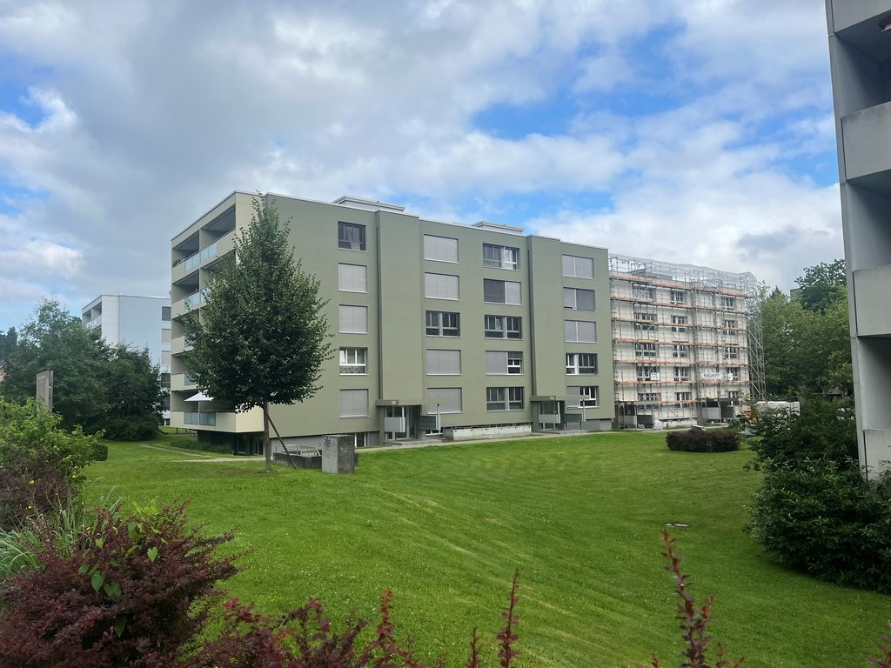
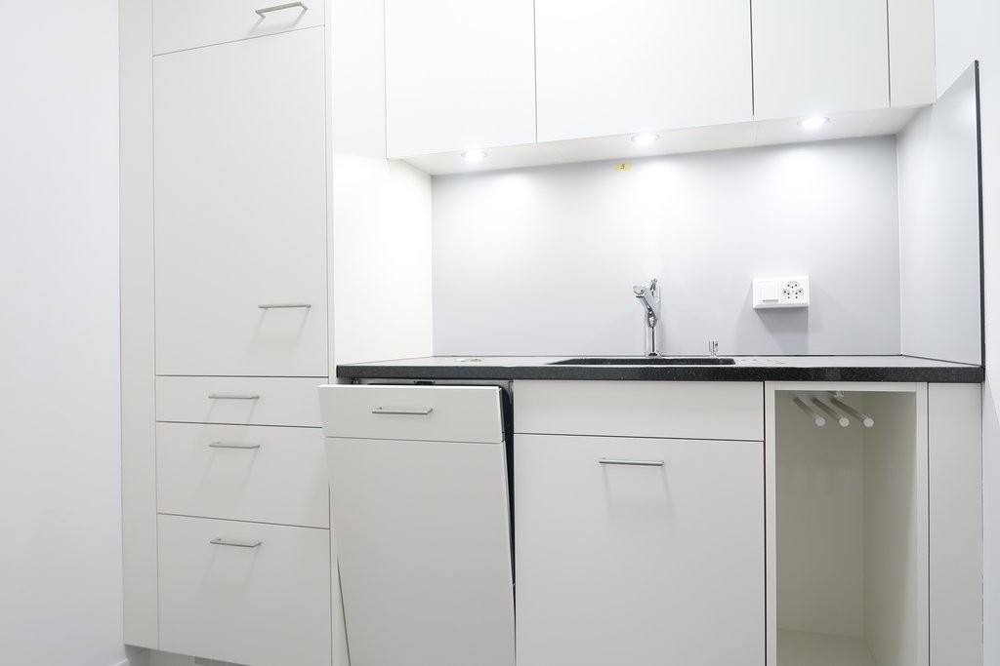
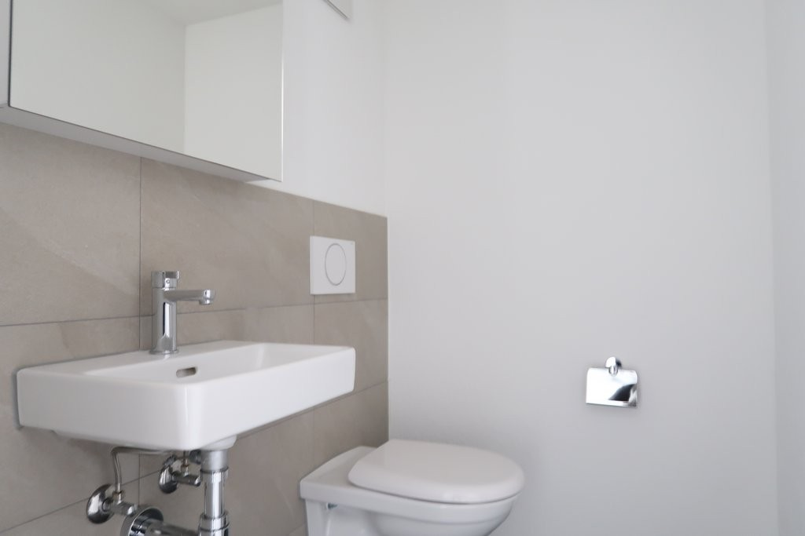
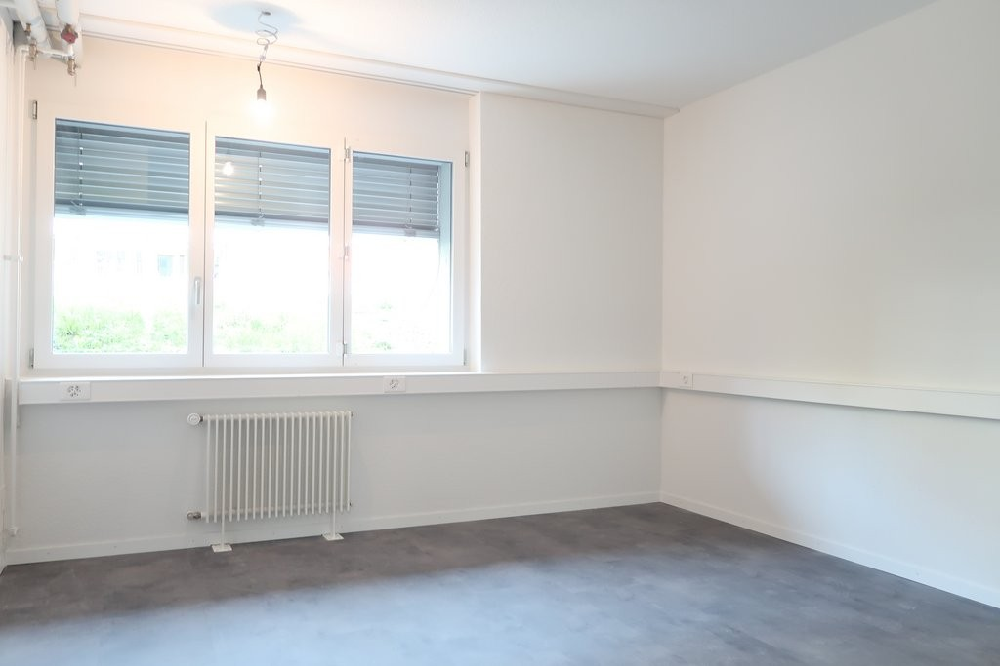
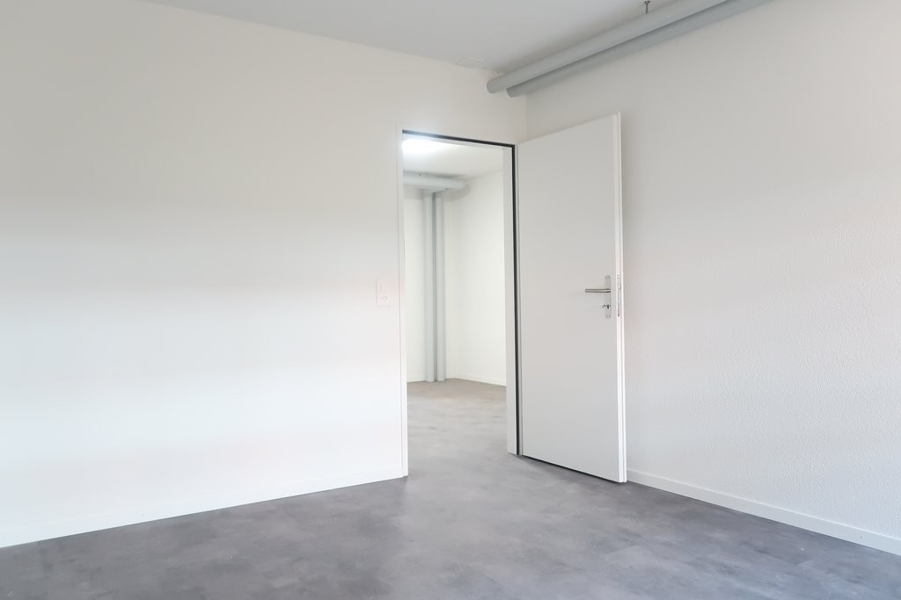
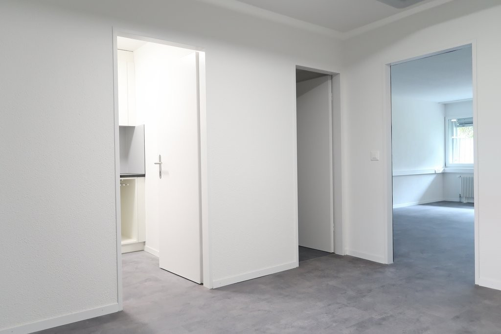
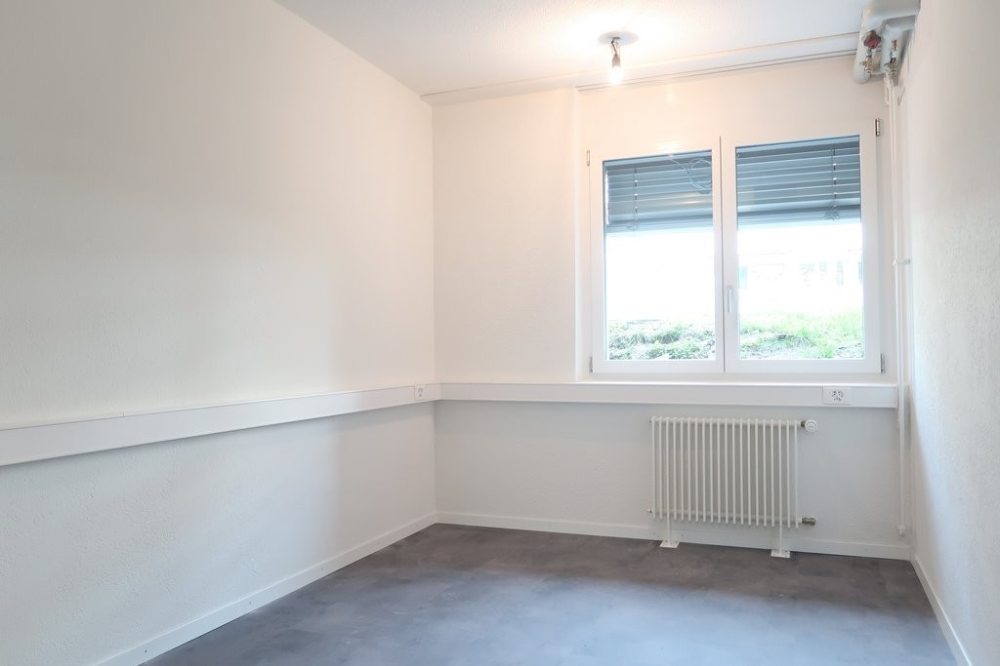
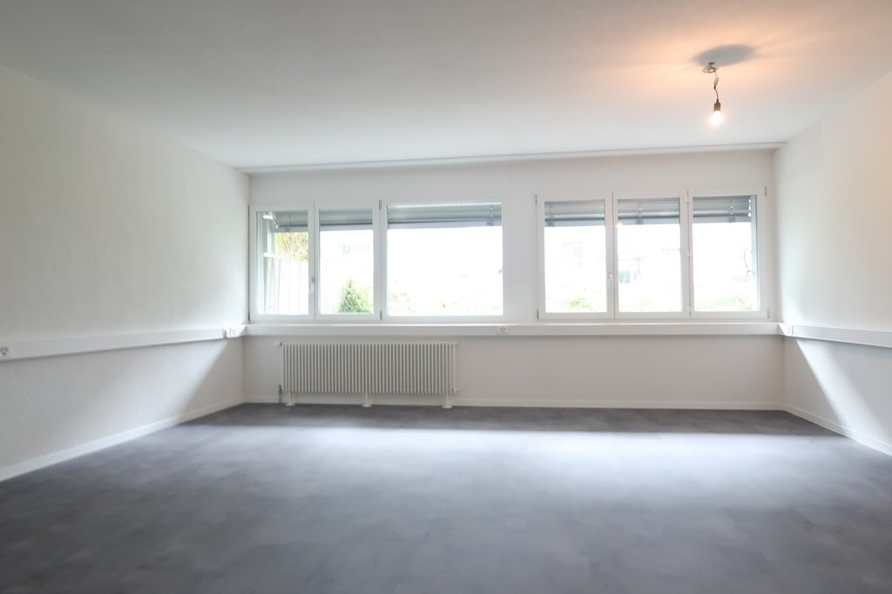
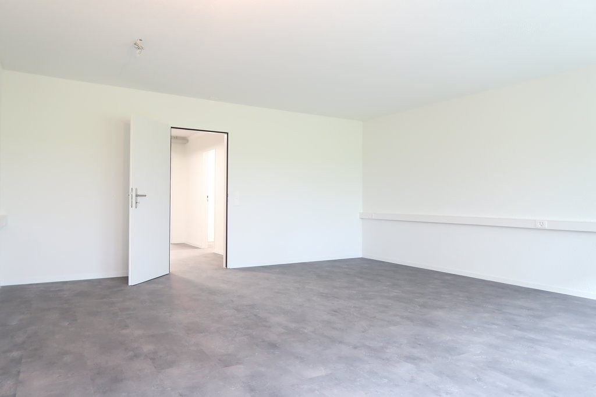
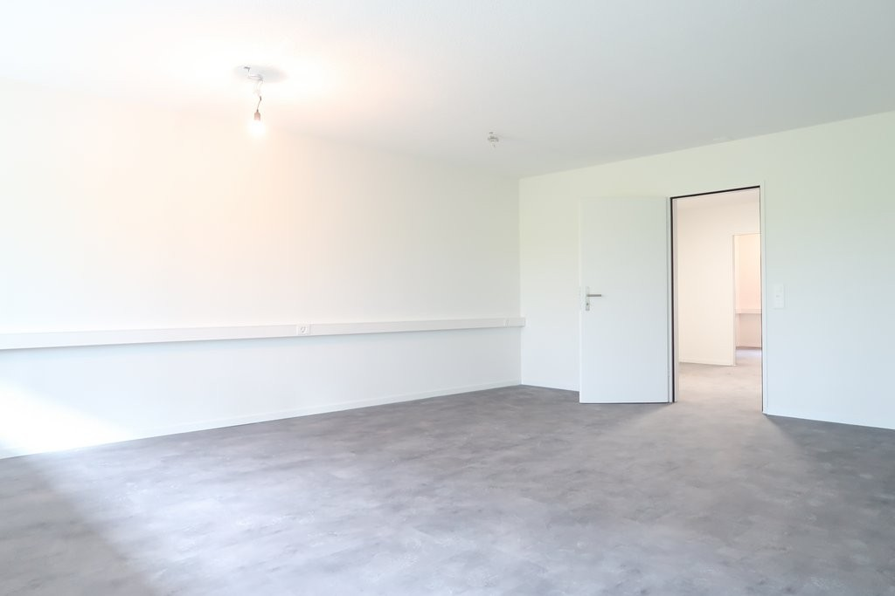

# Funkstrasse 104, 3084 Wabern - CHF 243 inkl. NK pro m² / Jahr

> **Categorie:** `B_buero_gewerbe`  
> **Regiune:** Cantonul Berna  
> **Tip ofertă:** RENT / OFFICE  
> **Relevant pentru praxis:** da (praxis)  
> **Sursă:** [flatfox.ch](https://flatfox.ch/de/wohnung/funkstrasse-104-3084-wabern/1502828/)  
> **Descărcat:** 2026-08-17 12:27

## Date obiect

| Câmp | Valoare |
|---|---|
| Adresă | Funkstrasse 104, 3084 Wabern |
| Categorie obiect | INDUSTRY |
| Tip obiect | OFFICE |
| Chirie netă | CHF 200 |
| Nebenkosten | CHF 43 |
| Chirie brută | CHF 243 |
| Preț afișat | CHF 243 |
| Suprafață utilă | 79 m² |
| Etaj | 0 |
| An construcție | 1974 |
| An renovare | 2024 |
| Disponibil de la | agr |
| Referință | 12660.02.390010 |

## Texte originale (germană)

**Titlu public:** Funkstrasse 104, 3084 Wabern - CHF 243 inkl. NK pro m² / Jahr

**Titlu scurt:** 79m² Büro

**Pitch:** 79m² Büro in Wabern mieten

**Titlu descriere:** Helles, neu saniertes Büro - modern, komfortabel, bereit für Ihr Team

**Titlu chirie:** 79m² Büro in Wabern mieten

**Spațiu afișat:** 79

### Descriere completă

Dieses kompakte Büro befindet sich in einer gepflegten fünfstöckigen Liegenschaft mit Lift und überzeugt durch eine zentrale, dennoch ruhige Lage. Die Nähe zur Tramhaltestelle Sandrain ermöglicht schnelle Verbindungen in die Stadt, während Einkaufsmöglichkeiten, Grünflächen am Gurten und die Aare in unmittelbarer Reichweite für kurze Pausen und Erholung sorgen.   
  
**Ausstattung im Überblick**   

  * Drei abgeschlossene Büroräume mit Fenstern für viel Tageslicht 
  * Einladender Eingangsbereich 
  * Moderne, neue Toilette 
  * Neue Teeküche für kreative Pausen 
  * Neue Novilonböden für eine ruhige, elegante Arbeitsatmosphäre 

**Vorteile**

  * Helle, freundliche Arbeitsumgebung durch lichtdurchflutete Räume 
  * Frisch renoviert - sofort bezugsbereit 
  * Praktischer Grundriss ideal für kleine Teams, Beratung oder Praxis 

**Benefits**

  * Zentrale, dennoch ruhige Arbeitsatmosphäre - ideal für Kleinstunternehmen, Startups und Freiberufler 
  * Hervorragende Anbindung an öffentliche Verkehrsmittel; kurze Wege zu Bahn, Bus und Tram 
  * Vielfältige Nutzungsmöglichkeiten: reines Büro, Beratung, Atelier oder Showroom auf kleinem Raumbedarf 
  * Gute Sichtbarkeit in gepflegter Umgebung mit attraktiver Nachbarschaft 

  
Haben wir Ihr Interesse geweckt? Dann können Sie sich via Kontaktformular bei uns melden. Wir freuen uns auf Ihre Kontaktaufnahme!

## Dotări (attributes)

- lift
- cable
- parkingspace
- garage

## Ofertant

- **Nume:** Von Graffenried AG Liegenschaften
- **Stradă:** Marktgass-Passage 3
- **NPA:** 3011
- **Localitate:** Bern

## Imagini (10)

*`01.jpg` — 1024x768 px — Aussenansicht_nach_Sanierung.jpg*

*`02.jpg` — 1024x683 px — IMG_7167.JPG*

*`03.jpg` — 1024x683 px — IMG_7168.JPG*

*`04.jpg` — 1024x683 px — IMG_7165.JPG*

*`05.jpg` — 1024x683 px — IMG_7166.JPG*

*`06.jpg` — 1024x683 px — IMG_7162.JPG*

*`07.jpg` — 1024x683 px — IMG_7164.JPG*

*`08.jpg` — 1024x683 px — IMG_7170.JPG*

*`09.jpg` — 1024x683 px — IMG_7173.JPG*

*`10.jpg` — 1024x683 px — IMG_7172.JPG*
