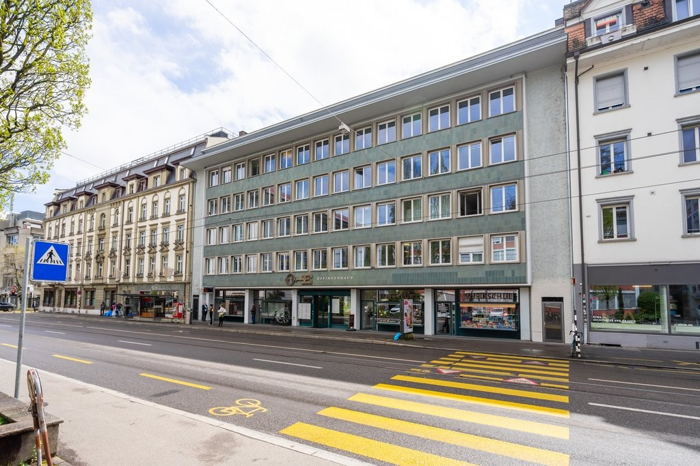
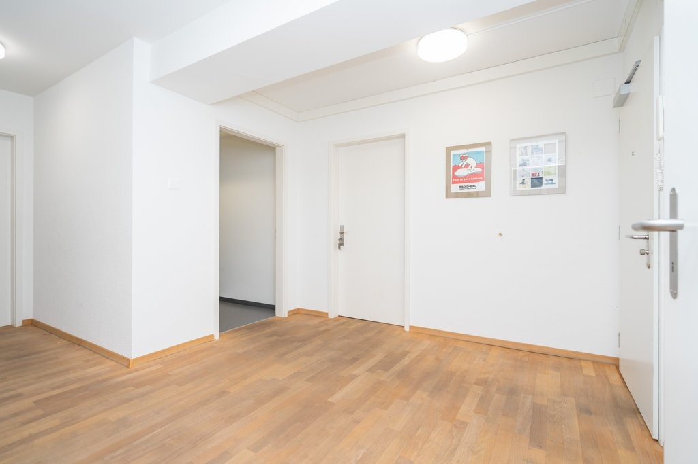
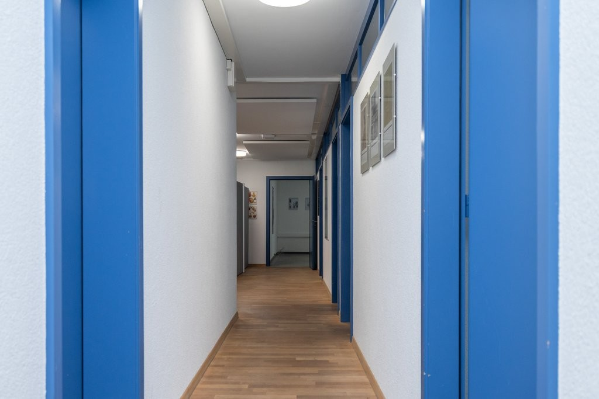
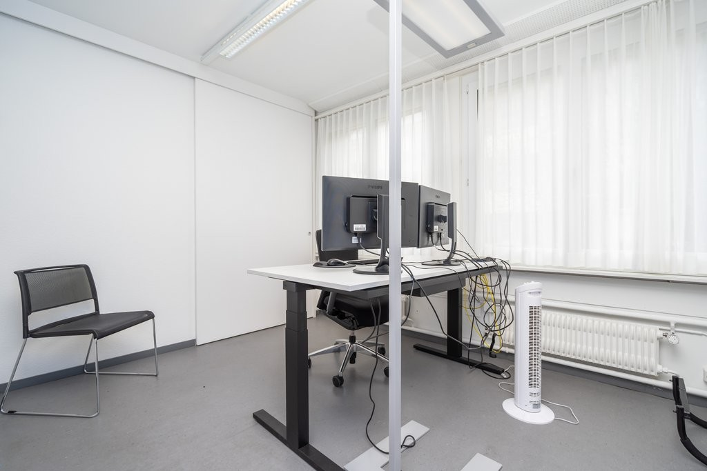
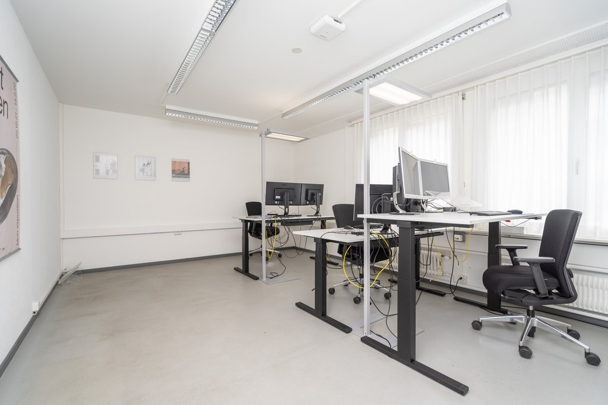
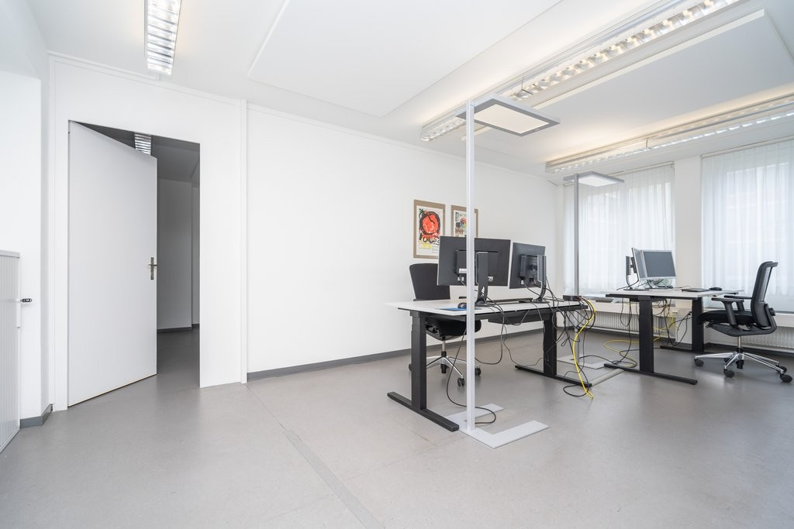
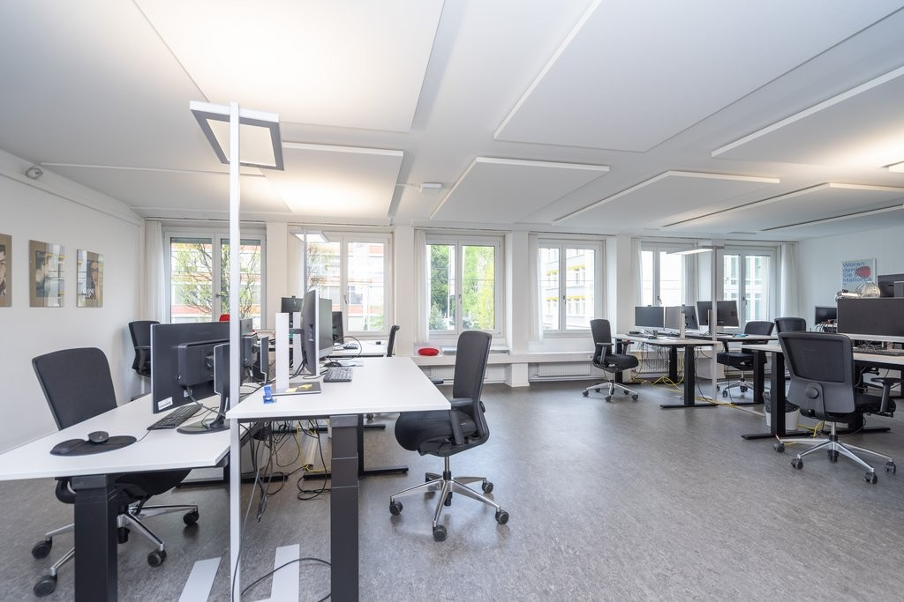
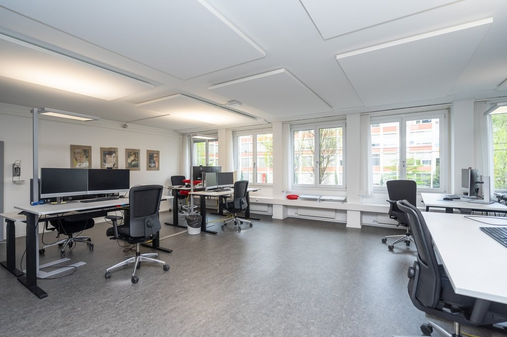

# Effingerstrasse 55, 3008 Bern - CHF 305 inkl. NK pro m² / Jahr

> **Categorie:** `B_buero_gewerbe`  
> **Regiune:** Berna (oraș)  
> **Tip ofertă:** RENT / OFFICE  
> **Sursă:** [flatfox.ch](https://flatfox.ch/de/wohnung/effingerstrasse-55-3008-bern/1510897/)  
> **Descărcat:** 2026-08-17 12:31

## Date obiect

| Câmp | Valoare |
|---|---|
| Adresă | Effingerstrasse 55, 3008 Bern |
| Categorie obiect | INDUSTRY |
| Tip obiect | OFFICE |
| Chirie netă | CHF 270 |
| Nebenkosten | CHF 35 |
| Chirie brută | CHF 305 |
| Preț afișat | CHF 305 |
| Suprafață utilă | 356 m² |
| Etaj | 1 |
| Disponibil de la | agr |
| Referință | 15301.01.20100 |

## Texte originale (germană)

**Titlu public:** Effingerstrasse 55, 3008 Bern - CHF 305 inkl. NK pro m² / Jahr

**Titlu scurt:** 356m² Büro

**Pitch:** 356m² Büro in Bern mieten

**Titlu descriere:** Büroflächen für Ihren Erfolg - das Effingerhaus erwartet Sie!

**Titlu chirie:** 356m² Büro in Bern mieten

**Spațiu afișat:** 356

### Descriere completă

**Sind Sie bereit, mit uns durchzustarten?**

  

Wir vermieten per sofort oder nach Vereinbarung diese erstklassige Bürofläche im Herzen von Bern. Mit einer Gesamtfläche von rund 360m2 erstreckt sich das Objekt über das gesamte 1. Obergeschoss und bietet dabei vielseitige, flexible Nutzungsmöglichkeiten passend zu Ihrem Konzept. 

  

**Die Highlights in Kürze**

  * Vollständiger Ausbau mit moderner Infrastruktur 
  * Helle, offene Räume mit grossen Fensterfronten 
  * Ideale Grundrissaufteilung mit der perfekten Mischung aus Grossraum-, Team- und Einzelbüros 
  * Individuelle Gestaltungsmöglichkeiten 
  * Grosszügige Teeküche und zwei Sanitäranlagen (inkl. Dusche) zur alleinigen Nutzung 
  * Perfekte Visibilität an bester Lage (Tramhaltestelle "Kaufmännischer Verband") 
  * Verschiedene Einkaufs- und Verpflegungsmöglichkeiten in nächster Umgebung 
  * Möglichkeit zur Flächenerweiterung (Schulungs-/Meetingräume im 1. UG) 

  

Die Fläche vereint modernes Design mit praktischer Funktionalität. Sie haben spezifische Ausbauwünsche? Kein Problem für uns - wir unterstützen Sie gerne! 

  

**Achtung. Eigenwerbung:** Sie ziehen in eine Mietwohnung und benötigen Unterstützung für den bestmöglichen Verkauf Ihrer Immobilie? Kontaktieren Sie die Dr.Meyer Immobilien AG für eine unverbindliche Offerte **\- wir sind gut darin.**

## Dotări (attributes)

- lift

## Ofertant

- **Nume:** Dr.Meyer Immobilien AG
- **Stradă:** Morgenstrasse 83A
- **NPA:** 3018
- **Localitate:** Bern

## Imagini (8)

*`01.jpg` — 1024x683 px — Aussenansicht*

*`02.jpg` — 1024x683 px — Eingangsbereich*

*`03.jpg` — 1024x683 px — Korridor*

*`04.jpg` — 1024x683 px — Teambüro*

*`05.jpg` — 1024x683 px — Teambüro*

*`06.jpg` — 1024x683 px — Grossraumbüro*

*`07.jpg` — 1024x683 px — Grossraumbüro*

*`08.jpg` — 1024x683 px — Grossraumbüro*
