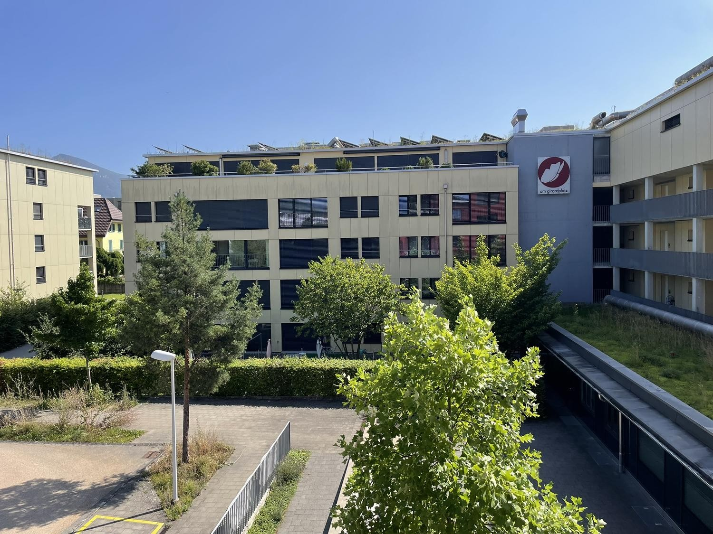
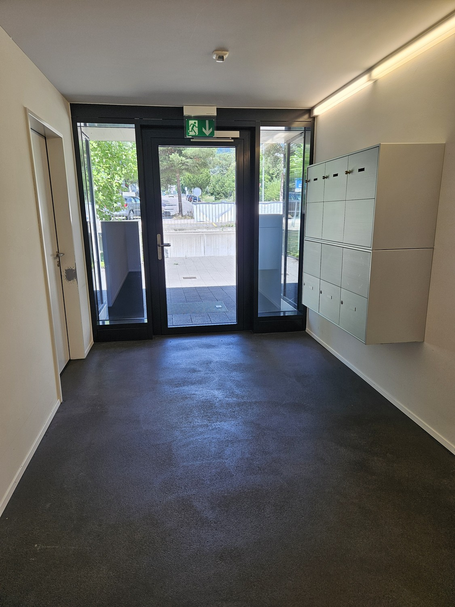
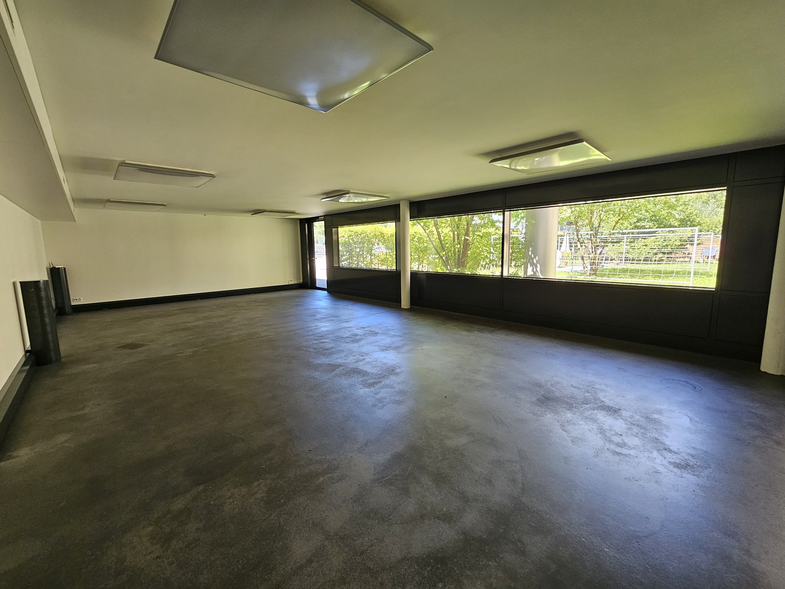
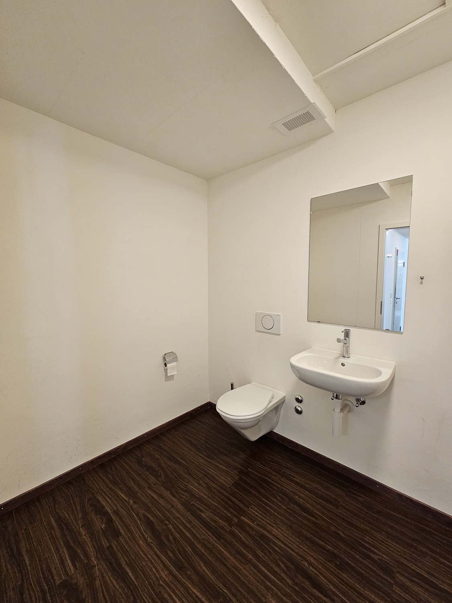

# Girardstrasse 17, 2540 Grenchen - CHF 1’150 inkl. NK pro Monat

> **Categorie:** `B_buero_gewerbe`  
> **Regiune:** Cantonul Berna  
> **Tip ofertă:** RENT / COMMERCIAL  
> **Relevant pentru praxis:** da (praxis)  
> **Sursă:** [flatfox.ch](https://flatfox.ch/de/wohnung/girardstrasse-17-2540-grenchen/1533359/)  
> **Descărcat:** 2026-08-17 12:32

## Date obiect

| Câmp | Valoare |
|---|---|
| Adresă | Girardstrasse 17, 2540 Grenchen |
| Categorie obiect | INDUSTRY |
| Tip obiect | COMMERCIAL |
| Chirie netă | CHF 1'000 |
| Nebenkosten | CHF 150 |
| Preț afișat | CHF 1'150 |
| Suprafață utilă | 65 m² |
| Etaj | 0 |
| Disponibil de la | imm |
| Referință | 1611.. |

## Texte originale (germană)

**Titlu public:** Girardstrasse 17, 2540 Grenchen - CHF 1’150 inkl. NK pro Monat

**Titlu scurt:** 65m² Gewerbe

**Pitch:** 65m² Gewerbe in Grenchen mieten

**Titlu descriere:** Flexible Gewerbeflächen an bester Lage – Nahe Zentrum Grenchen

**Titlu chirie:** 65m² Gewerbe in Grenchen mieten

**Spațiu afișat:** 65

### Descriere completă

Sie suchen die ideale Gewerbefläche für Ihr Unternehmen? Direkt in der Nähe des Zentrums von Grenchen bieten wir Ihnen moderne, flexible Mietflächen, die sich perfekt für Büro, Handel oder Dienstleistung eignen.  
  
**Top-Lage**  
Unsere Gewerbeflächen zeichnen sich durch ihre erstklassige Lage aus: Sie befinden sich nur wenige Minuten vom Stadtzentrum Grenchen entfernt und sind hervorragend an das öffentliche Verkehrsnetz sowie die wichtigsten Verkehrsadern angeschlossen.  
  
**Vielseitige Nutzungsmöglichkeiten**  
Ob als Büro, Showroom, Praxis oder Geschäftslokal – die Mietflächen sind variabel und lassen sich perfekt an Ihre Bedürfnisse anpassen. Mit großzügigen Raumaufteilungen und flexiblen Mietkonditionen bieten wir Ihnen die Freiheit, Ihre Geschäftsideen in einem modernen Umfeld zu verwirklichen.  
  
**Moderne Ausstattung**  
Die Gewerbeeinheiten verfügen über eine moderne Ausstattung inklusive großer Fensterfronten für optimale Belichtung, sowie über Einbauschränke. Auch Einstellhallenplätze sind ausreichend vorhanden.  
  
**Ihre Vorteile im Überblick**:  

*   Hervorragende Erreichbarkeit und Nähe zum Zentrum
*   Flexible Raumaufteilungen für verschiedene Nutzungen
*   Moderne Ausstattung und Infrastruktur
*   Attraktive Mietkonditionen

Kontaktieren Sie uns noch heute, um die verfügbaren Gewerbeflächen zu besichtigen und mehr über die Mietkonditionen zu erfahren.

## Dotări (attributes)

- garage
- accessiblewithwheelchair
- lift

## Ofertant

- **Nume:** Immovisa GmbH

## Imagini (4)

*`01.jpg` — 1500x1125 px*

*`02.jpg` — 1125x1500 px*

*`03.jpg` — 1500x1125 px*

*`04.jpg` — 1125x1500 px*
