# Schwarztorstrasse 87, 3007 Bern - CHF 3’450 inkl. NK pro Monat

> **Categorie:** `B_buero_gewerbe`  
> **Regiune:** Berna (oraș)  
> **Tip ofertă:** RENT / STORAGE_ROOM  
> **Sursă:** [flatfox.ch](https://flatfox.ch/de/wohnung/schwarztorstrasse-87-3007-bern/1540837/)  
> **Descărcat:** 2026-08-17 12:31

## Date obiect

| Câmp | Valoare |
|---|---|
| Adresă | Schwarztorstrasse 87, 3007 Bern |
| Categorie obiect | INDUSTRY |
| Tip obiect | STORAGE_ROOM |
| Chirie netă | CHF 2'150 |
| Nebenkosten | CHF 1'300 |
| Chirie brută | CHF 3'450 |
| Preț afișat | CHF 3'450 |
| Suprafață utilă | 366 m² |
| Etaj | -1 |
| Disponibil de la | agr |
| Referință | 15303.01.59100 |

## Texte originale (germană)

**Titlu public:** Schwarztorstrasse 87, 3007 Bern - CHF 3’450 inkl. NK pro Monat

**Titlu scurt:** 366m² Lager

**Pitch:** 366m² Lager in Bern mieten

**Titlu descriere:** 366 qm vielseitig nutzbare Fläche zu vermieten

**Titlu chirie:** 366m² Lager in Bern mieten

**Spațiu afișat:** 366

### Descriere completă

Wir vermieten per sofort oder nach Vereinbarung einen grosszügigen, flexiblen Raum mit 366 qm im 1. Untergeschoss, ideal geeignet als Lager, Werkstatt, Archiv oder für verschiedene andere Nutzungen. Der Raum verfügt über keine zu öffnenden Fenster, weshalb er weniger für Büros geeignet ist. 

  

**Ausstattung:**

Fläche: 366 Quadratmeter 

Preis: CHF 5.90 pro m2 

Toilette vorhanden 

Teppichboden 

Zwei Compactusanlagen können kostenlos übernommen werden 

Anlieferung über Rampe 

Liftmasse: 3.261 m (L) x 2.007 m (B) x 2.202 m (H) 

  

Bei Interesse oder für weitere Informationen stehen wir Ihnen gerne zur Verfügung!

## Dotări (attributes)

- lift

## Ofertant

- **Nume:** IMMOcreativ Balmer GmbH
- **Stradă:** Thunstrasse 8
- **NPA:** 3700
- **Localitate:** Spiez

## Imagini (12)

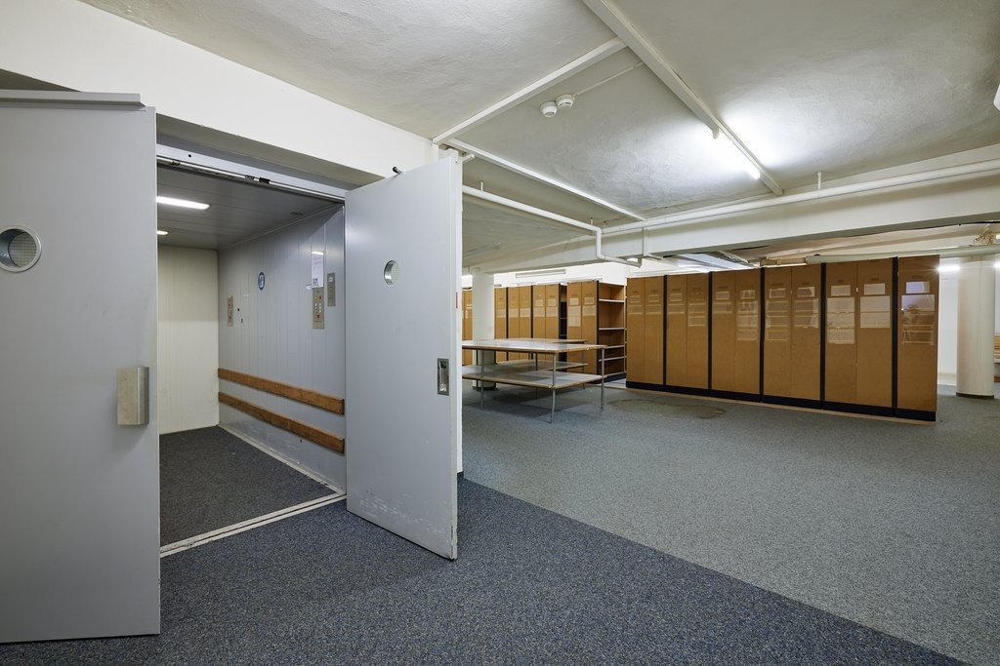
*`01.jpg` — 1024x683 px*

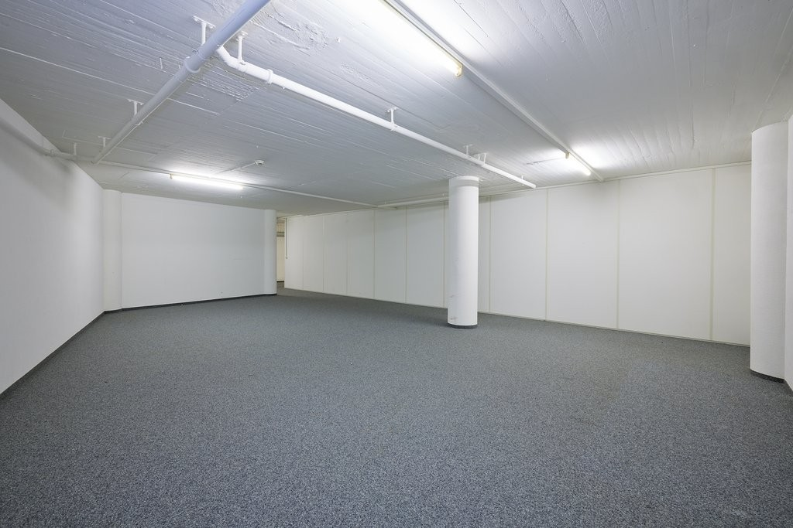
*`02.jpg` — 1024x683 px*

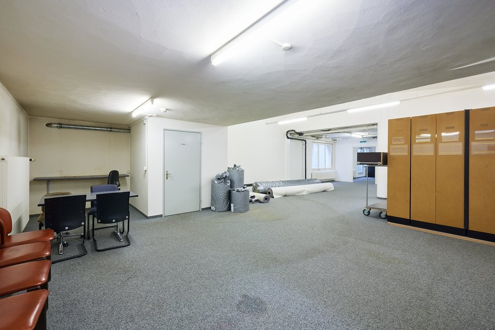
*`03.jpg` — 1024x683 px*

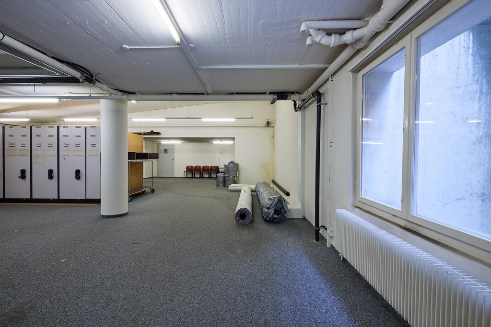
*`04.jpg` — 1024x683 px*

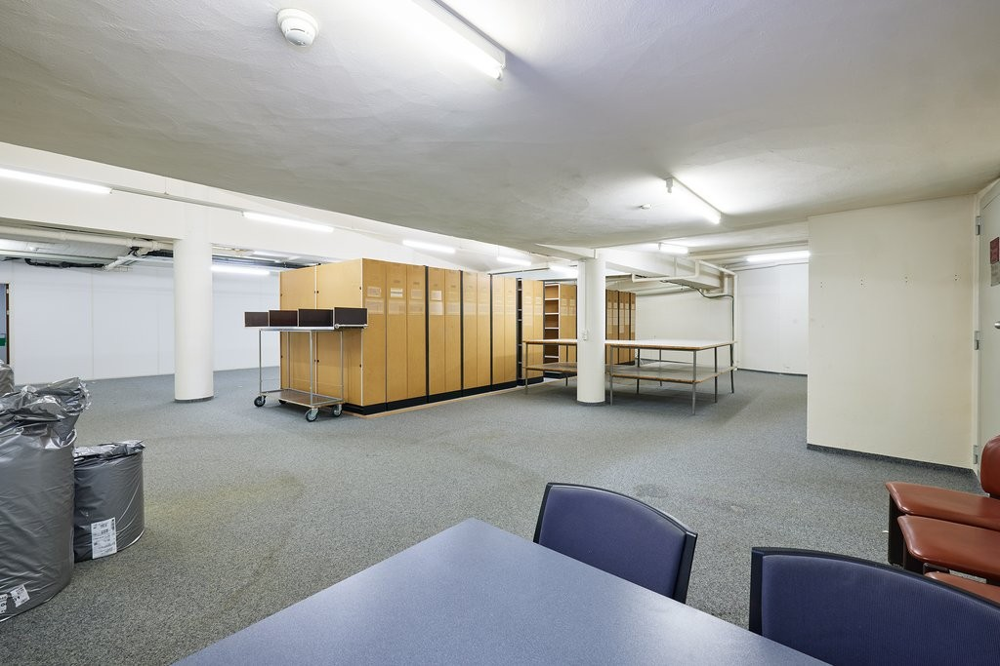
*`05.jpg` — 1024x683 px*

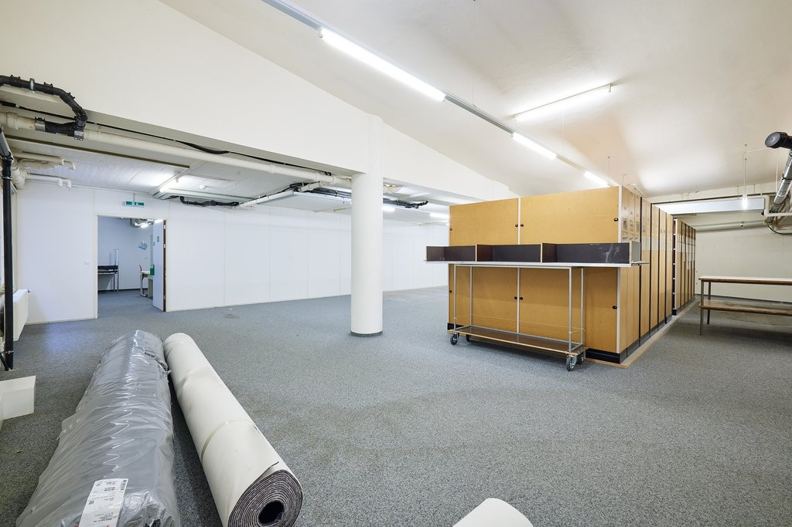
*`06.jpg` — 1024x683 px*

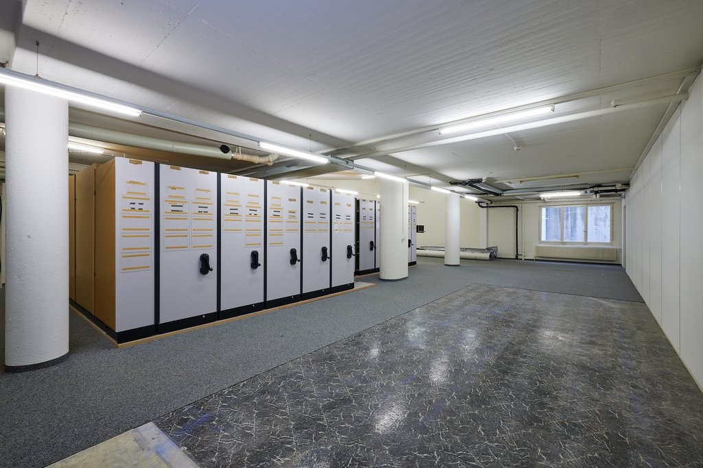
*`07.jpg` — 1024x683 px*

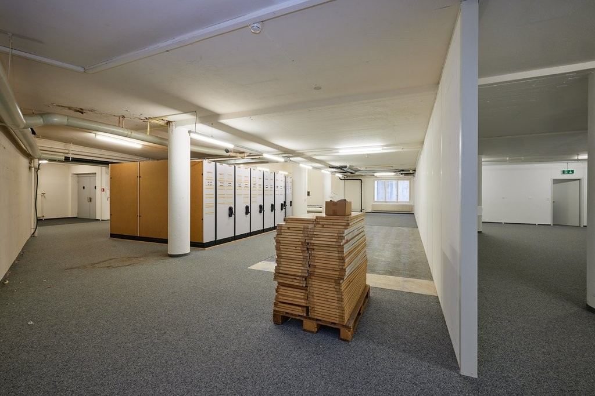
*`08.jpg` — 1024x683 px*

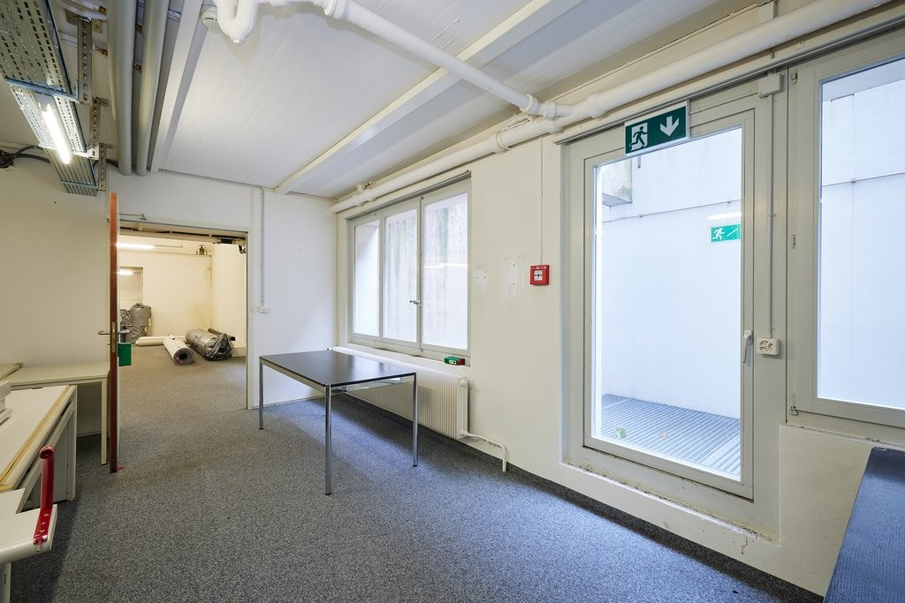
*`09.jpg` — 1024x683 px*

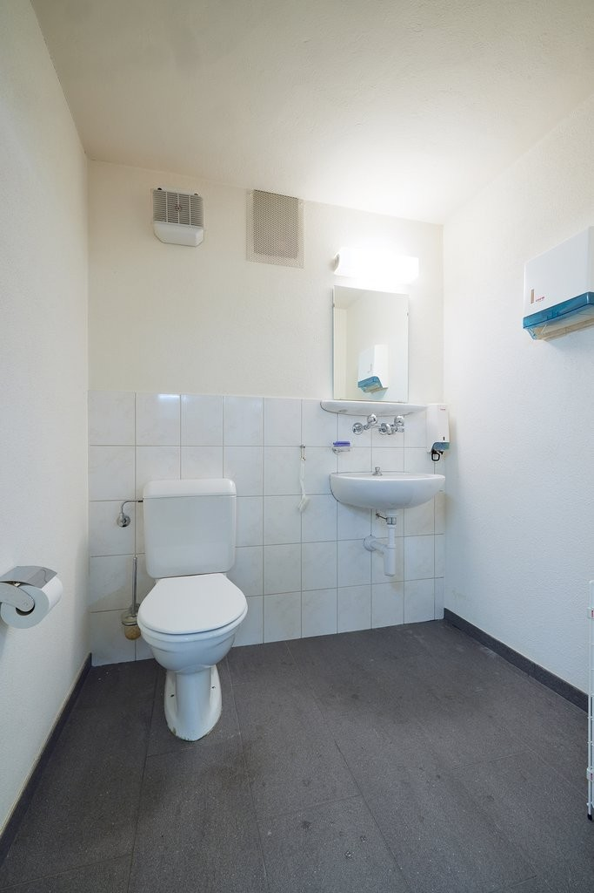
*`10.jpg` — 683x1024 px*

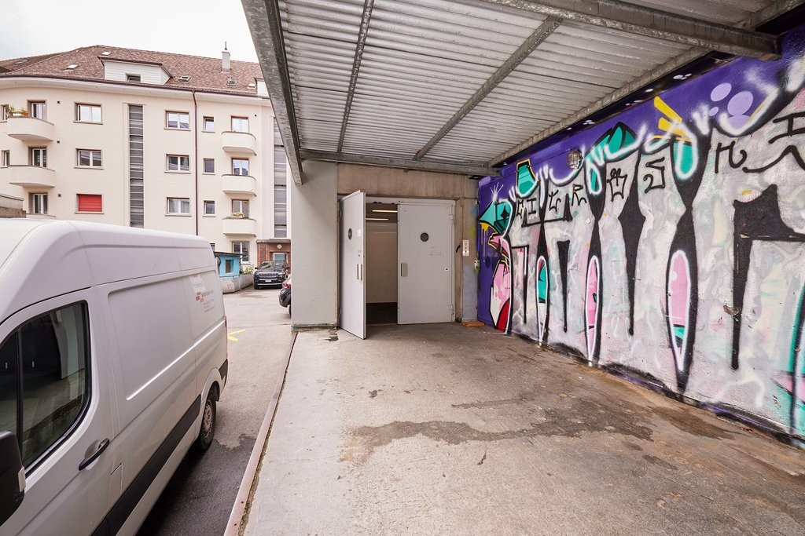
*`11.jpg` — 1024x683 px*

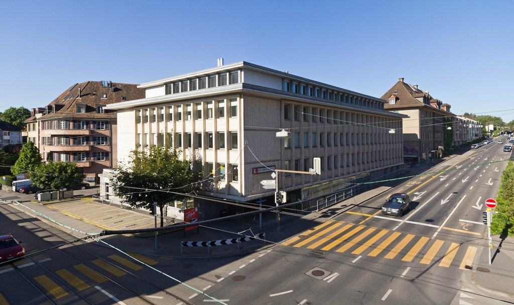
*`12.jpg` — 1024x609 px — Aussenansicht*
