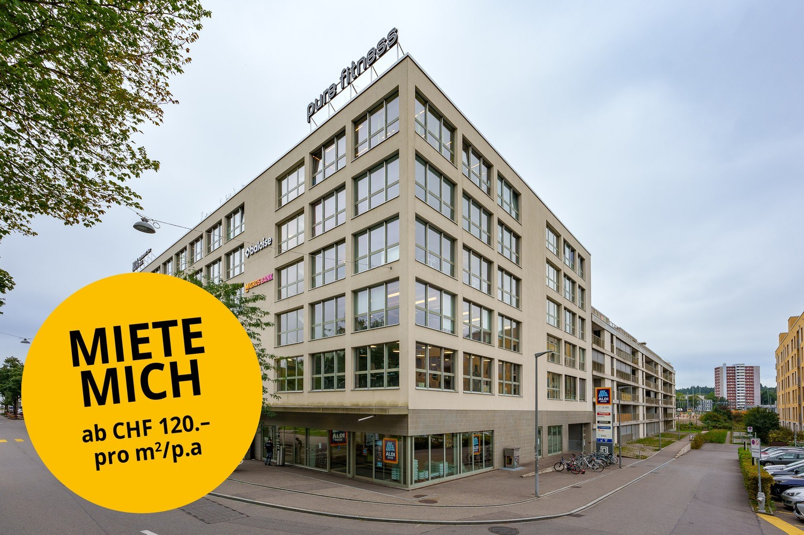
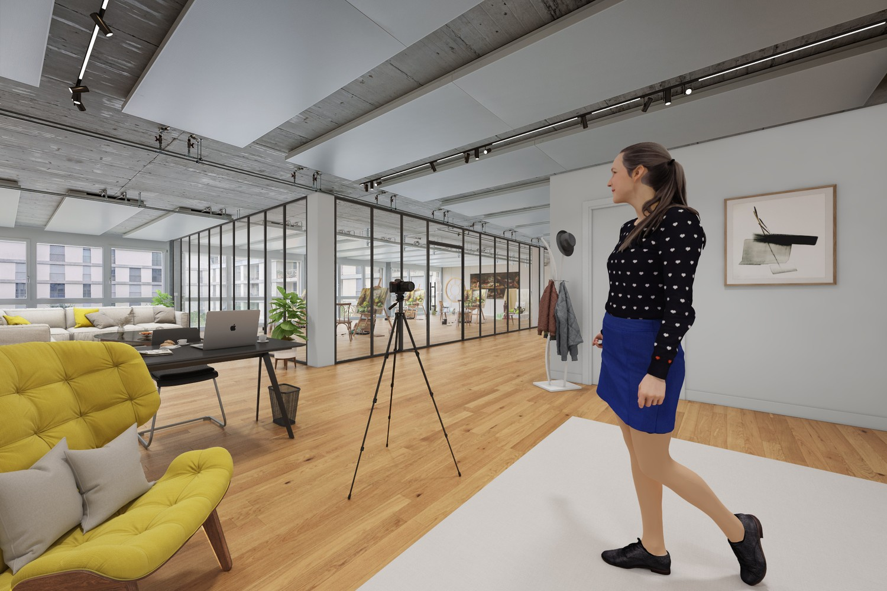
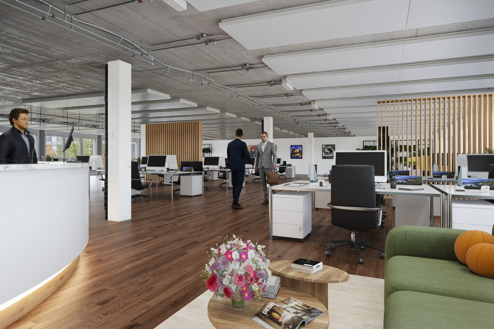
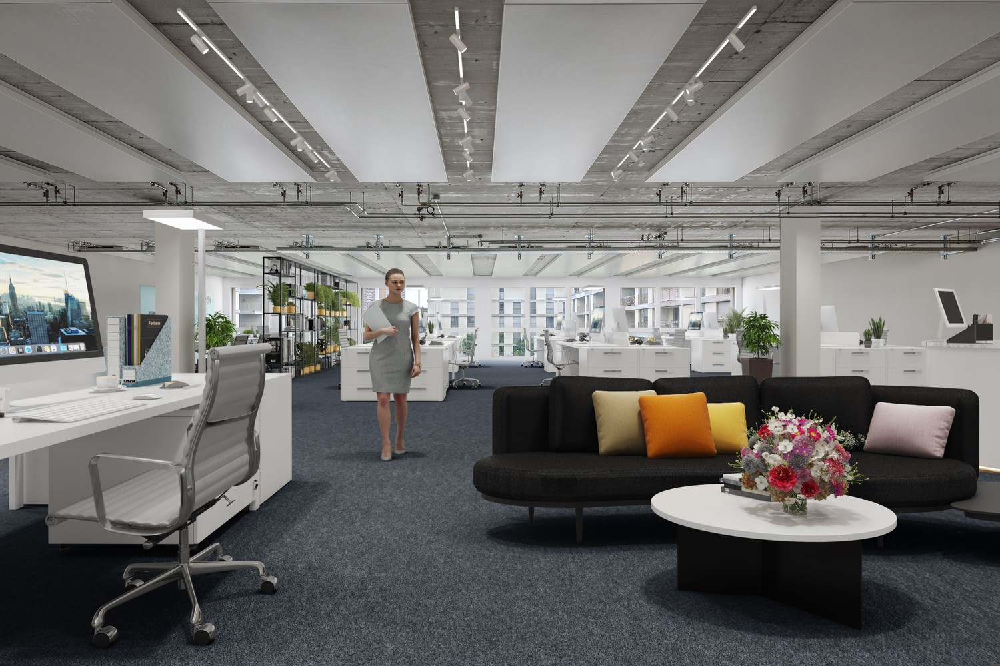
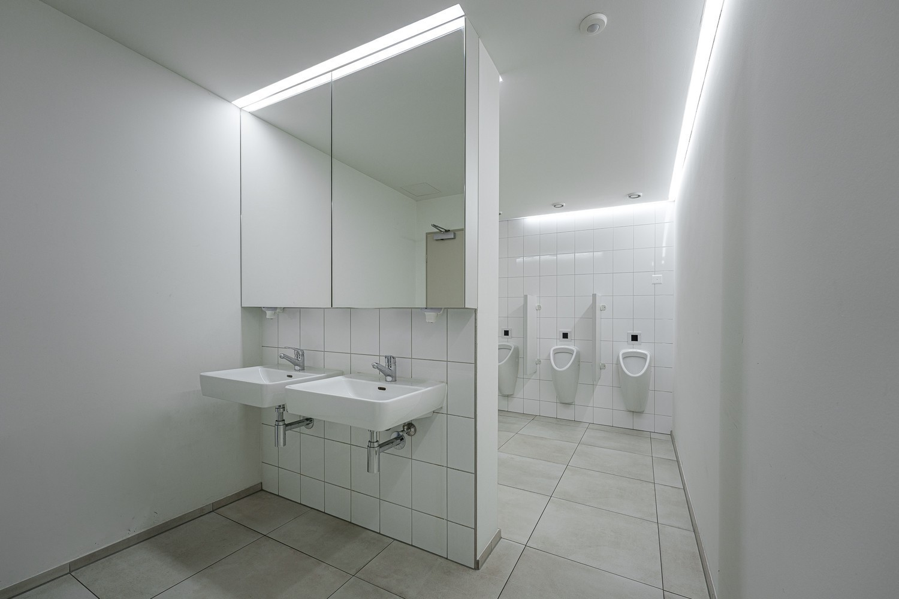
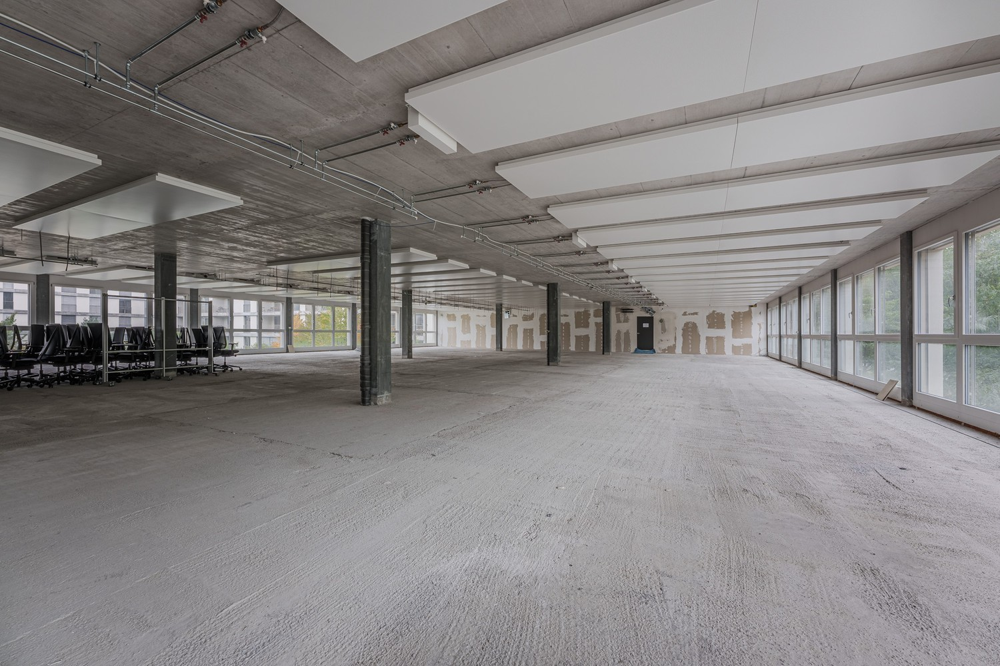
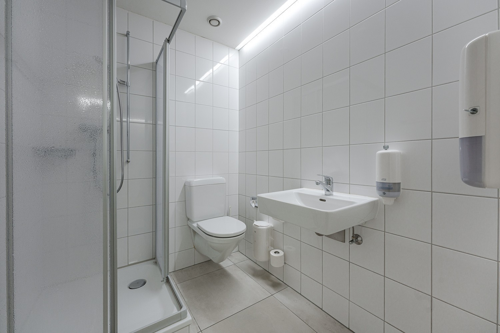
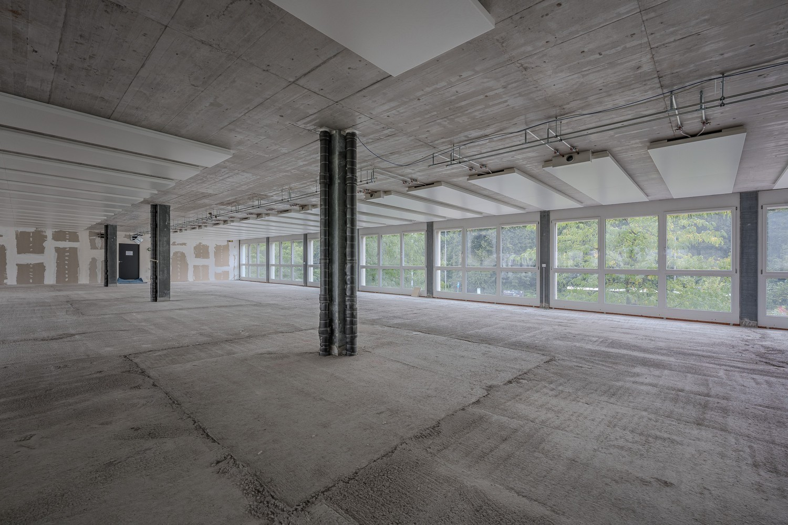
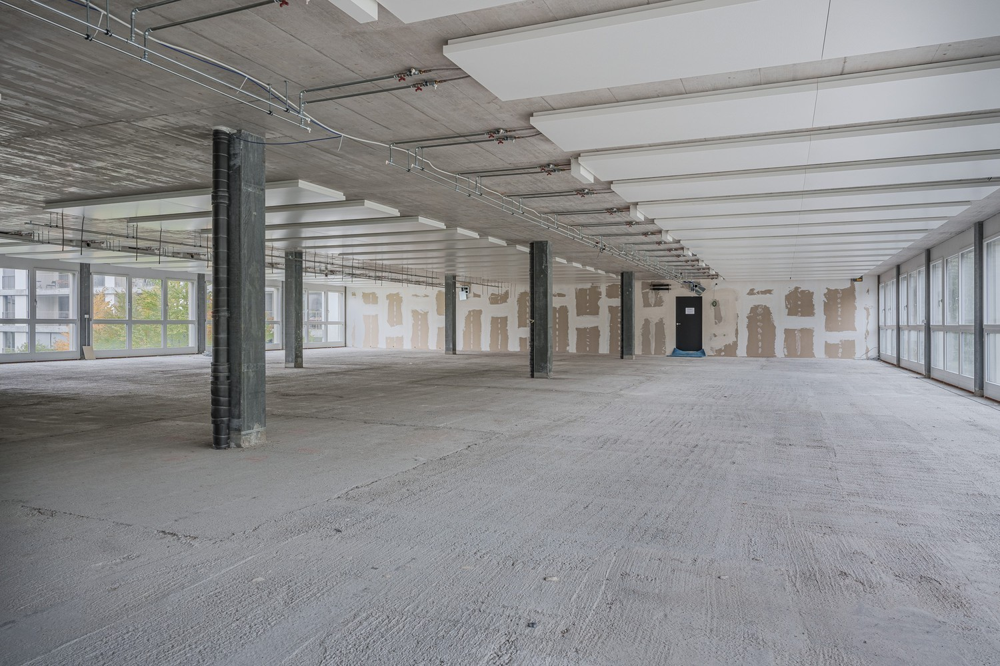
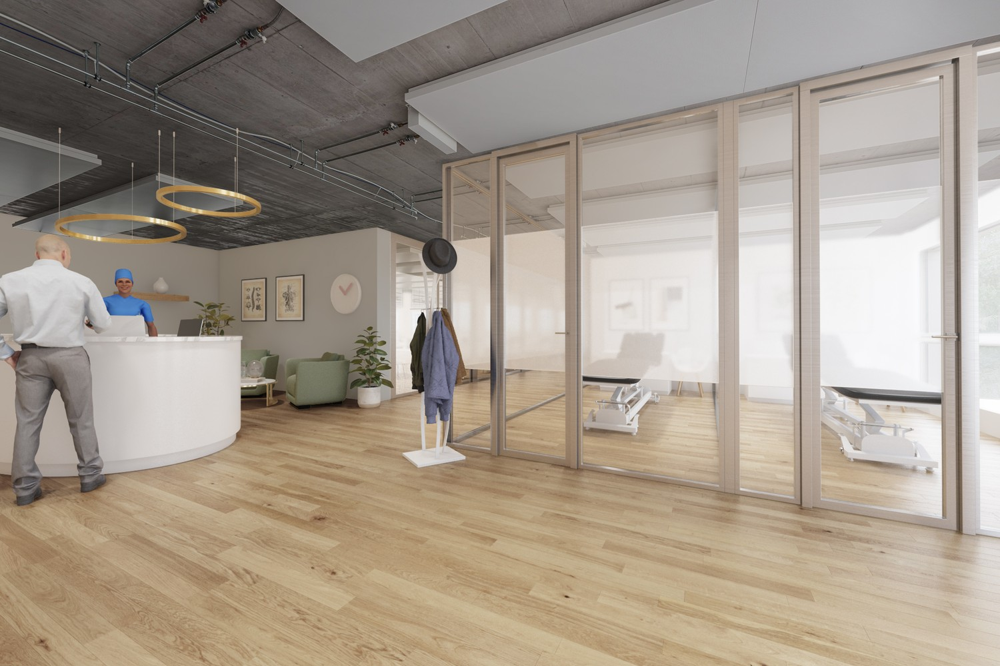

# Murtenstrasse 143, 3008 Bern - CHF 120 exkl. NK pro m² / Jahr

> **Categorie:** `B_buero_gewerbe`  
> **Regiune:** Berna (oraș)  
> **Tip ofertă:** RENT / OFFICE  
> **Relevant pentru praxis:** da (praxisfläche)  
> **Sursă:** [flatfox.ch](https://flatfox.ch/de/wohnung/murtenstrasse-143-3008-bern/1603575/)  
> **Descărcat:** 2026-08-17 12:24

## Date obiect

| Câmp | Valoare |
|---|---|
| Adresă | Murtenstrasse 143, 3008 Bern |
| Categorie obiect | INDUSTRY |
| Tip obiect | OFFICE |
| Chirie netă | CHF 120 |
| Preț afișat | CHF 120 |
| Suprafață utilă | 235 m² |
| Etaj | 1 |
| An construcție | 2011 |
| Disponibil de la | agr |
| Referință | VM100.0321033.08 |

## Texte originale (germană)

**Titlu public:** Murtenstrasse 143, 3008 Bern - CHF 120 exkl. NK pro m² / Jahr

**Titlu scurt:** 235m² Büro

**Pitch:** 235m² Büro in Bern mieten

**Titlu descriere:** Ihre neue Business-Location in Bern

**Titlu chirie:** 235m² Büro in Bern mieten

**Spațiu afișat:** 235

### Descriere completă

**Attraktive Mietzinskonditionen ab CHF 120.-/m2/p.a. (netto) - melden Sie sich für ein einmaliges Angebot!**  
  
Wir vermieten ab sofort oder nach Vereinbarung diverse Büro- sowie Praxisflächen im Obergeschoss an der Murtenstrasse 143 in Bern. Die Fläche im 1. OG befindet sich im Rohbau und kann - ganz nach Ihren Bedürfnissen - ausgebaut werden.  
  
In der Liegenschaft befindet sich zudem ein Warenlift.  
  
**Attraktiver Standort für Ihr Business**  
Die Liegenschaft an der Murtenstrasse 143 in Bern liegt zentral in Bern im Ausserholligen Quartier. Via ÖV sind Sie in 10 Minuten im Zentrum Berns oder in 10 Minuten am Bahnhof.  
Von auswärts gelangen Sie über die A1 zur Liegenschaft, ohne dass Sie durch das Zentrum der Stadt fahren müssen.  
  
**Erste Highlights:**  
  

*   Sehr helle Büroflächen (Unterteilung flexibel gestaltbar)
*   IT-Anschlüsse vorhanden
*   Konferenz- und Seminarraum direkt auf der Etage
*   2 Personenaufzüge und 1 Warenlift
*   WC-Anlagen pro Etage
*   Idealer Mietermix im Gebäude mit Aldi, Noa, Fitness, uvm.
*   Ausreichend Parkplätze sind vorhanden - Einstellhalle

Lassen Sie sich von den weiteren Highlights direkt vor Ort überzeugen und vereinbaren Sie noch heute einen Besichtigungstermin mit uns!  
  
**Weiteres Angebot:**  
  

*   Diverse Lagerflächen sowie Einstellplätze können dazu gemietet werden. Bitte melden Sie sich bei uns für weitere Informationen.

**Konditionen:**  
Der Nettomietzins von CHF 120 pro m²/Jahr (zzgl. NK) im ersten Jahr basiert auf einer 5-jährigen Vertragsdauer und versteht sich als Startpreis.  
Auch nach Ablauf der Rabattierung im ersten Jahr können wir Ihnen weiterhin attraktive Mietzinse anbieten; je nach Mietdauer, Ausbau & Fläche die Sie wünschen.  
  
Kontaktieren Sie uns gerne für Angaben zu den Konditionen.  
  
Sie wünschen weitere Auskünfte? Wir beraten Sie gerne und zeigen Ihnen die Räumlichkeiten bei einem persönlichen Besichtigungstermin. Wir freuen uns auf Ihre Anfrage.  
  
_\*Die aufgeführten Impressionen (Fotos) sind urheberrechtlich geschützt und dürfen nicht von Dritten verwendet werden. Die Flächen werden ohne Einrichtung vermietet._

## Dotări (attributes)

- parkingspace
- lift
- view

## Ofertant

- **Nume:** Privera AG
- **Stradă:** Worbstrasse 142
- **NPA:** 3073
- **Localitate:** Gümligen

## Imagini (10)

*`01.jpg` — 1500x1000 px*

*`02.jpg` — 1500x1000 px*

*`03.jpg` — 1500x1000 px*

*`04.jpg` — 1500x1000 px*

*`05.jpg` — 1500x1000 px*

*`06.jpg` — 1500x1000 px*

*`07.jpg` — 1500x1000 px*

*`08.jpg` — 1500x1000 px*

*`09.jpg` — 1500x1000 px*

*`10.jpg` — 1500x1000 px*

## Media suplimentară

- **video_url:** https://vimeo.com/1012064633?share=copy
