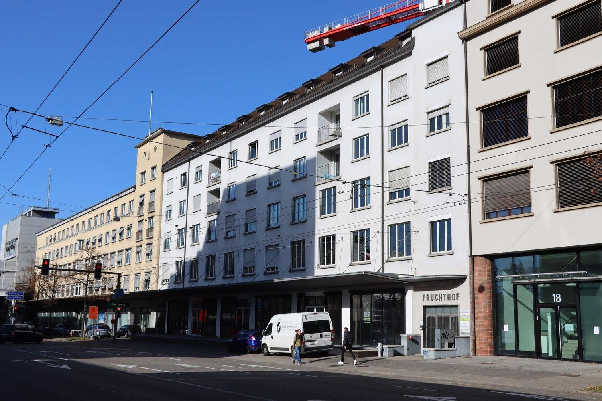
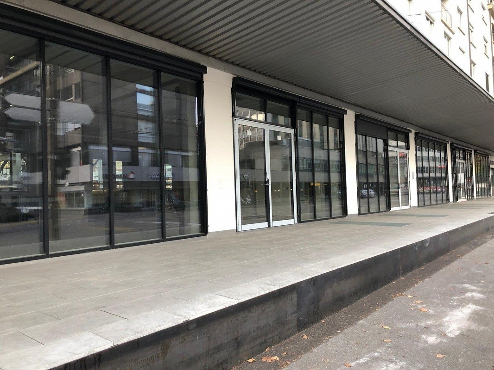
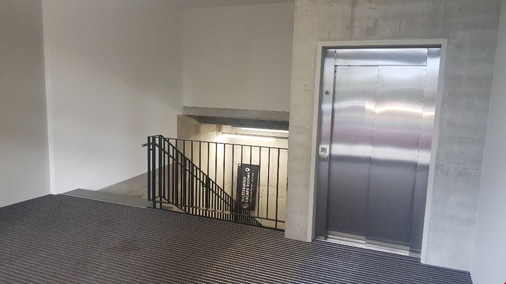
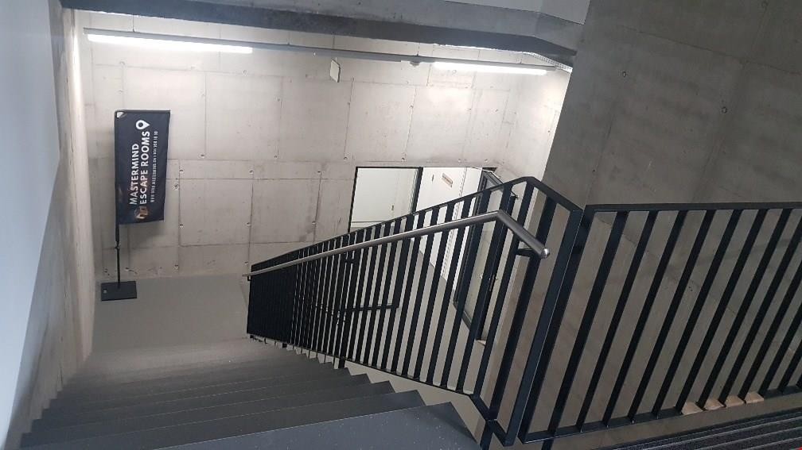
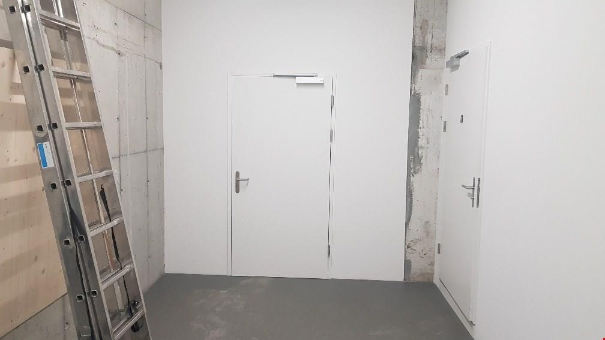
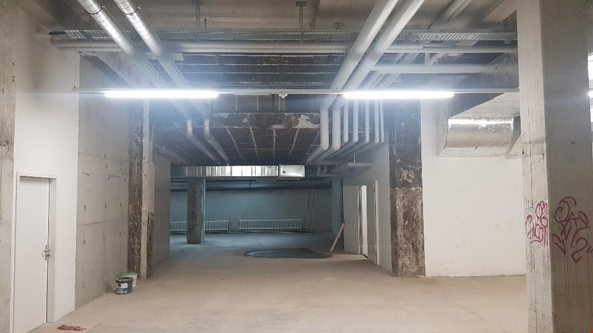
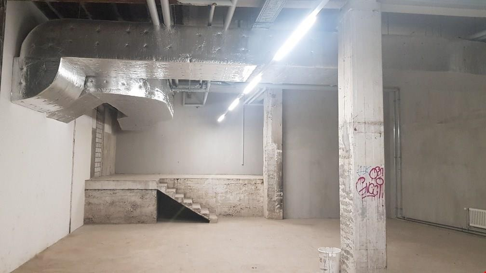
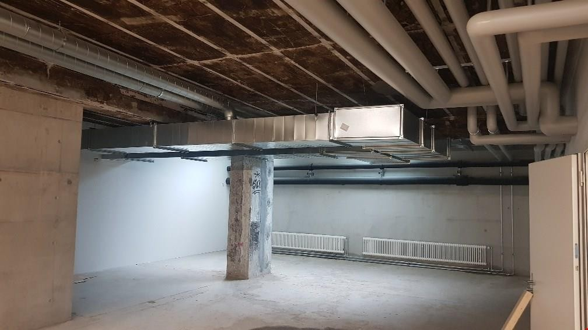
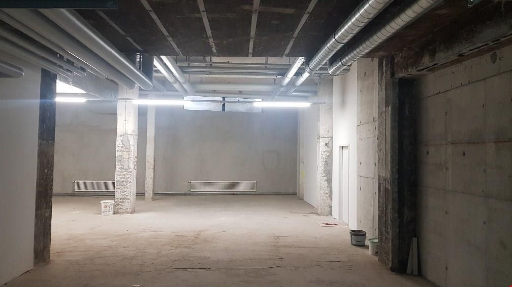

# Laupenstrasse 20, 3011 Bern - auf Anfrage

> **Categorie:** `B_buero_gewerbe`  
> **Regiune:** Berna (oraș)  
> **Tip ofertă:** RENT / COMMERCIAL  
> **Sursă:** [flatfox.ch](https://flatfox.ch/de/wohnung/laupenstrasse-20-3011-bern/1643193/)  
> **Descărcat:** 2026-08-17 12:34

## Date obiect

| Câmp | Valoare |
|---|---|
| Adresă | Laupenstrasse 20, 3011 Bern |
| Categorie obiect | INDUSTRY |
| Tip obiect | COMMERCIAL |
| Suprafață utilă | 251 m² |
| Etaj | -1 |
| Disponibil de la | imm |
| Referință | 4020..100 |

## Texte originale (germană)

**Titlu public:** Laupenstrasse 20, 3011 Bern - auf Anfrage

**Titlu scurt:** 251m² Gewerbe

**Pitch:** 251m² Gewerbe in Bern mieten

**Titlu descriere:** 251 m2 Gewerberäume

**Titlu chirie:** 251m² Gewerbe in Bern mieten

**Spațiu afișat:** 251

### Descriere completă

Wir vermieten per sofort oder nach Vereinbarung einen Dienstleistungs- und Gewerberaum im Rohbau direkt am Banhof Bern.  
  
Die Räumlichkeit befindet sich im 1. Untergeschoss und ist über ein Treppenhaus sowie mit dem Personenlift erschlossen und somit Rollstuhlgängig. Zur Mitbenutzung gehören WC-Anlagen inklusive Dusche.  
  
Die Liegenschaft ist optimal an den öffentlichen Verkehr angeschlossen. Praktisch vor der Haustüre befinden sich diverse Bus- und Tramlinien (Hirschengraben).  
  
Vermietung im Grundausbau. Ausbau erfolgt seitig Mieterschaft.  
  
Festlegung Nebenkosten gemäss Nutzung.  
  
Haben wir Ihr Interesse geweckt? Wir freuen uns auf Ihren Anruf

## Dotări (attributes)

- lift
- accessiblewithwheelchair

## Ofertant

- **Nume:** Haussener Verwaltungen AG
- **Stradă:** Monbijoustrasse 22
- **NPA:** 3001
- **Localitate:** Bern

## Imagini (9)

*`01.jpg` — 1500x1000 px*

*`02.jpg` — 1066x800 px*

*`03.jpg` — 1008x567 px*

*`04.jpg` — 1008x567 px*

*`05.jpg` — 1008x567 px*

*`06.jpg` — 1008x567 px*

*`07.jpg` — 1008x567 px*

*`08.jpg` — 1008x567 px*

*`09.jpg` — 1008x567 px*
