# Kirchackerweg 29, 3122 Kehrsatz - CHF 4’425 inkl. NK pro Monat

> **Categorie:** `B_buero_gewerbe`  
> **Regiune:** Cantonul Berna  
> **Tip ofertă:** RENT / COMMERCIAL  
> **Sursă:** [flatfox.ch](https://flatfox.ch/de/wohnung/kirchackerweg-29-3122-kehrsatz/1664582/)  
> **Descărcat:** 2026-08-17 12:35

## Date obiect

| Câmp | Valoare |
|---|---|
| Adresă | Kirchackerweg 29, 3122 Kehrsatz |
| Categorie obiect | INDUSTRY |
| Tip obiect | COMMERCIAL |
| Chirie netă | CHF 3'788 |
| Nebenkosten | CHF 637 |
| Preț afișat | CHF 4'425 |
| Suprafață utilă | 505 m² |
| Etaj | 0 |
| Disponibil de la | agr |
| Referință | 213681..193101 |

## Texte originale (germană)

**Titlu public:** Kirchackerweg 29, 3122 Kehrsatz - CHF 4’425 inkl. NK pro Monat

**Titlu scurt:** 505m² Gewerbe

**Pitch:** 505m² Gewerbe in Kehrsatz mieten

**Titlu descriere:** Raum für Ihren Betrieb – 505 m² Gewerbefläche mit Laderampe in Kehrsatz

**Titlu chirie:** 505m² Gewerbe in Kehrsatz mieten

**Spațiu afișat:** 505

### Descriere completă

Sie suchen eine vielseitig nutzbare Gewerbefläche mit viel Platz, praktischer Infrastruktur und guter Erreichbarkeit?  
  
Am Kirchackerweg 29 in Kehrsatz vermieten wir rund 505 m² Gewerbefläche im Erdgeschoss. Die Räumlichkeiten eignen sich ideal für Werkstatt, Produktion, Montage, Lager oder für Betriebe, die verschiedene Nutzungen an einem Standort kombinieren möchten.  
Grosszügige Flächen, eine praktische Laderampe und die vorhandene betriebliche Infrastruktur schaffen gute Voraussetzungen für unterschiedlichste Gewerbekonzepte. Die bestehenden Raumunterteilungen ermöglichen zudem eine sinnvolle Trennung von Arbeits-, Lager- und Nebenflächen.  
  
Willkommen sind etablierte Unternehmen ebenso wie Start-ups und junge Betriebe, die Raum für ihre Ideen und ihre weitere Entwicklung suchen.  
  
Das bietet Ihnen die Fläche  

*   ca. 505 m² Gewerbefläche im Erdgeschoss
*   grosszügige und vielseitig nutzbare Arbeits-, Produktions- und Lagerbereiche
*   50 m² Laderampe für eine unkomplizierte Warenanlieferung
*   Raumhöhe von ca. 2.95 m
*   75-Ampere-Stromanschluss
*   bestehende Raumunterteilungen
*   eigene Sanitäranlagen
*   Aussenpark- und Abstellmöglichkeiten
*   gute Erreichbarkeit von Bern und der Region

Die Liegenschaft bietet eine unkomplizierte und funktionale Basis für Unternehmen, die viel Raum benötigen und Wert auf ein gutes Verhältnis zwischen Fläche, Infrastruktur und Kosten legen.  
  
Ob Sie einen neuen Standort suchen, Ihren Betrieb vergrössern oder mit einer neuen Geschäftsidee durchstarten möchten – hier finden Sie den passenden Raum dafür.

## Dotări (attributes)

- parkingspace
- dishwasher
- ramp

## Ofertant

- **Nume:** Burgergemeinde Bern, Immobilien
- **Nume 2:** p. A. Domänenverwaltung
- **Stradă:** Bahnhofplatz 2, Postfach
- **NPA:** 3001
- **Localitate:** Bern

## Imagini (14)

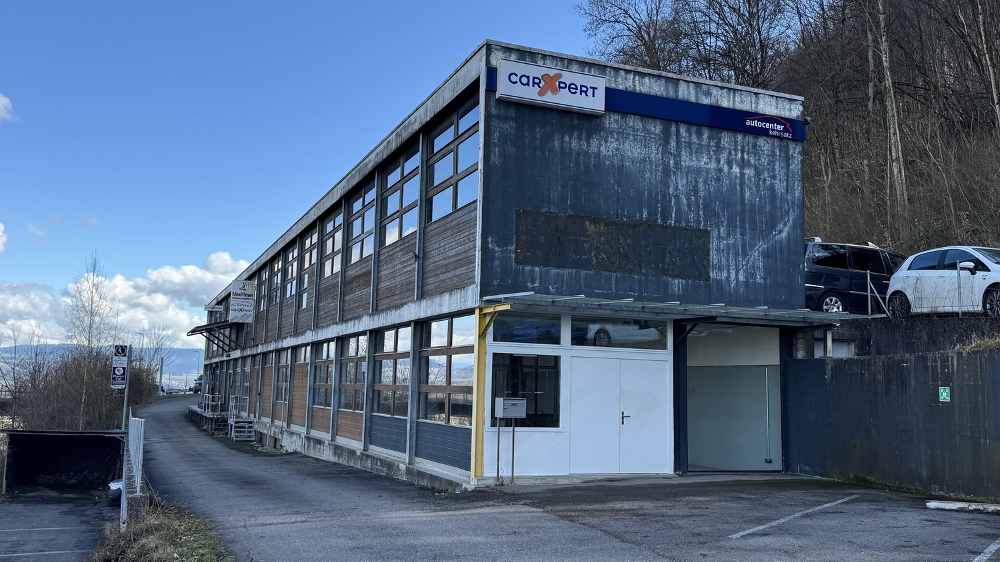
*`01.jpg` — 1500x844 px*

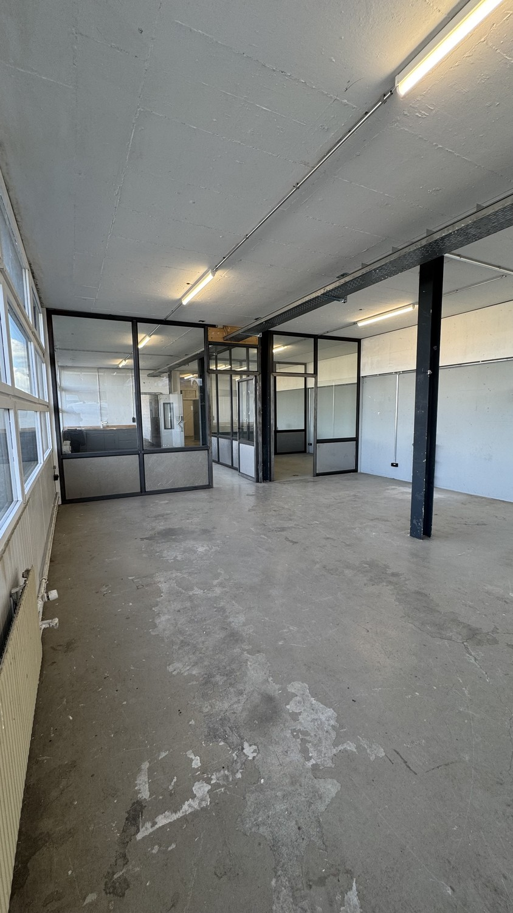
*`02.jpg` — 844x1500 px*

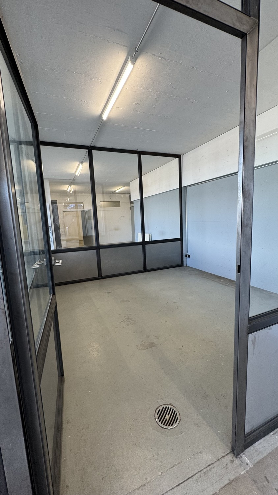
*`03.jpg` — 844x1500 px*

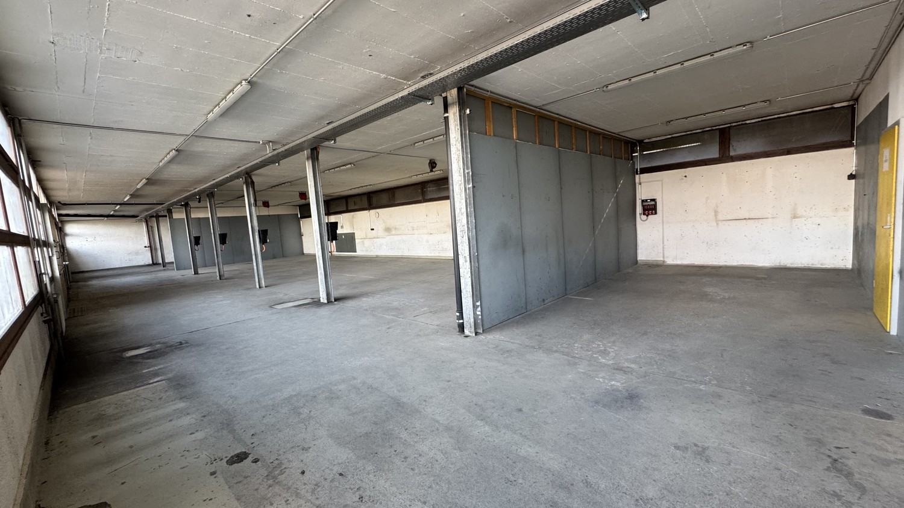
*`04.jpg` — 1500x844 px*

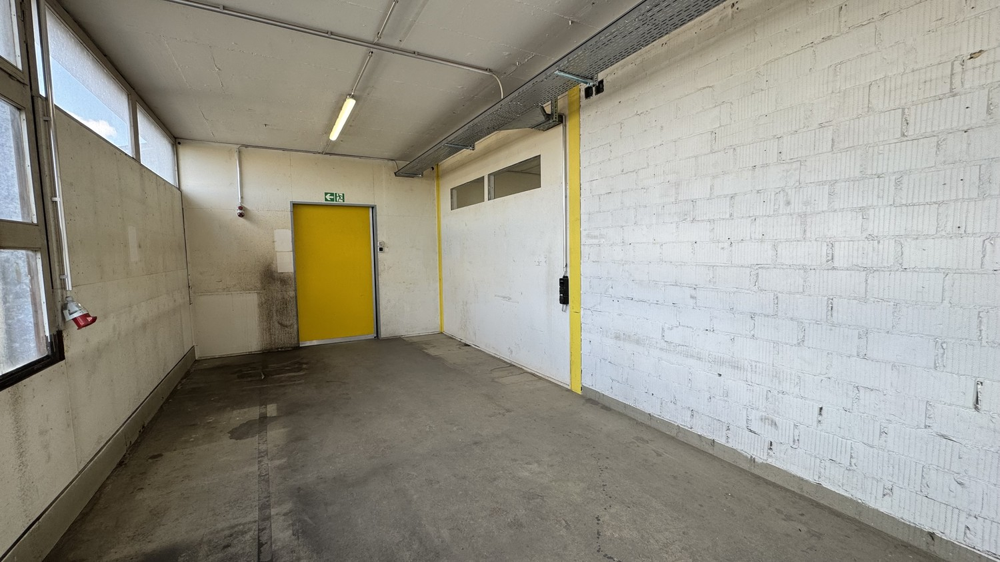
*`05.jpg` — 1500x844 px*

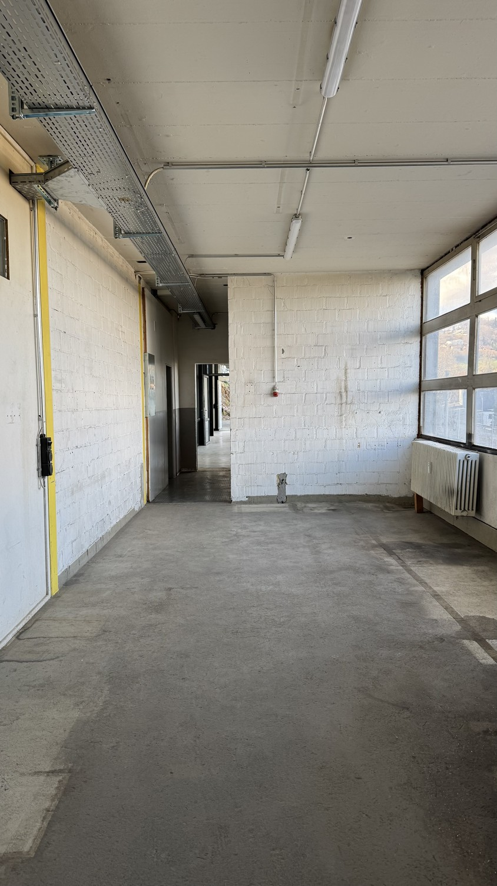
*`06.jpg` — 844x1500 px*

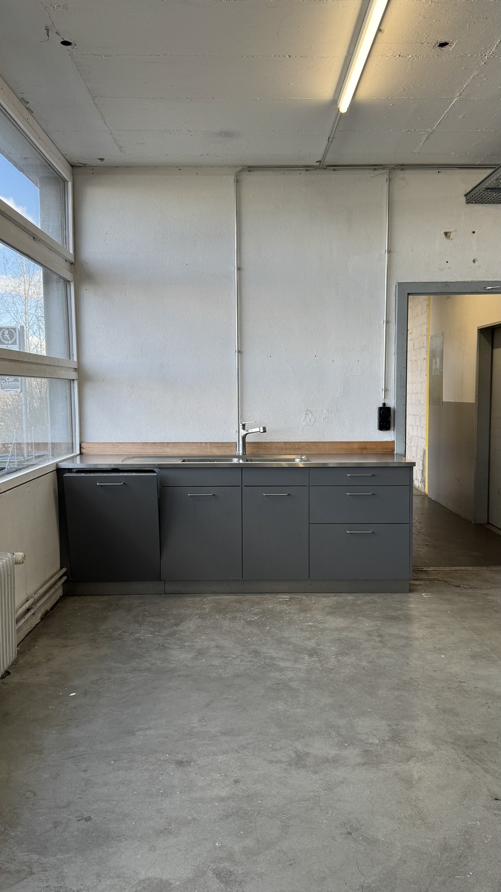
*`07.jpg` — 844x1500 px*

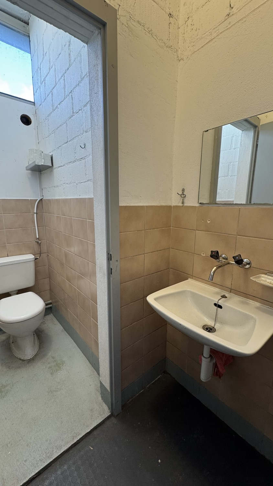
*`08.jpg` — 844x1500 px*

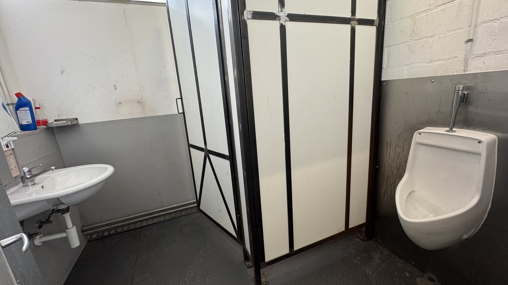
*`09.jpg` — 1500x844 px*

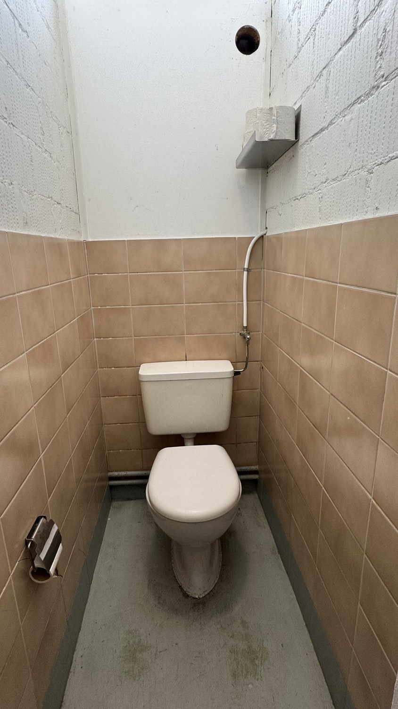
*`10.jpg` — 844x1500 px*

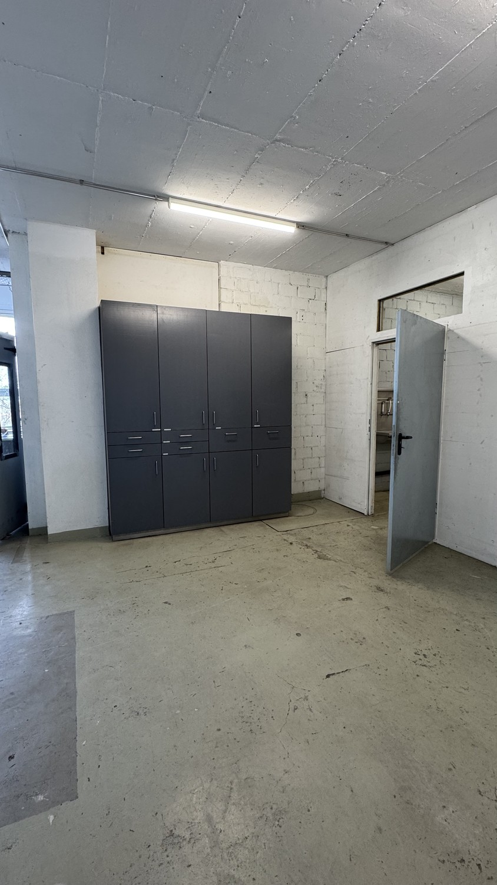
*`11.jpg` — 844x1500 px*

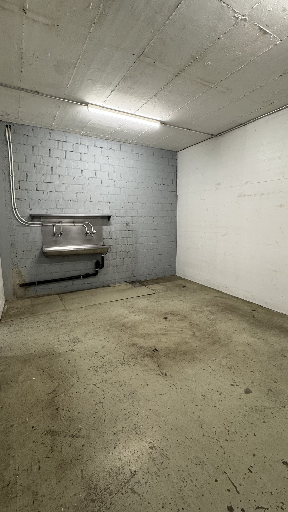
*`12.jpg` — 844x1500 px*

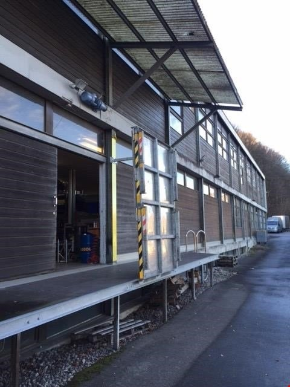
*`13.jpg` — 480x640 px — Laderampe*

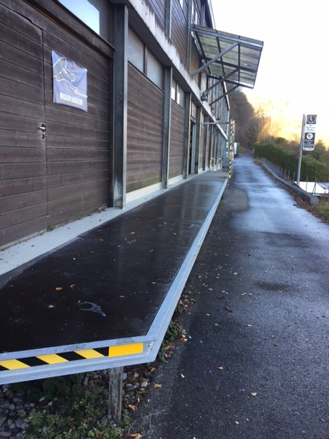
*`14.jpg` — 480x640 px*
