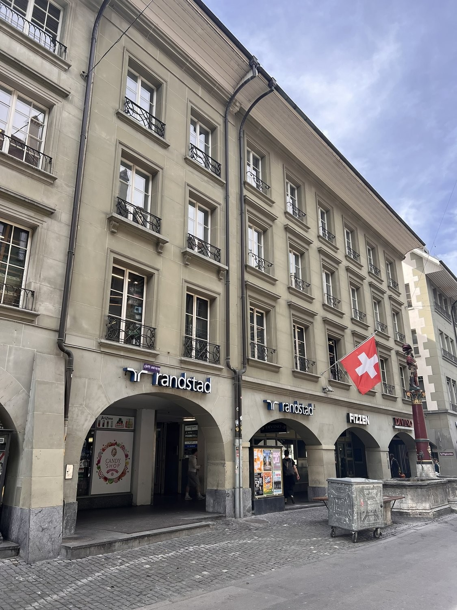
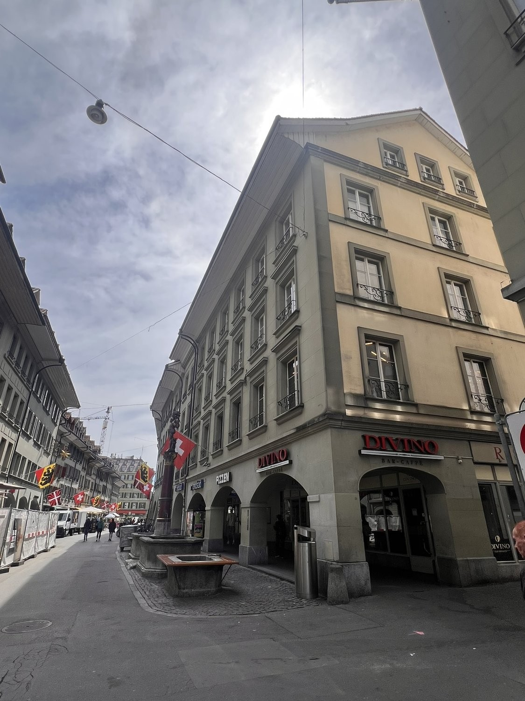
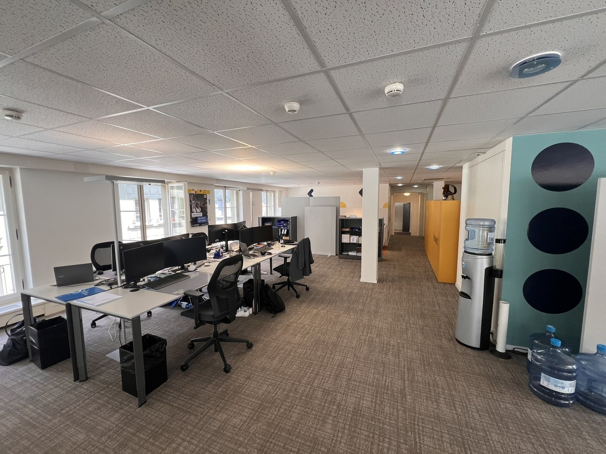
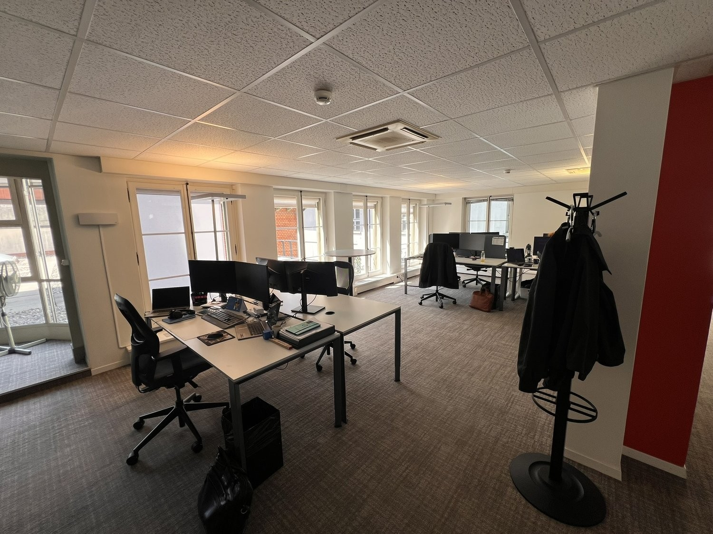
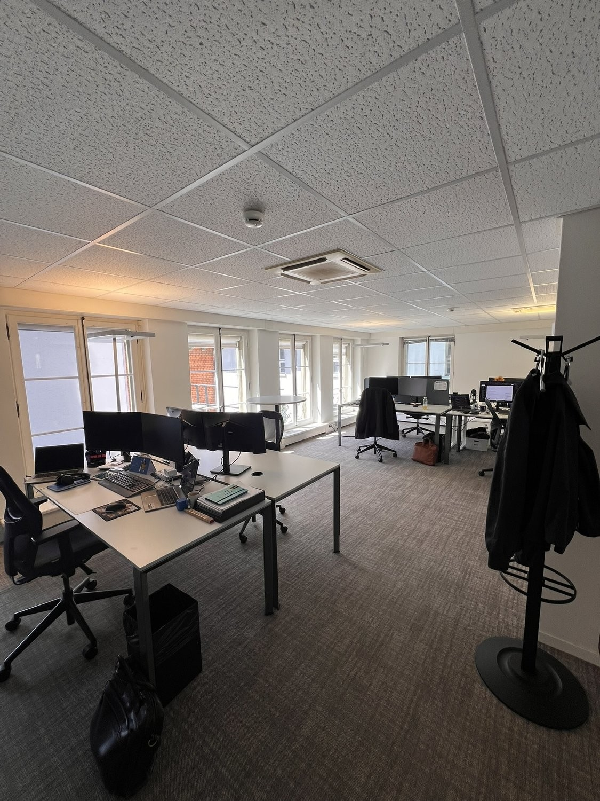
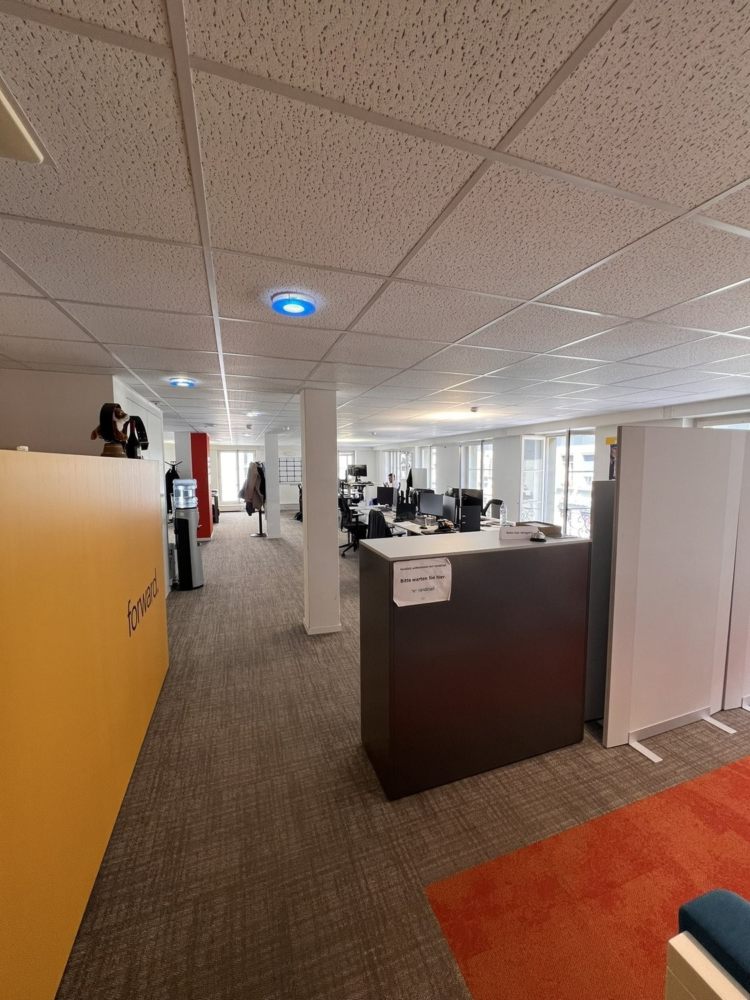
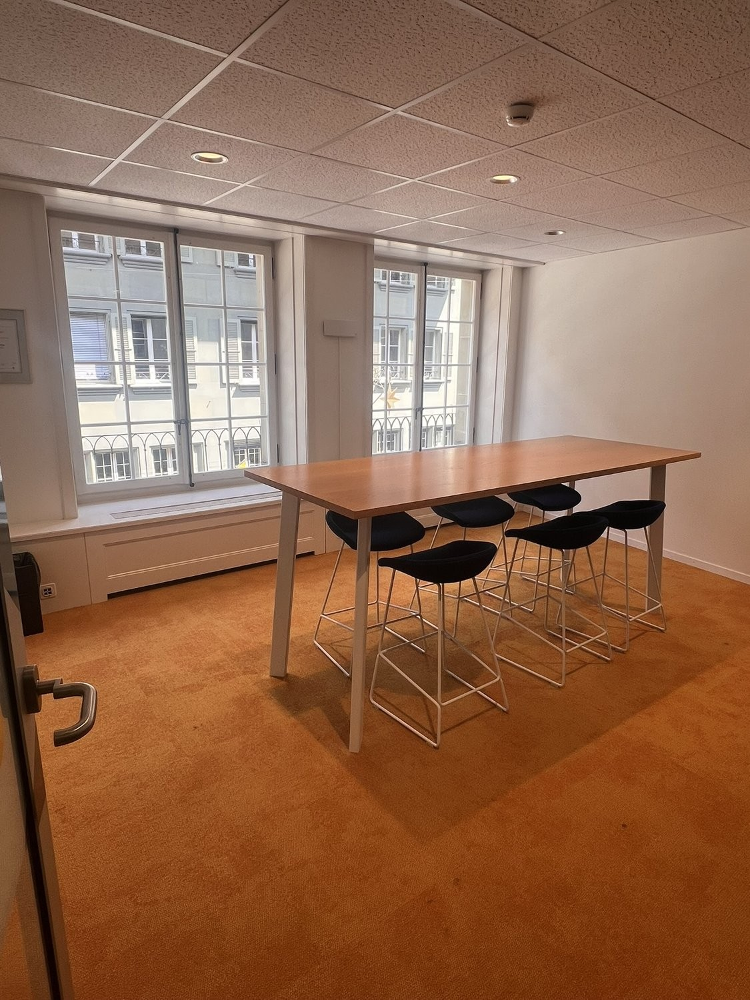
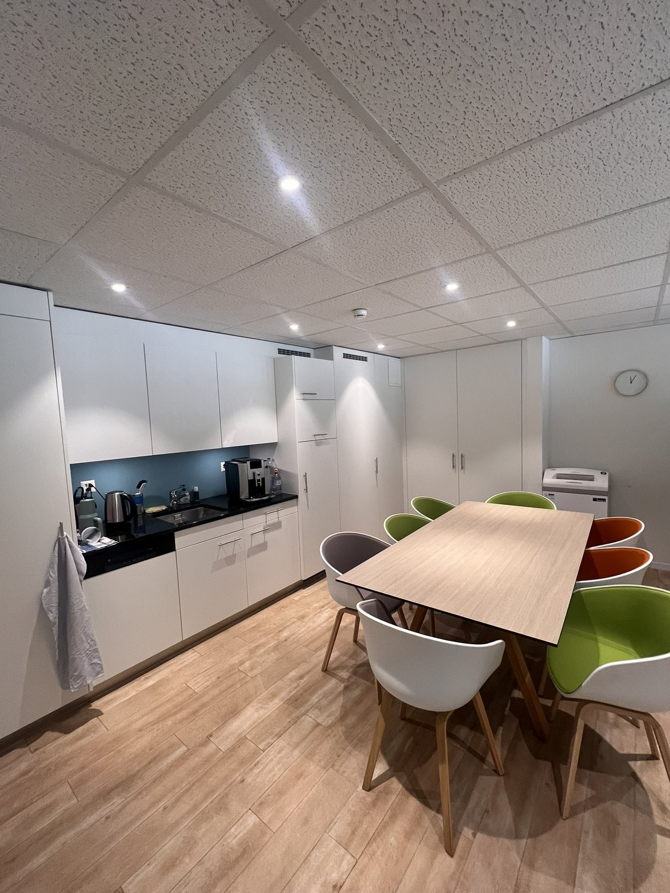

# Aarbergergasse 33, 3011 Bern - auf Anfrage

> **Categorie:** `B_buero_gewerbe`  
> **Regiune:** Berna (oraș)  
> **Tip ofertă:** RENT / OFFICE  
> **Relevant pentru praxis:** da (praxisräume)  
> **Sursă:** [flatfox.ch](https://flatfox.ch/de/wohnung/aarbergergasse-33-3011-bern/1717613/)  
> **Descărcat:** 2026-08-17 12:28

## Date obiect

| Câmp | Valoare |
|---|---|
| Adresă | Aarbergergasse 33, 3011 Bern |
| Categorie obiect | INDUSTRY |
| Tip obiect | OFFICE |
| Etaj | 2 |
| An construcție | 1903 |
| Disponibil de la | imm |
| Referință | 7631..1022 |

## Texte originale (germană)

**Titlu public:** Aarbergergasse 33, 3011 Bern - auf Anfrage

**Titlu scurt:** Büro

**Pitch:** Büro in Bern mieten

**Titlu descriere:** Flexibel einteilbare Büroflächen in der Altstadt Bern

**Titlu chirie:** Büro in Bern mieten

### Descriere completă

Die Mieträume befinden sich an der Aarbergergasse 33/35, 3 Gehminuten ab dem Hauptbahnhof zu erreichen.   
  
Sind Sie auf der Suche nach flexibel einteilbaren Gewerbeflächen mit gemeinschaftlicher Nutzung von Office, Sitzungszimmer, Küche und WC's? Die entsprechenden Flächen ab ca. 15 m2 (exkl. Anteil gemeischaftlich genutzter Teil) bis ca. 234 m2 befinden sich im 2.OG und eignen sich sehr gut für Büro- oder Praxisräume. Die Flächen sind über Treppe oder Lift (rollstuhlgängig) erreichbar. Zurzeit besteht ein Mieterausbau (grundsätzlich Rohbaumiete).   
  
\- Damen- und Herrentoilette   
\- Ausbau oder Teilausbau können übernommen werden   
\- Zusätzlicher Lagerraum von 10.5 m2 kann dazugemietet werden   
  
Für Fragen und eine unverbindliche Besichtigung stehen wir Ihnen gerne zur Verfügung.   
  
Wir freuen uns auf Ihre Kontaktaufnahme.

## Ofertant

- **Nume:** BDO AG Bern

## Imagini (8)

*`01.jpg` — 1125x1500 px — IMG_1982*

*`02.jpg` — 1125x1500 px — IMG_1991*

*`03.jpg` — 1500x1125 px — IMG_1970*

*`04.jpg` — 1500x1125 px — IMG_1969*

*`05.jpg` — 1125x1500 px — IMG_1967*

*`06.jpg` — 1125x1500 px — IMG_1965*

*`07.jpg` — 1125x1500 px — IMG_1957*

*`08.jpg` — 1125x1500 px — IMG_1959*
