# Worbstrasse 97, 3074 Muri b. Bern - auf Anfrage

> **Categorie:** `B_buero_gewerbe`  
> **Regiune:** Cantonul Berna  
> **Tip ofertă:** RENT / COMMERCIAL  
> **Sursă:** [flatfox.ch](https://flatfox.ch/de/wohnung/worbstrasse-97-3074-muri-b-bern/1785311/)  
> **Descărcat:** 2026-08-17 12:33

## Date obiect

| Câmp | Valoare |
|---|---|
| Adresă | Worbstrasse 97, 3074 Muri b. Bern |
| Categorie obiect | INDUSTRY |
| Tip obiect | COMMERCIAL |
| Suprafață utilă | 8026 m² |
| Disponibil de la | 2027-01-01 |
| Referință | 215301..140001 |

## Texte originale (germană)

**Titlu public:** Worbstrasse 97, 3074 Muri b. Bern - auf Anfrage

**Titlu scurt:** 8026m² Gewerbe

**Pitch:** 8026m² Gewerbe in Muri b. Bern mieten

**Titlu descriere:** Vielseitig nutzbares Lager- und Gewerbegebäude zur Zwischennutzung in Muri (BE)

**Titlu chirie:** 8026m² Gewerbe in Muri b. Bern mieten

**Spațiu afișat:** 8026

### Descriere completă

An gut erschlossener Lage an der Worbstrasse 97 in Muri wird ab Anfang 2027 ein vielseitig nutzbares Lager- und Gewerbegebäude zur Zwischennutzung angeboten. Mittelfristig ist eine umfassende Sanierung der Liegenschaft vorgesehen. Der genaue Zeitpunkt sowie die Umsetzung erfolgen jedoch in Abstimmung mit der zukünftigen Mieterschaft, wodurch sich interessante und planbare Nutzungsperspektiven ergeben.  
  
**Objektbeschreibung**  
  
Die Liegenschaft wird aktuell als Lager genutzt, ein Teil der Flächen ist als einfache Bürofläche ausgebaut. Das Gebäude ist nicht klimatisiert.  
Dank grosszügigen Geschosshöhen und effizienter Flächenaufteilung eignet sich das Gebäude ideal für Lager-, Logistik-, oder Gewerbenutzungen (keine Wohnnutzung).  
  
Ein besonderer Vorteil besteht in der hohen Flexibilität: Es können sowohl Gesamtflächen als auch Teilflächen bzw. einzelne Geschosse gemietet werden. Der Flächenzuschnitt und die Nutzung können weitgehend an die Bedürfnisse der Mieterschaft angepasst werden.  
  
**Flächenübersicht (ca.)**  
  

*   Untergeschoss: ca. 1’621 m²
*   Erdgeschoss: ca. 1’472 m²
*   1\. Obergeschoss: ca. 1’652 m²
*   2\. Obergeschoss: ca. 1’660 m²
*   3\. Obergeschoss: ca. 1’621 m²
*   Totalfläche: ca. 8’026 m²
*   Aussenfläche: ca. 3’400 m²

**Raumhöhen (ca.)**  
  

*   Untergeschoss: ca. 4.05 m, teils 3.03 m
*   Erdgeschoss: ca. 3.07 m
*   1.–2. Obergeschoss: ca. 2.85 m
*   3\. Obergeschoss: ca. 3.38 m

**Traglasten**  
  

*   Erdgeschoss: 600 kg/m²
*   1\. Obergeschoss: 1’200 kg/m²
*   2\. Obergeschoss: 1’200 kg/m²
*   3\. Obergeschoss: 300 kg/m²

**Parkierung & Aussenanlagen**  
  

*   Ca. 11 Personenwagen-Parkplätze
*   LKW-Parkplätze vorhanden
*   Grosszügige Aussenflächen für Logistik, Umschlag oder Zwischenlager

**Ihre Vorteile auf einen Blick**  
  

*   Attraktive Zwischennutzung mit planbarer Perspektive
*   Hohe Flexibilität bei Flächenaufteilung und Nutzung
*   Anmietung von Teilflächen oder gesamten Geschossen möglich
*   Grosse, zusammenhängende Flächen
*   Hohe Traglasten für anspruchsvolle Nutzungen
*   Umfangreiche Aussenfläche
*   Teilweise bestehende Büroflächen
*   Gute Erreichbarkeit (Bern / Agglomeration)
*   Individuelle Konditionen je nach Nutzung und Laufzeit

**Mietbeginn**  
  
Nach Vereinbarung, ab Auszug des aktuellen Mieters per Anfang 2027.  
  
**Interessiert?**  
  
Gerne stellen wir Ihnen weitere Unterlagen zur Verfügung oder besichtigen die Flächen mit Ihnen vor Ort.

## Dotări (attributes)

- parkingspace
- lift

## Imagini (12)

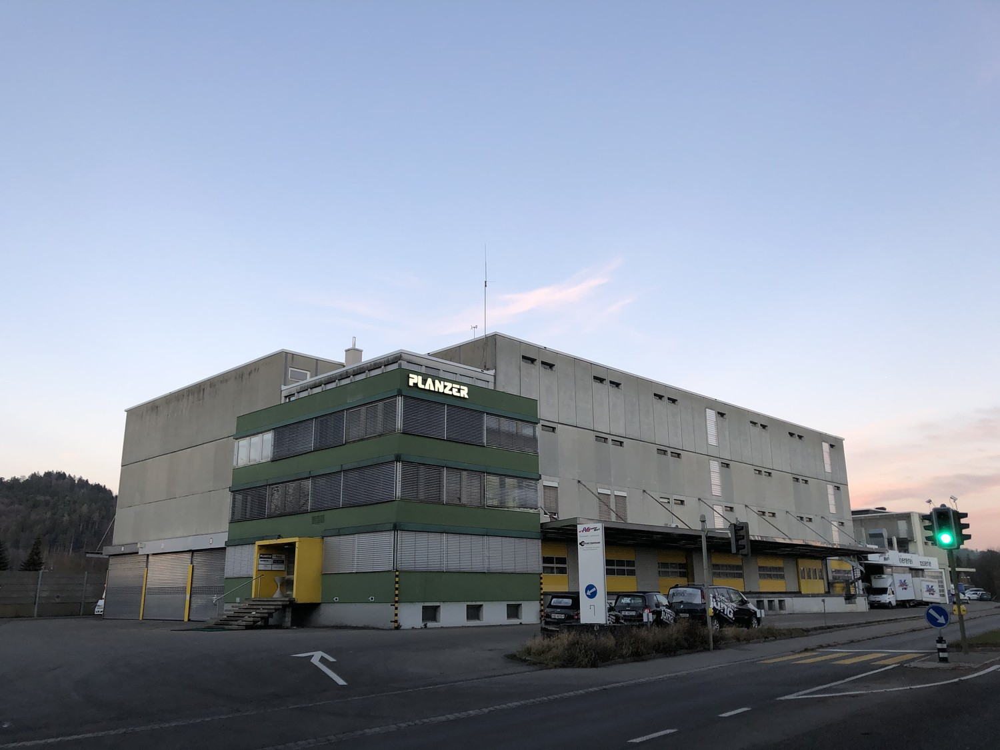
*`01.jpg` — 1500x1125 px — Aussenansicht*

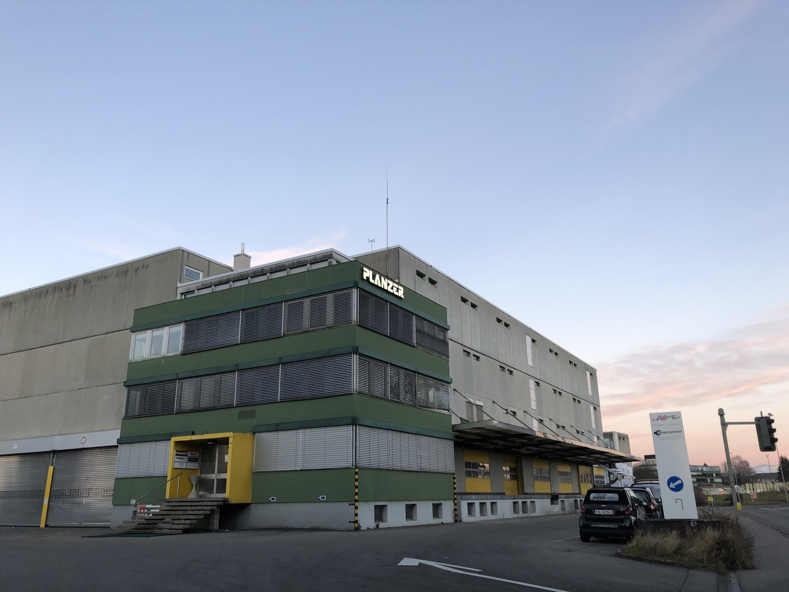
*`02.jpg` — 1500x1125 px — Aussenansicht*

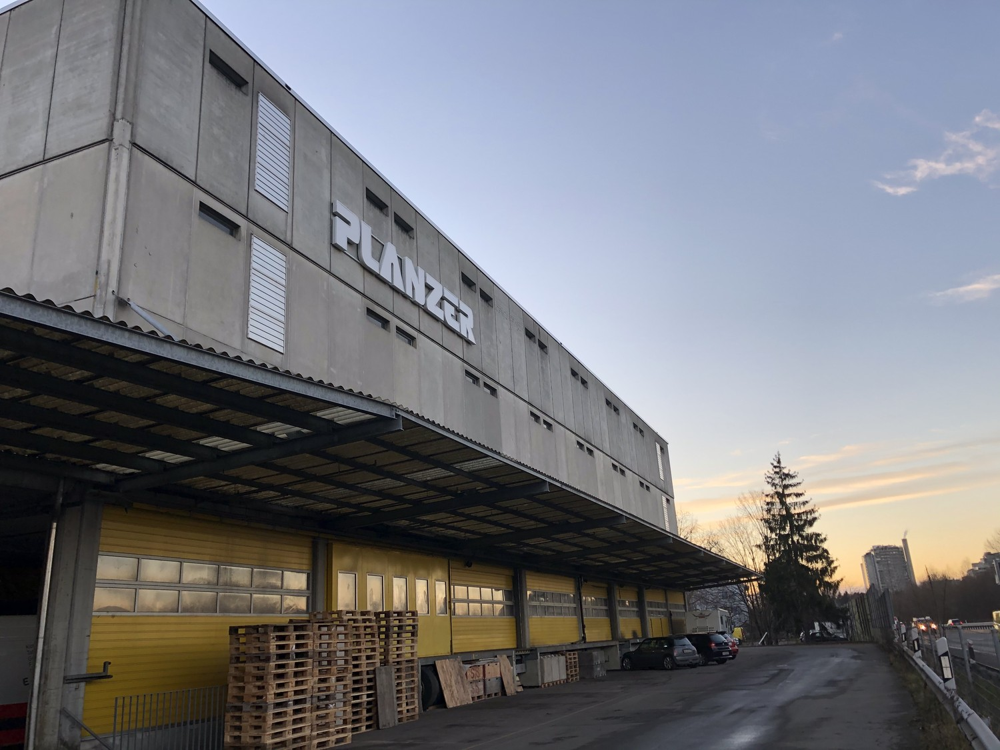
*`03.jpg` — 1500x1125 px — Aussenansicht*

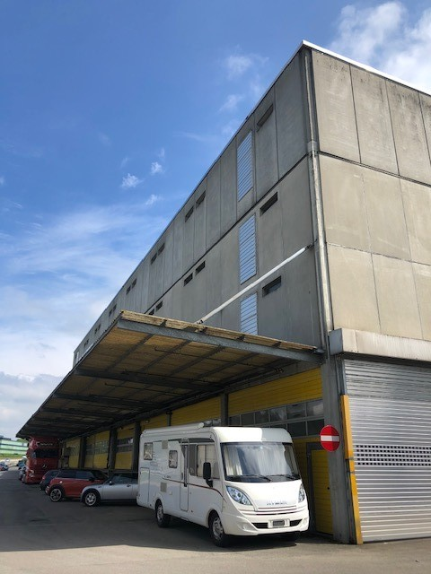
*`04.jpg` — 480x640 px — Aussenansicht*

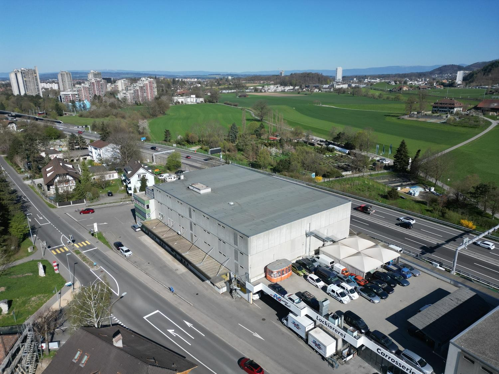
*`05.jpg` — 1500x1125 px*

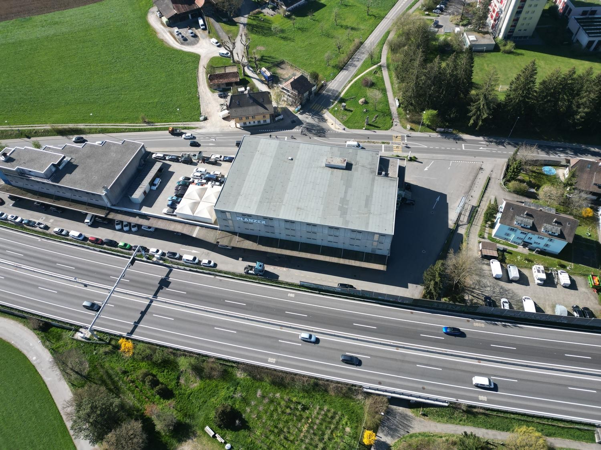
*`06.jpg` — 1500x1125 px*

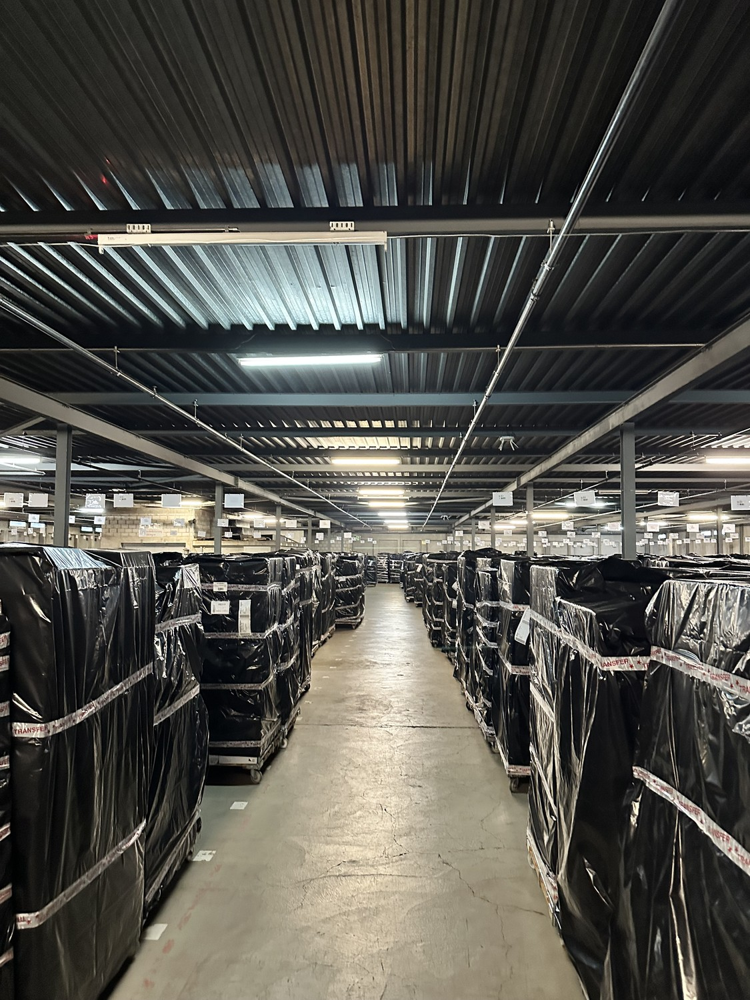
*`07.jpg` — 1125x1500 px — Obergeschoss*

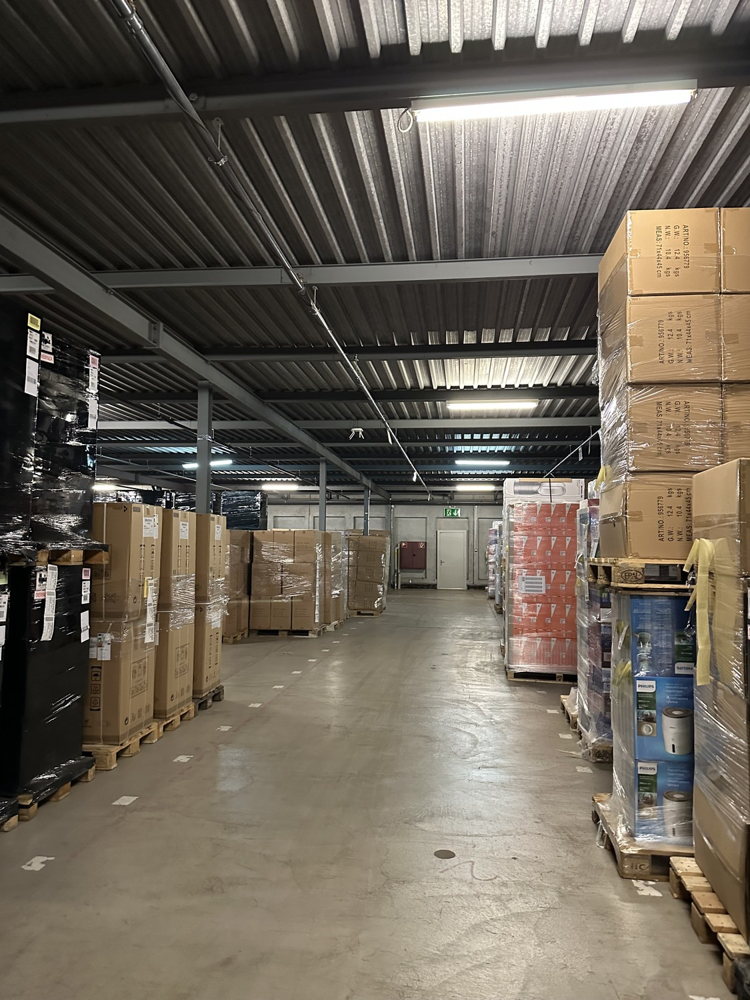
*`08.jpg` — 1125x1500 px*

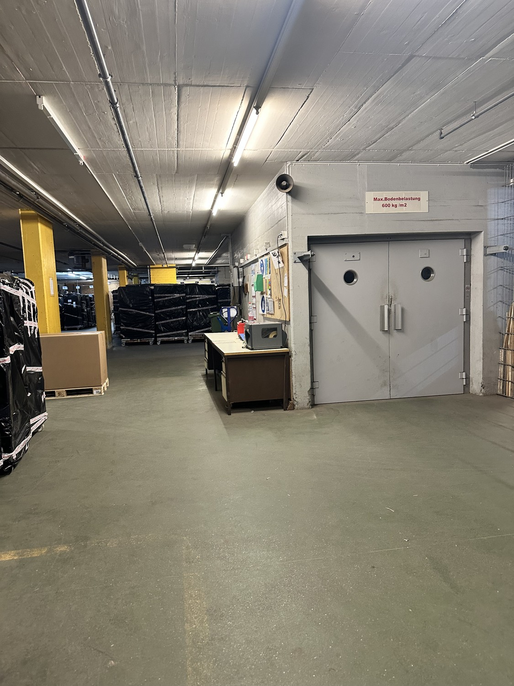
*`09.jpg` — 1125x1500 px — Erdgeschoss*

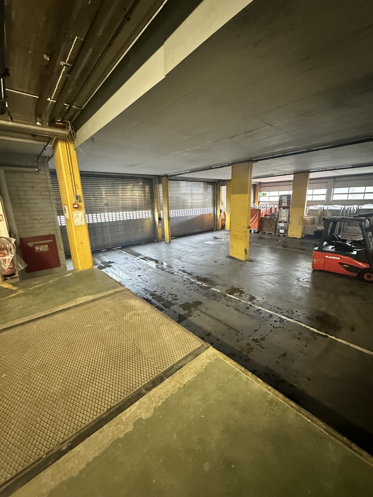
*`10.jpg` — 1125x1500 px — Erdgeschoss*

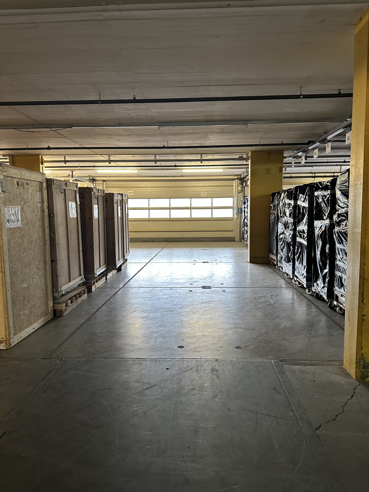
*`11.jpg` — 1125x1500 px — Erdgeschoss*

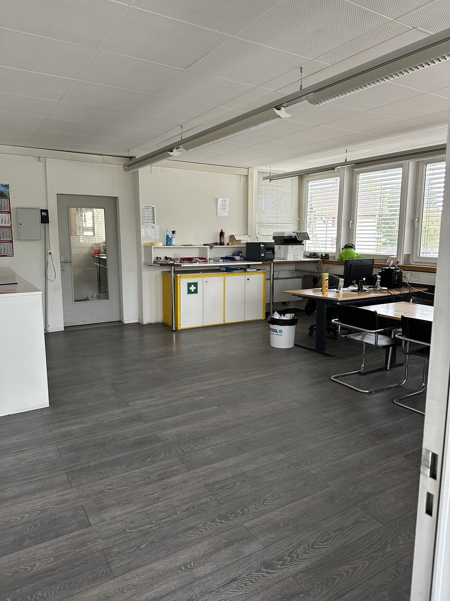
*`12.jpg` — 1125x1500 px*
