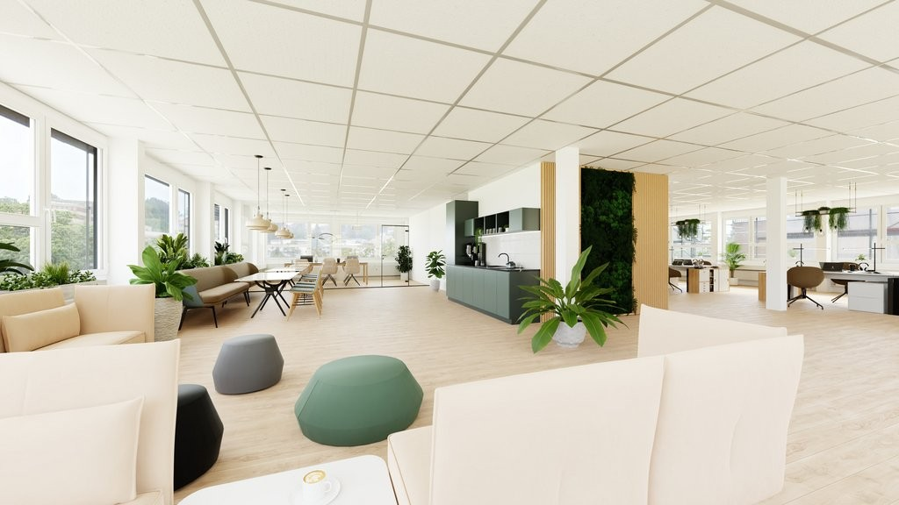
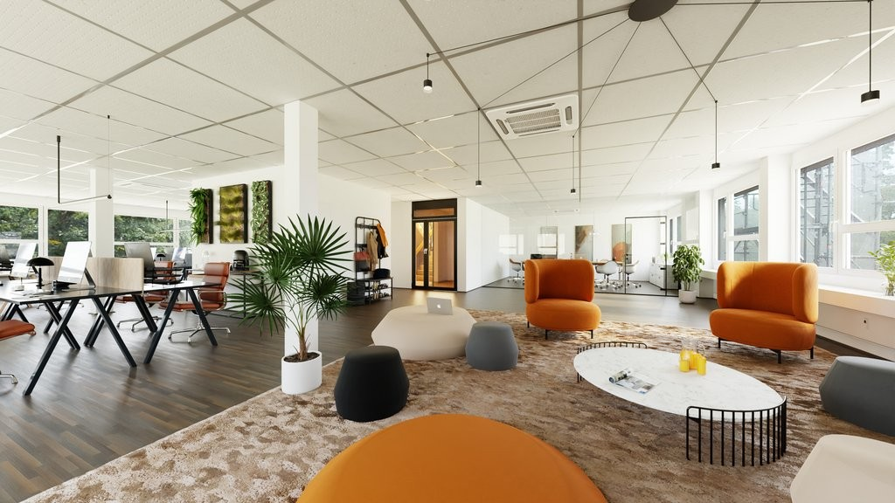
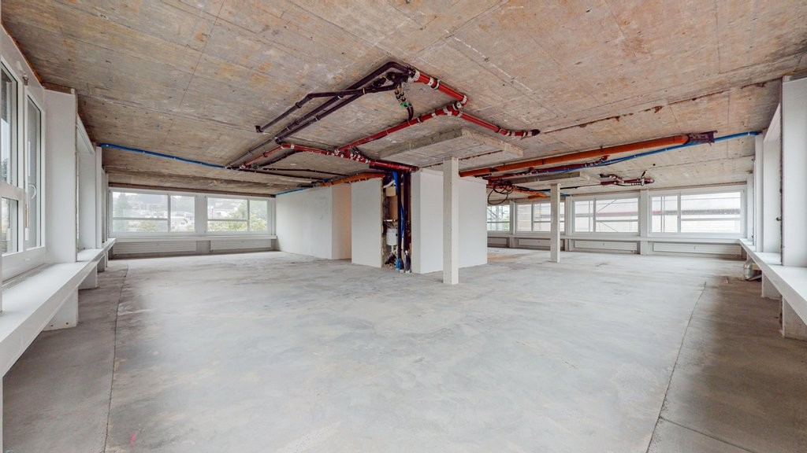
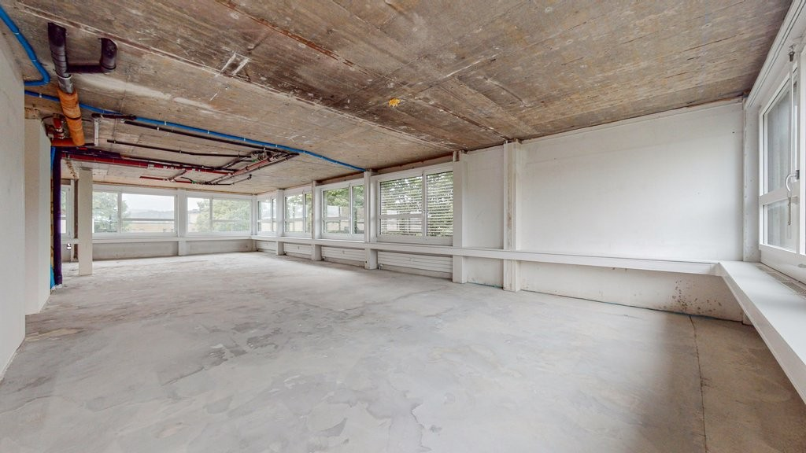
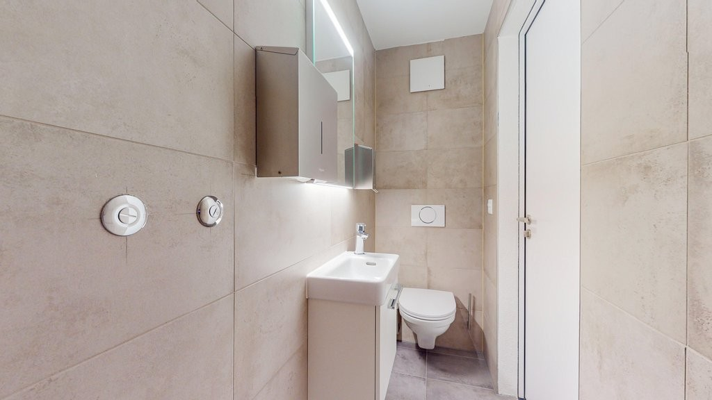
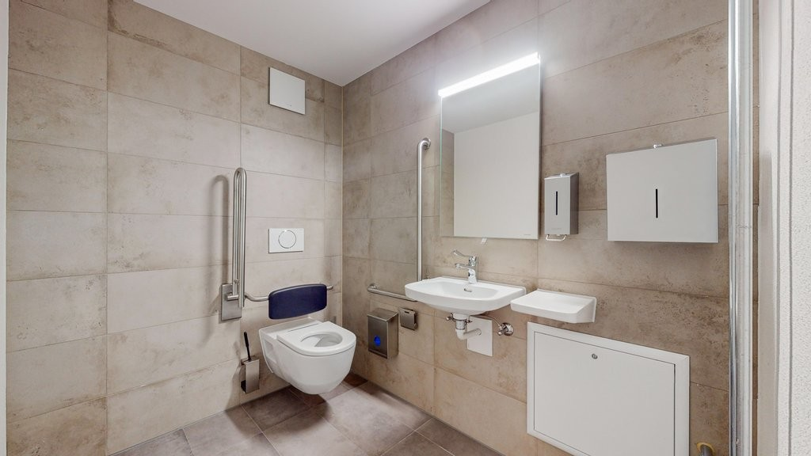
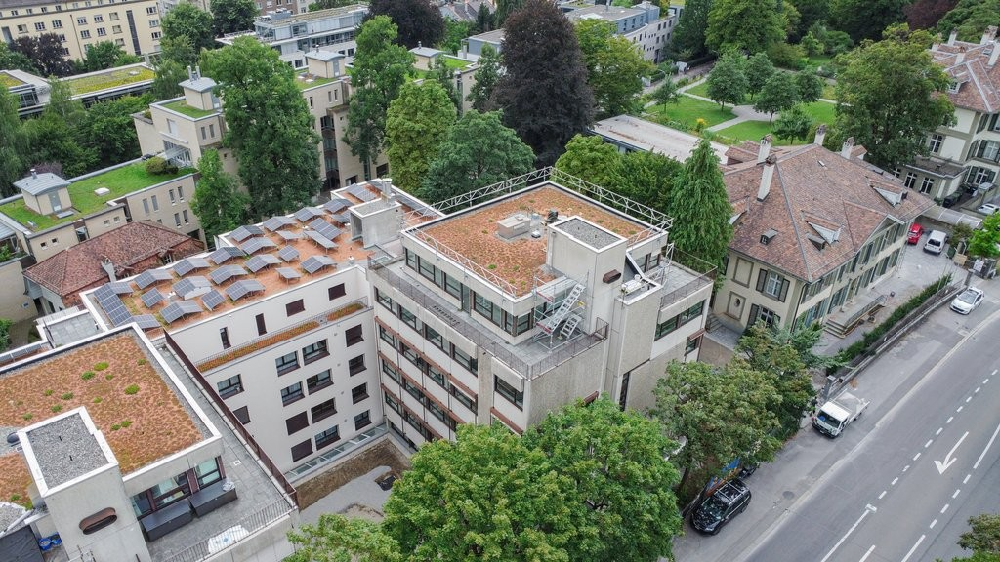

# Laupenstr. 37, 3008 Bern - CHF 275 inkl. NK pro m² / Jahr

> **Categorie:** `B_buero_gewerbe`  
> **Regiune:** Berna (oraș)  
> **Tip ofertă:** RENT / COMMERCIAL  
> **Sursă:** [flatfox.ch](https://flatfox.ch/de/wohnung/laupenstr-37-3008-bern/521746/)  
> **Descărcat:** 2026-08-17 12:38

## Date obiect

| Câmp | Valoare |
|---|---|
| Adresă | Laupenstr. 37, 3008 Bern |
| Categorie obiect | INDUSTRY |
| Tip obiect | COMMERCIAL |
| Chirie netă | CHF 240 |
| Nebenkosten | CHF 35 |
| Chirie brută | CHF 275 |
| Preț afișat | CHF 275 |
| Suprafață utilă | 194 m² |
| Etaj | -1 |
| An renovare | 2024 |
| Disponibil de la | agr |
| Referință | 0003.02.0901 |

## Texte originale (germană)

**Titlu public:** Laupenstr. 37, 3008 Bern - CHF 275 inkl. NK pro m² / Jahr

**Titlu scurt:** 194m² Gewerbe

**Pitch:** 194m² Gewerbe in Bern mieten

**Titlu descriere:** Ihre neue Büro- / Gewerbefläche nähe Bahnhof Bern

**Titlu chirie:** 194m² Gewerbe in Bern mieten

**Spațiu afișat:** 194

### Descriere completă

Sie sind auf der Suche nach geeigneten Büro- / Gewerberäumlichkeiten in der Stadt Bern? 

An der Laupenstrasse 37 in Bern vermieten wir eine Fläche mit rund 194 m2. Das Gebäude wurde im 2024/2025 umfassend saniert und die Fläche befindet sich daher in einem Top-Zustand. 

  

Die Fläche liegt in der Nähe des Hauptbahnhofs, in Richtung Inselspital, und ist hervorragend an den öffentlichen Verkehr angebunden. 

**  
**

Die Fläche wird im Rohbau vermietet und ist bereit für Ihren individuellen Mieterausbau. 

  

Sanitäranlagen sind bereits im Grundausbau enthalten. Im Zuge der Sanierung wurde in der Liegenschaft eine Grundklimatisierung verbaut. Es besteht daher die Möglichkeit, die Mietfläche mit einem Kühlsystem auszustatten.   

  

Das Gebäude ist rollstuhlgerecht und die Flächen sind mit einem Personenlift erschlossen. 

**  
**

In der Umgebung finden Sie zahlreiche Restaurants, Cafés und Geschäfte, die das Arbeitsumfeld bereichern.   

**  
**

Einstellplätze mit oder ohne Ladestation können dazu gemietet werden. 

  

Hinweis: Bei den Fotos handelt es sich um die vergleichbare Fläche im 3.OG. Die Visualisierungen zeigen einen möglichen Ausbau.

## Dotări (attributes)

- lift
- accessiblewithwheelchair

## Ofertant

- **Nume:** Allianz Suisse Immobilien AG
- **Stradă:** Effingerstrasse 34
- **NPA:** 3001
- **Localitate:** Bern

## Imagini (7)

*`01.jpg` — 1024x576 px — Visualisierung_Bern_GF_VS1.jpg*

*`02.jpg` — 1024x576 px — Visualisierung_Bern_GF_VS3.jpg*

*`03.jpg` — 1024x576 px — GF-Bern-Gewerbeflaeche-7.jpg*

*`04.jpg` — 1024x576 px — GF-Bern-Gewerbeflaeche-9.jpg*

*`05.jpg` — 1024x576 px — GF-Bern-WC-1.jpg*

*`06.jpg` — 1024x576 px — GF-Bern-WC-2.jpg*

*`07.jpg` — 1024x576 px — Drohne-8.jpg*
