# Funkstrasse 84, 3084 Wabern - CHF 183 inkl. NK pro m² / Jahr

> **Categorie:** `B_buero_gewerbe`  
> **Regiune:** Cantonul Berna  
> **Tip ofertă:** RENT / OFFICE  
> **Relevant pentru praxis:** da (praxen)  
> **Sursă:** [flatfox.ch](https://flatfox.ch/de/wohnung/funkstrasse-84-3084-wabern/570005/)  
> **Descărcat:** 2026-08-17 12:25

## Date obiect

| Câmp | Valoare |
|---|---|
| Adresă | Funkstrasse 84, 3084 Wabern |
| Categorie obiect | INDUSTRY |
| Tip obiect | OFFICE |
| Chirie netă | CHF 150 |
| Nebenkosten | CHF 33 |
| Chirie brută | CHF 183 |
| Preț afișat | CHF 183 |
| Suprafață utilă | 309 m² |
| Etaj | 0 |
| An construcție | 1975 |
| An renovare | 2011 |
| Disponibil de la | agr |
| Referință | 60080.02.390020 |

## Texte originale (germană)

**Titlu public:** Funkstrasse 84, 3084 Wabern - CHF 183 inkl. NK pro m² / Jahr

**Titlu scurt:** 309m² Büro

**Pitch:** 309m² Büro in Wabern mieten

**Titlu descriere:** Hier kann der Funke überspringen

**Titlu chirie:** 309m² Büro in Wabern mieten

**Spațiu afișat:** 309

### Descriere completă

An der Funkstrasse 84 und 86 in Wabern steht eine vielseitig nutzbare Gewerbefläche zur Vermietung, die durch Flexibilität, klare Strukturen und eine ruhige Lage überzeugt. Zwischen Gurten und Aare gelegen, bietet der Standort ein angenehmes Arbeitsumfeld mit guter Erreichbarkeit. Ideal für Unternehmen, Praxen oder Institutionen, die Raum für Entwicklung suchen. 

Die Fläche befindet sich im Zwischengeschoss (Boden der Fläche unterhalb des Erdreichs, Fenster ungefähr auf Höhe des Erdreichs) und zeichnet sich durch grosse Fensterfronten, viel Tageslicht und eine funktionale Raumaufteilung aus. 

Ein Ort, an dem Ideen entstehen, Konzepte wachsen und der Funke für Neues überspringen kann. 

  

**Lage & Erreichbarkeit **

  * Ruhige Lage zwischen Gurten und Aare 
  * Tramlinie 9 (Bern - Wabern) 
  * S-Bahn S3/S31 
  * Tramhaltestelle Sandrain in ca. 6 Gehminuten erreichbar 
  * Einkaufsmöglichkeiten in Gehdistanz 

  
**Ausstattung & Merkmale **   

  * Grosse Fensterfronten mit viel Tageslicht 
  * Elektrische Rollläden 
  * Automatische Beleuchtung in Korridoren und Sanitärbereichen 
  * Beleuchtete Notausgangschilder 
  * Lift vorhanden 
  * Strom-, Wasser- und Abwasseranschlüsse 
  * Ruhige und sonnige Lage 
  * Autoeinstellplätze vorhanden (separat mietbar) 
  * Zum Teil neu saniert (Ausbaustandard kann noch mitbestimmt werden) 

**  
**

**Drei Varianten - maximale Wahlfreiheit**

Die Gewerbefläche kann als Gesamteinheit oder in zwei unabhängigen Teilflächen gemietet werden. Dank zwei separaten Eingängen ist eine eigenständige Nutzung problemlos möglich. 

  

\---------------------------------------------------------------------------------------------------------------- 

**Variante 1:**

**Gesamte Gewerbefläche**

  * 309 m2 Nutzfläche 
  * Ideal für grössere Unternehmen oder kombinierte Nutzungen 

**Enthaltene Räume:**

  * 8 abschliessbare Büroräume 
  * 4 Abstell-/Lagerräume (inkl. Serverraum) 
  * 4 Toiletten (separat Damen/Herren) 
  * 1 Dusche 
  * Grosszügige Korridor- und Erschliessungsflächen 
  * Zwei separate Eingänge (Funkstrasse 84 & 86) 

\---------------------------------------------------------------------------------------------------------------- 

**Variante 2a:**

**Teilfläche Funkstr. 84**

  * ca. 137.6 m2 Nutzfläche mit eigenem 
  * Eingang 
  * Ideal für kleinere KMU, Praxen oder 
  * Dienstleistungsbetriebe mit überschaubarem Flächenbedarf. 

**Enthaltene Räume:**

  * 4 abschliessbare Büroräume 
  * Abstell-Putz- und Lagerräume 
  * 2 Toiletten (separat Damen und Herren) 
  * 1 Dusche 
  * Eigener Zugang über Funkstrasse 84 

\---------------------------------------------------------------------------------------------------------------- 

**Variante 2b:**

**Teilfläche Funkstr. 86**

  * ca. 171.4 m2 Nutzfläche mit eigenem Eingang 
  * Geeignet für Unternehmen mit etwas höherem Platzbedarf oder kombinierten Arbeits- und Nebenräumen. 

**Enthaltene Räume:**

  * 4 abschliessbare Büroräume 
  * Abstell-/Lagerraum 
  * WC Anlage 
  * Grosszügigere Raumstruktur 
  * Eigener Zugang über Funkstrasse 86 

\---------------------------------------------------------------------------------------------------------------- 

**Ist der Funke übergesprungen?**

Gerne zeigen wir Ihnen die Fläche vor Ort und besprechen gemeinsam, welche Variante am besten zu Ihren Bedürfnissen passt. Wir freuen uns auf Ihre Kontaktaufnahme.

## Dotări (attributes)

- lift
- cable
- garage
- minergie

## Ofertant

- **Nume:** Von Graffenried AG Liegenschaften
- **Stradă:** Marktgass-Passage 3
- **NPA:** 3011
- **Localitate:** Bern

## Imagini (12)

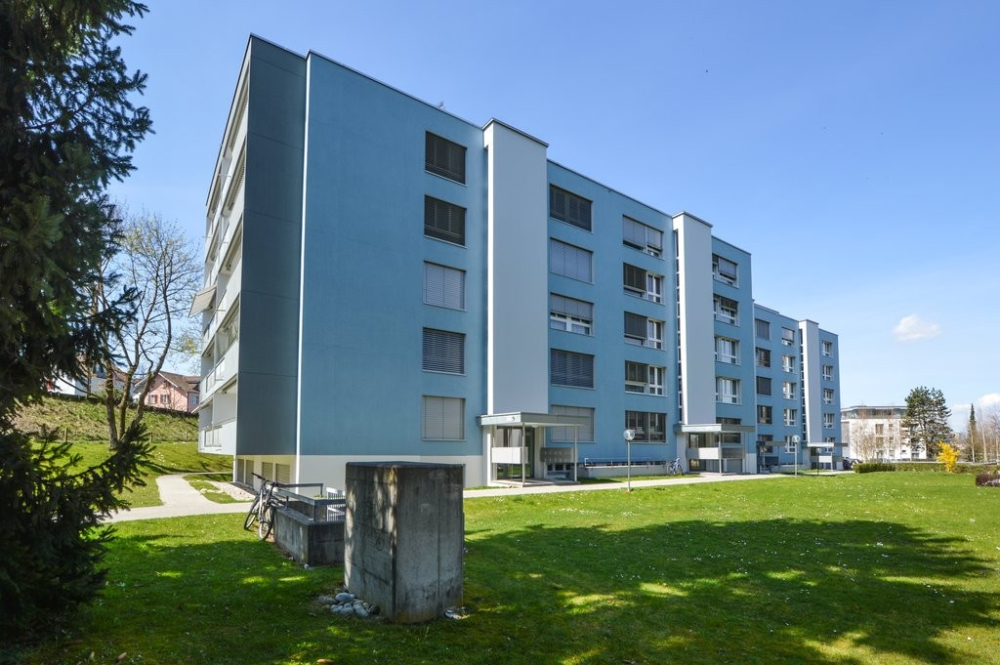
*`01.jpg` — 1024x681 px — 11450-52_Funkstrasse_82-86_01.JPG*

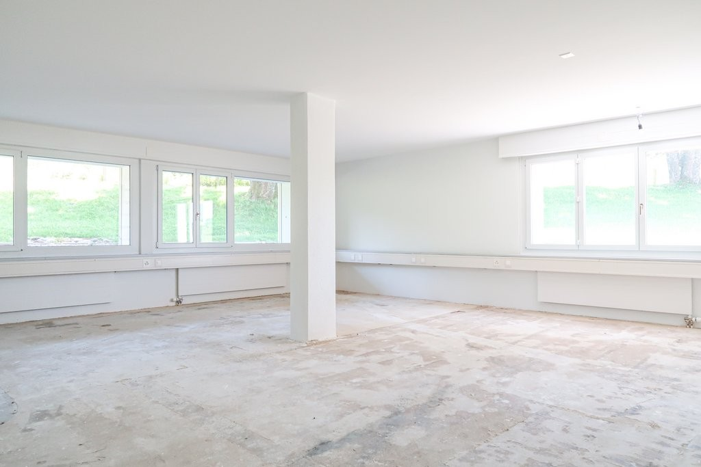
*`02.jpg` — 1024x683 px — IMG_2562.jpg*

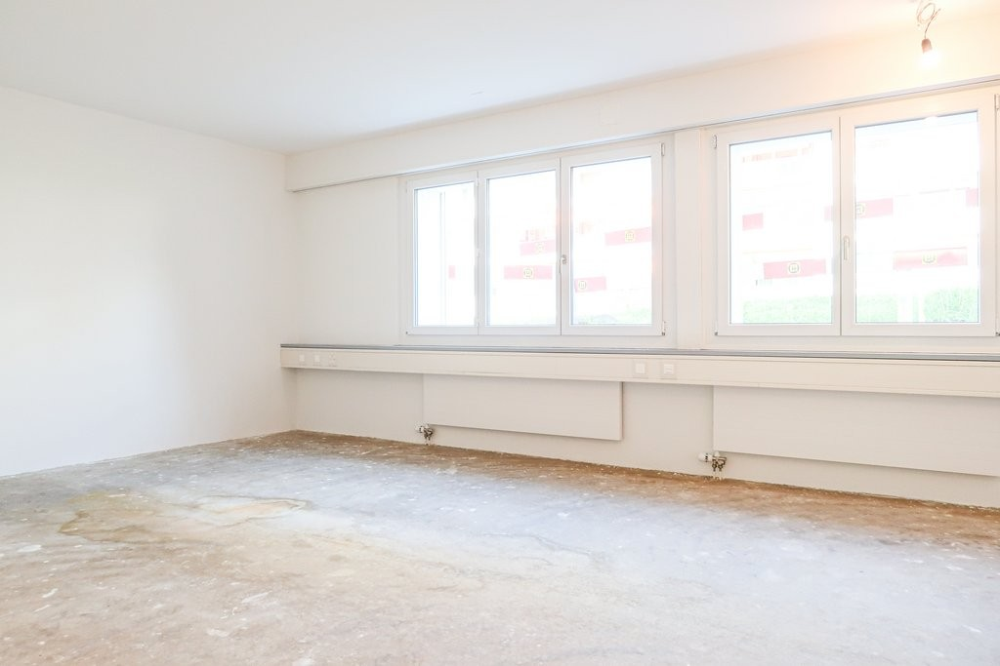
*`03.jpg` — 1024x683 px — IMG_2576.jpg*

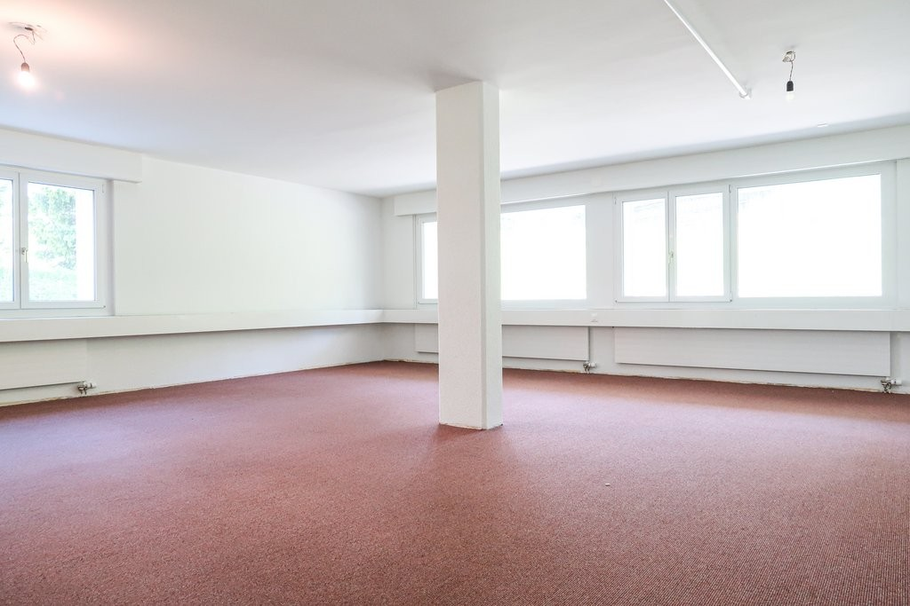
*`04.jpg` — 1024x683 px — IMG_2564.jpg*

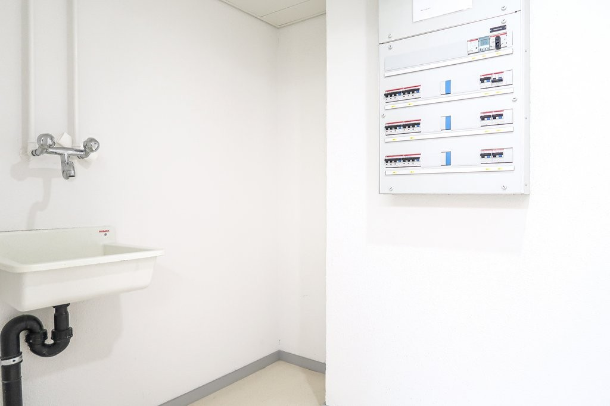
*`05.jpg` — 1024x683 px — IMG_0929.jpg*

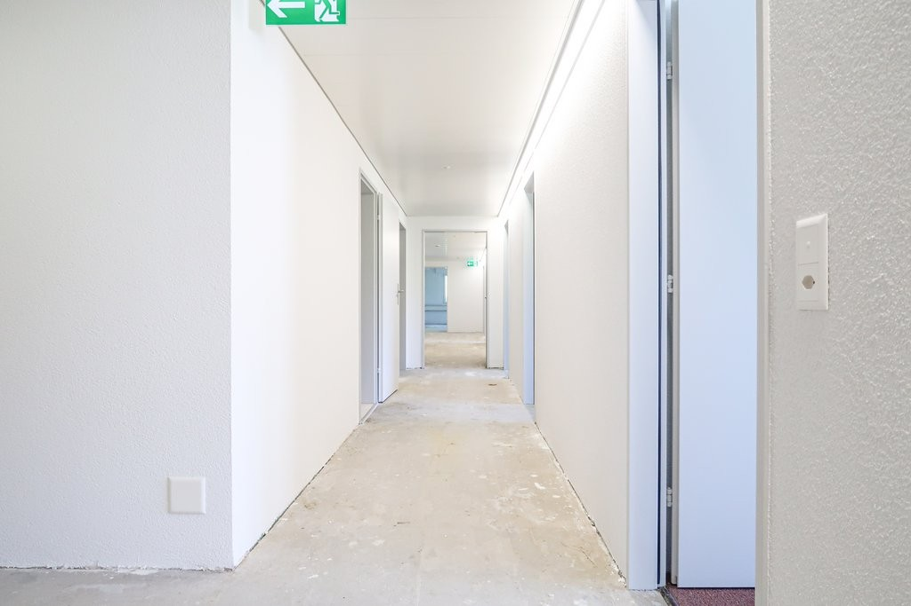
*`06.jpg` — 1024x683 px — IMG_2577.jpg*

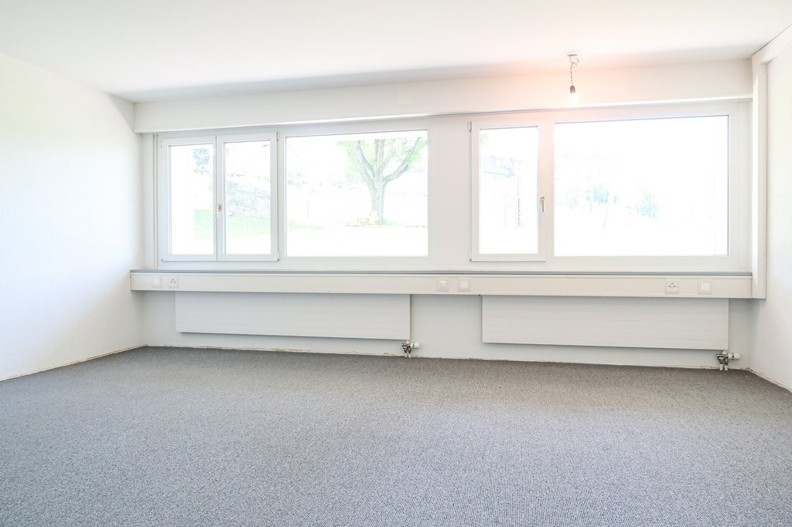
*`07.jpg` — 1024x683 px — IMG_2569.jpg*

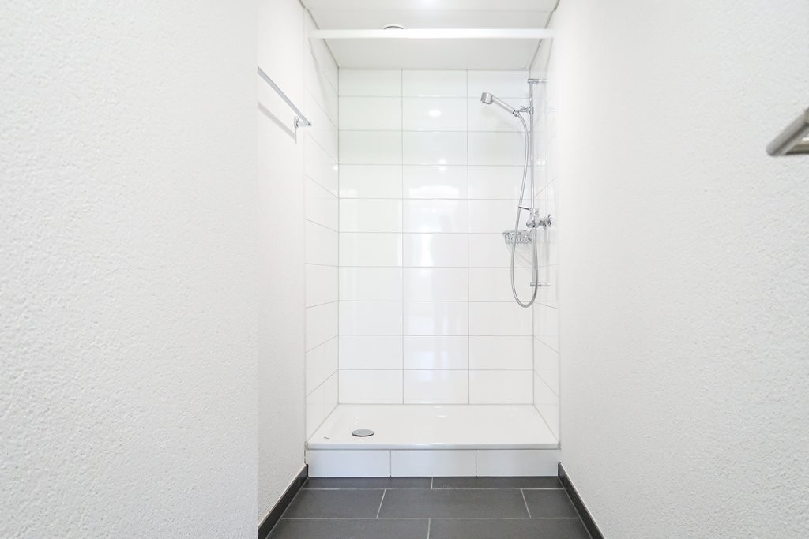
*`08.jpg` — 1024x683 px — IMG_2549.jpg*

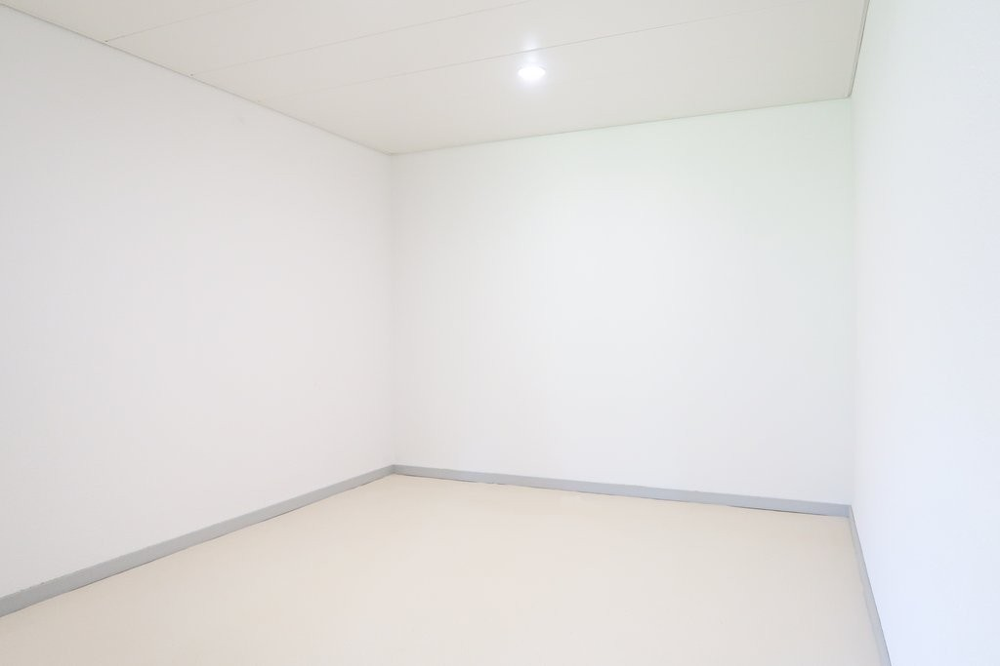
*`09.jpg` — 1024x683 px — IMG_2553.jpg*

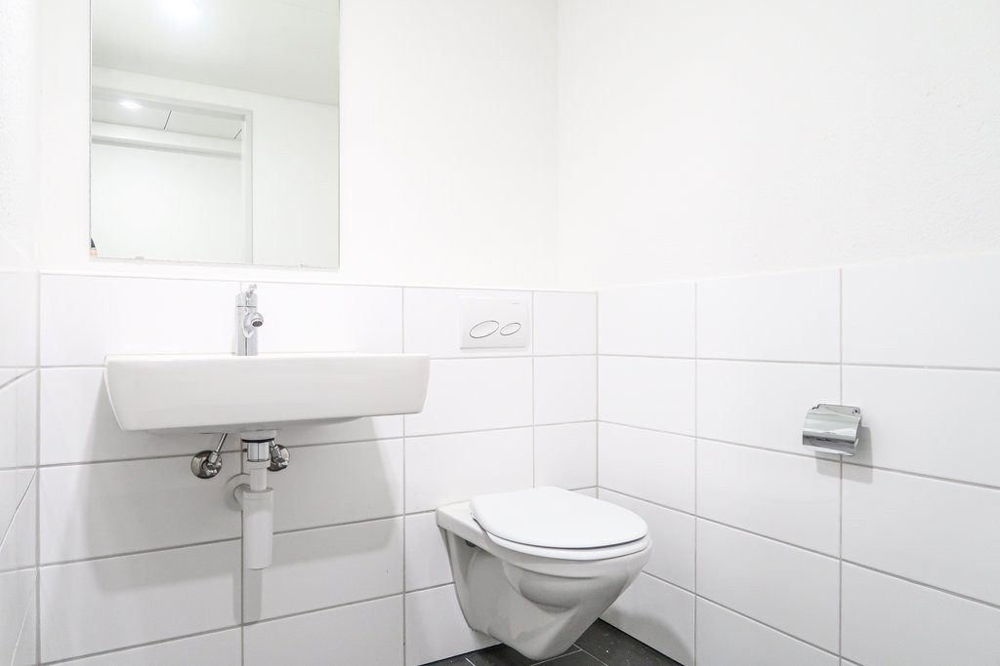
*`10.jpg` — 1024x683 px — IMG_2556.jpg*

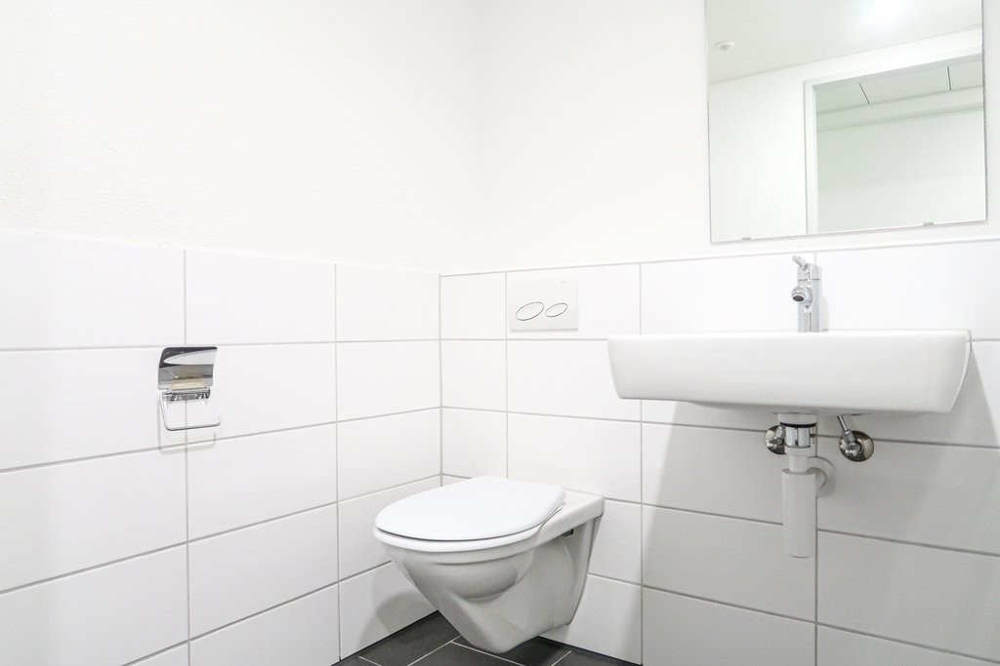
*`11.jpg` — 1024x683 px — IMG_2558.jpg*

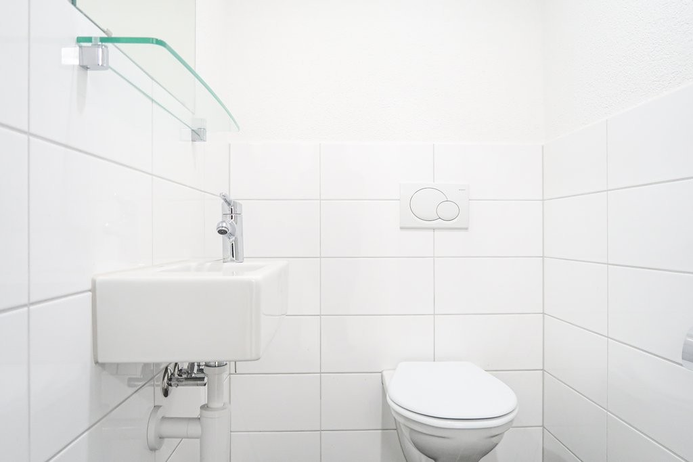
*`12.jpg` — 1024x683 px — IMG_2551.jpg*
