# Effingerstrasse 53, 3008 Bern - CHF 170 exkl. NK pro m² / Jahr

> **Categorie:** `B_buero_gewerbe`  
> **Regiune:** Berna (oraș)  
> **Tip ofertă:** RENT / OFFICE  
> **Sursă:** [flatfox.ch](https://flatfox.ch/de/wohnung/effingerstrasse-53-3008-bern/61417907/)  
> **Descărcat:** 2026-08-17 12:38

## Date obiect

| Câmp | Valoare |
|---|---|
| Adresă | Effingerstrasse 53, 3008 Bern |
| Categorie obiect | INDUSTRY |
| Tip obiect | OFFICE |
| Chirie netă | CHF 170 |
| Preț afișat | CHF 170 |
| Suprafață utilă | 330 m² |
| Etaj | 1 |
| Disponibil de la | 2025-10-01 |

## Texte originale (germană)

**Titlu public:** Effingerstrasse 53, 3008 Bern - CHF 170 exkl. NK pro m² / Jahr

**Titlu scurt:** 330m² Büro

**Pitch:** 330m² Büro in Bern mieten

**Titlu descriere:** zentrale Büroräumlichkeiten auf 330m2 mit Terrasse

**Titlu chirie:** 330m² Büro in Bern mieten

**Spațiu afișat:** 330

### Descriere completă

Ab sofort bieten wir Ihnen attraktive Büro- und Schulungsräumlichkeit in unmittelbarer Nähe des Inselspitals.  
  
Im angehängten Factsheet finden Sie alle wichtigen Informationen sowie den Grundrissplan zum Flächenangebot. Werfen Sie einen Blick hinein und entdecken Sie die vielseitigen Möglichkeiten!  
  
**Mietfläche:**  
Effingerstrasse 53 ca. 330 m2 im 1. OG  
  
Zusätzlich stehen im UG (Archiv- / Lagerräume) ca. 100 m2 zur Verfügung.  
  
Wenn wir Ihr Interesse geweckt haben, freuen wir uns darauf, Ihnen die Räumlichkeiten bei einem Besichtigungstermin näher vorzustellen.

## Dotări (attributes)

- lift
- balconygarden

## Ofertant

- **Nume:** Haussener Verwaltungen AG
- **Stradă:** Monbijoustrasse 22
- **NPA:** 3011
- **Localitate:** Bern

## Imagini (12)

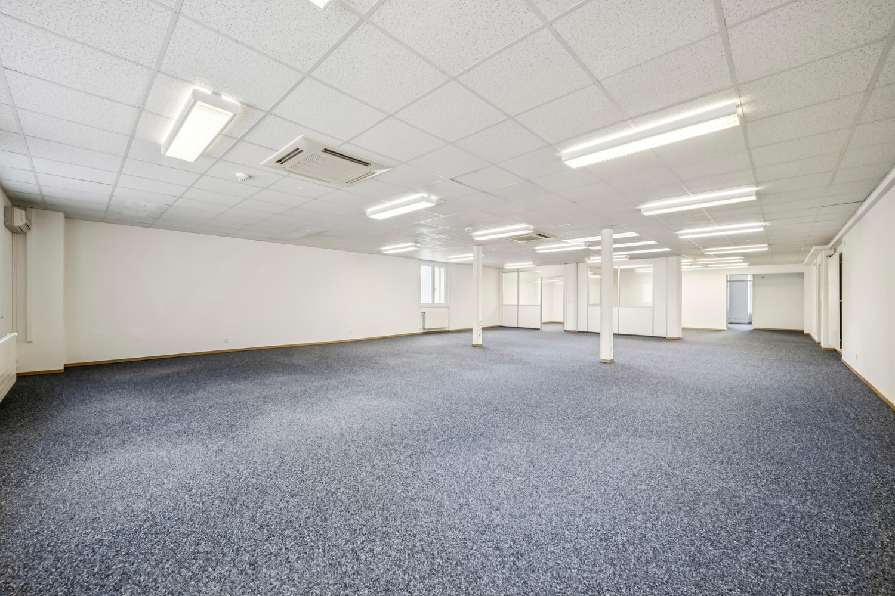
*`01.jpg` — 1500x1000 px*

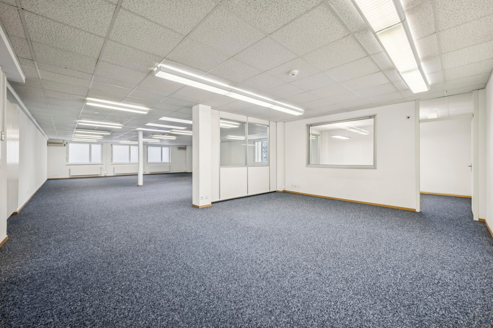
*`02.jpg` — 1500x1000 px*

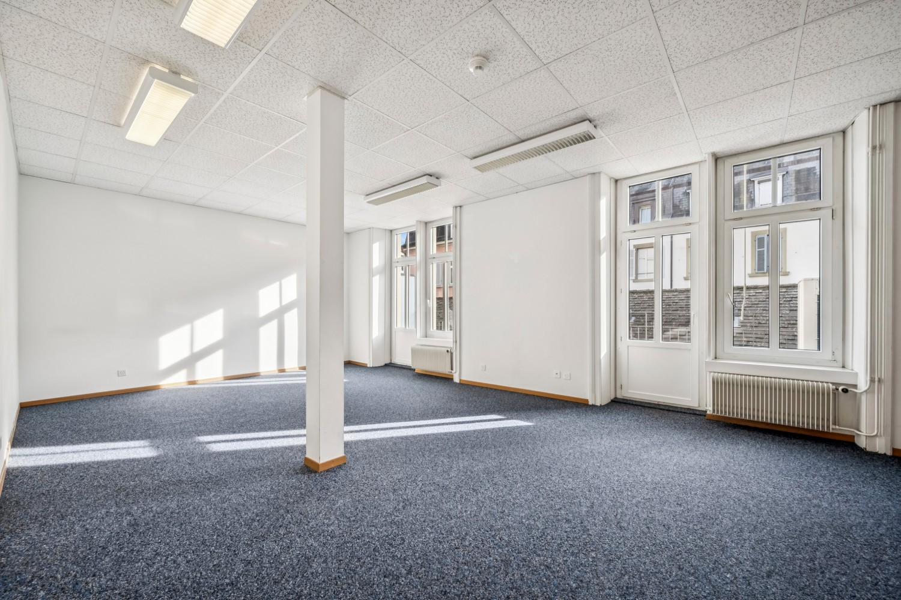
*`03.jpg` — 1500x1000 px*

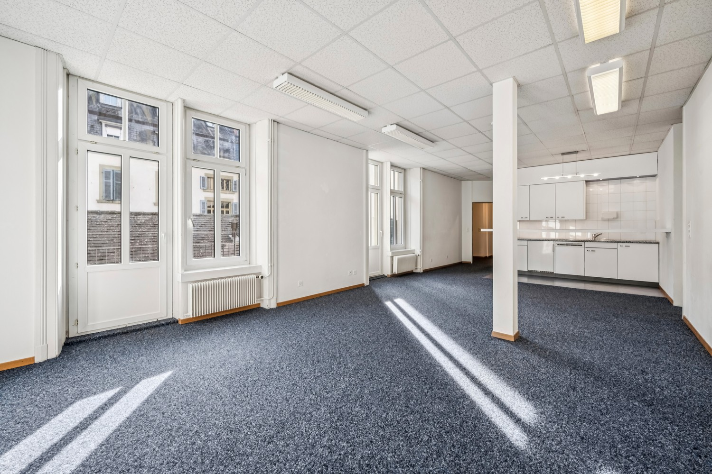
*`04.jpg` — 1500x1000 px*

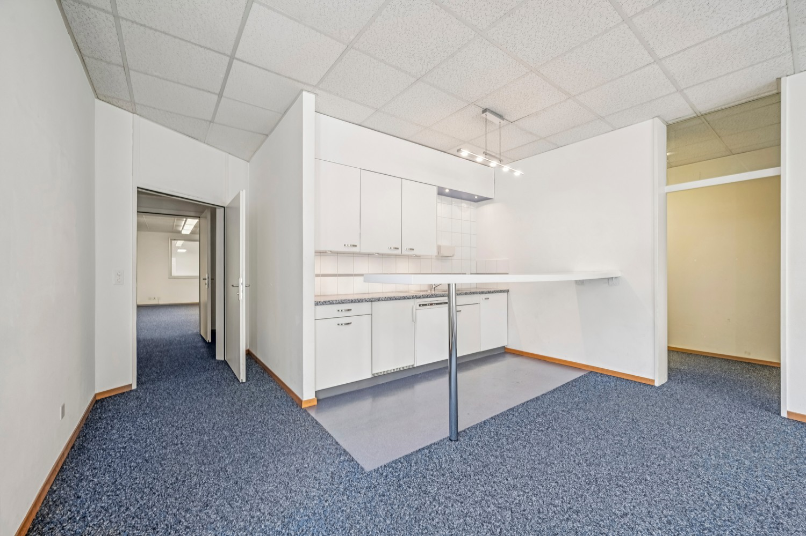
*`05.jpg` — 1500x1000 px*

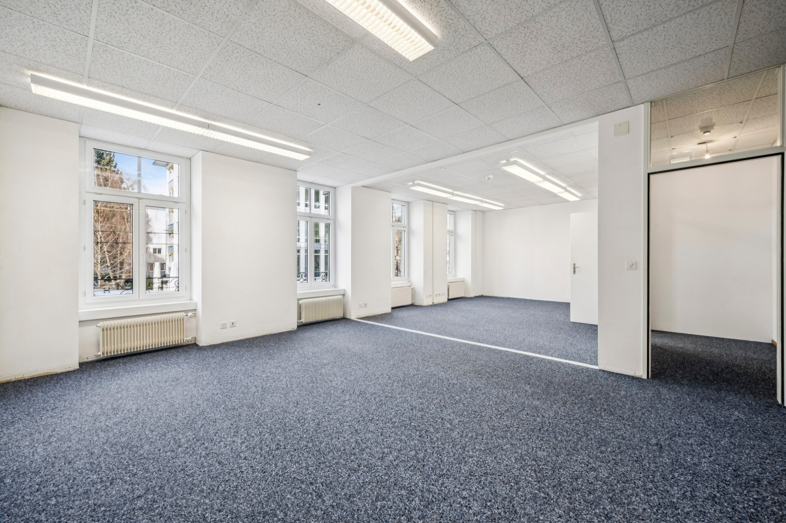
*`06.jpg` — 1500x1000 px*

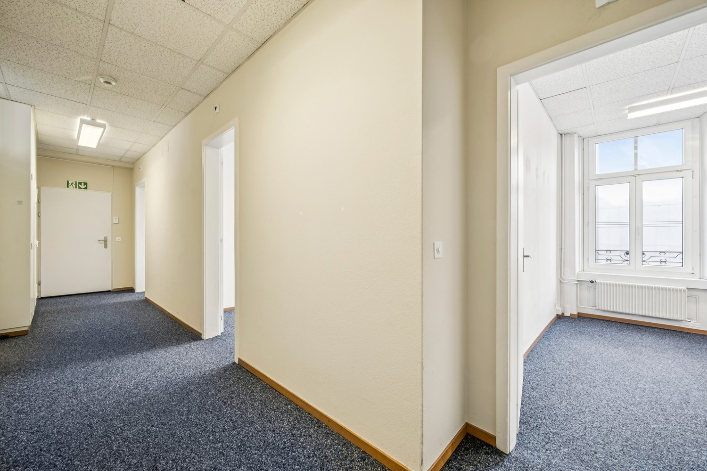
*`07.jpg` — 1500x1000 px*

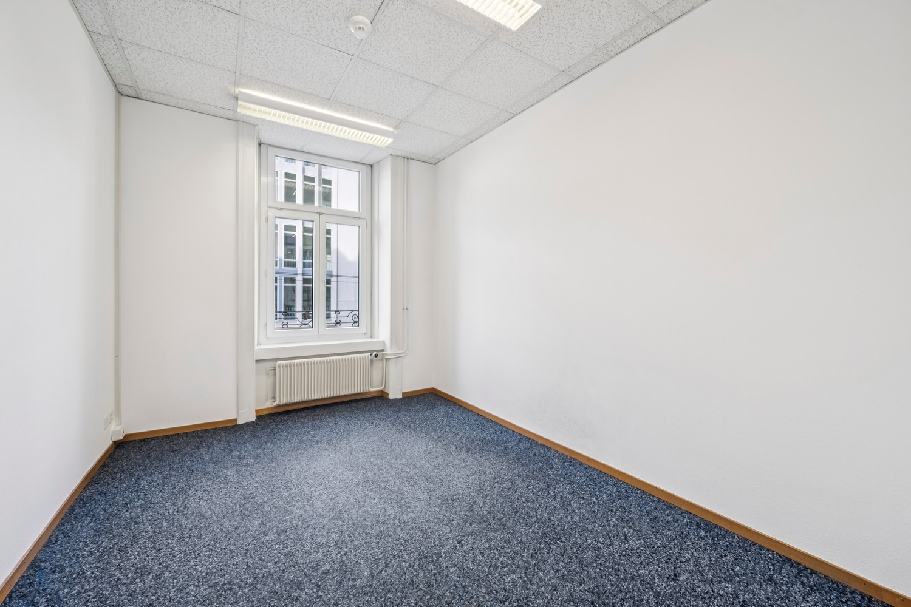
*`08.jpg` — 1500x1000 px*

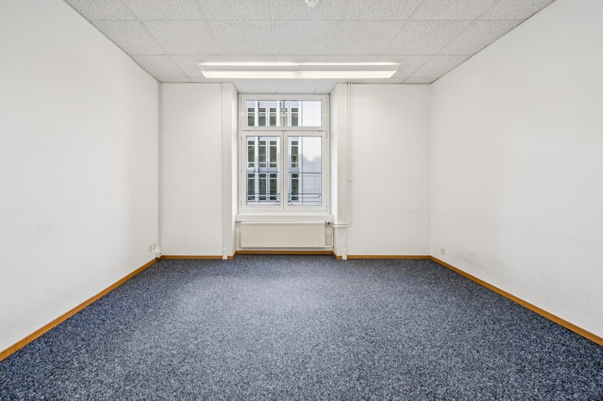
*`09.jpg` — 1500x1000 px*

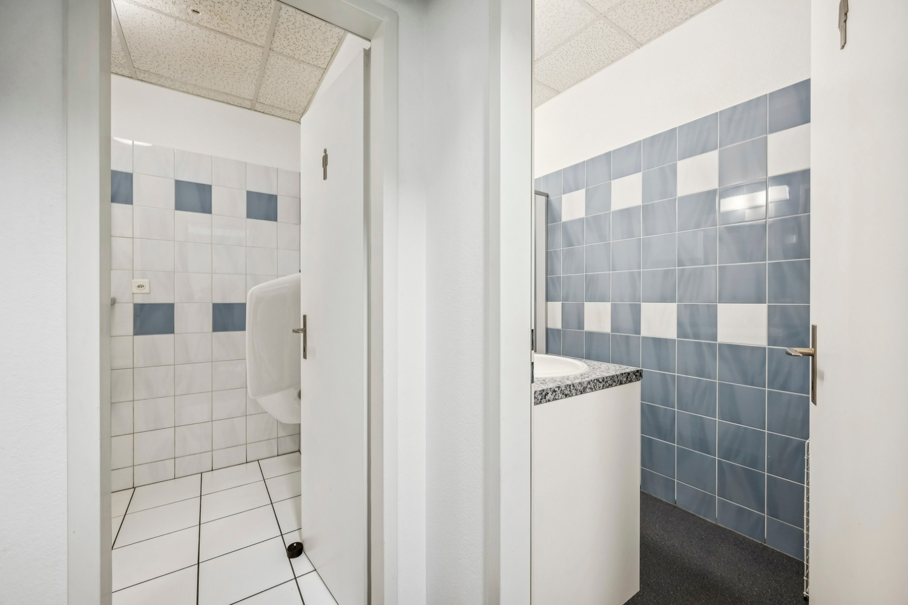
*`10.jpg` — 1500x1000 px*

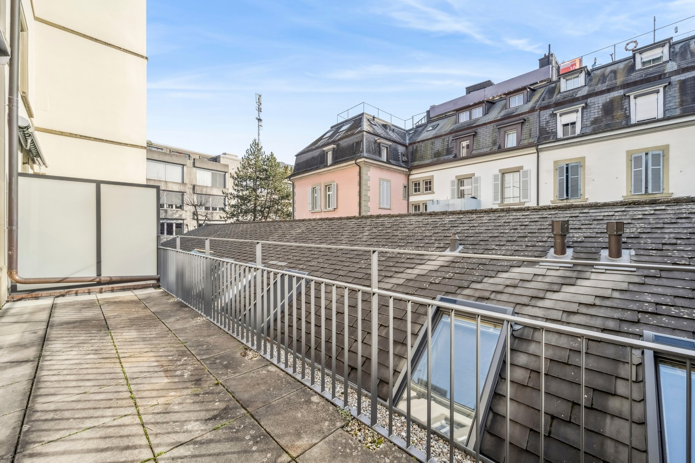
*`11.jpg` — 1500x1000 px*

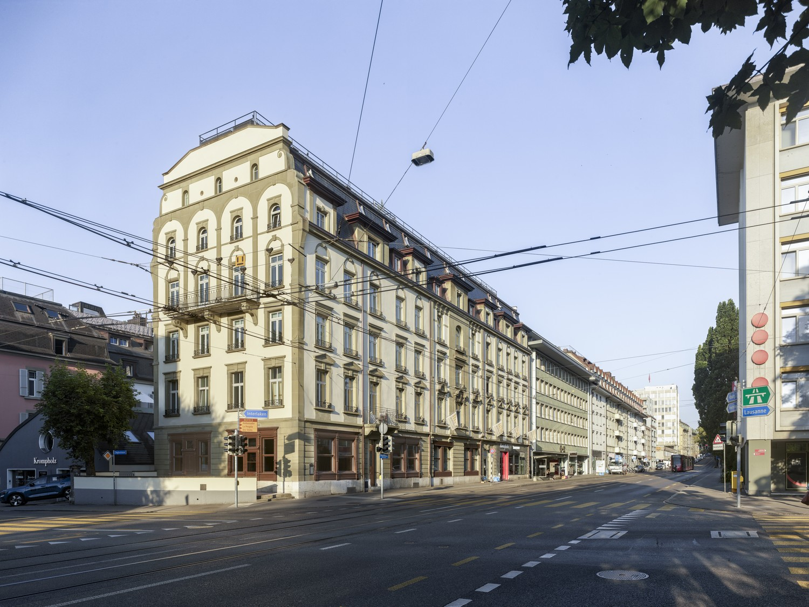
*`12.jpg` — 1500x1125 px*
