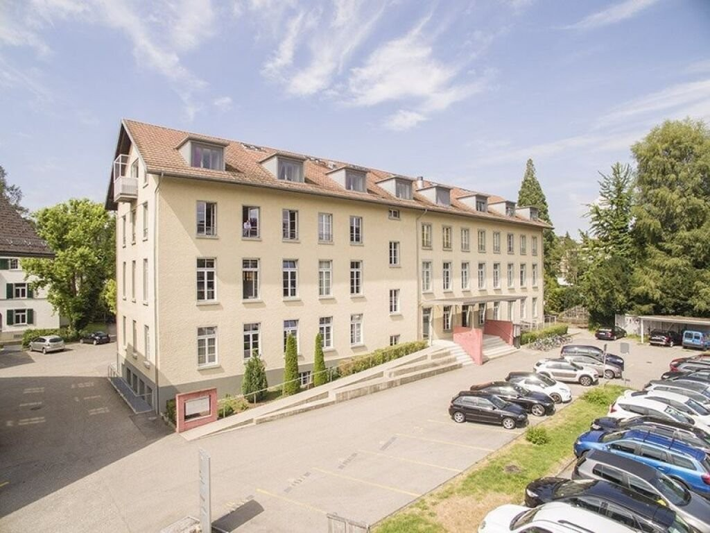
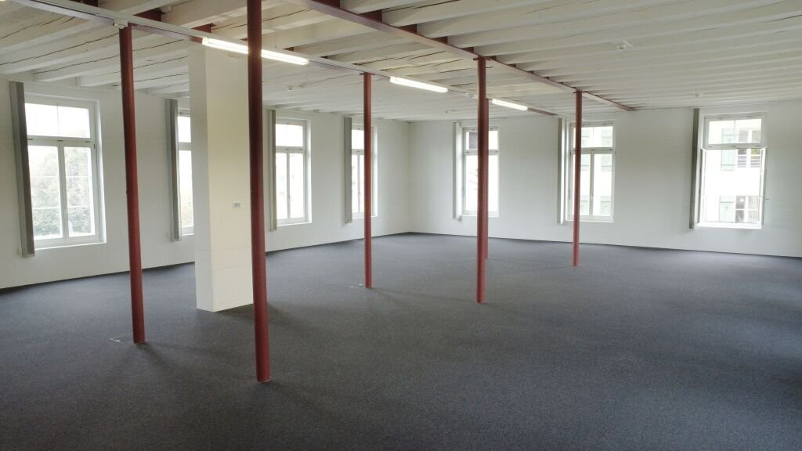
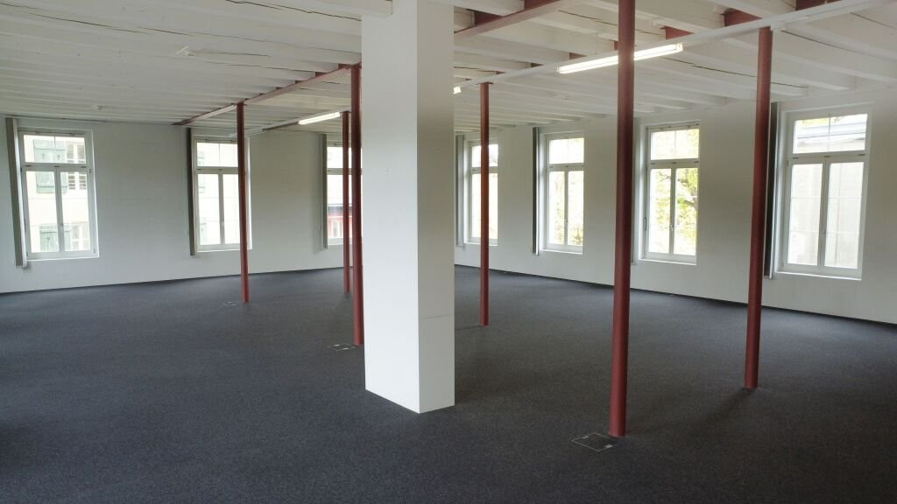
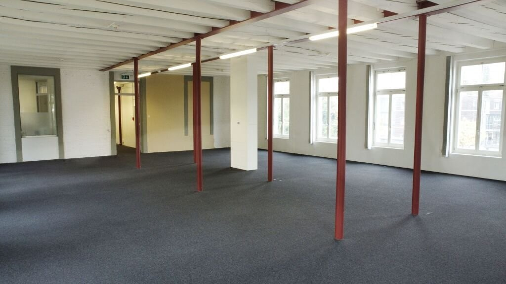
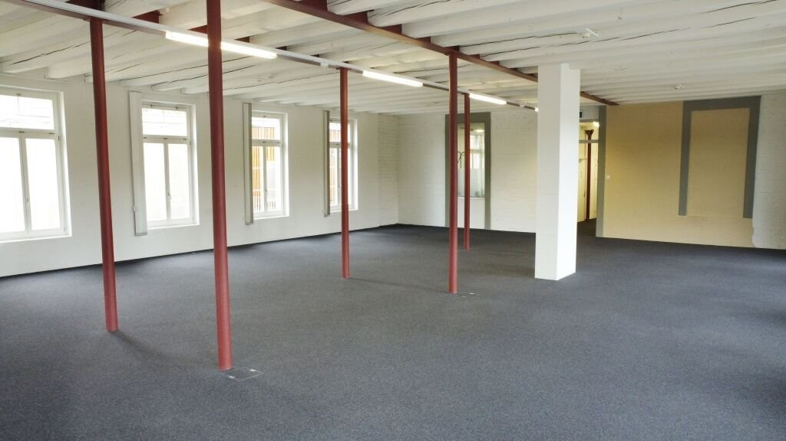

# Oberburgstrasse 10, 3400 Burgdorf - CHF 160 inkl. NK pro m² / Jahr

> **Categorie:** `B_buero_gewerbe`  
> **Regiune:** Cantonul Berna  
> **Tip ofertă:** RENT / OFFICE  
> **Relevant pentru praxis:** da (praxen)  
> **Sursă:** [flatfox.ch](https://flatfox.ch/de/wohnung/oberburgstrasse-10-3400-burgdorf/619829/)  
> **Descărcat:** 2026-08-17 12:34

## Date obiect

| Câmp | Valoare |
|---|---|
| Adresă | Oberburgstrasse 10, 3400 Burgdorf |
| Categorie obiect | INDUSTRY |
| Tip obiect | OFFICE |
| Chirie netă | CHF 160 |
| Chirie brută | CHF 160 |
| Preț afișat | CHF 160 |
| Suprafață utilă | 254 m² |
| Etaj | 1 |
| Disponibil de la | agr |
| Referință | 25201.02.20106 |

## Texte originale (germană)

**Titlu public:** Oberburgstrasse 10, 3400 Burgdorf - CHF 160 inkl. NK pro m² / Jahr

**Titlu scurt:** 254m² Büro

**Pitch:** 254m² Büro in Burgdorf mieten

**Titlu descriere:** Büro- und Gewerbeflächen mit flexiblen Nutzungsmöglichkeiten

**Titlu chirie:** 254m² Büro in Burgdorf mieten

**Spațiu afișat:** 254

### Descriere completă

Per sofort oder nach Vereinbarung vermieten wir an attraktiver Lage in Burgdorf (nur ca. 1 km vom Bahnhof entfernt) flexible Büro- und Gewerbeflächen mit einer Gesamtfläche von bis zu 759 m2. Die Flächen eignen sich ideal für ein breites Spektrum an Nutzungen und können individuell an Ihre Bedürfnisse angepasst werden. 

  

**Das bietet Ihnen die Immobilie:**

  

\- Flexible Nutzungsmöglichkeiten: Ideal geeignet für Büroarbeitsplätze, Agenturen, Praxen, Start-ups, Dienstleistungs- oder Gewerbebetriebe. 

\- Teilflächen ab 60 m2 bis 250 m2 können nach Ihren Anforderungen abgetrennt und gestaltet werden. 

\- Attraktiver Mietermix: Das Areal überzeugt durch ein angenehmes, professionelles Umfeld mit vielfältigen Gewerbe- und Dienstleistungsnutzungen. 

  

**Moderne Ausstattung und Infrastruktur:**

  

\- Liftanlage für bequemen Zugang 

\- Küchenzeile und Aufenthaltsraum 

\- Separate Toilettenanlagen 

\- Terrasse für Pausen und Begegnungen 

\- Lagerräume / Keller verfügbar 

  

**Lage & Erreichbarkeit: **

  

Die Liegenschaft befindet sich in zentraler, gut erreichbarer Lage in Burgdorf. 

  

Öffentliche Verkehrsmittel sowie die Autobahnanschlüsse sind in kurzer Zeit erreichbar - optimal für Mitarbeitende und Kundschaft gleichermassen. 

  

**Interesse geweckt?**

  

Wir freuen uns auf Ihre Kontaktaufnahme für einen unverbindlichen Besichtigungstermin.

## Ofertant

- **Nume:** Lubana AG
- **Stradă:** Fischermätteliweg 19
- **NPA:** 3400
- **Localitate:** Burgdorf

## Imagini (5)

*`01.jpg` — 1024x768 px — _slash_uploads_slash_2024_slash_04_slash_27f5e3a1-fd7f-11ee-afda-0a4bde28e6f6.jpg*

*`02.jpg` — 1024x576 px — _slash_uploads_slash_2025_slash_03_slash_6c54d2c1-0561-11f0-a9d5-069ae14c7a06.jpg*

*`03.jpg` — 1024x576 px — _slash_uploads_slash_2025_slash_03_slash_6c57c6ce-0561-11f0-a9d5-069ae14c7a06.jpg*

*`04.jpg` — 1024x576 px — _slash_uploads_slash_2025_slash_03_slash_6c53f15e-0561-11f0-a9d5-069ae14c7a06.jpg*

*`05.jpg` — 1024x576 px — _slash_uploads_slash_2025_slash_03_slash_6c52f73c-0561-11f0-a9d5-069ae14c7a06.jpg*

## Media suplimentară

- **tour_url:** https://my.matterport.com/show/?m=U1kZAuPAbfS
