# Melchnaustrasse 1, 4900 Langenthal - CHF 204 inkl. NK pro m² / Jahr

> **Categorie:** `B_buero_gewerbe`  
> **Regiune:** Cantonul Berna  
> **Tip ofertă:** RENT / OFFICE  
> **Relevant pentru praxis:** da (praxisfläche)  
> **Sursă:** [flatfox.ch](https://flatfox.ch/de/wohnung/melchnaustrasse-1-4900-langenthal/66468456/)  
> **Descărcat:** 2026-08-17 12:29

## Date obiect

| Câmp | Valoare |
|---|---|
| Adresă | Melchnaustrasse 1, 4900 Langenthal |
| Categorie obiect | INDUSTRY |
| Tip obiect | OFFICE |
| Chirie netă | CHF 168 |
| Nebenkosten | CHF 36 |
| Preț afișat | CHF 204 |
| Suprafață utilă | 248 m² |
| Etaj | 2 |
| Disponibil de la | agr |
| Referință | 25202.01. |

## Texte originale (germană)

**Titlu public:** Melchnaustrasse 1, 4900 Langenthal - CHF 204 inkl. NK pro m² / Jahr

**Titlu scurt:** 248m² Büro

**Pitch:** 248m² Büro in Langenthal mieten

**Titlu descriere:** Ihr neuer Standort in Langenthal

**Titlu chirie:** 248m² Büro in Langenthal mieten

**Spațiu afișat:** 248

### Descriere completă

Per sofort oder nach Vereinbarung vermieten wir eine Büro-/ Praxisfläche über 248.00 m2 im 2. OG am Spitalplatz in Langenthal.  
  
Die Fläche bietet Ihnen folgende Vorzüge:  
  
\- Einladender Eingangsbereich  
\- Vier abschliessbare Einzelbüros in verschiedenen Grössen  
\- Kleine Küche zur alleinigen Benutzung  
\- Toilettenanlage zur alleinigen Benutzung  
\- Lift vorhanden  
  
Mietzins:  
\- Netto Fr. 168.00 pro m2 im Jahr.  
\- monatlich Netto Fr. 3'485.00 + Akontobeitrag Nebenkosten Fr. 750.00  
  
Weitere Flächen können dazu gemietet werden:  
\- Lager 14.00 m2  
\- Archivraum 17.00 m2  
\- Die Räumlichkeiten befinden sich im 1. UG und sind via Lift erreichbar.  
  
Parkplätze:  
\- Möglichkeit Einstellhallenplätze zum Objekt dazu zu mieten  
\- Kosten Einstellhallenplatz Fr. 135.00 pro Monat  
  
Für mehr Informationen zur Liegenschaft und den übrigen Gewerbeflächen vor Ort, können Sie gerne unsere Homepage https://spitalplatz-langenthal.ch/ kontaktieren.  
  
Haben wir Ihr Interesse geweckt? Gerne können Sie sich für einen Besichtigungstermin über die Kontaktanfrage bei uns melden.

## Dotări (attributes)

- lift
- garage
- parkingspace

## Ofertant

- **Nume:** PRIVERA AG
- **Stradă:** Worbstrasse 142
- **NPA:** 3073
- **Localitate:** Gümligen

## Imagini (12)

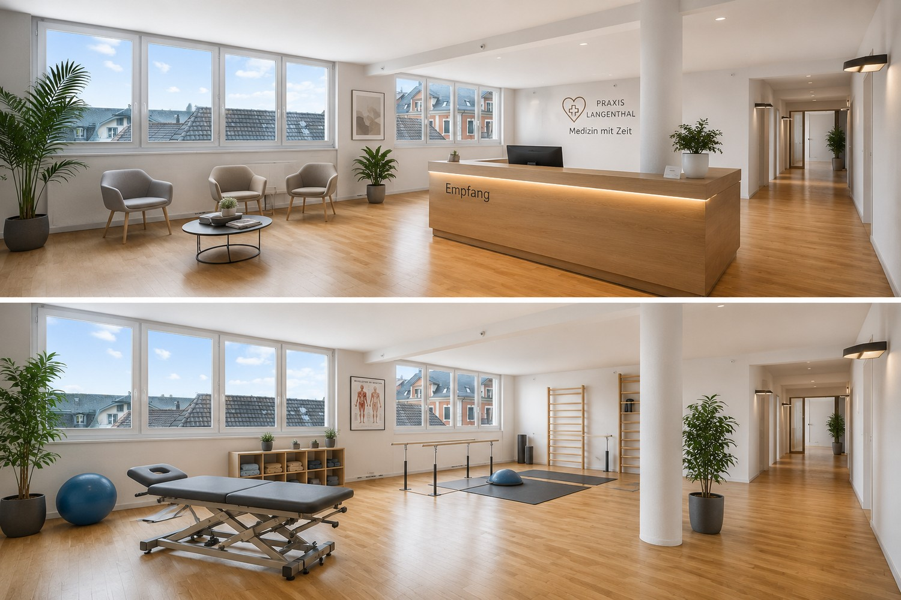
*`01.jpg` — 1500x1000 px*

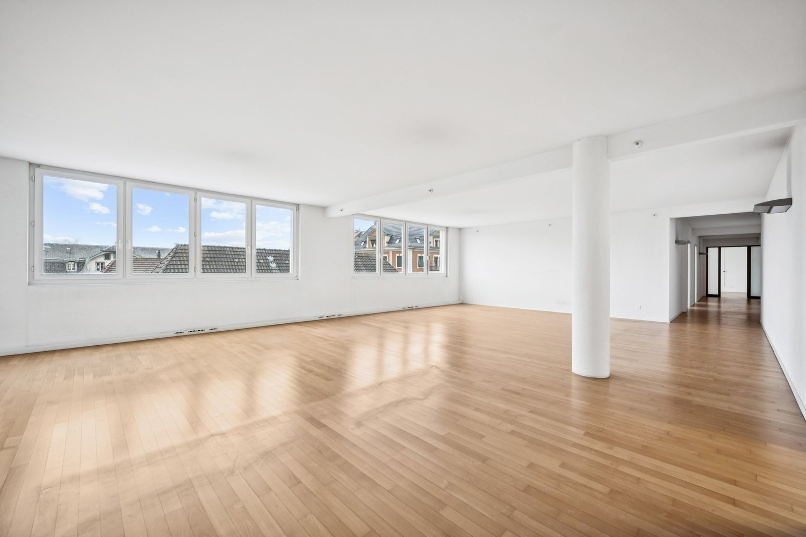
*`02.jpg` — 1500x1000 px*

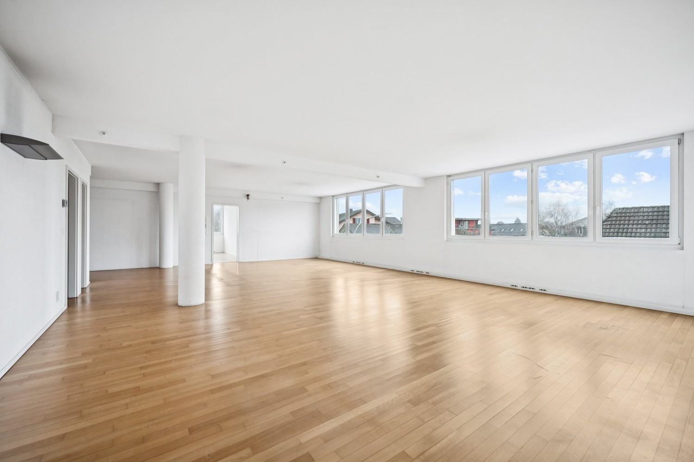
*`03.jpg` — 1500x1000 px*

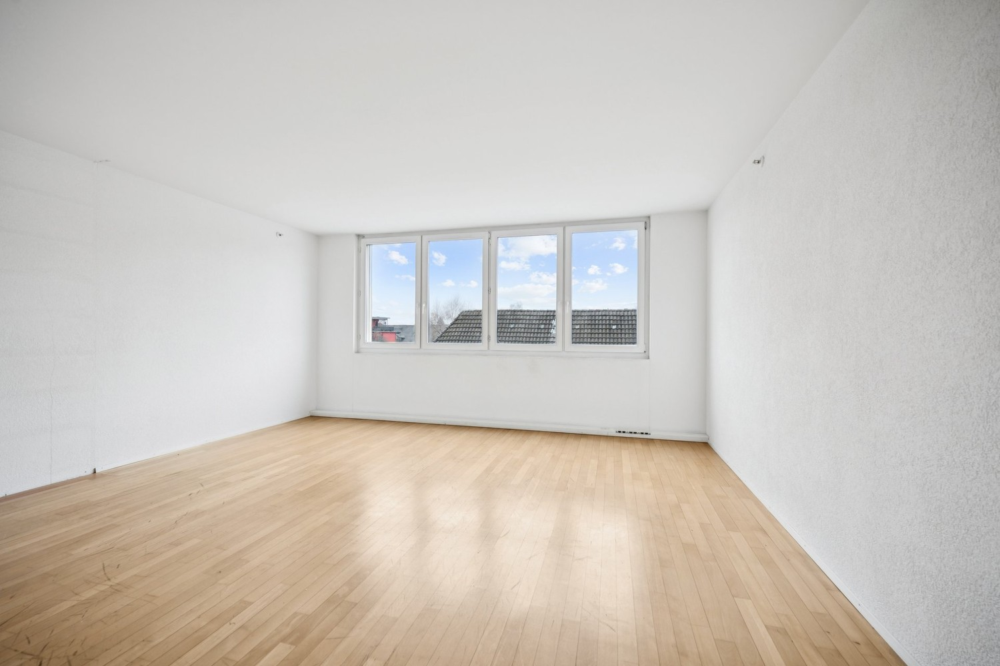
*`04.jpg` — 1500x1000 px*

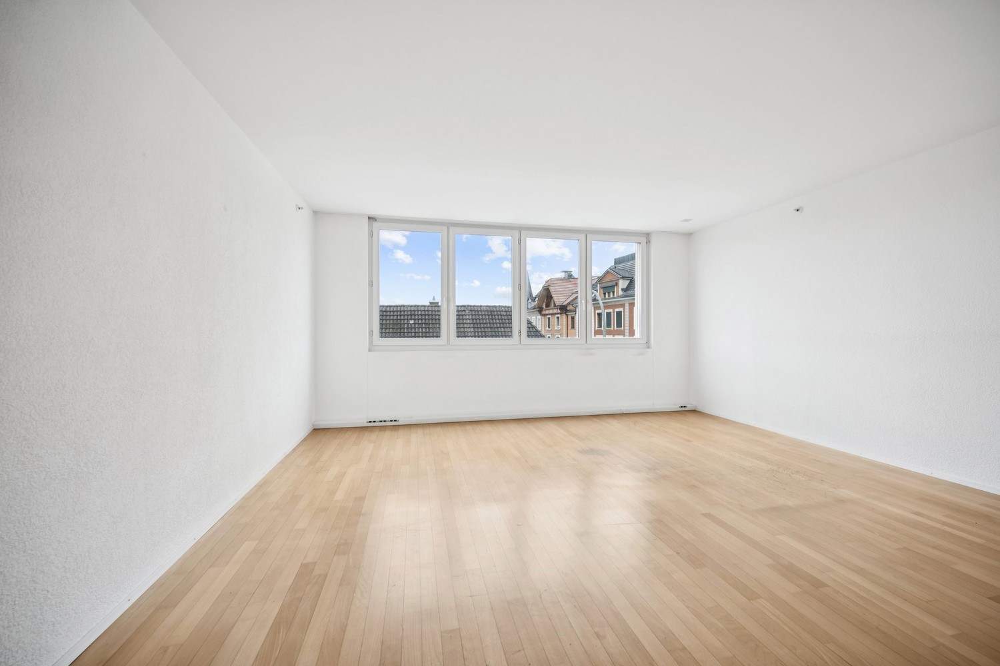
*`05.jpg` — 1500x1000 px*

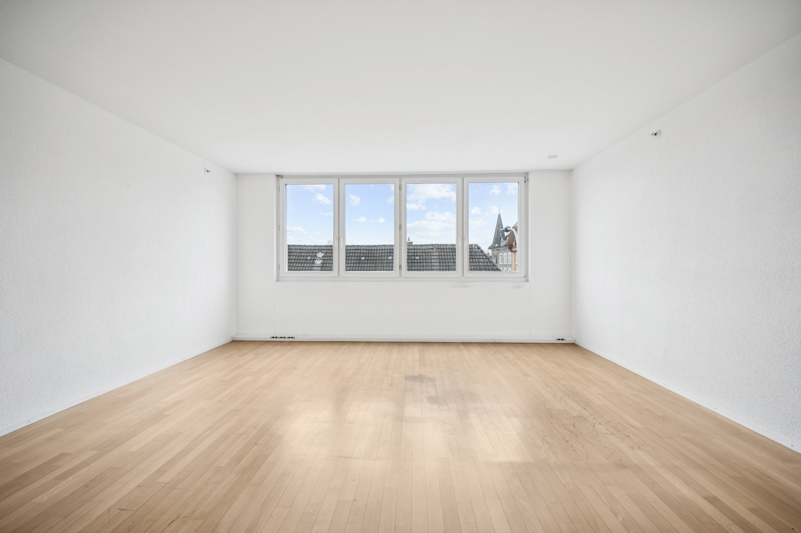
*`06.jpg` — 1500x1000 px*

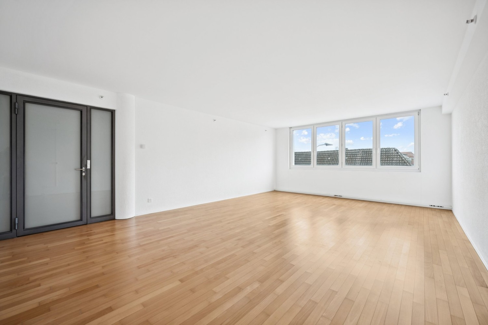
*`07.jpg` — 1500x1000 px*

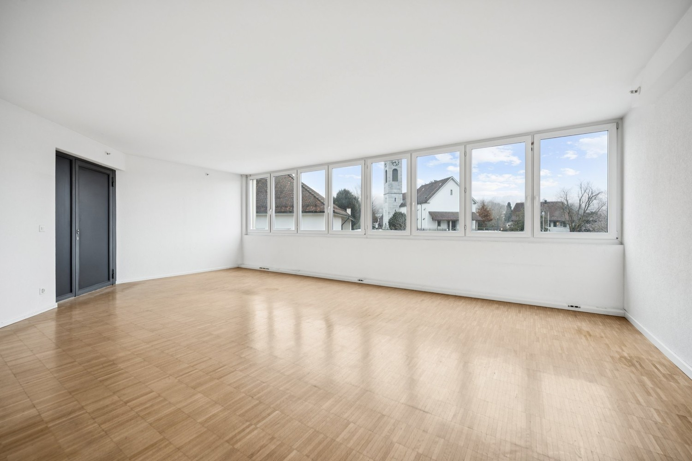
*`08.jpg` — 1500x1000 px*

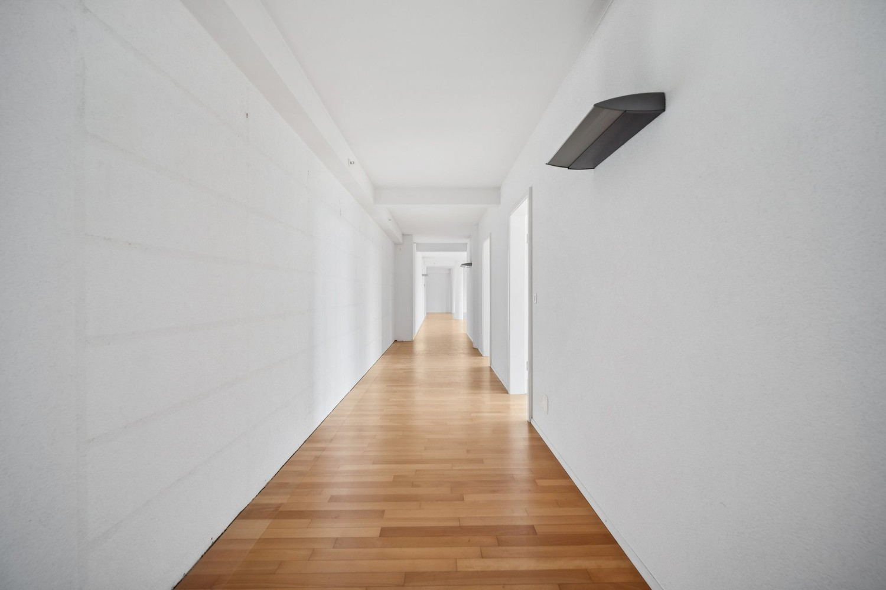
*`09.jpg` — 1500x1000 px*

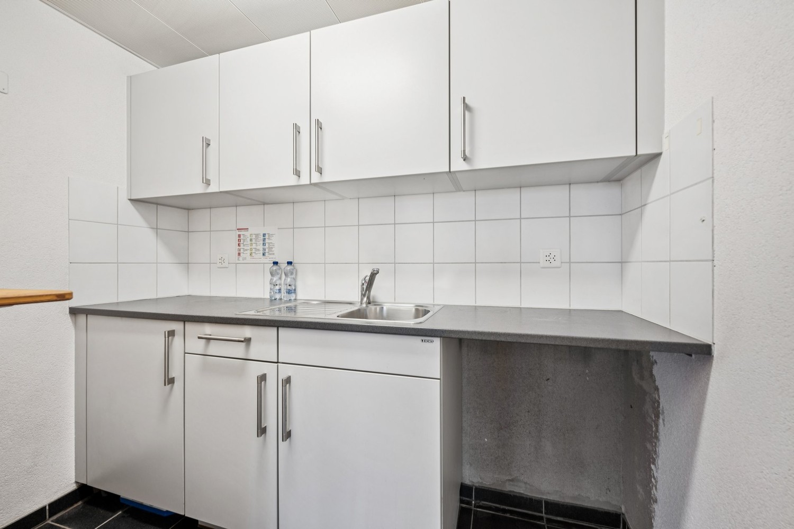
*`10.jpg` — 1500x1000 px*

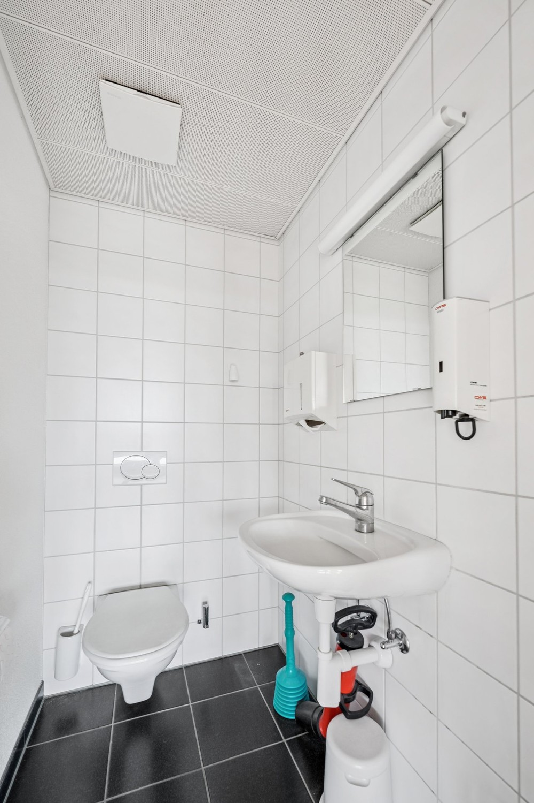
*`11.jpg` — 1000x1500 px*

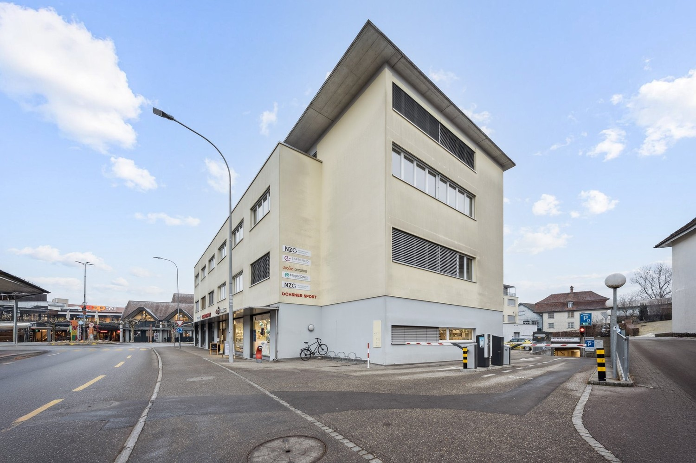
*`12.jpg` — 1500x1000 px*

## Media suplimentară

- **website_url:** https://spitalplatz-langenthal.ch/
