# Morgenstrasse 131, 3018 Bern - auf Anfrage

> **Categorie:** `B_buero_gewerbe`  
> **Regiune:** Berna (oraș)  
> **Tip ofertă:** RENT / OFFICE  
> **Sursă:** [flatfox.ch](https://flatfox.ch/de/wohnung/morgenstrasse-131-3018-bern/831186/)  
> **Descărcat:** 2026-08-17 12:33

## Date obiect

| Câmp | Valoare |
|---|---|
| Adresă | Morgenstrasse 131, 3018 Bern |
| Categorie obiect | INDUSTRY |
| Tip obiect | OFFICE |
| Suprafață utilă | 4376 m² |
| Etaj | 4 |
| An construcție | 1991 |
| Disponibil de la | agr |
| Referință | 25558..61403 |

## Texte originale (germană)

**Titlu public:** Morgenstrasse 131, 3018 Bern - auf Anfrage

**Titlu scurt:** 4376m² Büro

**Pitch:** 4376m² Büro in Bern mieten

**Titlu descriere:** Freie Gewerbefläche von total 4'376 m²

**Titlu chirie:** 4376m² Büro in Bern mieten

**Spațiu afișat:** 4376

### Descriere completă

Wir vermieten ab sofort oder nach Vereinbarung repräsentative Büroräumlichkeiten von total 4'376 m² an der Morgenstrasse 131 in Bümpliz. Die Räumlichkeiten sind über mehrere Stockwerke verteilt und bieten Ihnen folgende Vorzüge:   
  
\- Teilflächen zwischen 64-830 m² im 1. / 2. / 3. OG   
\- Caféteria inkl. Küchenzeile   
\- Separate Toiletten-Anlage   
\- Skelettbauweise – Unterteilung der Räumlichkeiten nach Ihren Wünschen   
\- Moderne IT-Infrastruktur   
  
Bei Bedarf stehen Einstellhallenplätze für je CHF 150.-- sowie Lagerflächen (https://flatfox.ch/de/wohnung/morgenstrasse-131-3018-bern/1088925/) zur Verfügung. Detaillierte Grundrisspläne können auf Anfrage ausgehändigt werden.   
  
Das Gewerbehaus liegt 2 Fahrtminuten vom Autobahnanschluss Niederwangen entfernt. Bahnhof Bümpliz Süd (S-Bahn) ist zu Fuss in 10 min., die Busstation Nr. 27 und 31 in 4 min. zu erreichen. Vom Hauptbahnhof Bern gelangt man mit dem ÖV innerhalb von 25 min. zur Liegenschaft.   
  
Mietzins auf Anfrage.

## Dotări (attributes)

- garage
- lift
- view
- accessiblewithwheelchair
- balconygarden

## Ofertant

- **Nume:** Niederer AG
- **Stradă:** Unterdorfstrasse 5
- **NPA:** 3072
- **Localitate:** Ostermundigen

## Imagini (12)

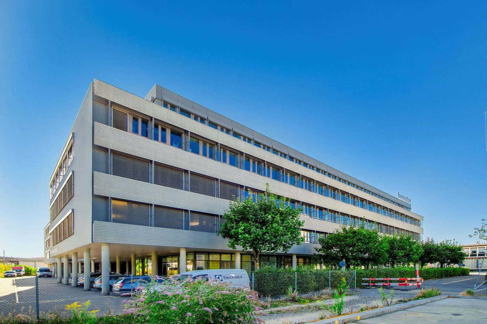
*`01.jpg` — 1400x931 px — Liegenschaft*

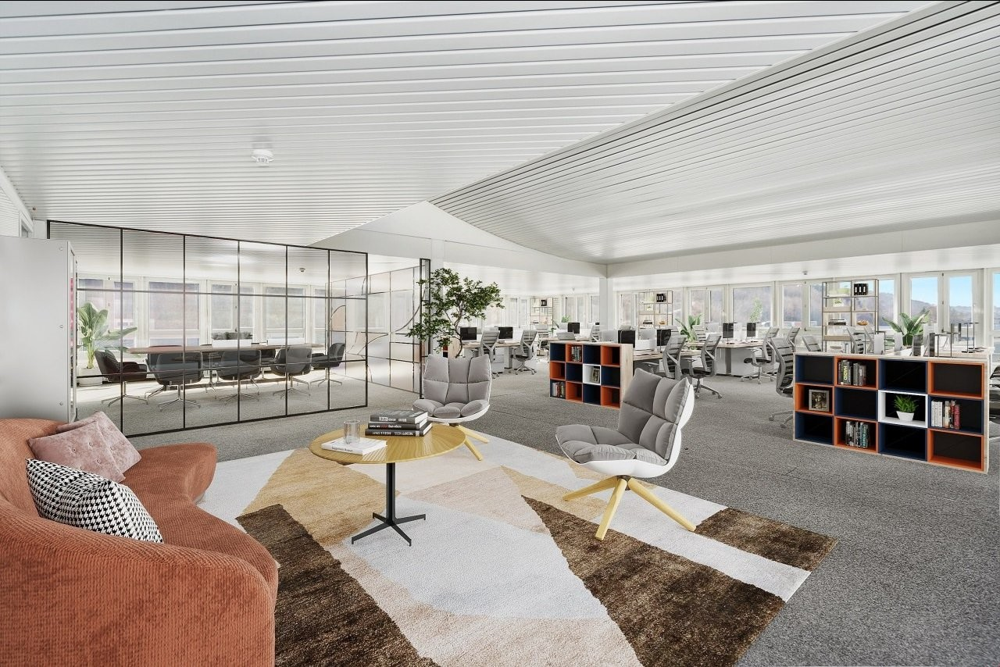
*`02.jpg` — 1280x854 px — Visualisierung*

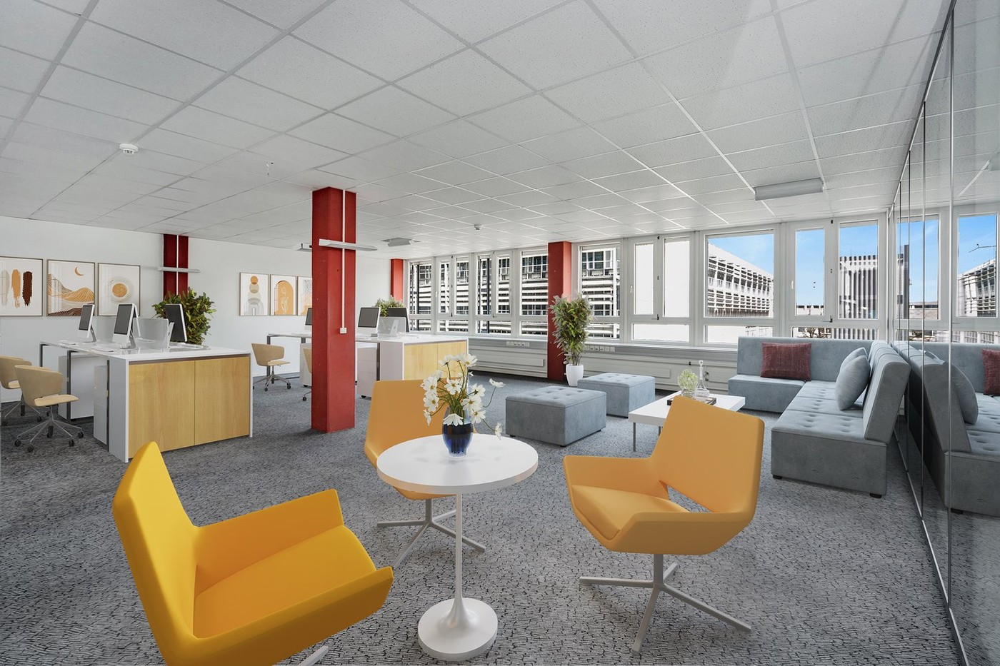
*`03.jpg` — 1400x933 px — Visualisierung*

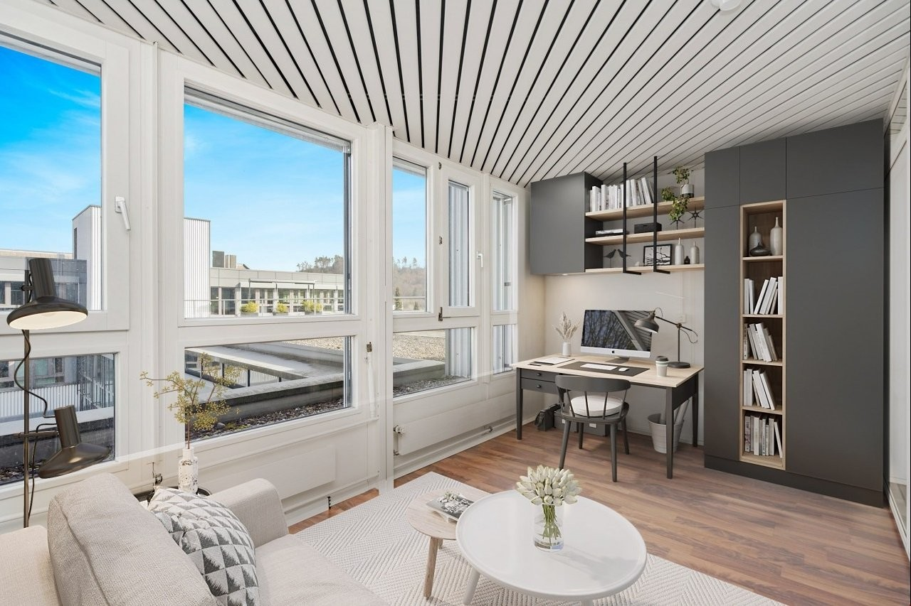
*`04.jpg` — 1280x853 px — Visualisierung*

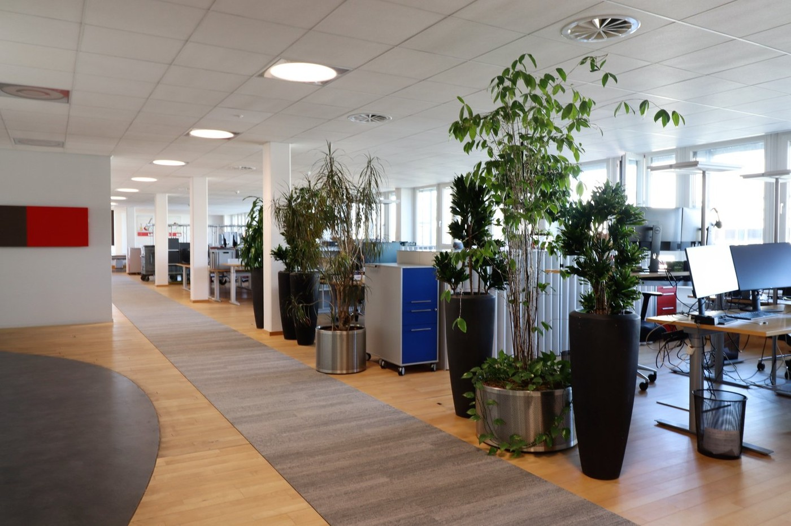
*`05.jpg` — 1400x933 px — Räumlichkeiten*

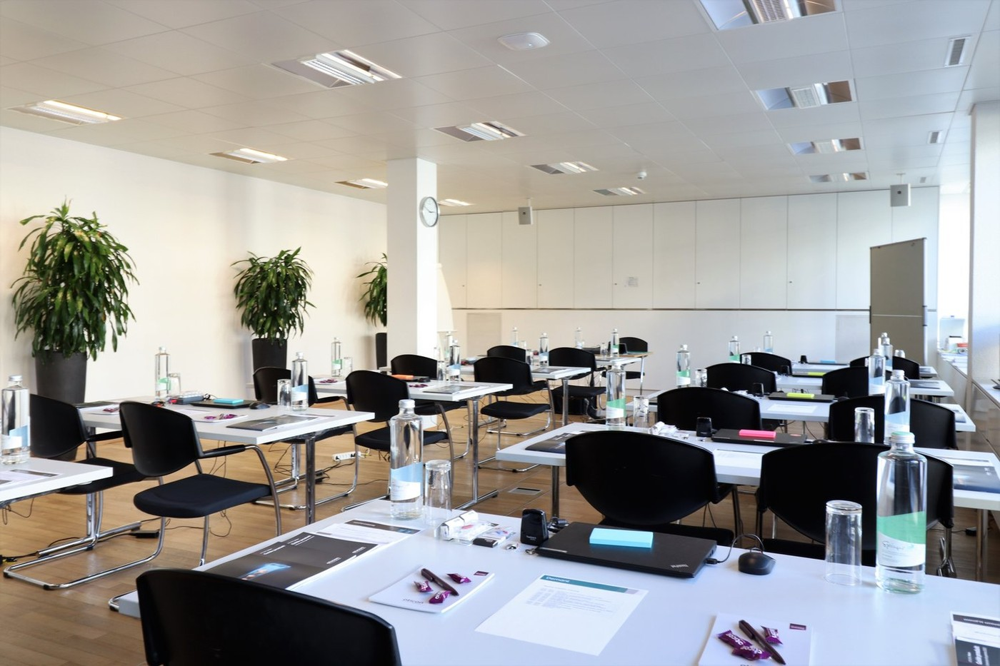
*`06.jpg` — 1400x933 px — Räumlichkeiten*

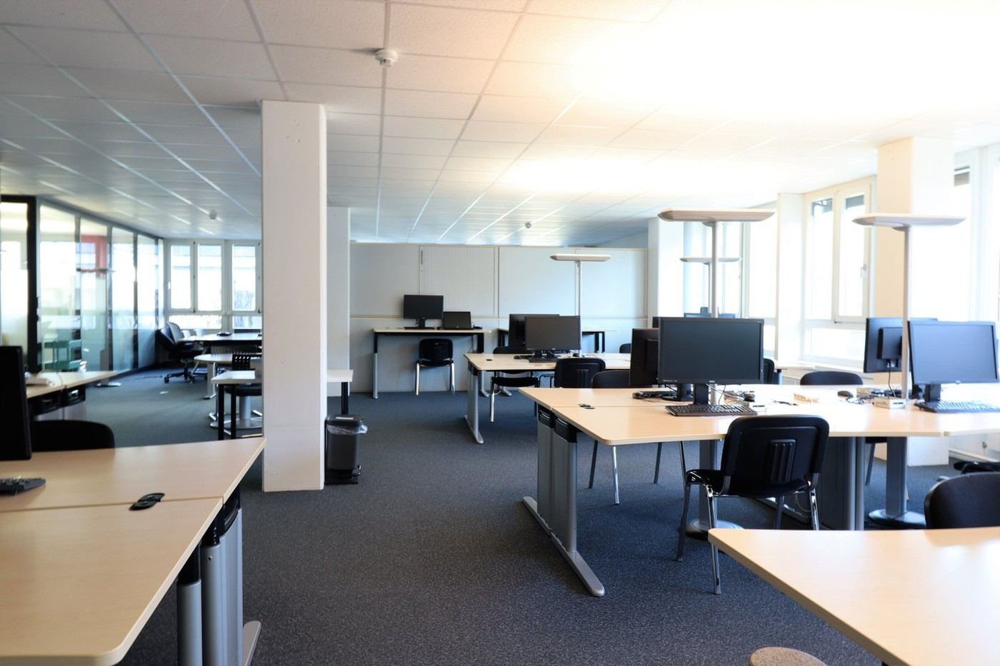
*`07.jpg` — 1400x933 px — Räumlichkeiten*

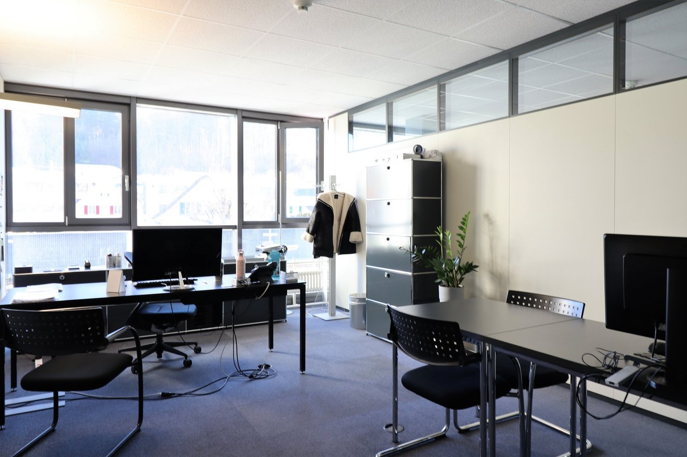
*`08.jpg` — 1400x933 px — Räumlichkeiten*

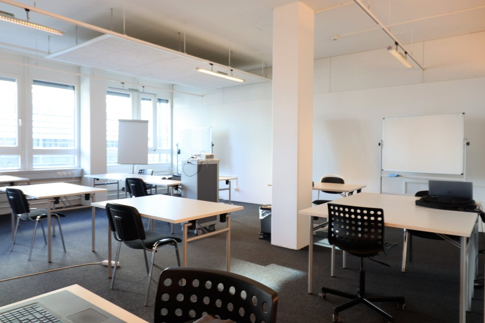
*`09.jpg` — 1400x933 px — Räumlichkeiten*

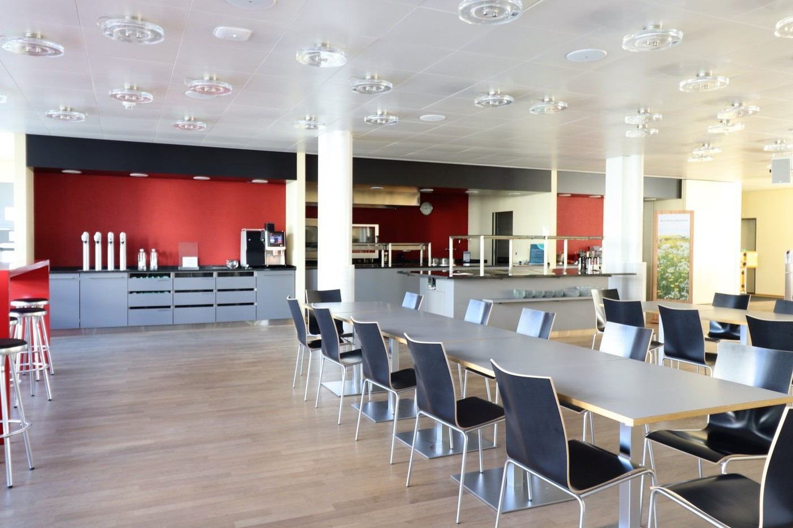
*`10.jpg` — 1400x933 px — Kantine*

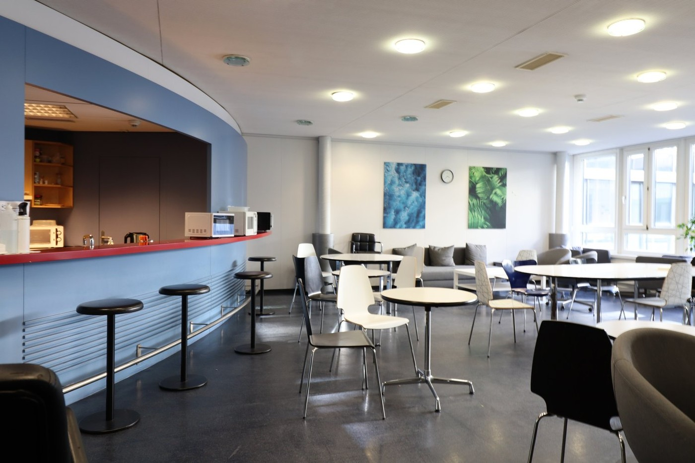
*`11.jpg` — 1400x933 px — Cafeteria*

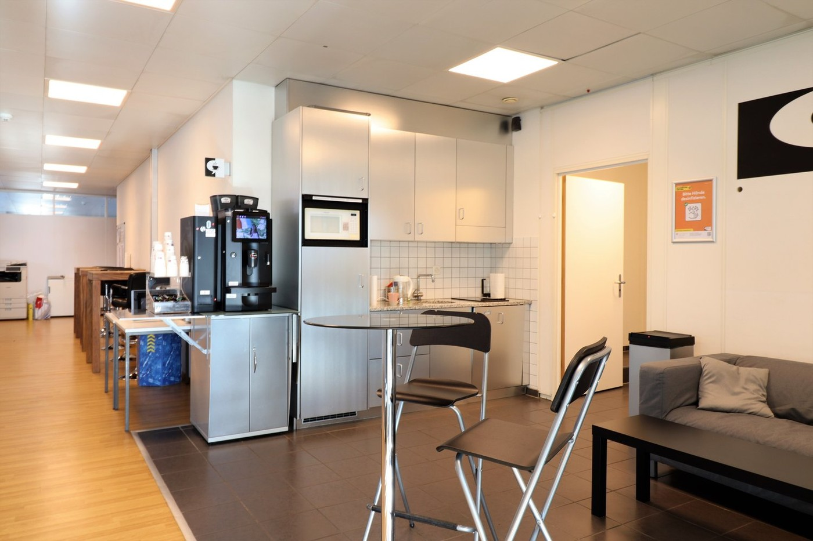
*`12.jpg` — 1400x933 px — Räumlichkeiten*
