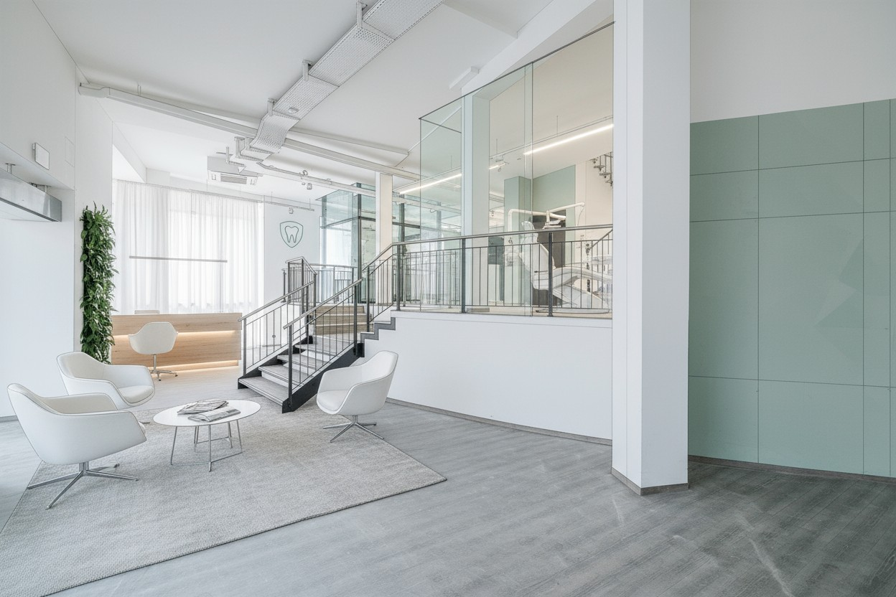
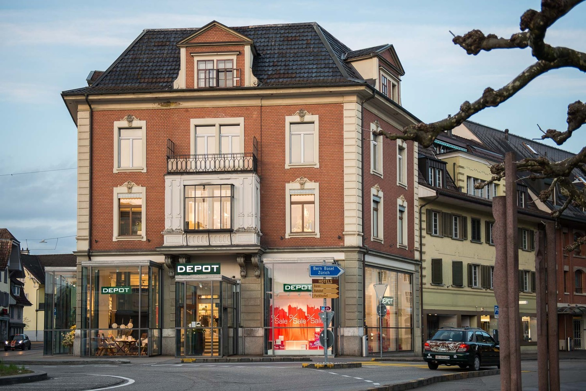
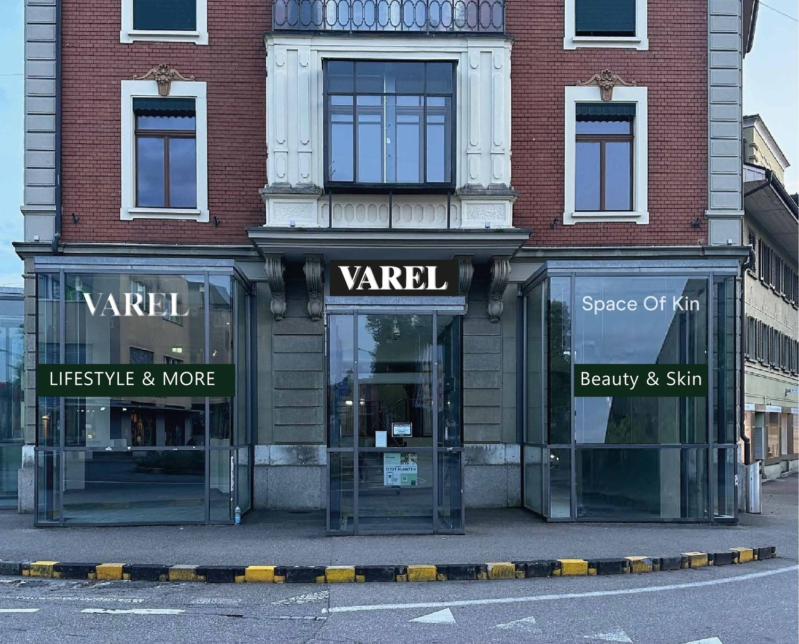
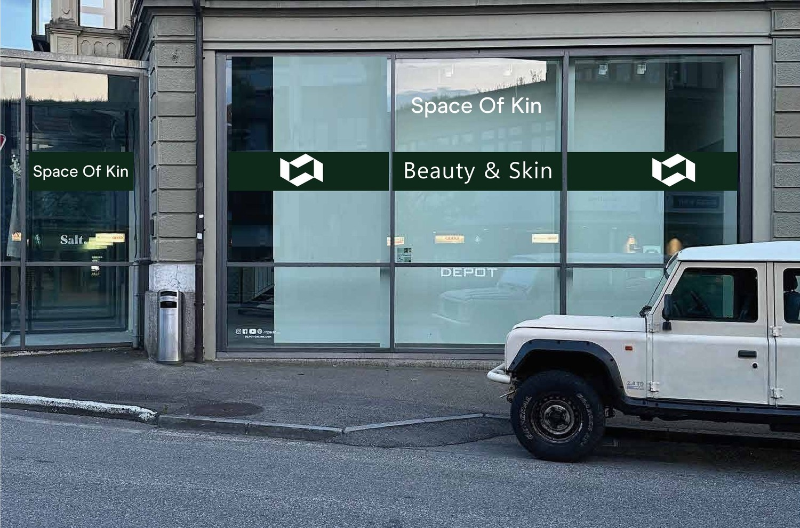
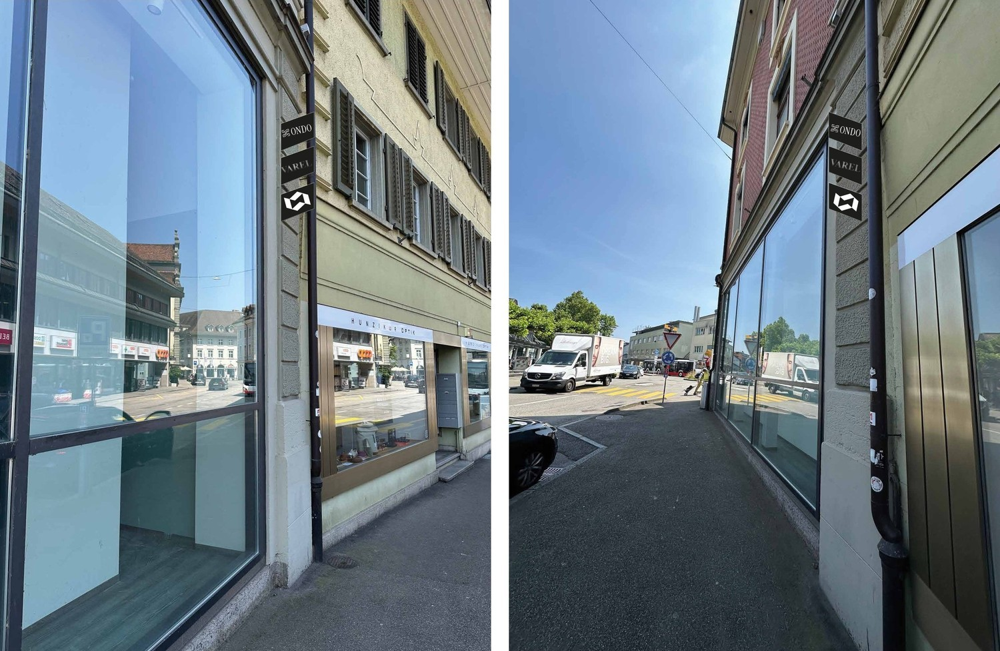
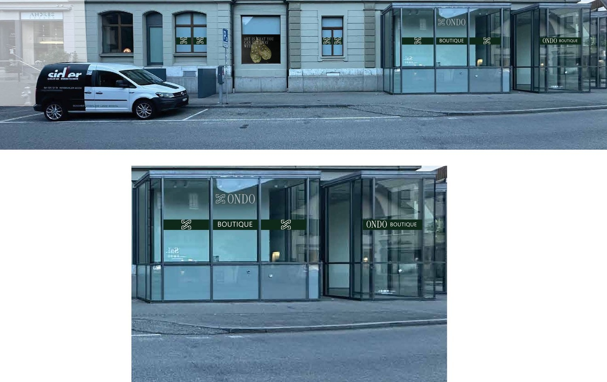
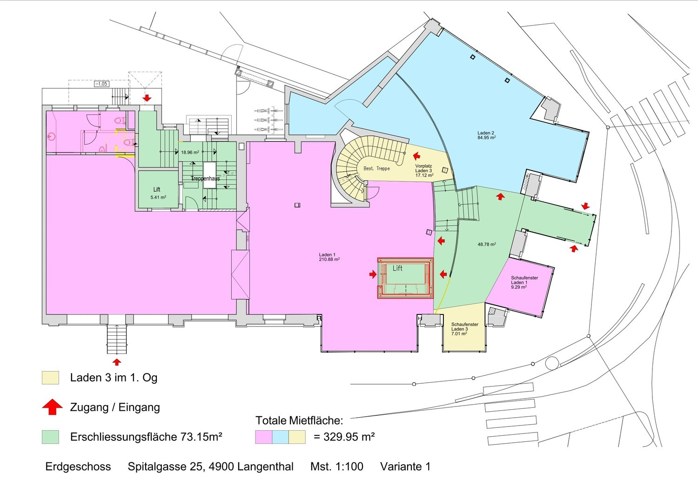
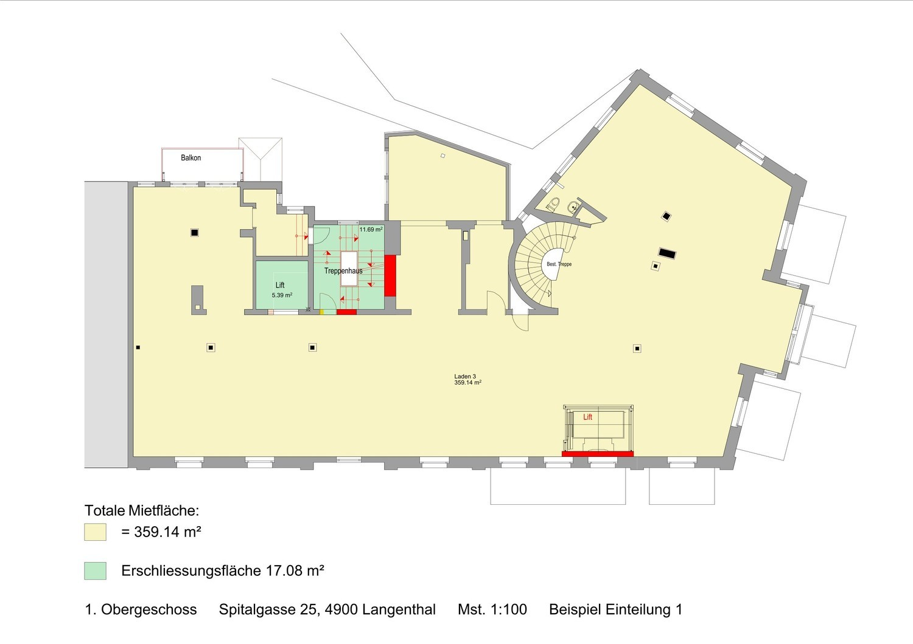

# Spitalgasse 25, 4900 Langenthal - auf Anfrage

> **Categorie:** `B_buero_gewerbe`  
> **Regiune:** Cantonul Berna  
> **Tip ofertă:** RENT / SHOP  
> **Relevant pentru praxis:** da (physiotherapie, praxen)  
> **Sursă:** [flatfox.ch](https://flatfox.ch/de/wohnung/spitalgasse-25-4900-langenthal/84609067/)  
> **Descărcat:** 2026-08-17 12:33

## Date obiect

| Câmp | Valoare |
|---|---|
| Adresă | Spitalgasse 25, 4900 Langenthal |
| Categorie obiect | INDUSTRY |
| Tip obiect | SHOP |
| Suprafață utilă | 790 m² |
| Disponibil de la | 2026-08-01 |
| Referință | 3000.3000.04.6001 |

## Texte originale (germană)

**Titlu public:** Spitalgasse 25, 4900 Langenthal - auf Anfrage

**Titlu scurt:** 790m² Ladenfläche

**Pitch:** 790m² Ladenfläche in Langenthal mieten

**Titlu descriere:** Attraktive Gewerbe-& Verkaufsflächen an bester Lage in Langenthal

**Titlu chirie:** 790m² Ladenfläche in Langenthal mieten

**Spațiu afișat:** 790

### Descriere completă

An **prominenter Zentrumslage** in Langenthal bieten wir vielseitig nutzbare **Gewerbe und Verkaufsflächen** zur Miete an. Die lichtdurchfluteten Räume mit grossen **Glaskuben und Schaufensterfronten** eignen sich ideal für **Gesundheitsdienstleistungen** wie:  
  

*   Arztpraxen
*   Physiotherapie
*   Sportmedizin
*   Weitere Gesundheits- oder Dienstleistungsangebote

Die Flächen sind **flexibel unterteilbar** und lassen sich individuell auf Ihre Bedürfnisse anpassen. Auch eine Zusammenlegung mehrerer Einheiten ist möglich.  
  
**Top Standortvorteile:**  
  

*   Top-Lage: Direkt im Zentrum, neben der Berner Kantonalbank, McDonalds, Coop und weiteren Geschäften.
*   Maximale Sichtbarkeit für Ihr Geschäft dank den grossen Schaufenster.
*   Hohe Passantenfrequenz für optimale Sichtbarkeit und Werbewirkung
*   Öffentliche Parkhäuser in unmittelbarer Nähe (nur 1 Minute Fussweg)

**Flächen:**  
Laden 1: 220.17m2  
Laden 2: 84.95m2  
Laden 3: 383.27m2

## Dotări (attributes)

- accessiblewithwheelchair
- lift

## Ofertant

- **Nume:** AGMENTO Immobilien AG
- **Stradă:** Eichengasse 3
- **NPA:** 4702
- **Localitate:** Oensingen

## Imagini (8)

*`01.jpg` — 1248x832 px*

*`02.jpg` — 1500x1001 px*

*`03.jpg` — 1500x1210 px*

*`04.jpg` — 1500x992 px*

*`05.jpg` — 1500x977 px*

*`06.jpg` — 1500x946 px*

*`07.jpg` — 1500x1060 px*

*`08.jpg` — 1500x1060 px*

## Media suplimentară

- **website_url:** https://www.agmento.ch/gewerbeangebot.php?id=12
