# Stöckackerstrasse 79, 3018 Bern - CHF 1’670 inkl. NK pro Monat

> **Categorie:** `B_buero_gewerbe`  
> **Regiune:** Berna (oraș)  
> **Tip ofertă:** RENT / OFFICE  
> **Sursă:** [flatfox.ch](https://flatfox.ch/de/wohnung/stockackerstrasse-79-3018-bern/84737337/)  
> **Descărcat:** 2026-08-17 12:38

## Date obiect

| Câmp | Valoare |
|---|---|
| Adresă | Stöckackerstrasse 79, 3018 Bern |
| Categorie obiect | INDUSTRY |
| Tip obiect | OFFICE |
| Chirie netă | CHF 1'340 |
| Nebenkosten | CHF 330 |
| Chirie brută | CHF 1'670 |
| Preț afișat | CHF 1'670 |
| Suprafață utilă | 117 m² |
| Etaj | 0 |
| Disponibil de la | imm |
| Referință | 1180.01.00003 |

## Texte originale (germană)

**Titlu public:** Stöckackerstrasse 79, 3018 Bern - CHF 1’670 inkl. NK pro Monat

**Titlu scurt:** 117m² Büro

**Pitch:** 117m² Büro in Bern mieten

**Titlu descriere:** Attraktive Büroräumlichkeiten im EG zu vermieten!

**Titlu chirie:** 117m² Büro in Bern mieten

**Spațiu afișat:** 117

### Descriere completă

Wir vermieten per 1. Februar 2026 oder je nach Vereinbarung auch vorher an der Stöckackerstrasse 79 in 3018 Bern attraktive Gewerberäumlichkeiten (117m2) im Erdgeschoss. 

  

Die Fläche verfügt über separat abgetrennte Räume. Die Räume sind grosszügig und sind mit pflegleichtem Linoleumboden ausgestattet. Eine Küche und WC-Anlage ist ebenfalls vorhanden. 

Ein Einstellhallenplatz kann für monatlich CHF 100.00 dazu gemietet werden.   

  

Haben wir Ihr Interesse geweckt? Wir stehen Ihnen gerne zur Verfügung, um allfällige Fragen zu beantworten. 

  

Achtung. Eigenwerbung: Sie ziehen in eine Mietwohnung und benötigen Unterstützung für den bestmöglichen Verkauf Ihrer Immobilie? Kontaktieren Sie die " [ https://www.dr-meyer.ch"> ](https://www.dr-meyer.ch"%3E/) ;

## Ofertant

- **Nume:** Dr.Meyer Immobilien AG
- **Stradă:** Morgenstrasse 83A
- **NPA:** 3018
- **Localitate:** Bern

## Imagini (11)

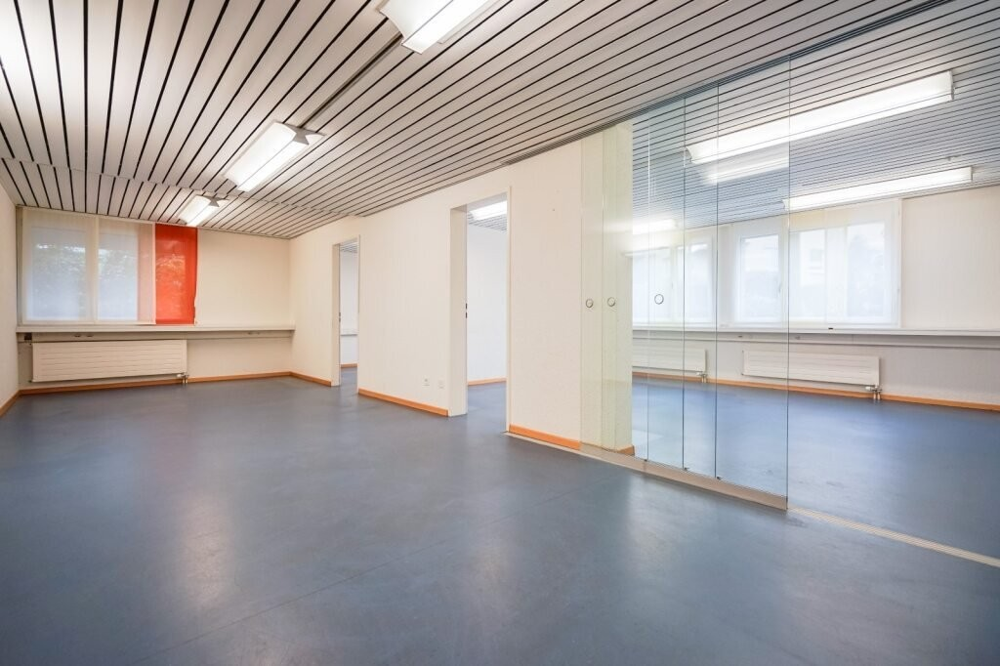
*`01.jpg` — 1024x682 px — 4130de18-3f12-4e9a-98f9-7fd461e443b5.jpg*

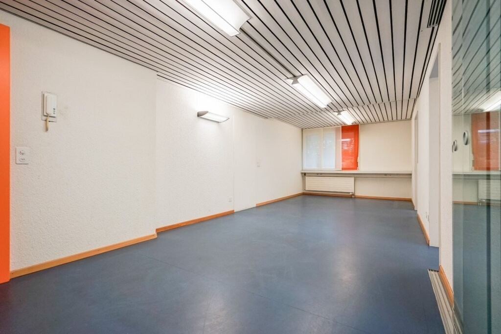
*`02.jpg` — 1024x682 px — b504489e-e288-40f0-8033-3c1016265436.jpg*

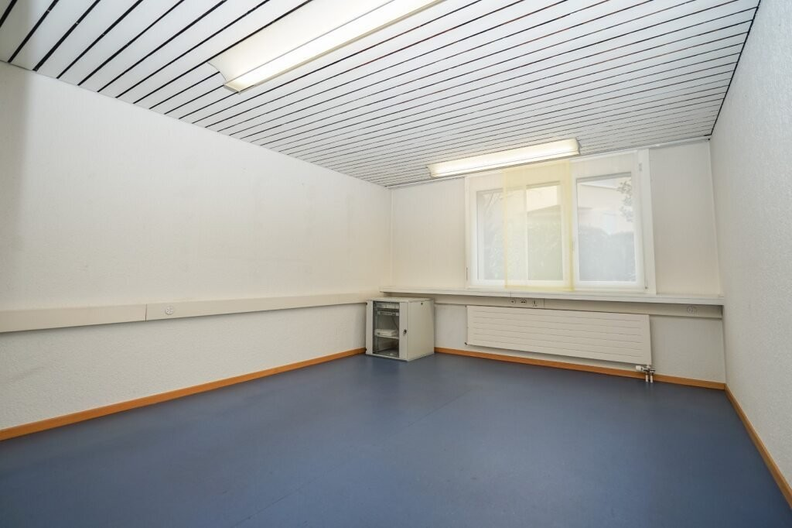
*`03.jpg` — 1024x682 px — 9c909418-f536-45bd-ac95-8fbcda27b363.jpg*

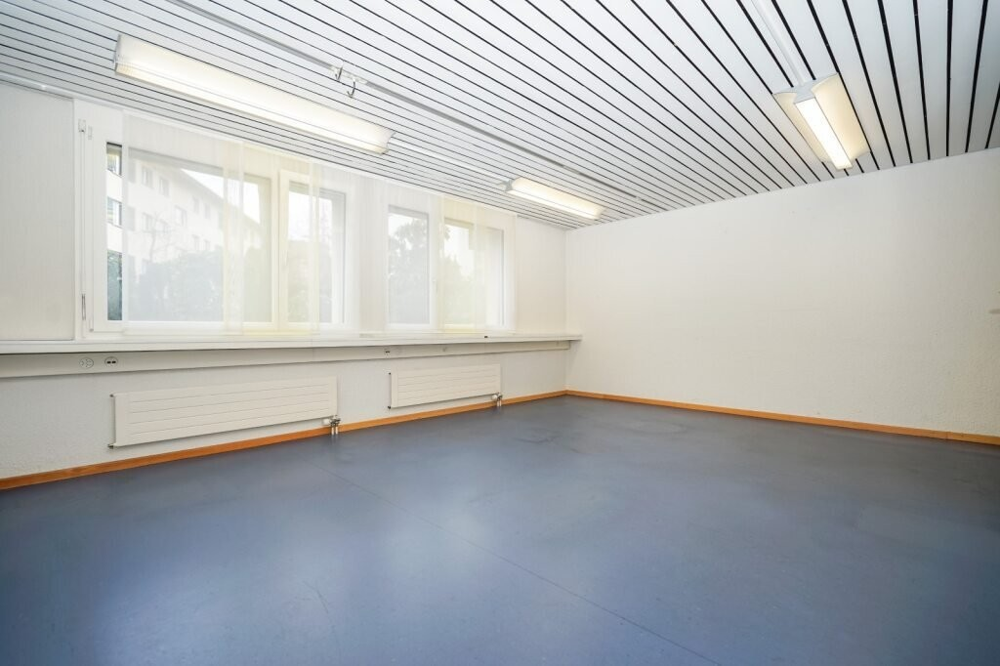
*`04.jpg` — 1024x682 px — a0d962ff-0d50-475b-a00d-8667fe59b3f9.jpg*

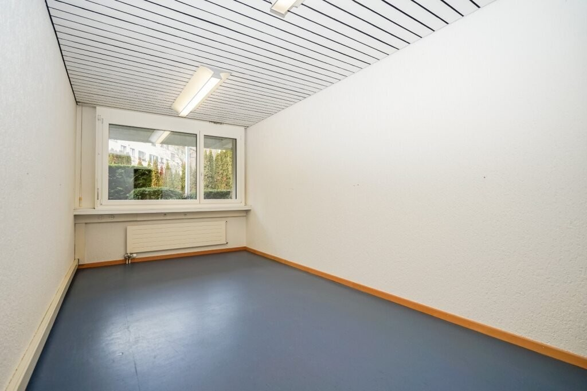
*`05.jpg` — 1024x682 px — 97a56685-8a45-4d09-9733-39e7b22a7494.jpg*

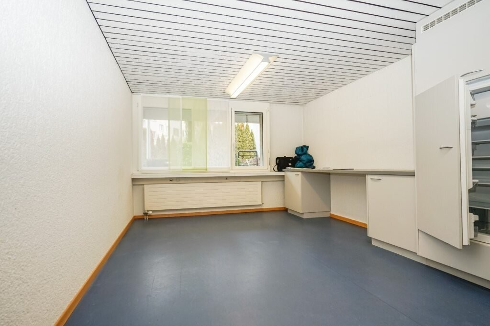
*`06.jpg` — 1024x682 px — c141eeb1-f272-4231-9b38-4bc15493e2cc.jpg*

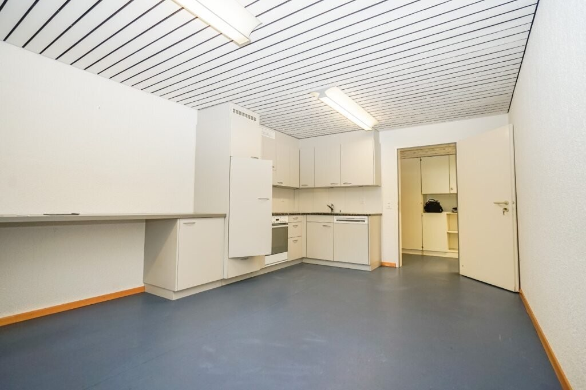
*`07.jpg` — 1024x682 px — 50b04b3e-e35a-4f17-ab49-fed4277c356a.jpg*

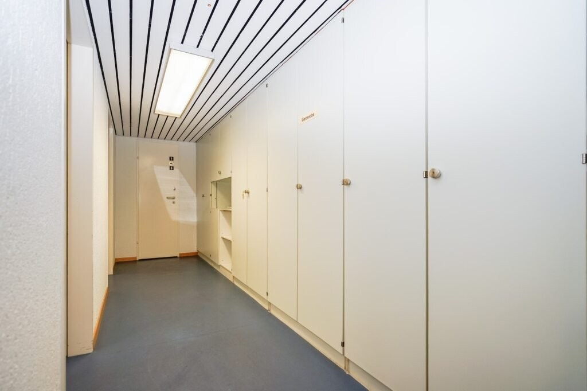
*`08.jpg` — 1024x682 px — 4c62f843-f164-4f13-a92d-6b07526333a1.jpg*

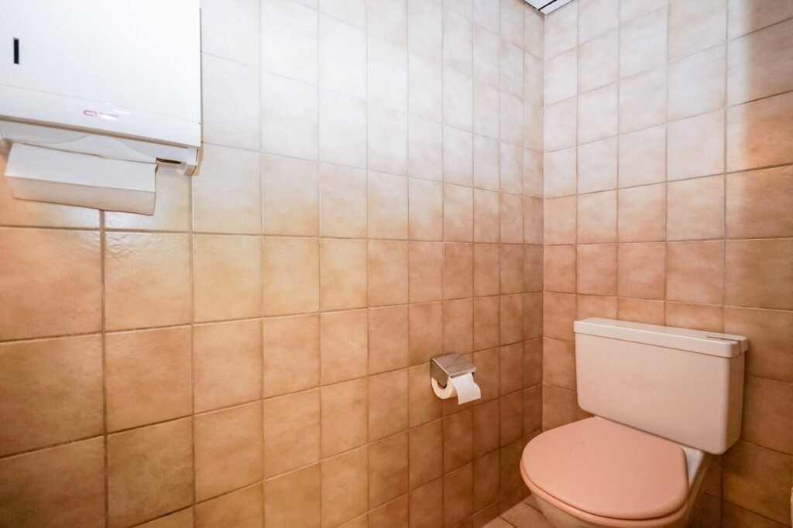
*`09.jpg` — 1024x682 px — c968ccf7-af49-4337-a1ce-31c413782c34.jpg*

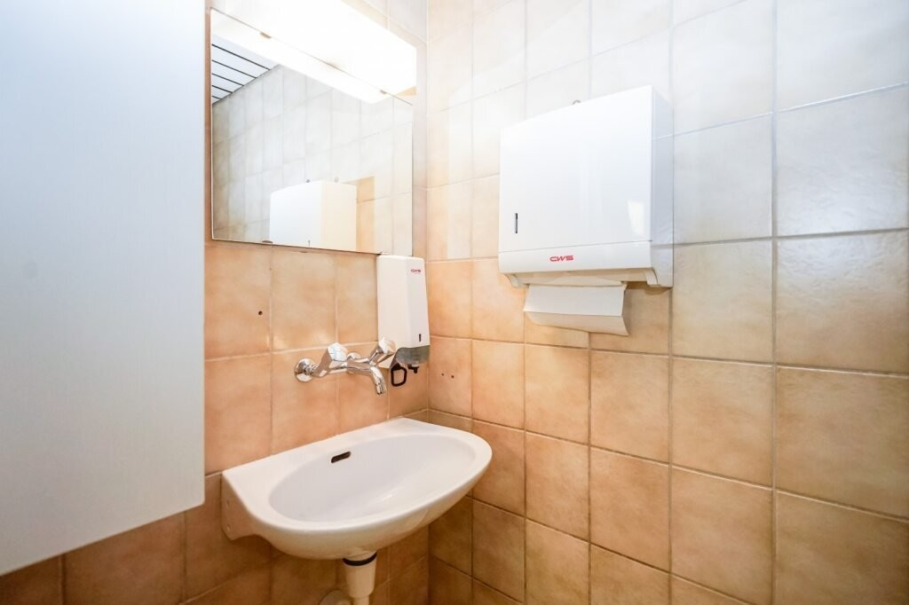
*`10.jpg` — 1024x682 px — aa916a44-5a67-479e-9692-c42ef14ab81c.jpg*

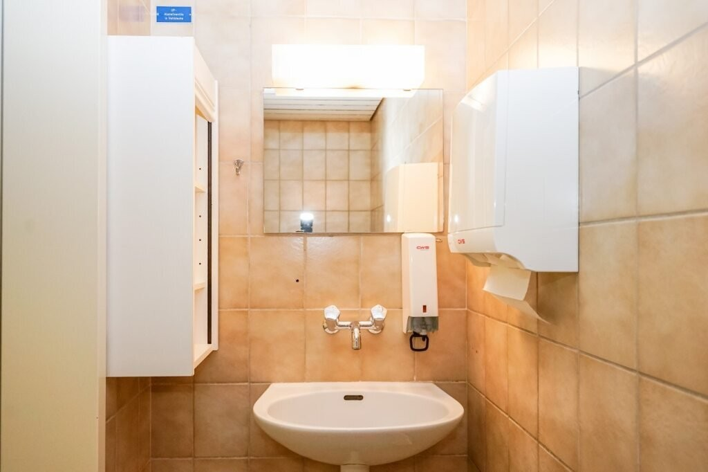
*`11.jpg` — 1024x682 px — 25618f7a-8003-4b45-bf6d-c24ac18f4279.jpg*
