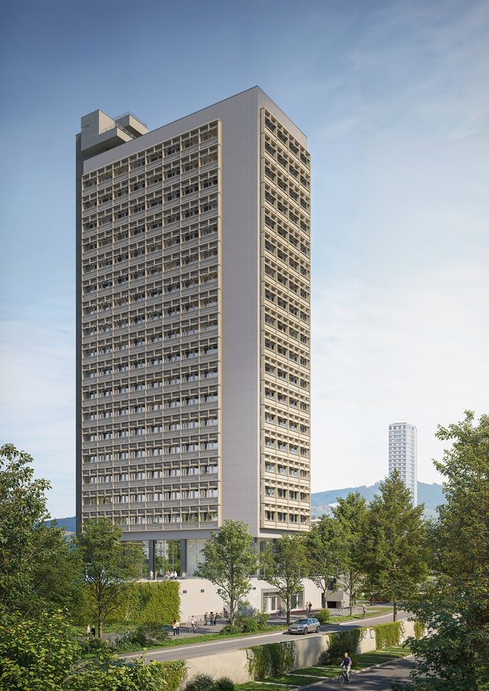
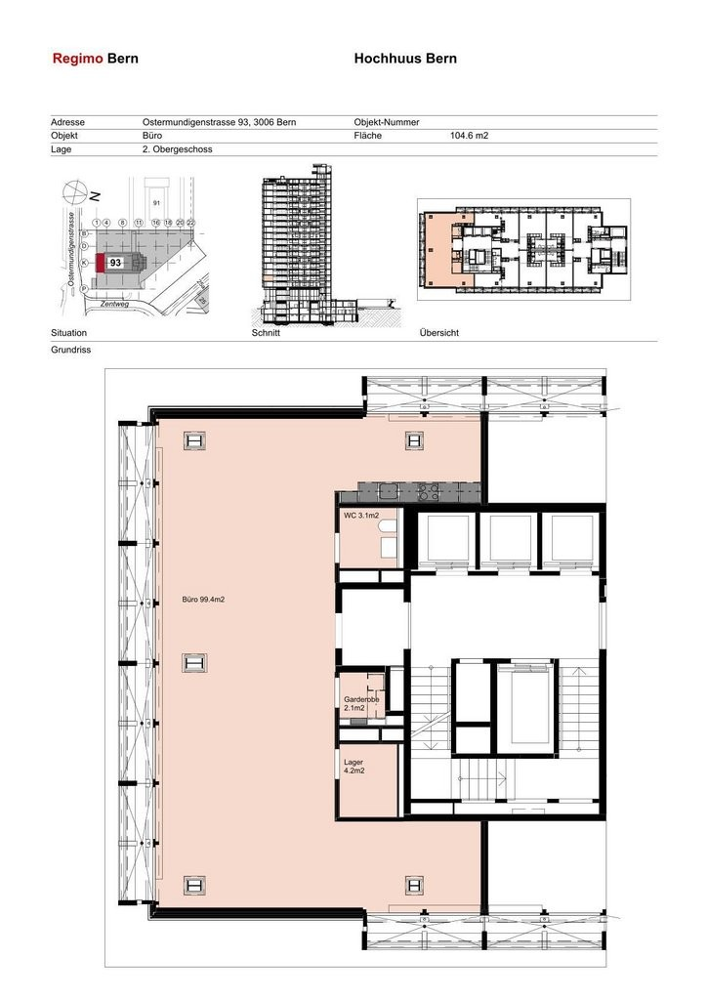

# Ostermundigenstrasse 93, 3006 Bern - auf Anfrage

> **Categorie:** `B_buero_gewerbe`  
> **Regiune:** Berna (oraș)  
> **Tip ofertă:** RENT / OFFICE  
> **Relevant pentru praxis:** da (praxisräume)  
> **Sursă:** [flatfox.ch](https://flatfox.ch/de/wohnung/ostermundigenstrasse-93-3006-bern/84895995/)  
> **Descărcat:** 2026-08-17 12:27

## Date obiect

| Câmp | Valoare |
|---|---|
| Adresă | Ostermundigenstrasse 93, 3006 Bern |
| Categorie obiect | INDUSTRY |
| Tip obiect | OFFICE |
| Suprafață utilă | 109 m² |
| Etaj | 2 |
| Disponibil de la | agr |
| Referință | 26116.01.6021 |

## Texte originale (germană)

**Titlu public:** Ostermundigenstrasse 93, 3006 Bern - auf Anfrage

**Titlu scurt:** 109m² Büro

**Pitch:** 109m² Büro in Bern mieten

**Titlu descriere:** Büroflächen im Hochhuus: Ankommen, einrichten, durchstarten

**Titlu chirie:** 109m² Büro in Bern mieten

**Spațiu afișat:** 109

### Descriere completă

An der Ostermundigenstrasse 93, am östlichen Stadteingang von Bern, erwartet Sie eine Bürofläche mit bester Erreichbarkeit. Der Bus hält direkt vor dem Gebäude, der Bahnhof Ostermundigen ist in wenigen Minuten zu Fuss erreichbar und auch die Autobahn liegt ganz in der Nähe. So gelangen Mitarbeitende, Kunden und Partner jederzeit bequem an Ihren Standort.   
  
Im 2.Obergeschoss erwartet Sie eine moderne Bürofläche, die sich flexibel an Ihre Bedürfnisse anpassen lässt. Die klare Grundstruktur sorgt für eine helle und offene Atmosphäre und bietet zugleich viel Spielraum für individuelle Gestaltung. Ob moderne Bürokonzepte, Praxisräume, Dienstleistungsflächen oder andere innovative Nutzungen, hier finden Sie die passende Basis für Ihre Ideen.   
  
**Gut fürs Geschäft:**   
\- flexible Nutzungsmöglichkeiten   
\- vorhandener Boden- und Wandbelag   
\- vorhandene elektrische Installationen   
\- Toilettenanlagen   
\- komplett ausgebaute Küche   
\- Elektrogrundinstallation mit Bodensteckdosen   
\- auf Wunsch Abstellplatz für CHF 80.00 pro Monat   
  
**Ihre Vorteile mit Regimo Business:**   
1\. Individuelle Mietpreis- und Vertragsmodelle   
2\. Beratung und Unterstützung bei der Umbau- und Einrichtungsplanung durch ausgewiesene Spezialisten.   
3\. Persönliche Betreuung und hohe Flexibilität im Hinblick auf Mieterwünsche während der gesamten Vertragsdauer.   
  
Das Hochhuus ist ein architektonisches Wahrzeichen mit Geschichte. Es verleiht Ihrem Unternehmen eine repräsentative Adresse und verbindet Funktionalität mit Charakter. Mehr Informationen: [ **Hochhuus** ](https://navigator5.beyonity.ch/?id=2FE9C154&language=ch) .   
  
Haben wir Ihr Interesse geweckt? Dann zögern Sie nicht und kontaktieren Sie uns, um einen individuellen Besichtigungstermin zu vereinbaren.

## Dotări (attributes)

- lift
- balconygarden
- accessiblewithwheelchair

## Ofertant

- **Nume:** Regimo Bern
- **Stradă:** Thunstrasse 32
- **NPA:** 3005
- **Localitate:** Bern

## Imagini (2)

*`01.jpg` — 724x1024 px — Visualisierung Gebäude*

*`02.jpg` — 724x1024 px — Grundrissplan*

## Media suplimentară

- **website_url:** http://www.hochhuus.ch
